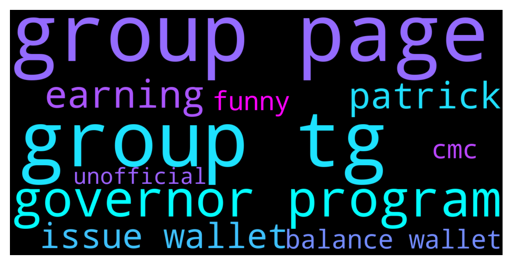

# **@algorand**
 ## Analysis for **2021-12-14** - **2021-12-15**.

---

## 📊 **Basic Stats**

**n_messages_sent**: 154

---

---

## 🔝 **Top keywords and related messages**

1. **group page**

    @ChadDadd --- *Is this the official algo group on TG? I found another one as well.* **--->** [TG Discussion](https://t.me/algorand/321838)

    @ChadDadd --- *Yes the website link brought me here but I found a different group on TG with same name.* **--->** [TG Discussion](https://t.me/algorand/321845)

    @ChadDadd --- *I figured because the page linked me but the other group has more members so I wanted to ask.* **--->** [TG Discussion](https://t.me/algorand/321841)

    @Kmw81 --- *Which page linked you to the other group . If you check official website this is the group* **--->** [TG Discussion](https://t.me/algorand/321844)

    @angelo9007 --- *You can go to Governance Page.  For your information, The governance page sends a 0 algo transaction to opt you into governance, and to vote, and to claim your rewards* **--->** [TG Discussion](https://t.me/algorand/321480)

    @cperezu70 --- *Hello, can anyone tell me if there is an Algorand group in Spanish? It is difficult to keep up with them in this group, I only speak Spanish.* **--->** [TG Discussion](https://t.me/algorand/321427)

2. **group tg**

    @ChadDadd --- *Is this the official algo group on TG? I found another one as well.* **--->** [TG Discussion](https://t.me/algorand/321838)

    @ChadDadd --- *Yes the website link brought me here but I found a different group on TG with same name.* **--->** [TG Discussion](https://t.me/algorand/321845)

    @ChadDadd --- *I figured because the page linked me but the other group has more members so I wanted to ask.* **--->** [TG Discussion](https://t.me/algorand/321841)

    @Kmw81 --- *Which page linked you to the other group . If you check official website this is the group* **--->** [TG Discussion](https://t.me/algorand/321844)

    @Kmw81 --- *😎 Mr Patrick ( James bond ) of unoffical algorand tg channel* **--->** [TG Discussion](https://t.me/algorand/321884)

    @cperezu70 --- *Hello, can anyone tell me if there is an Algorand group in Spanish? It is difficult to keep up with them in this group, I only speak Spanish.* **--->** [TG Discussion](https://t.me/algorand/321427)

3. **governor program**

    @Hank --- *Question? To join governor we just buy Algo and store in Algorand wallet? This correct?* **--->** [TG Discussion](https://t.me/algorand/321814)

    @Prash_Agarwal --- *could you please let me know if i am allowed to join the governor program now? until now i held my Algo on Kraken* **--->** [TG Discussion](https://t.me/algorand/321799)

    @Leugim_21 --- *if you hold an Algo you are already a community governor, we all are. But if you mean that you want the Governor Bonus by submitting your vote on important decisions and accepting the rules of Governance that is different.* **--->** [TG Discussion](https://t.me/algorand/321817)

    @Prash_Agarwal --- *Hello...am i allowed to join the governor program now even though i did not join as a governor in the 1st program... ?* **--->** [TG Discussion](https://t.me/algorand/321795)

    @Patdogbaby --- *Have many more governors thrown in the towel ? (I didn't btw)* **--->** [TG Discussion](https://t.me/algorand/321404)

    @Martin --- *Because lot of governors flee like bourgeois from the titanic when the price started sinking* **--->** [TG Discussion](https://t.me/algorand/321410)

4. **earning**

    @Leugim_21 --- *Q41 make sure you are eligible, then the earnings check algorandstats.com* **--->** [TG Discussion](https://t.me/algorand/321829)

    @crypto_jazz88 --- *Hope you’d be stacking the dip.. Imma re accumulate into my portfolio w my farm earnings 😅😅 it’s the usual price cycle. So HODL* **--->** [TG Discussion](https://t.me/algorand/322090)

5. **patrick**

    @cryptomanmachine --- *This is a community for anyone who is interested in algorand but has been banned by Patrick for no reason* **--->** [TG Discussion](https://t.me/algorand/321860)

    @Kmw81 --- *😎 Mr Patrick ( James bond ) of unoffical algorand tg channel* **--->** [TG Discussion](https://t.me/algorand/321884)

6. **issue wallet**

    @MackDenver --- *Hey X Y, the mobile wallet is having some syncing issues, we are working on fixing it. Your balance is in the right place just not updated* **--->** [TG Discussion](https://t.me/algorand/322093)

    @chassoux --- *Hi guys, I’ve send my USDT from KuCoin to Algorand Wallet, now I can see my USDT on AlgoExplorer and on Tinyman, but not in my Wallet. Any ideas? I have enough ALGO in my Algorand Wallet and I’ve clicked on Add new asset and then Approve, but USDT just won’t show* **--->** [TG Discussion](https://t.me/algorand/322092)

    @MackDenver --- *Sorry to hear that. Try using our web wallet MyAlgo in the meantime.* **--->** [TG Discussion](https://t.me/algorand/322070)

    @MackDenver --- *We are looking into the wallet issue right now, it will be fixed shortly* **--->** [TG Discussion](https://t.me/algorand/322087)

    @SavoryMonkey --- *Woke up this morning to find that in my Algo wallet my typical reward was cut in half. Anyone else experiencing something similar?* **--->** [TG Discussion](https://t.me/algorand/321568)

    @KasyWillss --- *MyAlgo wallet is cool. You can also use Atomic wallet.* **--->** [TG Discussion](https://t.me/algorand/321523)

7. **balance wallet**

    @MackDenver --- *Hey X Y, the mobile wallet is having some syncing issues, we are working on fixing it. Your balance is in the right place just not updated* **--->** [TG Discussion](https://t.me/algorand/322093)

    @chassoux --- *Hi guys, I’ve send my USDT from KuCoin to Algorand Wallet, now I can see my USDT on AlgoExplorer and on Tinyman, but not in my Wallet. Any ideas? I have enough ALGO in my Algorand Wallet and I’ve clicked on Add new asset and then Approve, but USDT just won’t show* **--->** [TG Discussion](https://t.me/algorand/322092)

    @MackDenver --- *Sorry to hear that. Try using our web wallet MyAlgo in the meantime.* **--->** [TG Discussion](https://t.me/algorand/322070)

    @MackDenver --- *We are looking into the wallet issue right now, it will be fixed shortly* **--->** [TG Discussion](https://t.me/algorand/322087)

    @SavoryMonkey --- *Woke up this morning to find that in my Algo wallet my typical reward was cut in half. Anyone else experiencing something similar?* **--->** [TG Discussion](https://t.me/algorand/321568)

    @KasyWillss --- *MyAlgo wallet is cool. You can also use Atomic wallet.* **--->** [TG Discussion](https://t.me/algorand/321523)

8. **cmc**

    @jakaaaas --- *cmc is going crazy, showing wrong pricing* **--->** [TG Discussion](https://t.me/algorand/321906)

    @FereydoonAttar --- *on CMC the price on Decoin is lower* **--->** [TG Discussion](https://t.me/algorand/322035)

9. **funny**

    @patrick_crypto --- *funny - to see the people who’ve been banned acting like they’re innocent little children. should I post screen shots of what you say in your channel JHF?  Let’s just say he isn’t… an Algorand fan.  🤣* **--->** [TG Discussion](https://t.me/algorand/321886)

    @leupagus --- *Perhaps the jokes aren't all that funny?* **--->** [TG Discussion](https://t.me/algorand/321899)

10. **unofficial**

    @Kmw81 --- *Becareful lot of scammers . But there is one unofficial for discussion @algorand_price* **--->** [TG Discussion](https://t.me/algorand/321847)

    @cryptomanmachine --- *He’s the mod who runs the unofficial price channel, he’s got a bit of a stick up his a*** **--->** [TG Discussion](https://t.me/algorand/321869)

