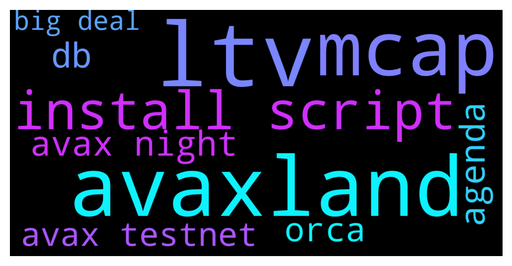

# **@avalancheavax**
 ## Analysis for **2021-12-14** - **2021-12-15**.

---

## 📊 **Basic Stats**

**n_messages_sent**: 217

---

---

## 🔝 **Top keywords and related messages**

1. **ltv**

    @defirlkp --- *there's no interest on a loan in orca, you have to pay a 0.75% fee when repaying a loan and if you ltv ratio falls below the threshold you can get liquidated and your collateral that you supplied used to repay the loan* **--->** [TG Discussion](https://t.me/avalancheavax/313160)

    @A --- *Thanks for your replies and patience.  ... ... ... I still don't get something.   Let's say you have some crypto (ETH, AVAX, BTC).   If you put it in AAVE, you can both earn interest and borrow against it. And you earn interest on the full amount of your deposit, even when you've taken out a loan so a large portion of your deposit is also collateral.  But with YieldYak or BenQi, you earn interest, but can't borrow against it. UPDATE: YOU CAN BOTH DEPOSIT AND BORROW AT BENQI. LOOKS LIKE YIELDYAK IS JUST FOR FARMING.  And at Orca, you can borrow against it, but you can't earn interest.  So it seems like it's better to keep as much as possible in one place where you can 1) earn interest on your full amount and 2) borrow and 3) maintain a safer LTV.   And it seems like if you split it up into two smaller amounts, by putting some in a place that pays interest but doesn't lend like YieldYak or BenQi, and some in a place where you can borrow but not earn interest like Orca, you've reduced the amount you earn interest on, and you've increased your LTV risk.   I'm probably missing something. That's why I'm here asking.  The reason it's so helpful to be able to turn to Telegram or Discord and ask questions is because it's a way to find out if your understanding is correct, or if you've come to wrong conclusions. It's hard to know if you understand something if you can't verify your understanding.* **--->** [TG Discussion](https://t.me/avalancheavax/313165)

    @euroog --- *Might I suggest you jump into the Orca telegram and ask these questions? You can borrow to the limit of the LTV. If your borrow percent increase above the LTV because of decrease in price of your collateral you get partially liquidated. You can borrow as little as you want. The only restriction is that you can max borrow up to the percentage specified by the LTV, eg. 70%. Each vault states the LTV so you can see what you maximally can borrow.  YieldYak is the only platform whose interestbearing token receipts can be deposited into Orca. Here's a video on it, but they've added more vaults since it was published: https://youtu.be/zft6CenpjAU* **--->** [TG Discussion](https://t.me/avalancheavax/313477)

    @A --- *AVAX deposited to YieldYak to gather interest. Some AVAX deposited to Orca for a loan. Interest on loan paid by borrower to Orca. Interest on deposit paid by YieldYak to depositer.  1) Is that right? 2) Does YieldYak not lend using deposited AVAX as collateral? 3) If not (so you need to go to Orca for a loan), the interest you earn overall would be less, right? Because the amount earning interest is lower because some has been moved out of YieldYak to Orca?  4) I will look at Orca's documentation to see if I can find out if it's possible to know before borrowing from them what a stable interest-rate charge to the borrower would be at Orca, and will update this message if I do. If anybody knows off the top of their head, and for the benefit of others with the same question who might be reading this, I hope someone will reply. UPDATE: "there's no interest on a loan in orca, you have to pay a 0.75% fee when repaying a loan and if you ltv ratio falls below the threshold you can get liquidated and your collateral that you supplied used to repay the loan" 5)  A company called Nexo loans against crypto collateral for I think somewhere close to 7%, or 6.5%. Seems high. 6) Does anybody have a link to information about amounts of interest on deposits paid by YieldYak? 7) Does anybody know of a way to buy insurance on DAO deposits and borrows, so you might be covered in the event of something like a hack or demise of the team or ...I don't know what... ?* **--->** [TG Discussion](https://t.me/avalancheavax/313159)

2. **avaxland**

    @cresuss --- *"AVAXLAND"  Avaxland is the first ever City Builder play-to-earn on the Avalanche blockchain! 🔺 Have you always dreamed of being Emin Gün Sirer's neighbor? It will soon be possible!  Support an Avalanche Community project with a unique business model, which aims to democratize play-to-earn games. 💵 Join us on our social networks to learn more about the world of Avaxland and participate in the first sale of houses (NFTs) from the unique "Founder's Edition" collection that will take place on Kalao. 🏤  Website: https://avaxland.io/  Twitter: https://twitter.com/Avaxland_game Telegram : https://t.me/avaxlandofficial  Discord : https://discord.gg/Bndeqj4aPA* **--->** [TG Discussion](https://t.me/avalancheavax/313501)

3. **mcap**

    @Sparrow --- *@Shitdogeavax stealth launched 100k MCAP CHECK IT TO THE MOON GUYS!!* **--->** [TG Discussion](https://t.me/avalancheavax/313408)

    @suraj654479976 --- *💚 Jump on the NEMESIS DEFI 2.0, Hype Train  Join:  "Rising . NemesisDAO . Finance"  <- 🌎  📍 Today: Day 32 (15.12.2021)  🏆 BEST APY on BSC —>  6% Daily ROI 🏆 👉 HotBit Trading Contest Live (Day 32) 👈 👤 10k Holder reached on Day 30! 👤 💪 50mCAP reached on Day 25, 08.12.2021 💪 🔥 Listed on HOTBIT on 09.12.2021 🔥 🥇 CERTIK Audit & Security announced on 10.12.2021🥇 💥 CMC & CG listed day 2! 💥 ⚔️ Doxxed with BSCDaily – More doxx inc 💪 🔰 Strongest 20% Liq/mCAP rate on BSC! 🔰  🚀🚀 100mCAP coming this week 🚀🚀  TG is "nemesisdao"* **--->** [TG Discussion](https://t.me/avalancheavax/313677)

4. **install script**

    @huter90 --- *We want to build a full Node. What else do we need to do besides Run an Avalanche Node using the Install Script？* **--->** [TG Discussion](https://t.me/avalancheavax/313569)

    @Nicolas_A --- *nothing if you want to be a validator you need to stake 2000 avax on it. Else running install script is enough* **--->** [TG Discussion](https://t.me/avalancheavax/313572)

    @huter90 --- *How big is avalanche's db data? We have been running the script for 6 days now, with 93G DB data, why is it so slow?* **--->** [TG Discussion](https://t.me/avalancheavax/313560)

5. **avax night**

    @Nicolas_A --- *Ask in Discord chat.avax.network / use the faucet https://faucet.avax-test.network/* **--->** [TG Discussion](https://t.me/avalancheavax/313613)

    @A --- *Thanks for your replies and patience.  ... ... ... I still don't get something.   Let's say you have some crypto (ETH, AVAX, BTC).   If you put it in AAVE, you can both earn interest and borrow against it. And you earn interest on the full amount of your deposit, even when you've taken out a loan so a large portion of your deposit is also collateral.  But with YieldYak or BenQi, you earn interest, but can't borrow against it. UPDATE: YOU CAN BOTH DEPOSIT AND BORROW AT BENQI. LOOKS LIKE YIELDYAK IS JUST FOR FARMING.  And at Orca, you can borrow against it, but you can't earn interest.  So it seems like it's better to keep as much as possible in one place where you can 1) earn interest on your full amount and 2) borrow and 3) maintain a safer LTV.   And it seems like if you split it up into two smaller amounts, by putting some in a place that pays interest but doesn't lend like YieldYak or BenQi, and some in a place where you can borrow but not earn interest like Orca, you've reduced the amount you earn interest on, and you've increased your LTV risk.   I'm probably missing something. That's why I'm here asking.  The reason it's so helpful to be able to turn to Telegram or Discord and ask questions is because it's a way to find out if your understanding is correct, or if you've come to wrong conclusions. It's hard to know if you understand something if you can't verify your understanding.* **--->** [TG Discussion](https://t.me/avalancheavax/313165)

    @Nicolas_A --- *nothing if you want to be a validator you need to stake 2000 avax on it. Else running install script is enough* **--->** [TG Discussion](https://t.me/avalancheavax/313572)

    @huter90 --- *Can someone give me some testnet avax? We want to do some validator tests* **--->** [TG Discussion](https://t.me/avalancheavax/313609)

    @AlessandroPap --- *Can someone give me some testnet avax? Got nonce too low from this faucet https://faucet.avax-test.network/ and now i can't retry...* **--->** [TG Discussion](https://t.me/avalancheavax/313590)

    @A --- *AVAX deposited to YieldYak to gather interest. Some AVAX deposited to Orca for a loan. Interest on loan paid by borrower to Orca. Interest on deposit paid by YieldYak to depositer.  1) Is that right? 2) Does YieldYak not lend using deposited AVAX as collateral? 3) If not (so you need to go to Orca for a loan), the interest you earn overall would be less, right? Because the amount earning interest is lower because some has been moved out of YieldYak to Orca?  4) I will look at Orca's documentation to see if I can find out if it's possible to know before borrowing from them what a stable interest-rate charge to the borrower would be at Orca, and will update this message if I do. If anybody knows off the top of their head, and for the benefit of others with the same question who might be reading this, I hope someone will reply. UPDATE: "there's no interest on a loan in orca, you have to pay a 0.75% fee when repaying a loan and if you ltv ratio falls below the threshold you can get liquidated and your collateral that you supplied used to repay the loan" 5)  A company called Nexo loans against crypto collateral for I think somewhere close to 7%, or 6.5%. Seems high. 6) Does anybody have a link to information about amounts of interest on deposits paid by YieldYak? 7) Does anybody know of a way to buy insurance on DAO deposits and borrows, so you might be covered in the event of something like a hack or demise of the team or ...I don't know what... ?* **--->** [TG Discussion](https://t.me/avalancheavax/313159)

6. **db**

    @huter90 --- *How big is avalanche's db data? We have been running the script for 6 days now, with 93G DB data, why is it so slow?* **--->** [TG Discussion](https://t.me/avalancheavax/313560)

7. **agenda**

    @busiibriee --- *ETH network is a gas fees scam agenda* **--->** [TG Discussion](https://t.me/avalancheavax/313515)

    @Tyranny5000 --- *and bsc is a scam agenda lol* **--->** [TG Discussion](https://t.me/avalancheavax/313516)

8. **orca**

    @defirlkp --- *there's no interest on a loan in orca, you have to pay a 0.75% fee when repaying a loan and if you ltv ratio falls below the threshold you can get liquidated and your collateral that you supplied used to repay the loan* **--->** [TG Discussion](https://t.me/avalancheavax/313160)

    @A --- *Thanks for your replies and patience.  ... ... ... I still don't get something.   Let's say you have some crypto (ETH, AVAX, BTC).   If you put it in AAVE, you can both earn interest and borrow against it. And you earn interest on the full amount of your deposit, even when you've taken out a loan so a large portion of your deposit is also collateral.  But with YieldYak or BenQi, you earn interest, but can't borrow against it. UPDATE: YOU CAN BOTH DEPOSIT AND BORROW AT BENQI. LOOKS LIKE YIELDYAK IS JUST FOR FARMING.  And at Orca, you can borrow against it, but you can't earn interest.  So it seems like it's better to keep as much as possible in one place where you can 1) earn interest on your full amount and 2) borrow and 3) maintain a safer LTV.   And it seems like if you split it up into two smaller amounts, by putting some in a place that pays interest but doesn't lend like YieldYak or BenQi, and some in a place where you can borrow but not earn interest like Orca, you've reduced the amount you earn interest on, and you've increased your LTV risk.   I'm probably missing something. That's why I'm here asking.  The reason it's so helpful to be able to turn to Telegram or Discord and ask questions is because it's a way to find out if your understanding is correct, or if you've come to wrong conclusions. It's hard to know if you understand something if you can't verify your understanding.* **--->** [TG Discussion](https://t.me/avalancheavax/313165)

    @euroog --- *Might I suggest you jump into the Orca telegram and ask these questions? You can borrow to the limit of the LTV. If your borrow percent increase above the LTV because of decrease in price of your collateral you get partially liquidated. You can borrow as little as you want. The only restriction is that you can max borrow up to the percentage specified by the LTV, eg. 70%. Each vault states the LTV so you can see what you maximally can borrow.  YieldYak is the only platform whose interestbearing token receipts can be deposited into Orca. Here's a video on it, but they've added more vaults since it was published: https://youtu.be/zft6CenpjAU* **--->** [TG Discussion](https://t.me/avalancheavax/313477)

    @defirlkp --- *in benqi you can earn interest when you supply an asset and you can also borrow, yieldyak is an autocompounder, with strategies for lending protocols such as aave and benqi (think its the usual folding strategy). in orca you borrow a stablecoin called avai which you can then swap for any asset you want and then use that to earn a return with whatever strategy you use, some go for stablecoin pairs/pools such as those at axial* **--->** [TG Discussion](https://t.me/avalancheavax/313166)

    @A --- *Thanks. Then is Orca simlar to Benqi and AAVE?* **--->** [TG Discussion](https://t.me/avalancheavax/313140)

    @euroog --- *There's no interest, only the payback fee, as far as I understand. If you use AAVE or BenQi you GAIN interest on your asset, ie. it increase in value, and you can use that as collateral in Orca. So you can loan against it at zero interest in Orca, while the underlying asset has yield and increases in value* **--->** [TG Discussion](https://t.me/avalancheavax/313227)

9. **avax testnet**

    @Nicolas_A --- *Ask in Discord chat.avax.network / use the faucet https://faucet.avax-test.network/* **--->** [TG Discussion](https://t.me/avalancheavax/313613)

    @A --- *Thanks for your replies and patience.  ... ... ... I still don't get something.   Let's say you have some crypto (ETH, AVAX, BTC).   If you put it in AAVE, you can both earn interest and borrow against it. And you earn interest on the full amount of your deposit, even when you've taken out a loan so a large portion of your deposit is also collateral.  But with YieldYak or BenQi, you earn interest, but can't borrow against it. UPDATE: YOU CAN BOTH DEPOSIT AND BORROW AT BENQI. LOOKS LIKE YIELDYAK IS JUST FOR FARMING.  And at Orca, you can borrow against it, but you can't earn interest.  So it seems like it's better to keep as much as possible in one place where you can 1) earn interest on your full amount and 2) borrow and 3) maintain a safer LTV.   And it seems like if you split it up into two smaller amounts, by putting some in a place that pays interest but doesn't lend like YieldYak or BenQi, and some in a place where you can borrow but not earn interest like Orca, you've reduced the amount you earn interest on, and you've increased your LTV risk.   I'm probably missing something. That's why I'm here asking.  The reason it's so helpful to be able to turn to Telegram or Discord and ask questions is because it's a way to find out if your understanding is correct, or if you've come to wrong conclusions. It's hard to know if you understand something if you can't verify your understanding.* **--->** [TG Discussion](https://t.me/avalancheavax/313165)

    @Nicolas_A --- *nothing if you want to be a validator you need to stake 2000 avax on it. Else running install script is enough* **--->** [TG Discussion](https://t.me/avalancheavax/313572)

    @huter90 --- *Can someone give me some testnet avax? We want to do some validator tests* **--->** [TG Discussion](https://t.me/avalancheavax/313609)

    @AlessandroPap --- *Can someone give me some testnet avax? Got nonce too low from this faucet https://faucet.avax-test.network/ and now i can't retry...* **--->** [TG Discussion](https://t.me/avalancheavax/313590)

    @A --- *AVAX deposited to YieldYak to gather interest. Some AVAX deposited to Orca for a loan. Interest on loan paid by borrower to Orca. Interest on deposit paid by YieldYak to depositer.  1) Is that right? 2) Does YieldYak not lend using deposited AVAX as collateral? 3) If not (so you need to go to Orca for a loan), the interest you earn overall would be less, right? Because the amount earning interest is lower because some has been moved out of YieldYak to Orca?  4) I will look at Orca's documentation to see if I can find out if it's possible to know before borrowing from them what a stable interest-rate charge to the borrower would be at Orca, and will update this message if I do. If anybody knows off the top of their head, and for the benefit of others with the same question who might be reading this, I hope someone will reply. UPDATE: "there's no interest on a loan in orca, you have to pay a 0.75% fee when repaying a loan and if you ltv ratio falls below the threshold you can get liquidated and your collateral that you supplied used to repay the loan" 5)  A company called Nexo loans against crypto collateral for I think somewhere close to 7%, or 6.5%. Seems high. 6) Does anybody have a link to information about amounts of interest on deposits paid by YieldYak? 7) Does anybody know of a way to buy insurance on DAO deposits and borrows, so you might be covered in the event of something like a hack or demise of the team or ...I don't know what... ?* **--->** [TG Discussion](https://t.me/avalancheavax/313159)

10. **big deal**

    @huter90 --- *How big is avalanche's db data? We have been running the script for 6 days now, with 93G DB data, why is it so slow?* **--->** [TG Discussion](https://t.me/avalancheavax/313560)

    @Dreadmau5 --- *I witnessed a hype launch on Avax last night, not even that big tbh but biggest I've seen on here, the chain looked like it was really struggling, transactions werent going through at all for a lot of people, 140k volume max i think. Are there plans to improve this? It was shitcoin that launched as well i think there would be massive issues if there was a legit project that was hyped out about launching on here* **--->** [TG Discussion](https://t.me/avalancheavax/313658)

    @defirlkp --- *yes you can post your questions but the gap between what you're asking and defi lending is quite big that it seems you have not done any preliminary research into it yet* **--->** [TG Discussion](https://t.me/avalancheavax/313145)

    @Tyranny5000 --- *is $ave new balancer dex v2 for avalanche a big deal? like how big? 1 who cares 10 big deal* **--->** [TG Discussion](https://t.me/avalancheavax/313460)

    @Dreadmau5 --- *It isn't bad for the environment our energy providers and world leaders are the ones preventing us from harnessing renewable energy, look at the bigger picture not the crypto* **--->** [TG Discussion](https://t.me/avalancheavax/313213)

    @PSY --- *There's no regulation coming from Indian Government , Indians are putting fiat in market "100million" is a big Number for now* **--->** [TG Discussion](https://t.me/avalancheavax/313685)

