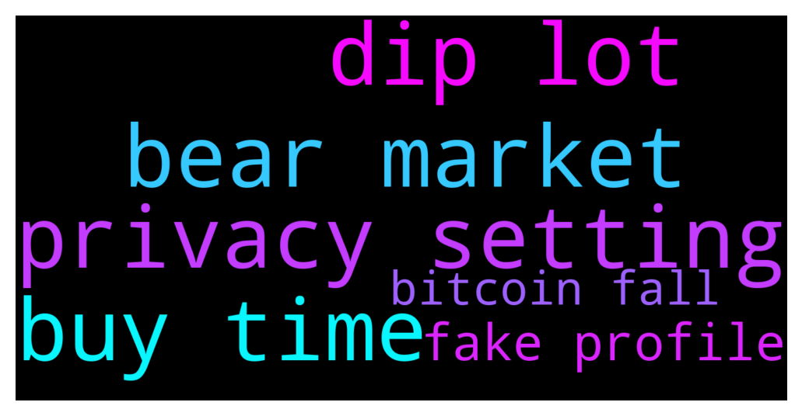

# **@balancer_officialchat**
 ## Analysis for **2021-12-14** - **2021-12-15**.

---

## 📊 **Basic Stats**

**n_messages_sent**: 79

---

---

## 🔝 **Top keywords and related messages**

1. **privacy setting**

    @reymond2476 --- *⚠️ Please be aware of scammers.⚠️   Our holder's security and safety are our number one priority. Be advised that scammers create fake profiles to impersonate team members or Admin. NEVER give out log-in information, seed phrases, or any other personal information to anyone!   Some easy steps you can take are to change your privacy settings to disable members from private messaging you or adding you to other groups without your permission.  Go to - Settings Go to - Privacy and Security Change all of your settings under the Privacy category from "everybody" to "My Contacts".  ⚠️Always read pinned message for latest info* **--->** [TG Discussion](https://t.me/balancer_officialchat/13113)

2. **bear market**

    @Zhang5689 --- *Where does everyone think Bitcoin will raise to until it hits a bear market for good??? How long do you think the bear market will last or if we even do have one?* **--->** [TG Discussion](https://t.me/balancer_officialchat/13104)

    @kennethfred --- *Keep holding. We're still in an incomplete Bull market.* **--->** [TG Discussion](https://t.me/balancer_officialchat/13106)

    @alanshawn399 --- *The market is down today, should I buy more mainstream currencies?* **--->** [TG Discussion](https://t.me/balancer_officialchat/13024)

    @Zhang5689 --- *What are your thoughts on today's market decline?* **--->** [TG Discussion](https://t.me/balancer_officialchat/13023)

3. **dip lot**

    @alanshawn399 --- *When I'm your barber and I found out that you didn't buy from BAL when it was dip  😭* **--->** [TG Discussion](https://t.me/balancer_officialchat/13061)

    @Baker --- *There are people in this community that got almost 2X their investment because they bought during the dip when a lot of people were scared to* **--->** [TG Discussion](https://t.me/balancer_officialchat/13065)

    @alanshawn399 --- *After dips comes massive pumps Now is still a good time buy* **--->** [TG Discussion](https://t.me/balancer_officialchat/13069)

    @Aaron --- *That means if you're my baber. I won't let you know that I didn't buy from the dip* **--->** [TG Discussion](https://t.me/balancer_officialchat/13062)

    @willscott222 --- *You really can’t lose. Even if you don’t have money to spend this dip. Just relax, trade your BAL on the promo sales, get your bonuses, play the long game and enjoy the ride.* **--->** [TG Discussion](https://t.me/balancer_officialchat/13102)

    @Baker --- *now is the best time to buy from the dip and gain a lot of profit when BAL pump* **--->** [TG Discussion](https://t.me/balancer_officialchat/13135)

4. **buy time**

    @lottie092 --- *This is the best time to buy from the promo sales* **--->** [TG Discussion](https://t.me/balancer_officialchat/13008)

    @alanshawn399 --- *After dips comes massive pumps Now is still a good time buy* **--->** [TG Discussion](https://t.me/balancer_officialchat/13069)

    @Baker --- *Everybody is fearful about BAL and this is the time we should buy more. Buy* **--->** [TG Discussion](https://t.me/balancer_officialchat/13079)

    @mm32115 --- *With the potentially enormous amounts of BAL being burned every two weeks it seems that it would be possible for you to do x100 on your investment and the marketcap stay the same? This seems insane to me but logical at the same time haha* **--->** [TG Discussion](https://t.me/balancer_officialchat/13072)

    @kennethfred --- *Wow this is the right time to buy BAL  From the promo sales don't miss it* **--->** [TG Discussion](https://t.me/balancer_officialchat/13089)

    @Baker --- *now is the best time to buy from the dip and gain a lot of profit when BAL pump* **--->** [TG Discussion](https://t.me/balancer_officialchat/13135)

5. **fake profile**

    @reymond2476 --- *⚠️ Please be aware of scammers.⚠️   Our holder's security and safety are our number one priority. Be advised that scammers create fake profiles to impersonate team members or Admin. NEVER give out log-in information, seed phrases, or any other personal information to anyone!   Some easy steps you can take are to change your privacy settings to disable members from private messaging you or adding you to other groups without your permission.  Go to - Settings Go to - Privacy and Security Change all of your settings under the Privacy category from "everybody" to "My Contacts".  ⚠️Always read pinned message for latest info* **--->** [TG Discussion](https://t.me/balancer_officialchat/13113)

6. **bitcoin fall**

    @Zhang5689 --- *Where does everyone think Bitcoin will raise to until it hits a bear market for good??? How long do you think the bear market will last or if we even do have one?* **--->** [TG Discussion](https://t.me/balancer_officialchat/13104)

    @kennethfred --- *Every coin dipped currently due to the fall of Bitcoin mate* **--->** [TG Discussion](https://t.me/balancer_officialchat/13119)

    @willscott222 --- *The bigger the drop, the bigger the next impulsive wave up. Should see Bitcoin go past 70k in its next wave up over next month I think so* **--->** [TG Discussion](https://t.me/balancer_officialchat/13021)

