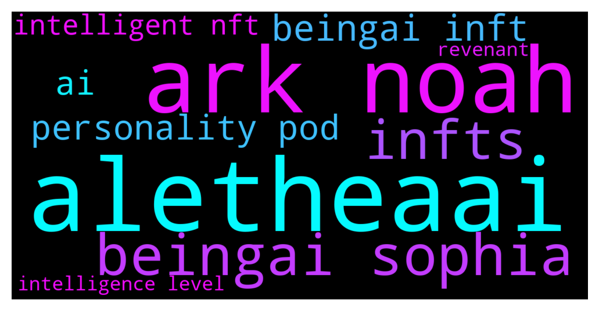

# **@binancenfts**
 ## Analysis for **2021-12-14** - **2021-12-15**.

---

## 📊 **Basic Stats**

**n_messages_sent**: 268

---

---

## 🔝 **Top keywords and related messages**

1. **aletheaai**

    @Aabidah1 --- *💢Which NFT has been sold at your highest price and at what price?🔥  #AletheaAI* **--->** [TG Discussion](https://t.me/binancenfts/409212)

    @c_hinmay --- *Will the NFTs be created by AI itself only or is it available for other artists too? I am confused about minting process... can you explain? #AletheaAI* **--->** [TG Discussion](https://t.me/binancenfts/409216)

    @Metavurse --- *We currently support 10 NFT communities (more information in Discord www.discord.gg/aletheaai) which you can fuse your pod with. None of these were created by AI. The AI lives within the Personality Pod, which you can create the personality for. When fused, you then have an iNFT.* **--->** [TG Discussion](https://t.me/binancenfts/409294)

    @Aaa5786 --- *How many wallet support Alethea?#AletheaAI* **--->** [TG Discussion](https://t.me/binancenfts/409276)

    @Kenikky --- *Get your questions ready. I will open the chat only for 1 minute. And add at the end of the question #AletheaAI* **--->** [TG Discussion](https://t.me/binancenfts/409203)

    @Naikgauresh481 --- *Please share your social media handle? #AletheaAI* **--->** [TG Discussion](https://t.me/binancenfts/409261)

2. **ark noah**

    @Metavurse --- *Here is an example of what you can currently do at Noah's Ark with one of our supported communities* **--->** [TG Discussion](https://t.me/binancenfts/409172)

    @Metavurse --- *Here is an video from Noah's Ark* **--->** [TG Discussion](https://t.me/binancenfts/409180)

    @Metavurse --- *Alethea also sold a new, exciting collection known as Personality Pods, which allow NFT owners to fuse their existing NFT with a Personality Pod and bring it to life. Currently, Alethea supports 10 PFP projects to fuse with Personality Pods, but in the future, even more NFT projects will be welcome to fuse. Owners of Personality Pods are able to train their pods through the Noah’s Ark Intelligent Metaverse.* **--->** [TG Discussion](https://t.me/binancenfts/409170)

    @petrichorcnr --- *I am amazed by your innovative project. In order to be a real and sustainable source of income in the future, will the artificial intelligence robots in the Noah's Ark ecosystem be able to design nft when they come to the stage of making their own decisions over time?Will they be able to write a music or movie script? @Metavurse* **--->** [TG Discussion](https://t.me/binancenfts/409241)

    @rahmat1591 --- *Can we only interact with iNFT's in Noah's Ark metaverse or we can open iNFT's on our browser or moblie to interact with them? #AletheaAI* **--->** [TG Discussion](https://t.me/binancenfts/409229)

    @alam463 --- *How do SOPHIA beingAI iNFTS earn reward on NOAH'S ARK?#AletheaAI* **--->** [TG Discussion](https://t.me/binancenfts/409217)

3. **beingai sophia**

    @Kenikky --- *You have me interested, but why should I buy a Sophia beingAI iNFT?* **--->** [TG Discussion](https://t.me/binancenfts/409186)

    @trixie5576 --- *what can i do with my SOPHIA beingAI INFT?#AletheaAI* **--->** [TG Discussion](https://t.me/binancenfts/409235)

    @Metavurse --- *Initial Gaming Offering is the process through which gaming projects raise funds by offering gaming NFT assets. IGOs are genesis gaming NFT assets from top gaming projects available exclusively on the Binance NFT Marketplace. Collections can launch either via auction, flat rate sales, or mystery boxes. Alethea AI and beingAI is launching the Sophia beingAI iNFT IGO via English Auctions.  By collaborating with beingAI, AletheaAI is leading the world’s first intelligent IGO by featuring 100 intelligent NFTs of Sophia the Robot (created by Hanson Robotics). Sophia beingAI is an intelligent animated version of Sophia the Robot which will be available on Binance NFT on 16th December to interact with the world in real-time. We will be auctioning  20 Sophia beingAI iNFTs of various intelligence level daily, for 5 days.* **--->** [TG Discussion](https://t.me/binancenfts/409181)

    @sorazora439 --- *Does a SOPHIA beingAI iNFT come with a POD?#AletheaAI* **--->** [TG Discussion](https://t.me/binancenfts/409254)

    @alam463 --- *How do SOPHIA beingAI iNFTS earn reward on NOAH'S ARK?#AletheaAI* **--->** [TG Discussion](https://t.me/binancenfts/409217)

    @BNB_Arthur --- *Dear Binancians!  @real_alethea, the pioneer of Intelligent NFTs, is launching on Binance NFT Marketplace with 100 Sophia @beingaico iNFTs on the 16th of December.  Stay tuned for more on their train-to-earn model, and check out Sophia in their Noah’s Ark metaverse today! 👀* **--->** [TG Discussion](https://t.me/binancenfts/409040)

4. **infts**

    @BNB_Arthur --- *Dear Binancians!  @real_alethea, the pioneer of Intelligent NFTs, is launching on Binance NFT Marketplace with 100 Sophia @beingaico iNFTs on the 16th of December.  Stay tuned for more on their train-to-earn model, and check out Sophia in their Noah’s Ark metaverse today! 👀* **--->** [TG Discussion](https://t.me/binancenfts/409040)

    @Metavurse --- *This collection comprises 100 unique Sophia beingAI iNFTs to celebrate the birth of Sophia beingAI as she travels around the world and through Alethea’s Intelligent Metaverse to interact with humans and evolve her intelligence. Sophia beingAI aims to connect all cultures, ethnicities, religions, nations, genders, generations and species into a realm of total inclusiveness. The collection will include 100 unique iNFTs in 4 groups, signifying the transmedia  universes with past, present, future human presence that Sophia beingAI will visit.   Beginning December 16th, 2021 at 5pm EST, 20 Sophia beingAI iNFTs will be sold at auction daily. They 20 Sophia beingAI iNFTs will be released each of the following four days until the auction concludes on December 21st, 2021.* **--->** [TG Discussion](https://t.me/binancenfts/409183)

    @Metavurse --- *Also if anyone is bored waiting on me to respond - I do encourage you to to go www.alethea.ai and play around. We have a number of iNFTs that you can speak with live on the site now* **--->** [TG Discussion](https://t.me/binancenfts/409163)

    @Metavurse --- *First off, I know you already want one 😂.. but let me explain a bit more..  When you purchase a Sophia beingAI iNFT, you are joining the epic communities of both beingAI and Alethea AI. You are taking part in the inaugural collection of 100 Sophia beingAI iNFTs, a historic first. You can also earn interaction rewards through Noah’s Ark.* **--->** [TG Discussion](https://t.me/binancenfts/409187)

    @me_sweetheart --- *#AletheaAI Are these iNFTs on Ethereum or Binance Smart Chain? Do I use BNB or ETH to bid? @Metavurse* **--->** [TG Discussion](https://t.me/binancenfts/409207)

    @cocoteaaa --- *I’ve seen the collection of iNFTs in your website and I’m really amazed. Are there limited supplies of iNFTs? Does all of iNFTs have a unique intelligence or characteristic that won’t be present to other iNFTs? @Metavurse @cybersomeone #AletheaAI* **--->** [TG Discussion](https://t.me/binancenfts/409224)

5. **beingai inft**

    @Kenikky --- *You have me interested, but why should I buy a Sophia beingAI iNFT?* **--->** [TG Discussion](https://t.me/binancenfts/409186)

    @Metavurse --- *It really is. In fact, our Auction of the first iNFT at Sothebys was a very large recruitment tool for us.* **--->** [TG Discussion](https://t.me/binancenfts/409156)

    @cybersomeone --- *here's a summary image of, "What is an iNFT" using one of our Revenants as an example!* **--->** [TG Discussion](https://t.me/binancenfts/409297)

    @Metavurse --- *We currently support 10 NFT communities (more information in Discord www.discord.gg/aletheaai) which you can fuse your pod with. None of these were created by AI. The AI lives within the Personality Pod, which you can create the personality for. When fused, you then have an iNFT.* **--->** [TG Discussion](https://t.me/binancenfts/409294)

    @trixie5576 --- *what can i do with my SOPHIA beingAI INFT?#AletheaAI* **--->** [TG Discussion](https://t.me/binancenfts/409235)

    @rahmat1591 --- *Can we only interact with iNFT's in Noah's Ark metaverse or we can open iNFT's on our browser or moblie to interact with them? #AletheaAI* **--->** [TG Discussion](https://t.me/binancenfts/409229)

6. **personality pod**

    @hamzazafar7 --- *If I’ve trained my Pod up with an amazing personality and don’t want to attach it to any NFT,  Can I sell it as is? @AltheaAl* **--->** [TG Discussion](https://t.me/binancenfts/409275)

    @Metavurse --- *Alethea also sold a new, exciting collection known as Personality Pods, which allow NFT owners to fuse their existing NFT with a Personality Pod and bring it to life. Currently, Alethea supports 10 PFP projects to fuse with Personality Pods, but in the future, even more NFT projects will be welcome to fuse. Owners of Personality Pods are able to train their pods through the Noah’s Ark Intelligent Metaverse.* **--->** [TG Discussion](https://t.me/binancenfts/409170)

    @Metavurse --- *We currently support 10 NFT communities (more information in Discord www.discord.gg/aletheaai) which you can fuse your pod with. None of these were created by AI. The AI lives within the Personality Pod, which you can create the personality for. When fused, you then have an iNFT.* **--->** [TG Discussion](https://t.me/binancenfts/409294)

    @sorazora439 --- *Does a SOPHIA beingAI iNFT come with a POD?#AletheaAI* **--->** [TG Discussion](https://t.me/binancenfts/409254)

    @Metavurse --- *You do not have to attach it (we call this fusing a pod with an NFT to create an iNFT) to sell it. However in order for the iNFT to embark into another metaverse, not just be on Noah's Ark, the pod needs to be fused.* **--->** [TG Discussion](https://t.me/binancenfts/409292)

    @Dinc3 --- *Hi! @Metavurse @cybersomeone  Please explain the Personality Pods feature of Alethea. How does it work? In which ways is personality pods is unique and make a difference in the market when you compare it to other projects? What are the advantages of using it?   #AletheaAI* **--->** [TG Discussion](https://t.me/binancenfts/409225)

7. **ai**

    @Aabidah1 --- *💢Which NFT has been sold at your highest price and at what price?🔥  #AletheaAI* **--->** [TG Discussion](https://t.me/binancenfts/409212)

    @Kenikky --- *You have me interested, but why should I buy a Sophia beingAI iNFT?* **--->** [TG Discussion](https://t.me/binancenfts/409186)

    @c_hinmay --- *Will the NFTs be created by AI itself only or is it available for other artists too? I am confused about minting process... can you explain? #AletheaAI* **--->** [TG Discussion](https://t.me/binancenfts/409216)

    @Metavurse --- *We currently support 10 NFT communities (more information in Discord www.discord.gg/aletheaai) which you can fuse your pod with. None of these were created by AI. The AI lives within the Personality Pod, which you can create the personality for. When fused, you then have an iNFT.* **--->** [TG Discussion](https://t.me/binancenfts/409294)

    @Aaa5786 --- *How many wallet support Alethea?#AletheaAI* **--->** [TG Discussion](https://t.me/binancenfts/409276)

    @Semeerkvv --- *Start Your Bid 60$ Cheapest price on BINANCE market  Search 👇  BrainCaser Club #87* **--->** [TG Discussion](https://t.me/binancenfts/409466)

8. **intelligent nft**

    @plutoniumgame --- *I sent a request for our digital art, nft, but no response, why binans placed all sorts of pixel geeks but not respond to a really good project?* **--->** [TG Discussion](https://t.me/binancenfts/408832)

    @Aabidah1 --- *💢Which NFT has been sold at your highest price and at what price?🔥  #AletheaAI* **--->** [TG Discussion](https://t.me/binancenfts/409212)

    @Metavurse --- *Check out more about our Intelligent Metaverse here: https://www.fastcompany.com/90684509/alethea-ai-nft-avatar-metaverse-mark-cuban* **--->** [TG Discussion](https://t.me/binancenfts/409296)

    @hamzazafar7 --- *If I’ve trained my Pod up with an amazing personality and don’t want to attach it to any NFT,  Can I sell it as is? @AltheaAl* **--->** [TG Discussion](https://t.me/binancenfts/409275)

    @Metavurse --- *Alethea also sold a new, exciting collection known as Personality Pods, which allow NFT owners to fuse their existing NFT with a Personality Pod and bring it to life. Currently, Alethea supports 10 PFP projects to fuse with Personality Pods, but in the future, even more NFT projects will be welcome to fuse. Owners of Personality Pods are able to train their pods through the Noah’s Ark Intelligent Metaverse.* **--->** [TG Discussion](https://t.me/binancenfts/409170)

    @c_hinmay --- *Will the NFTs be created by AI itself only or is it available for other artists too? I am confused about minting process... can you explain? #AletheaAI* **--->** [TG Discussion](https://t.me/binancenfts/409216)

9. **intelligence level**

    @petrichorcnr --- *I am amazed by your innovative project. In order to be a real and sustainable source of income in the future, will the artificial intelligence robots in the Noah's Ark ecosystem be able to design nft when they come to the stage of making their own decisions over time?Will they be able to write a music or movie script? @Metavurse* **--->** [TG Discussion](https://t.me/binancenfts/409241)

    @Metavurse --- *Initial Gaming Offering is the process through which gaming projects raise funds by offering gaming NFT assets. IGOs are genesis gaming NFT assets from top gaming projects available exclusively on the Binance NFT Marketplace. Collections can launch either via auction, flat rate sales, or mystery boxes. Alethea AI and beingAI is launching the Sophia beingAI iNFT IGO via English Auctions.  By collaborating with beingAI, AletheaAI is leading the world’s first intelligent IGO by featuring 100 intelligent NFTs of Sophia the Robot (created by Hanson Robotics). Sophia beingAI is an intelligent animated version of Sophia the Robot which will be available on Binance NFT on 16th December to interact with the world in real-time. We will be auctioning  20 Sophia beingAI iNFTs of various intelligence level daily, for 5 days.* **--->** [TG Discussion](https://t.me/binancenfts/409181)

    @Billythepoo1 --- *I understand ai level with be increasing the intelligence but what real world use will it have? will ai creation be as good as human ones? what if ai codes other ai?* **--->** [TG Discussion](https://t.me/binancenfts/409273)

    @Metavurse --- *This collection comprises 100 unique Sophia beingAI iNFTs to celebrate the birth of Sophia beingAI as she travels around the world and through Alethea’s Intelligent Metaverse to interact with humans and evolve her intelligence. Sophia beingAI aims to connect all cultures, ethnicities, religions, nations, genders, generations and species into a realm of total inclusiveness. The collection will include 100 unique iNFTs in 4 groups, signifying the transmedia  universes with past, present, future human presence that Sophia beingAI will visit.   Beginning December 16th, 2021 at 5pm EST, 20 Sophia beingAI iNFTs will be sold at auction daily. They 20 Sophia beingAI iNFTs will be released each of the following four days until the auction concludes on December 21st, 2021.* **--->** [TG Discussion](https://t.me/binancenfts/409183)

    @Metavurse --- *Alethea AI is proud to partner with Binance and beingAI, to launch a new collection known as “The Transmedia Universe of Sophia beingAI”. Sophia beingAI is the virtual, anime version of the world’s most loved and celebrated robot - Sophia. Sophia is the first robot citizen, a brand ambassador and an internet celebrity. Sophia beingAI’s story is grounded in the heritage and origin story of Sophia the Robot. Alethea and beingAI share a mission of exploring human identity and intelligence through AI, making this a natural partnership. As an iNFT, Sophia beingAI can now cross the digital landscape and offer real-time interactions so you can get to know the personality behind the asset. Together we are launching Binance’s first Intelligence IGO (Initial Game Offering) featuring one hundred intelligent NFTs.* **--->** [TG Discussion](https://t.me/binancenfts/409177)

    @xperia3 --- *Hi! 👾  There are 10 Different Intelligence Levels in Alethea AI. Can you please tell us the what are the benefits and the extra attributes when you level up? What do we have to do level up? How much should we invest to reach the best level?  @cybersomeone @Metavurse  #AletheaAI* **--->** [TG Discussion](https://t.me/binancenfts/409209)

10. **revenant**

    @Metavurse --- *Our Revenant collection was recently at Auction at OpenSea and brought in approximately 7M at auction: https://nftplazas.com/alethea-ai-breaks-opensea-records-with-latest-inft-sales/?utm_source=twitter&utm_medium=NFT+Plazas+%E2%8F%B9%EF%B8%8F+NFT+News&utm_campaign=publer* **--->** [TG Discussion](https://t.me/binancenfts/409285)

    @cybersomeone --- *here's a summary image of, "What is an iNFT" using one of our Revenants as an example!* **--->** [TG Discussion](https://t.me/binancenfts/409297)

    @Metavurse --- *In October ‘21, Alethea concluded an incredibly successful auction of their first collection known as The Revenants. This is a collection of one hundred Intelligent NFTs, based on history’s most significant figures. From Aristotle to Cleopatra to Cinderella, the icons of the past, both real and fictional, were reborn as iNFTs. The Revenants can now be found on Noah’s Ark, where you can use them to record custom video messages, upload audio, or - in the case of some characters such as Julius Caesar or Adam Smith - you can even interact and hold a conversation with them. The highest selling Revenant during the auction was Vincent Van Gogh, who sold for 58 ETH ($232,000 USD).* **--->** [TG Discussion](https://t.me/binancenfts/409169)

