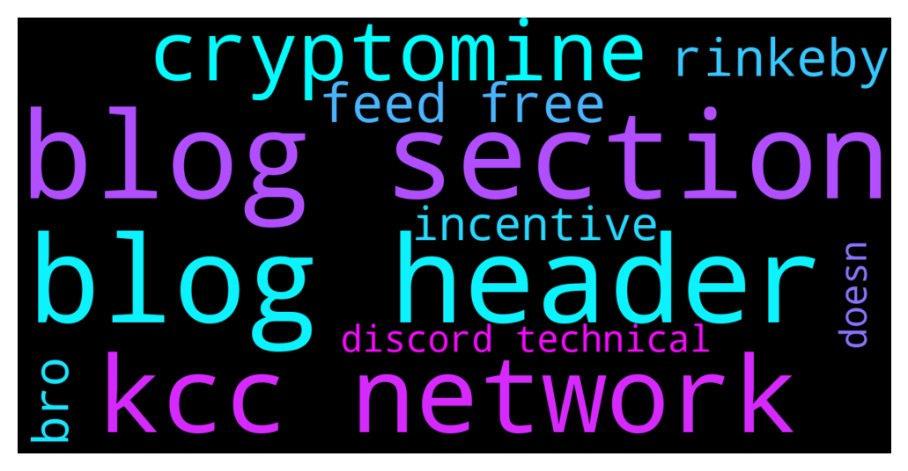

# **@chainlinkofficial**
 ## Analysis for **2021-12-14** - **2021-12-15**.

---

## 📊 **Basic Stats**

**n_messages_sent**: 119

---

---

## 🔝 **Top keywords and related messages**

1. **blog section**

    @king_agaga --- *To any admin: Might want to let the webdev team know that the header for the Blog section of the website hasn't been updated to reflect the rest of the site: https://blog.chain.link/* **--->** [TG Discussion](https://t.me/chainlinkofficial/355102)

    @king_agaga --- *See above: the header for Blog section doesn't include the recently added Insurance page, for example.* **--->** [TG Discussion](https://t.me/chainlinkofficial/355103)

2. **blog header**

    @king_agaga --- *To any admin: Might want to let the webdev team know that the header for the Blog section of the website hasn't been updated to reflect the rest of the site: https://blog.chain.link/* **--->** [TG Discussion](https://t.me/chainlinkofficial/355102)

    @king_agaga --- *See above: the header for Blog section doesn't include the recently added Insurance page, for example.* **--->** [TG Discussion](https://t.me/chainlinkofficial/355103)

3. **kcc network**

    @nam_nguyenson --- *If the sending and receiving network doesn't match, then yes most likely it's lost. Exchanges can sometimes help you with that so I recommend reaching out to them. There is not much we can help with here.* **--->** [TG Discussion](https://t.me/chainlinkofficial/355152)

    @harrumphharrumph --- *Chainlink 2.0 is not really a "binary" transition, one day you switch off Chainlink and the next day you switch on Chainlink 2.0, but rather a set of capabilities that will develop independently to gradually make hybrid smart contracts go mainstream. Feeds using OCR or even smart contracts leveraging Chainlink Keepers are already "Chainlink 2.0" to some extent, as they leverage the hybrid nature of the oracle networks, given that they post information on-chain but part of the computation occurs off-chain.  More information can be found here and the linked whitepaper: https://blog.chain.link/chainlink-2-0-lays-foundation-for-adoption-of-hybrid-smart-contracts/* **--->** [TG Discussion](https://t.me/chainlinkofficial/355018)

    @marcromeron --- *In just a few moments, we will have a Community Q&A with CRD Network who recently announced that has launched its official Chainlink node, bringing its compliance data on-chain to help facilitate institutional adoption of DeFi. To read more about this integration, please check this article below: https://crd-network.medium.com/the-crd-chainlink-node-is-here-helping-you-get-legally-compliant-across-defi-dapps-d70279a1ecea* **--->** [TG Discussion](https://t.me/chainlinkofficial/354910)

    @altcoiner --- *WEll,I withdrew link from kucoin using the KCC network,and I dont seee the coins in my wallet.Did I screw up here?* **--->** [TG Discussion](https://t.me/chainlinkofficial/355150)

    @mleinad --- *Why isn't chainlink VRF available on ropsten, like you literally choose the networks only that we can't get any testnet funds for....  AMAZING!* **--->** [TG Discussion](https://t.me/chainlinkofficial/354758)

    @Jordan2994 --- *I'm from moonpot community. We are using Chainlink VRF (Verifiable Random Function) on BSC network in our protocol. Wanna know when can we expect Chainlink VRF on Fantom, because at some point we will go multichain and Fantom is our first target network.  would appriciate some leaks, just curious. Thank you on answer and time.* **--->** [TG Discussion](https://t.me/chainlinkofficial/355033)

4. **cryptomine**

    @nam_nguyenson --- *https://www.chainlinkecosystem.com/ecosystem/cryptomines/  CryptoMines integrated Chainlink VRF. It is not a partnership though just to clarify.* **--->** [TG Discussion](https://t.me/chainlinkofficial/355125)

    @KMG850C --- *Wait, not cryptomines bro, it Minecrypto, can i send screenshoot in here?* **--->** [TG Discussion](https://t.me/chainlinkofficial/355130)

5. **feed free**

    @Linkederic --- *While the price feeds are free to consumer, many projects elect to become sponsors and pay to use the price feeds, supporting higher quality data sources, additional node operators, etc* **--->** [TG Discussion](https://t.me/chainlinkofficial/355122)

    @Sylvarantt --- *Hi @Jordan2994, Chainlink Price feeds are already live on Fantom mainnet. You can read more on this here.* **--->** [TG Discussion](https://t.me/chainlinkofficial/355025)

    @harrumphharrumph --- *Chainlink 2.0 is not really a "binary" transition, one day you switch off Chainlink and the next day you switch on Chainlink 2.0, but rather a set of capabilities that will develop independently to gradually make hybrid smart contracts go mainstream. Feeds using OCR or even smart contracts leveraging Chainlink Keepers are already "Chainlink 2.0" to some extent, as they leverage the hybrid nature of the oracle networks, given that they post information on-chain but part of the computation occurs off-chain.  More information can be found here and the linked whitepaper: https://blog.chain.link/chainlink-2-0-lays-foundation-for-adoption-of-hybrid-smart-contracts/* **--->** [TG Discussion](https://t.me/chainlinkofficial/355018)

    @kootsZhin --- *Hi, prolly a dump question, but I would like to ask what is the incentive for data provider nodes of the chainlink price feed as they are free* **--->** [TG Discussion](https://t.me/chainlinkofficial/355118)

    @Joypokkamol --- *China has a telegram group, It’s called @chainlinkfans (unofficial) and please also feel free to check out our Chinese communities (official) here: https://blog.chain.link/chainlink-chinese-communities/* **--->** [TG Discussion](https://t.me/chainlinkofficial/354900)

    @Xiang --- *Yeah but now I know the real admins / support now so I’m so free from scammers* **--->** [TG Discussion](https://t.me/chainlinkofficial/354731)

6. **rinkeby**

    @MelkboerJan --- *Gm, can some1 provide me some rinkeby LINK? Faucets arent working* **--->** [TG Discussion](https://t.me/chainlinkofficial/355167)

    @mleinad --- *Hi, yesterday if VRF worked fine, and now i redeployed a contract, with the exact same settings,  It should work correctly still yes?   for some reason today i'm not getting the VRF on the Rinkeby Testnet* **--->** [TG Discussion](https://t.me/chainlinkofficial/354983)

    @harrumphharrumph --- *You can get plenty of rinkeby and Kovan on the link I shakers.* **--->** [TG Discussion](https://t.me/chainlinkofficial/354767)

    @mleinad --- *Rinkeby faucet offline, kovan is 0.0001 eth per 24 hours, i assume we need to pay the gas fees for creating our contracts and such* **--->** [TG Discussion](https://t.me/chainlinkofficial/354766)

    @mleinad --- *noticed that the gas fees were super high today earlier on Rinkeby* **--->** [TG Discussion](https://t.me/chainlinkofficial/354985)

    @dirk_schuitema --- *Are you having troubles reaching the page or does the LINK not show up in your rinkeby wallet?* **--->** [TG Discussion](https://t.me/chainlinkofficial/355168)

7. **bro**

    @KMG850C --- *Wait, not cryptomines bro, it Minecrypto, can i send screenshoot in here?* **--->** [TG Discussion](https://t.me/chainlinkofficial/355130)

    @KMG850C --- *Ahh i see, thx a lot bro 🙏* **--->** [TG Discussion](https://t.me/chainlinkofficial/355129)

8. **incentive**

    @kootsZhin --- *Hi, prolly a dump question, but I would like to ask what is the incentive for data provider nodes of the chainlink price feed as they are free* **--->** [TG Discussion](https://t.me/chainlinkofficial/355118)

    @kootsZhin --- *Got it thanks eric! One more question, so in that sense, price feed is mainly provided by the chainlink team themselves, other nodes will tends to provide other data because of the incentive?* **--->** [TG Discussion](https://t.me/chainlinkofficial/355124)

9. **discord technical**

    @harrumphharrumph --- *I think it may be down. The Kovan faucet said to email faucets@chain.link if there are issues. I sent a notice about 30 minutes ago to them. For things like this, though, you may want to join the technical discord https://chain.link/discord as that's where developers generally are.* **--->** [TG Discussion](https://t.me/chainlinkofficial/355203)

    @harrumphharrumph --- *@RaeRae0 Sorry, the bot deletes messages from new users with the mention of dm's.   You can do that in the #keepers channel of the discord I posted just above your message. This is the best place.* **--->** [TG Discussion](https://t.me/chainlinkofficial/355206)

    @marcromeron --- *I highly suggest joining our technical Discord here: https://discord.gg/aSK4zew where we have developers, team members, and node operators.* **--->** [TG Discussion](https://t.me/chainlinkofficial/354987)

    @dirk_schuitema --- *I highly suggest joining our technical Discord here: https://discord.gg/aSK4zew where we have developers, team members, and node operators. I'm sure someone can send you some.* **--->** [TG Discussion](https://t.me/chainlinkofficial/355170)

    @nam_nguyenson --- *I suggest joining our Discord server, where a lot more developer experts can help with this technical question.* **--->** [TG Discussion](https://t.me/chainlinkofficial/354828)

    @AmineLarhrib --- *You can reach us on our social and join our community groups: we are on Twitter, Telegram, Discord…  Whoever likes good crypto memes, should check out our new CRD’s Instagram meme account.  Also, if you are new to crypto and DeFi, visit our YouTube channel for educational content.* **--->** [TG Discussion](https://t.me/chainlinkofficial/354970)

10. **doesn**

    @nam_nguyenson --- *If the sending and receiving network doesn't match, then yes most likely it's lost. Exchanges can sometimes help you with that so I recommend reaching out to them. There is not much we can help with here.* **--->** [TG Discussion](https://t.me/chainlinkofficial/355152)

    @king_agaga --- *See above: the header for Blog section doesn't include the recently added Insurance page, for example.* **--->** [TG Discussion](https://t.me/chainlinkofficial/355103)

