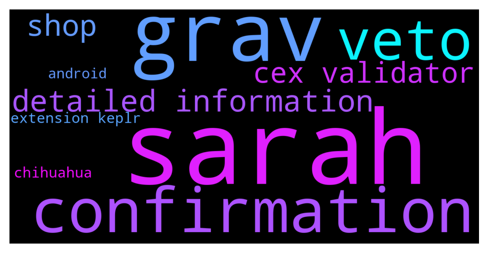

# **@cosmosproject**
 ## Analysis for **2021-12-14** - **2021-12-15**.

---

## 📊 **Basic Stats**

**n_messages_sent**: 405

---

---

## 🔝 **Top keywords and related messages**

1. **sarah**

    @TicoJohnny --- *👩🏻‍🚀 AMA in 1 Hour! 🧑🏻‍🚀   Cosmonauts, join the Community AMA with Sarah-Diane Eck | Founder of Lum Network    In one hour, we get the chance to have a community call with Sarah, if you have any questions for her, feel free to sign up!  Ask Sarah anything about: 💰 How Lum will reward users ⚙️ Tokenomics & Integrations 🚀 Roadmap, what comes next?  🗓 Today, Dec 15th, 6PM UTC  Sign Up Here* **--->** [TG Discussion](https://t.me/cosmosproject/454302)

    @TicoJohnny --- *👩🏻‍🚀Cosmos AMA Alert 🧑🏻‍🚀   Cosmonauts, join the Community AMA with Sarah-Diane Eck | Founder of Lum Network    Tomorrow, at 10am PDT, we get the chance to have a community call with Sarah, if you have any questions for her, feel free to sign up!  Ask Sarah anything about: 💰 How Lum will reward users ⚙️ Tokenomics & Integrations 🚀 Roadmap, what comes next?  🗓 Dec 15th, 6PM UTC  Sign Up Here* **--->** [TG Discussion](https://t.me/cosmosproject/453784)

2. **grav**

    @ZoltanAtom --- *Well if you are a dev and how to use CL then maybe you give it a try. Otherwise please wait more detailed informations from Gravity bridge team.* **--->** [TG Discussion](https://t.me/cosmosproject/454150)

    @ZoltanAtom --- *Gravity Bridge mainnet is live and no more detailed information yet.* **--->** [TG Discussion](https://t.me/cosmosproject/454122)

    @AtomJazz --- *Osmosis had upgrade today as well, JUNO will be launching smart contracts tommorow. We had a gravity bridge chain launch today and the first meme coin on Cosmos, the Chihuahua token* **--->** [TG Discussion](https://t.me/cosmosproject/453708)

    @ZoltanAtom --- *Lol you can’t. Wait for official announcements from Gravity team!* **--->** [TG Discussion](https://t.me/cosmosproject/454244)

    @catdotfish --- *Get Ready Cosmonauts, The time has come:  The Gravity Bridge Chain is LIVE!* **--->** [TG Discussion](https://t.me/cosmosproject/454141)

    @ZoltanAtom --- *Yes. Not grav. So please be mega careful and just follow official announcements about Grav.* **--->** [TG Discussion](https://t.me/cosmosproject/454267)

3. **confirmation**

    @Epikur --- *>>> If you have Android device, then you can try Keplr extension with Kiwi browser. But only thing doesn't work is delegating the coins. I am using it daily  >>> Nice! Wouldnt recommend it to new people tho hence there could be some compatibility issues and they would think that they are doing something wrong 🙂  >>> Yes, issues does exist.   1. You can't delegate to validator (it just doesn't show the tx confirmation modal)  2. Sometimes it opens extension tabs infinitely  3. .... maybe other  >>> Brave Android doesn't support extensions, just checked. Yandex does, but it doesn't work properly, Keplr extension UI messed up, unusable  ...  Just checked the Ungoogled Chrome with extensions, can't install the Keplr extension. Maybe browser version is outdated, it doesn't understand the new manifest version.   Opera Android doesn't support extensions too, so only variant left is Kiwi browser.* **--->** [TG Discussion](https://t.me/cosmosproject/454231)

    @alphamobile85 --- *yeah but on a exchange when I deposit it says that funds will be deposisted once 30 confirmations are done* **--->** [TG Discussion](https://t.me/cosmosproject/454078)

    @alphamobile85 --- *Hi everyone, how I can find the number or confirmations for a tx ?* **--->** [TG Discussion](https://t.me/cosmosproject/454075)

    @bcosmos --- *can I get a quick confirmation for our keplr wallets, if we create through gmail we just get a private key no mneomonic ?* **--->** [TG Discussion](https://t.me/cosmosproject/453908)

    @alphamobile85 --- *"Coins will be deposited immediately after 30 network confirmation and takes from 1 to 60 minutes."* **--->** [TG Discussion](https://t.me/cosmosproject/454079)

4. **veto**

    @ZoltanAtom --- *1. no with veto - Atom burns 2.reaching quorum - refunded back  3.not reaching quorum - refunded back* **--->** [TG Discussion](https://t.me/cosmosproject/454161)

    @Vivek --- *I didn't veto it, i was expecting angry bewildered questions on why would i ever do that* **--->** [TG Discussion](https://t.me/cosmosproject/454181)

    @Vivek --- *I voted no with veto on the vega proposal, how did it pass when i vetoed it?* **--->** [TG Discussion](https://t.me/cosmosproject/454176)

5. **detailed information**

    @Vasko --- *Hello , do we have any confirmed information about stake drops?* **--->** [TG Discussion](https://t.me/cosmosproject/453956)

    @ZoltanAtom --- *Well if you are a dev and how to use CL then maybe you give it a try. Otherwise please wait more detailed informations from Gravity bridge team.* **--->** [TG Discussion](https://t.me/cosmosproject/454150)

    @ZoltanAtom --- *Gravity Bridge mainnet is live and no more detailed information yet.* **--->** [TG Discussion](https://t.me/cosmosproject/454122)

    @ZoltanAtom --- *Just live. But no more information yet as I said. Don’t have much detailed information.* **--->** [TG Discussion](https://t.me/cosmosproject/454132)

    @ZoltanAtom --- *🚨🚨🚨SCAM ALERT 🚨🚨🚨  👩🏻‍🚀👨🏾‍🚀 Dear Cosmonauts,  As you well know there are a lot of people who are trying to impersonate me and the other admins of the Cosmos chat to extort your personal information. Please remind that: • Admins will never DM your first • Admins will never ask you to fill a form • Admins will never ask for your seed phrase • Admins will never invite you to any airdrop  • Do not exist a Cosmos Support  ⚠️⚠️⚠️ New Users ⚠️⚠️⚠️ If you have just joined the channel and anyone DMs you impersonating an admin, the support or a bot, please report it to @notoscam.  ⚔️KEEP YOUR SEED PHRASE SAFE⚔️  If you have any doubt, the best way to verify is to write here on the main channel.  Stay Safe & Happy Staking!  🚨🚨🚨🚨🚨🚨🚨🚨🚨🚨* **--->** [TG Discussion](https://t.me/cosmosproject/453849)

    @ZoltanAtom --- *Coingecko is correct one. We did ask to coinmarketcap many times about this uncorrect informations to change it but no answer yet from them. So You use should Coingecko one.* **--->** [TG Discussion](https://t.me/cosmosproject/454139)

6. **shop**

    @ZoltanAtom --- *🎅🏻Oh~Oh~Oh!☃️  Cosmonauts, Are you ready for an $ATOM~ic Christmas? 👕 Our Shop has been updated with a new selection of Cosmos-branded Swags!  🎄Make the best gift to your loved ones and don't forget to use [HAPPYCOSMOSHOLIDAYS] in the shop for 20% off!* **--->** [TG Discussion](https://t.me/cosmosproject/454254)

    @Epikur --- *I read somewhere, there is update with XMas, New Year style merch on shop. But I didn't find that* **--->** [TG Discussion](https://t.me/cosmosproject/454013)

    @Kostas --- *I think shop marketing is bad..prices should be paid in atom and not in dollars in my opinion 😅* **--->** [TG Discussion](https://t.me/cosmosproject/453996)

7. **cex validator**

    @yourdudeEv --- *Anyone know why the Smartnodes validator for ATOM is showing inactive?* **--->** [TG Discussion](https://t.me/cosmosproject/454190)

    @ZoltanAtom --- *If your funds are on cex, you should move your atoms to Keplr Wallet and start to stake them there. Here is link and step by step guide;   https://t.co/eSyDVJMFAD?amp=1  And a step by step guide: https://medium.com/chainapsis/how-to-use-keplr-wallet-40afc80907f6* **--->** [TG Discussion](https://t.me/cosmosproject/454227)

    @ZoltanAtom --- *Hi there,I don’t know how to check past votes of validators. On Cosmoscan you can see their latest vote afaik. But you can easy check your votes on mintscan.* **--->** [TG Discussion](https://t.me/cosmosproject/454105)

    @ZoltanAtom --- *For example cex validators are generally excluded from airdrops. The reason is for this cex validators are not contributing within Cosmos.* **--->** [TG Discussion](https://t.me/cosmosproject/453870)

    @Prometheus_Zeus --- *I think this comes into discussion once the fees on the hin will bet in total the inflation. Before it makes no sense because no one will stake anymore and validators will not receive their benefits.* **--->** [TG Discussion](https://t.me/cosmosproject/453358)

    @UnityChaos --- *Kinda surprised by how many medium sized validators failed to do the upgrade and are now getting jailed... probably not a bad idea for everyone to check if the validators they delegate to are actually paying attention and upgrading, cuz if they're not you're missing out on rewards* **--->** [TG Discussion](https://t.me/cosmosproject/454195)

8. **extension keplr**

    @ZoltanAtom --- *You should import your Luna address on Keplr.   (If someone dm to you, block and report it)* **--->** [TG Discussion](https://t.me/cosmosproject/453469)

    @Thanhdcb --- *is chihuahua run on juno or cosmos sdk?  so i see on keplr wallet, it looks like a coin* **--->** [TG Discussion](https://t.me/cosmosproject/453850)

    @Ray_Louis --- *And I tried what you said . Can’t import my Luna address on my Keplr , says invalid address there . Seems like Keplr doesn’t support Luna network .* **--->** [TG Discussion](https://t.me/cosmosproject/453515)

    @AtomJazz --- *In keplr select low fees instead of average. Maybe this will help. If that won't work you will probably need to ask someone to send you some dust LUM to have enough for the gas* **--->** [TG Discussion](https://t.me/cosmosproject/454007)

    @Epikur --- *>>> If you have Android device, then you can try Keplr extension with Kiwi browser. But only thing doesn't work is delegating the coins. I am using it daily  >>> Nice! Wouldnt recommend it to new people tho hence there could be some compatibility issues and they would think that they are doing something wrong 🙂  >>> Yes, issues does exist.   1. You can't delegate to validator (it just doesn't show the tx confirmation modal)  2. Sometimes it opens extension tabs infinitely  3. .... maybe other  >>> Brave Android doesn't support extensions, just checked. Yandex does, but it doesn't work properly, Keplr extension UI messed up, unusable  ...  Just checked the Ungoogled Chrome with extensions, can't install the Keplr extension. Maybe browser version is outdated, it doesn't understand the new manifest version.   Opera Android doesn't support extensions too, so only variant left is Kiwi browser.* **--->** [TG Discussion](https://t.me/cosmosproject/454231)

    @ZoltanAtom --- *If your funds are on cex, you should move your atoms to Keplr Wallet and start to stake them there. Here is link and step by step guide;   https://t.co/eSyDVJMFAD?amp=1  And a step by step guide: https://medium.com/chainapsis/how-to-use-keplr-wallet-40afc80907f6* **--->** [TG Discussion](https://t.me/cosmosproject/454227)

9. **chihuahua**

    @Thanhdcb --- *is chihuahua run on juno or cosmos sdk?  so i see on keplr wallet, it looks like a coin* **--->** [TG Discussion](https://t.me/cosmosproject/453850)

    @AtomJazz --- *Osmosis had upgrade today as well, JUNO will be launching smart contracts tommorow. We had a gravity bridge chain launch today and the first meme coin on Cosmos, the Chihuahua token* **--->** [TG Discussion](https://t.me/cosmosproject/453708)

    @AtomJazz --- *Yesterday we had Chihuahua airdrop and Lum airdrop* **--->** [TG Discussion](https://t.me/cosmosproject/453958)

    @UnityChaos --- *I don't really have one lol, haven't set up any public facing stuff for the validator, just been getting people who know me by reputation to delegate to it on various networks (Cosmos, Osmosis, Juno, Lum and Chihuahua atm)* **--->** [TG Discussion](https://t.me/cosmosproject/454203)

10. **android**

    @Epikur --- *>>> If you have Android device, then you can try Keplr extension with Kiwi browser. But only thing doesn't work is delegating the coins. I am using it daily  >>> Nice! Wouldnt recommend it to new people tho hence there could be some compatibility issues and they would think that they are doing something wrong 🙂  >>> Yes, issues does exist.   1. You can't delegate to validator (it just doesn't show the tx confirmation modal)  2. Sometimes it opens extension tabs infinitely  3. .... maybe other  >>> Brave Android doesn't support extensions, just checked. Yandex does, but it doesn't work properly, Keplr extension UI messed up, unusable  ...  Just checked the Ungoogled Chrome with extensions, can't install the Keplr extension. Maybe browser version is outdated, it doesn't understand the new manifest version.   Opera Android doesn't support extensions too, so only variant left is Kiwi browser.* **--->** [TG Discussion](https://t.me/cosmosproject/454231)

    @Epikur --- *I am daily claiming reward from Bostrom network (not exist in Keplr Android and Cosmostation), so that functionality is enought for me. I didn't tested Osmosis and other dapps with that.* **--->** [TG Discussion](https://t.me/cosmosproject/454250)

