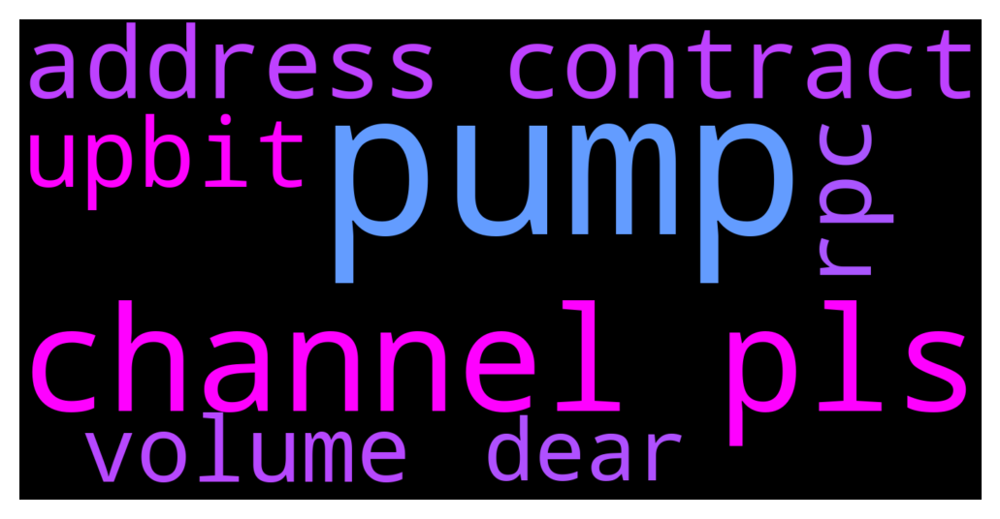

# **@cryptonear**
 ## Analysis for **2021-12-14** - **2021-12-15**.

---

## 📊 **Basic Stats**

**n_messages_sent**: 722

---

---

## 🔝 **Top keywords and related messages**

1. **pump**

    @T3uv1 --- *So are you actually telling me that this coin is only for pump and dump purposes?* **--->** [TG Discussion](https://t.me/cryptonear/240241)

    @Human_kind_project_Dev --- *Guys near will be listed in koreas biggest exchange. A video is in YouTube about it that’s why the pump was right ?* **--->** [TG Discussion](https://t.me/cryptonear/239092)

    @rhinohq8992 --- *I agree that Ref finnace very slow. We may miss this Pump but btw, it also good news that People know about NEAR today. Near will grown up day by day* **--->** [TG Discussion](https://t.me/cryptonear/238913)

    @Adam --- *Massive pump and massive sell off* **--->** [TG Discussion](https://t.me/cryptonear/238629)

    @pj19222 --- *So lucky that I switched on the Binance app, and saw the pump, and managed to sold all NEAR at $14.8. 🤩😜* **--->** [TG Discussion](https://t.me/cryptonear/239916)

    @bailey_12 --- *I don’t thing even if you stored your assets on Cex,u won’t able to catch the pump since it is only a matter of seconds. Anyways, you also face the risk of loss fund when Cex broken.   But I am all hope for your best. At least you stayed around and support near till now. That is more valuable than those price pump.  GL ser* **--->** [TG Discussion](https://t.me/cryptonear/238930)

2. **channel pls**

    @larry_lang --- *this one is kinda outdated tbh, but i found a interesting one doing an airdrop=))  https://discord.gg/fmeq3mDH (pls DOYR before jumping in, as im just sharing the topic of airdrop and would not take responsible for your investing action)* **--->** [TG Discussion](https://t.me/cryptonear/236983)

    @larry_lang --- *heyyy calm pp calm=000 for price discussion pls go to this channel: https://t.me/merchantsofnear* **--->** [TG Discussion](https://t.me/cryptonear/238627)

    @larry_lang --- *yeah im trying to reach Ref.finance as well, but in the mean time pls join thier chat and ask about it, when ref.finance come back those chat would be the first to give out details:  https://t.me/ref_finance* **--->** [TG Discussion](https://t.me/cryptonear/238934)

    @larry_lang --- *yeah pls go to this channel for price prediction https://t.me/merchantsofnear* **--->** [TG Discussion](https://t.me/cryptonear/238939)

    @larry_lang --- *oh okie for price chat pls go to this channel : https://t.me/merchantsofnear* **--->** [TG Discussion](https://t.me/cryptonear/239132)

    @Kripto_Raptor --- *⚠️WARNING, there are fake impersonator Groups ⚠️  Please report these channels: 👉https://t.me/thenearcrypto_ex  👉https://t.me/cryptonear00  How to do it: 1. Join 2. click on three dots on upper right 3. click 'Report' 4. choose 'Fake Account' 5. tell telegram that 'this group is fake/scam and original one is @cryptonear which can be confirmed on near.org' 6. click 'Report' again 7. make sure to Delete/Leave the fake group👉* **--->** [TG Discussion](https://t.me/cryptonear/236835)

3. **address contract**

    @cattuongvyy --- *when I check on BSCscan, I see there is a NEAR code with the amount of 5 million tokens. I thought near was a layer 1 foundation coin? so why is its contract in BSCSCAN (0x1fa4a73a3f0133f0025378af00236f3abdee5d63). Can someone help me answer it?* **--->** [TG Discussion](https://t.me/cryptonear/239440)

    @BinhCAO --- *I created my account on web wallet, then import it to trust wallet.  I fund NEAR to trust wallet via address showed in there. But web wallet isn’t.  Then I transfer NEAR from trust to web wallet. Web shows the transaction but my account isn’t get updated* **--->** [TG Discussion](https://t.me/cryptonear/237038)

    @kv9990 --- *Aurora lower entry barrier for any app that're Moving from eth to near So first they can deploy on aurora reusing same code as they are on ETH,they get familiar environment, and if they wanna have additional features of NEAR like 30% fees for developers ,readable wallet addresses ,they can switch to NEAR  Aurora is a nice onboarding tool for near blockchain to all of existing eth blockchain developer and projects* **--->** [TG Discussion](https://t.me/cryptonear/237336)

    @larry_lang --- *=))) yeah that our's NEAR contract on BSC, we have to deploy a bsc contract so that transaction can be made from near network to BSC network* **--->** [TG Discussion](https://t.me/cryptonear/239447)

    @larry_lang --- *$NEAR contract address on AURORA  "0xC42C30aC6Cc15faC9bD938618BcaA1a1FaE8501d"  $NEAR contract address on ETH "0x85F17Cf997934a597031b2E18a9aB6ebD4B9f6a4"  $NEAR contract address on BSC "0x1fa4a73a3f0133f0025378af00236f3abdee5d63"* **--->** [TG Discussion](https://t.me/cryptonear/238799)

    @larry_lang --- *other contract can be found here: $NEAR contract address on AURORA  "0xC42C30aC6Cc15faC9bD938618BcaA1a1FaE8501d"  $NEAR contract address on ETH "0x85F17Cf997934a597031b2E18a9aB6ebD4B9f6a4"  $NEAR contract address on BSC "0x1fa4a73a3f0133f0025378af00236f3abdee5d63"* **--->** [TG Discussion](https://t.me/cryptonear/239449)

4. **upbit**

    @maxyarseb --- *There are no infos anywhere about updates or events.. You say upbit listing, where is tje info about it.. Why dont team use tweetter online active..* **--->** [TG Discussion](https://t.me/cryptonear/239053)

    @kv9990 --- *I remember Algo and 1inch reacting the same way after UPBIT Listing sir 👀😉 It's what Korean Whales do! Please #dyor atleast a little!* **--->** [TG Discussion](https://t.me/cryptonear/240258)

    @NEARverse_xd --- *And what about 100% pump? Koreans are crazy. Upbit is biggest korean exchange and they are manipulating every single coin during listing* **--->** [TG Discussion](https://t.me/cryptonear/240259)

    @TheWalkingGoat --- *I managed to fill the short at 17$. Well play team. Congrat for listing on Upbit, btw.* **--->** [TG Discussion](https://t.me/cryptonear/238974)

5. **rpc**

    @angusmcmangus --- *can anyone link a legit site for creating an aurora wallet. I know it needs to be metamask but I am not sure on the RPC etc to set it up* **--->** [TG Discussion](https://t.me/cryptonear/239370)

    @larry_lang --- *To add Aurora network to MetaMask, go to Rainbow Bridge and click 'Connect Aurora'.  To add the network manually, go to MetaMask networks, choose Custom RPC and enter the following settings: Network Name: Aurora Mainnet New RPC URL: https://mainnet.aurora.dev Chain ID: 1313161554 Symbol: ETH Block Explorer URL: https://explorer.mainnet.aurora.dev* **--->** [TG Discussion](https://t.me/cryptonear/239372)

    @cuongdcc --- *and actually RPC servers on Aurora are  wayyy better than NEAR* **--->** [TG Discussion](https://t.me/cryptonear/239487)

    @bailey_12 --- *Is it down for you right now? Maybe the traffics from Việt Nam are too high so it may slow down RPC* **--->** [TG Discussion](https://t.me/cryptonear/238857)

    @cuongdcc --- *btw, devs are working to upgrade RPC servers on NEAR* **--->** [TG Discussion](https://t.me/cryptonear/239488)

    @cc15167258586 --- *I'm afraid not. RPC can't affect the block speed* **--->** [TG Discussion](https://t.me/cryptonear/240149)

6. **volume**

    @Kripto_Raptor --- *in lower volume exchanges you can take is as high as you want 😊* **--->** [TG Discussion](https://t.me/cryptonear/239783)

    @Kripto_Raptor --- *we got some more volume from Korean friends 😁* **--->** [TG Discussion](https://t.me/cryptonear/239549)

    @Kripto_Raptor --- *welcome to crypto lol. but if you are a holder you will sure benefits. we will get some more volume from Koreans 😏* **--->** [TG Discussion](https://t.me/cryptonear/240036)

    @Kripto_Raptor --- *but the volume is much lower compare to cz 😃* **--->** [TG Discussion](https://t.me/cryptonear/239781)

    @cuongdcc --- *yay but trading volume yesterday is ~500m, still impressed!* **--->** [TG Discussion](https://t.me/cryptonear/240035)

    @Surferfc --- *NEAR is suspended again on Binance? Why you ask - why I asked and this is what they said... "Dear user, NEAR network is experiencing congestion due to a large spike in withdrawal volume. This has resulted in longer withdrawal processing time. The withdrawal function has been suspended and will resume at the earliest once the congestion has reduced. In the interim, you can click ""Set Reminder"" on the crypto withdrawal page to receive an email/SMS notification once the withdrawal function is restored. As of now, we do not have an ETA for this case."* **--->** [TG Discussion](https://t.me/cryptonear/239569)

7. **dear**

    @Anon000 --- *Dear community and contributors!!   We are moving all news contributions to AstroDAO going forward. We've updated the "How to  contribute" section in the DAO Journey article below 👇🏼 Please read it and keep em' NEAR news coming 🎉⚡️🚀  https://nearweek.medium.com/first-step-in-the-nearweek-dao-journey-2b107acc323e* **--->** [TG Discussion](https://t.me/cryptonear/237436)

    @TruongLgs --- *dear admin how can i convert learnear points to near.* **--->** [TG Discussion](https://t.me/cryptonear/239835)

    @Hoang --- *Dear all,  Please advise if unstake by ref finance, how much time near transfers to wallet?* **--->** [TG Discussion](https://t.me/cryptonear/240203)

    @FritzWagner --- *Gn dear NEAReans ! Happy to see you all with good mood =) See you tomorrow. May the force be NEAR u ! Always* **--->** [TG Discussion](https://t.me/cryptonear/239137)

    @pavelgordok --- *dear mods and admins it's been over a week now, I still haven't received any reward🥲* **--->** [TG Discussion](https://t.me/cryptonear/238019)

    @JOJOUPUP --- *Dear Near Team,  anything wrong happening to Near wallet,  why the balance and staking amount all appears 0 while there is some $near in wallet and staked ?* **--->** [TG Discussion](https://t.me/cryptonear/238701)

