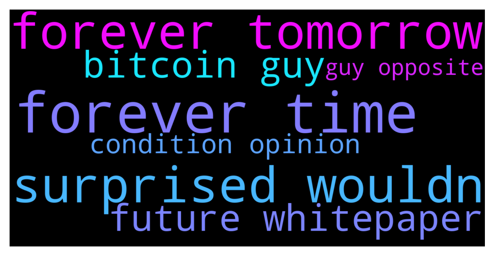

# **@defisearchpublic**
 ## Analysis for **2021-12-13** - **2021-12-15**.

---

## 📊 **Basic Stats**

**n_messages_sent**: 20

---

---

## 🔝 **Top keywords and related messages**

1. **forever time**

    @Victor1111 --- *Anyone looking for the link to King forever should check my bio* **--->** [TG Discussion](https://t.me/defisearchpublic/240278)

    @BreeTii --- *We could see one last push up soon can't tell the time ,  Anyone head about KING FOREVER?* **--->** [TG Discussion](https://t.me/defisearchpublic/240253)

    @Victor1111 --- *King forever bro launching tomorrow 20:00 UTC* **--->** [TG Discussion](https://t.me/defisearchpublic/240255)

    @jj528977 --- *have any one heard abt king forever????* **--->** [TG Discussion](https://t.me/defisearchpublic/240251)

2. **forever tomorrow**

    @Victor1111 --- *Anyone looking for the link to King forever should check my bio* **--->** [TG Discussion](https://t.me/defisearchpublic/240278)

    @BreeTii --- *We could see one last push up soon can't tell the time ,  Anyone head about KING FOREVER?* **--->** [TG Discussion](https://t.me/defisearchpublic/240253)

    @Victor1111 --- *King forever bro launching tomorrow 20:00 UTC* **--->** [TG Discussion](https://t.me/defisearchpublic/240255)

    @jj528977 --- *have any one heard abt king forever????* **--->** [TG Discussion](https://t.me/defisearchpublic/240251)

    @Victor1111 --- *No bro i missed it but I'm definitely buying at launch tomorrow* **--->** [TG Discussion](https://t.me/defisearchpublic/240261)

3. **surprised wouldn**

    @Milkyboy --- *Wouldn't be surprised if $POND hits $4-$6 range at some point in the future.  Just finished reading the whitepaper & running through the discord, @MarlinProtocol team, progress etc Impressive.  The lack of hype & marketing might seem like a bad thing but I think it's the opposite* **--->** [TG Discussion](https://t.me/defisearchpublic/240201)

4. **future whitepaper**

    @Milkyboy --- *Wouldn't be surprised if $POND hits $4-$6 range at some point in the future.  Just finished reading the whitepaper & running through the discord, @MarlinProtocol team, progress etc Impressive.  The lack of hype & marketing might seem like a bad thing but I think it's the opposite* **--->** [TG Discussion](https://t.me/defisearchpublic/240201)

    @KEK --- *With the exception of intellectual and human capital, most resources will become commodities in the near future.* **--->** [TG Discussion](https://t.me/defisearchpublic/240165)

5. **bitcoin guy**

    @Taylor --- *Hi guys, is bitcoin worth holding right now, what do you think?* **--->** [TG Discussion](https://t.me/defisearchpublic/240212)

    @Kris --- *Yes, bitcoin should grow now, i think its a good idea* **--->** [TG Discussion](https://t.me/defisearchpublic/240213)

    @Elainemay --- *Hey guys, I want to invest in souni project. You think it will be the next potential project?* **--->** [TG Discussion](https://t.me/defisearchpublic/240168)

6. **condition opinion**

    @Zelda --- *What are your opinions on the condition of web 3 development today? I started hearing less and less about it.* **--->** [TG Discussion](https://t.me/defisearchpublic/240193)

7. **guy opposite**

    @Taylor --- *Hi guys, is bitcoin worth holding right now, what do you think?* **--->** [TG Discussion](https://t.me/defisearchpublic/240212)

    @Milkyboy --- *Wouldn't be surprised if $POND hits $4-$6 range at some point in the future.  Just finished reading the whitepaper & running through the discord, @MarlinProtocol team, progress etc Impressive.  The lack of hype & marketing might seem like a bad thing but I think it's the opposite* **--->** [TG Discussion](https://t.me/defisearchpublic/240201)

    @Elainemay --- *Hey guys, I want to invest in souni project. You think it will be the next potential project?* **--->** [TG Discussion](https://t.me/defisearchpublic/240168)

