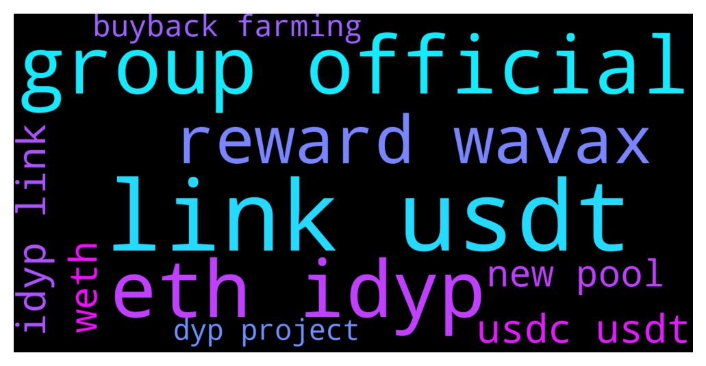

# **@dypfinance**
 ## Analysis for **2021-12-14** - **2021-12-15**.

---

## 📊 **Basic Stats**

**n_messages_sent**: 175

---

---

## 🔝 **Top keywords and related messages**

1. **link usdt**

    @timdyp --- *We are excited to announce that the new pools for staking, buyback, and farming have been launched on #Ethereum  Join staking if you are holding #DYP or buyback & farming if you are holding WETH, WBTC, USDC, USDT, LINK or #iDYP and earn #ETH as rewards👇 https://dyp.finance/earnv2  Learn more about the new pools👇 https://link.medium.com/jCtilB5P0lb  👉https://twitter.com/dypfinance/status/1471162808041713665* **--->** [TG Discussion](https://t.me/dypfinance/229865)

    @iamJubi --- *Hello. Yes you need WAVAX.  These are the supported assets if you want to deposit v2 DYP farm- avalanche network (WAVAX, USDC.e, USDT.e, WETH.e, PNG, QI, DAI.e, XAVA, WBTC.e, LINK.e, or iDYP) and earn WAVAX/ETH/DYP as rewards. link https://dyp.finance/farmv2/avax* **--->** [TG Discussion](https://t.me/dypfinance/229694)

    @timdyp --- *Check out the #Avalanche and #Binance farming pools and earn up to 2000% APY! 9031 #BNB and 17476 #AVAX paid to farmers💰  Join farming by automatically adding liquidity if you are holding BNB, AVAX, BTC, #ETH, #PNG, USDC, USDT, LINK, #CAKE or iDYP👇 https://dyp.finance/farmv2  👉https://twitter.com/dypfinance/status/1470730289899048977* **--->** [TG Discussion](https://t.me/dypfinance/229460)

    @iamJubi --- *Check out the #Avalanche and #Binance farming pools and earn up to 2000% APY! 9031 #BNB and 17476 #AVAX paid to farmers💰  Join farming by automatically adding liquidity if you are holding BNB, AVAX, BTC, #ETH, #PNG, USDC, USDT, LINK, #CAKE or iDYP👇 https://dyp.finance/farmv2  👉https://twitter.com/dypfinance/status/1470730289899048977* **--->** [TG Discussion](https://t.me/dypfinance/229738)

    @timdyp --- *DeFi Yield Protocol #DYP Stats and Products for new users:  - Our Liquidity Providers earned 9085 #ETH, 9019 #BNB, and 17443 #AVAX worth $39,628,227 Millions - $10,216,418 liquidity on #Uniswap, #PancakeSwap and #Pangolin - Total Value Locked (TVL) $34,261,372.00 - Total users 23,556   Latest Announcements and Events: https://dyp.finance/latestupdates   DeFi Yield Protocol offers four different ways for earning a passive income:  FARM Automatically adds liquidity using one asset. To start earning, all you need is to deposit one of the supported assets. The protocol employs an anti-manipulation feature that aims to limit the market impact on users’ converting rewards into ETH and other native platform tokens. https://dyp.finance/farmv2  STAKE Stake your DYP tokens and earn up to 165% APY.  No Impermanent Loss. To start earning, all you need is to deposit DYP tokens into the Staking contract. You can choose from two different staking options, with rewards starting from 62% APY up to 165% APY, depending on the lock time from a minimum of zero-days up to a maximum of 90 days. https://dyp.finance/stakev2  BUYBACK The Buyback is one of the latest products from DeFi Yield Protocol. It is a smart contract with staking integrated that offers up to 157% APY for the users. https://dyp.finance/buybackv2  VAULT The DYP Earn Vault is an automated yield farming contract with Compound Protocol integration and support for ETH, WBTC, USDC, USDT, and DAI markets. https://dyp.finance/vault   Other products from DeFi Yield Protocol:  NFTs The NFT dApp by Defi Yield Protocol acts as a marketplace and a gallery where users can mint, buy, sell and trade NFTs for a fixed price.  https://nft.dyp.finance/ V2 version will be released soon, for more info https://t.me/dypannouncements/752.  DYP TOOLS The core feature of the DYP is the decentralized tool dashboard. It provides advanced features, such as Decentralized Score, Unique Community Trust Vote System, DYP Locker, Yield Farm Data, and LaunchPad, allowing investors to make informed decisions that maximize yields and reduce risks. https://tools.dyp.finance/  REFERRAL Should you refer DYP to your friends, 5% of your friends rewards will be automatically sent to you whenever your friends stake DYP. You do not need to stake, it’s automatically sent to you, free of gas fee. https://dyp.finance/referralv2  BRIDGE The Bridge will help you swap DYP tokens between Ethereum Network and Binance Smart Chain / Avalanche Network. https://dyp.finance/bridge  GOVERNANCE DYP tokens represent voting shares in DeFi Yield protocol governance. DYP holders through governance can vote to add more pools, burn tokens, or allocate DYP toward grants, strategic partnerships, governance initiatives, and other programs. https://dyp.finance/vote   If you're interested to learn more, please subscribe to our YouTube Official Channel: https://www.youtube.com/c/DeFiYieldProtocol   For the latest updates join our Announcement Channel:  https://t.me/dypannouncements   Not allowed: Harmful language, insulting others, outright FUD, false/misleading information, shilling other projects, or price discussion. Links to outside forums will be accepted as long as they follow the rules above.  Instant BAN: impersonation, discrimination, explicit content, promotional links, spam, bots, or outright scams.   Please report anyone impersonating team members to the moderators listed below.   Team Moderators:  @DhoniMSD516 @iamJubi @kleopatrad @hemanrock @Tekkol @timdyp  Admins will NOT take the initiative to message you privately to solve problems. Never give your private keys to anyone, send tokens to addresses that they offer, or click on any links that they provide. Don’t share confidential personal information in private chats, and don't make transactions of any kind at all.* **--->** [TG Discussion](https://t.me/dypfinance/229271)

    @DhoniMSD516 --- *https://dyp.finance/farmv2/avax here is the link for V2 AVAX pool, now go to the page of days where you farmed in* **--->** [TG Discussion](https://t.me/dypfinance/229433)

2. **group official**

    @timdyp --- *DeFi Yield Protocol #DYP Stats and Products for new users:  - Our Liquidity Providers earned 9085 #ETH, 9019 #BNB, and 17443 #AVAX worth $39,628,227 Millions - $10,216,418 liquidity on #Uniswap, #PancakeSwap and #Pangolin - Total Value Locked (TVL) $34,261,372.00 - Total users 23,556   Latest Announcements and Events: https://dyp.finance/latestupdates   DeFi Yield Protocol offers four different ways for earning a passive income:  FARM Automatically adds liquidity using one asset. To start earning, all you need is to deposit one of the supported assets. The protocol employs an anti-manipulation feature that aims to limit the market impact on users’ converting rewards into ETH and other native platform tokens. https://dyp.finance/farmv2  STAKE Stake your DYP tokens and earn up to 165% APY.  No Impermanent Loss. To start earning, all you need is to deposit DYP tokens into the Staking contract. You can choose from two different staking options, with rewards starting from 62% APY up to 165% APY, depending on the lock time from a minimum of zero-days up to a maximum of 90 days. https://dyp.finance/stakev2  BUYBACK The Buyback is one of the latest products from DeFi Yield Protocol. It is a smart contract with staking integrated that offers up to 157% APY for the users. https://dyp.finance/buybackv2  VAULT The DYP Earn Vault is an automated yield farming contract with Compound Protocol integration and support for ETH, WBTC, USDC, USDT, and DAI markets. https://dyp.finance/vault   Other products from DeFi Yield Protocol:  NFTs The NFT dApp by Defi Yield Protocol acts as a marketplace and a gallery where users can mint, buy, sell and trade NFTs for a fixed price.  https://nft.dyp.finance/ V2 version will be released soon, for more info https://t.me/dypannouncements/752.  DYP TOOLS The core feature of the DYP is the decentralized tool dashboard. It provides advanced features, such as Decentralized Score, Unique Community Trust Vote System, DYP Locker, Yield Farm Data, and LaunchPad, allowing investors to make informed decisions that maximize yields and reduce risks. https://tools.dyp.finance/  REFERRAL Should you refer DYP to your friends, 5% of your friends rewards will be automatically sent to you whenever your friends stake DYP. You do not need to stake, it’s automatically sent to you, free of gas fee. https://dyp.finance/referralv2  BRIDGE The Bridge will help you swap DYP tokens between Ethereum Network and Binance Smart Chain / Avalanche Network. https://dyp.finance/bridge  GOVERNANCE DYP tokens represent voting shares in DeFi Yield protocol governance. DYP holders through governance can vote to add more pools, burn tokens, or allocate DYP toward grants, strategic partnerships, governance initiatives, and other programs. https://dyp.finance/vote   If you're interested to learn more, please subscribe to our YouTube Official Channel: https://www.youtube.com/c/DeFiYieldProtocol   For the latest updates join our Announcement Channel:  https://t.me/dypannouncements   Not allowed: Harmful language, insulting others, outright FUD, false/misleading information, shilling other projects, or price discussion. Links to outside forums will be accepted as long as they follow the rules above.  Instant BAN: impersonation, discrimination, explicit content, promotional links, spam, bots, or outright scams.   Please report anyone impersonating team members to the moderators listed below.   Team Moderators:  @DhoniMSD516 @iamJubi @kleopatrad @hemanrock @Tekkol @timdyp  Admins will NOT take the initiative to message you privately to solve problems. Never give your private keys to anyone, send tokens to addresses that they offer, or click on any links that they provide. Don’t share confidential personal information in private chats, and don't make transactions of any kind at all.* **--->** [TG Discussion](https://t.me/dypfinance/229271)

    @DhoniMSD516 --- *Hey there is no chinese group, this is the only official English group* **--->** [TG Discussion](https://t.me/dypfinance/229707)

    @hemanrock --- *it is still in Q4. please wait for official announcement.* **--->** [TG Discussion](https://t.me/dypfinance/229575)

    @DhoniMSD516 --- *This group is related to official DYP Project* **--->** [TG Discussion](https://t.me/dypfinance/229822)

    @timdyp --- *This is my last WARNING for you, next time when you misinterpret my affirmation or you come up with other ways of FUDDING, you will be banned. I am sure that it is clear for all the users from this group what you are doing here! I am talking about TRADING, you are talking about Bitconnect, I am asking you what is the connection with Bitconnect, and after that you are telling me that ''So you're saying Bitconnect was fine because some made money? Jeez''.* **--->** [TG Discussion](https://t.me/dypfinance/229169)

    @Loverboy --- *Pls whats the group all about?* **--->** [TG Discussion](https://t.me/dypfinance/229813)

3. **eth idyp**

    @timdyp --- *We are excited to announce that the new pools for staking, buyback, and farming have been launched on #Ethereum  Join staking if you are holding #DYP or buyback & farming if you are holding WETH, WBTC, USDC, USDT, LINK or #iDYP and earn #ETH as rewards👇 https://dyp.finance/earnv2  Learn more about the new pools👇 https://link.medium.com/jCtilB5P0lb  👉https://twitter.com/dypfinance/status/1471162808041713665* **--->** [TG Discussion](https://t.me/dypfinance/229865)

    @Firas --- *I think the main difference is that idyp has been recently listed and that some people bought it at the initial spike. Pretty sure people who bought it close to listing price aren't complaining 😅* **--->** [TG Discussion](https://t.me/dypfinance/229152)

    @iamJubi --- *Hello. Yes you need WAVAX.  These are the supported assets if you want to deposit v2 DYP farm- avalanche network (WAVAX, USDC.e, USDT.e, WETH.e, PNG, QI, DAI.e, XAVA, WBTC.e, LINK.e, or iDYP) and earn WAVAX/ETH/DYP as rewards. link https://dyp.finance/farmv2/avax* **--->** [TG Discussion](https://t.me/dypfinance/229694)

    @timdyp --- *Check out the #Avalanche and #Binance farming pools and earn up to 2000% APY! 9031 #BNB and 17476 #AVAX paid to farmers💰  Join farming by automatically adding liquidity if you are holding BNB, AVAX, BTC, #ETH, #PNG, USDC, USDT, LINK, #CAKE or iDYP👇 https://dyp.finance/farmv2  👉https://twitter.com/dypfinance/status/1470730289899048977* **--->** [TG Discussion](https://t.me/dypfinance/229460)

    @iamJubi --- *Check out the #Avalanche and #Binance farming pools and earn up to 2000% APY! 9031 #BNB and 17476 #AVAX paid to farmers💰  Join farming by automatically adding liquidity if you are holding BNB, AVAX, BTC, #ETH, #PNG, USDC, USDT, LINK, #CAKE or iDYP👇 https://dyp.finance/farmv2  👉https://twitter.com/dypfinance/status/1470730289899048977* **--->** [TG Discussion](https://t.me/dypfinance/229738)

    @DhoniMSD516 --- *Trade iDYP tokens on PancakeSwap V2 https://pancakeswap.finance/swap?inputCurrency=0xBD100d061E120b2c67A24453CF6368E63f1Be056  Trade iDYP tokens on Pangolin DEX https://app.pangolin.exchange/#/swap?&outputCurrency=0xBD100d061E120b2c67A24453CF6368E63f1Be056* **--->** [TG Discussion](https://t.me/dypfinance/229542)

4. **reward wavax**

    @timdyp --- *We are excited to announce that the new pools for staking, buyback, and farming have been launched on #Ethereum  Join staking if you are holding #DYP or buyback & farming if you are holding WETH, WBTC, USDC, USDT, LINK or #iDYP and earn #ETH as rewards👇 https://dyp.finance/earnv2  Learn more about the new pools👇 https://link.medium.com/jCtilB5P0lb  👉https://twitter.com/dypfinance/status/1471162808041713665* **--->** [TG Discussion](https://t.me/dypfinance/229865)

    @DhoniMSD516 --- *Hey mate as said the Farms works under POS concept our devs did some improved strategies to increase the rewards or apy a little higher you can dig in our github and look at our codes https://github.com/dypfinance* **--->** [TG Discussion](https://t.me/dypfinance/229728)

    @iamJubi --- *Hello. Yes you need WAVAX.  These are the supported assets if you want to deposit v2 DYP farm- avalanche network (WAVAX, USDC.e, USDT.e, WETH.e, PNG, QI, DAI.e, XAVA, WBTC.e, LINK.e, or iDYP) and earn WAVAX/ETH/DYP as rewards. link https://dyp.finance/farmv2/avax* **--->** [TG Discussion](https://t.me/dypfinance/229694)

    @timdyp --- *DeFi Yield Protocol #DYP Stats and Products for new users:  - Our Liquidity Providers earned 9085 #ETH, 9019 #BNB, and 17443 #AVAX worth $39,628,227 Millions - $10,216,418 liquidity on #Uniswap, #PancakeSwap and #Pangolin - Total Value Locked (TVL) $34,261,372.00 - Total users 23,556   Latest Announcements and Events: https://dyp.finance/latestupdates   DeFi Yield Protocol offers four different ways for earning a passive income:  FARM Automatically adds liquidity using one asset. To start earning, all you need is to deposit one of the supported assets. The protocol employs an anti-manipulation feature that aims to limit the market impact on users’ converting rewards into ETH and other native platform tokens. https://dyp.finance/farmv2  STAKE Stake your DYP tokens and earn up to 165% APY.  No Impermanent Loss. To start earning, all you need is to deposit DYP tokens into the Staking contract. You can choose from two different staking options, with rewards starting from 62% APY up to 165% APY, depending on the lock time from a minimum of zero-days up to a maximum of 90 days. https://dyp.finance/stakev2  BUYBACK The Buyback is one of the latest products from DeFi Yield Protocol. It is a smart contract with staking integrated that offers up to 157% APY for the users. https://dyp.finance/buybackv2  VAULT The DYP Earn Vault is an automated yield farming contract with Compound Protocol integration and support for ETH, WBTC, USDC, USDT, and DAI markets. https://dyp.finance/vault   Other products from DeFi Yield Protocol:  NFTs The NFT dApp by Defi Yield Protocol acts as a marketplace and a gallery where users can mint, buy, sell and trade NFTs for a fixed price.  https://nft.dyp.finance/ V2 version will be released soon, for more info https://t.me/dypannouncements/752.  DYP TOOLS The core feature of the DYP is the decentralized tool dashboard. It provides advanced features, such as Decentralized Score, Unique Community Trust Vote System, DYP Locker, Yield Farm Data, and LaunchPad, allowing investors to make informed decisions that maximize yields and reduce risks. https://tools.dyp.finance/  REFERRAL Should you refer DYP to your friends, 5% of your friends rewards will be automatically sent to you whenever your friends stake DYP. You do not need to stake, it’s automatically sent to you, free of gas fee. https://dyp.finance/referralv2  BRIDGE The Bridge will help you swap DYP tokens between Ethereum Network and Binance Smart Chain / Avalanche Network. https://dyp.finance/bridge  GOVERNANCE DYP tokens represent voting shares in DeFi Yield protocol governance. DYP holders through governance can vote to add more pools, burn tokens, or allocate DYP toward grants, strategic partnerships, governance initiatives, and other programs. https://dyp.finance/vote   If you're interested to learn more, please subscribe to our YouTube Official Channel: https://www.youtube.com/c/DeFiYieldProtocol   For the latest updates join our Announcement Channel:  https://t.me/dypannouncements   Not allowed: Harmful language, insulting others, outright FUD, false/misleading information, shilling other projects, or price discussion. Links to outside forums will be accepted as long as they follow the rules above.  Instant BAN: impersonation, discrimination, explicit content, promotional links, spam, bots, or outright scams.   Please report anyone impersonating team members to the moderators listed below.   Team Moderators:  @DhoniMSD516 @iamJubi @kleopatrad @hemanrock @Tekkol @timdyp  Admins will NOT take the initiative to message you privately to solve problems. Never give your private keys to anyone, send tokens to addresses that they offer, or click on any links that they provide. Don’t share confidential personal information in private chats, and don't make transactions of any kind at all.* **--->** [TG Discussion](https://t.me/dypfinance/229271)

    @iamJubi --- *You won`t need to do anything after you deposited. You can claim your reward as WAVAX or WETH.e plus DYP.  The dyp reward is distributed real time and the WETH.e/WAVAX is distributed every after 24 hours. :)* **--->** [TG Discussion](https://t.me/dypfinance/229700)

    @DhoniMSD516 --- *Hey DYP rewards are updated real time. WAVAX/WBNB rewards are updated every 24H and a claim trigger should be happened  You can hover on Claim in desktop to see time for next rewards and claim when it says Feel free to execute or you can wait and if someone from pool trigger claim rewards are shown* **--->** [TG Discussion](https://t.me/dypfinance/229324)

5. **usdc usdt**

    @timdyp --- *We are excited to announce that the new pools for staking, buyback, and farming have been launched on #Ethereum  Join staking if you are holding #DYP or buyback & farming if you are holding WETH, WBTC, USDC, USDT, LINK or #iDYP and earn #ETH as rewards👇 https://dyp.finance/earnv2  Learn more about the new pools👇 https://link.medium.com/jCtilB5P0lb  👉https://twitter.com/dypfinance/status/1471162808041713665* **--->** [TG Discussion](https://t.me/dypfinance/229865)

    @iamJubi --- *Hello. Yes you need WAVAX.  These are the supported assets if you want to deposit v2 DYP farm- avalanche network (WAVAX, USDC.e, USDT.e, WETH.e, PNG, QI, DAI.e, XAVA, WBTC.e, LINK.e, or iDYP) and earn WAVAX/ETH/DYP as rewards. link https://dyp.finance/farmv2/avax* **--->** [TG Discussion](https://t.me/dypfinance/229694)

    @timdyp --- *Check out the #Avalanche and #Binance farming pools and earn up to 2000% APY! 9031 #BNB and 17476 #AVAX paid to farmers💰  Join farming by automatically adding liquidity if you are holding BNB, AVAX, BTC, #ETH, #PNG, USDC, USDT, LINK, #CAKE or iDYP👇 https://dyp.finance/farmv2  👉https://twitter.com/dypfinance/status/1470730289899048977* **--->** [TG Discussion](https://t.me/dypfinance/229460)

    @iamJubi --- *Check out the #Avalanche and #Binance farming pools and earn up to 2000% APY! 9031 #BNB and 17476 #AVAX paid to farmers💰  Join farming by automatically adding liquidity if you are holding BNB, AVAX, BTC, #ETH, #PNG, USDC, USDT, LINK, #CAKE or iDYP👇 https://dyp.finance/farmv2  👉https://twitter.com/dypfinance/status/1470730289899048977* **--->** [TG Discussion](https://t.me/dypfinance/229738)

    @timdyp --- *DeFi Yield Protocol #DYP Stats and Products for new users:  - Our Liquidity Providers earned 9085 #ETH, 9019 #BNB, and 17443 #AVAX worth $39,628,227 Millions - $10,216,418 liquidity on #Uniswap, #PancakeSwap and #Pangolin - Total Value Locked (TVL) $34,261,372.00 - Total users 23,556   Latest Announcements and Events: https://dyp.finance/latestupdates   DeFi Yield Protocol offers four different ways for earning a passive income:  FARM Automatically adds liquidity using one asset. To start earning, all you need is to deposit one of the supported assets. The protocol employs an anti-manipulation feature that aims to limit the market impact on users’ converting rewards into ETH and other native platform tokens. https://dyp.finance/farmv2  STAKE Stake your DYP tokens and earn up to 165% APY.  No Impermanent Loss. To start earning, all you need is to deposit DYP tokens into the Staking contract. You can choose from two different staking options, with rewards starting from 62% APY up to 165% APY, depending on the lock time from a minimum of zero-days up to a maximum of 90 days. https://dyp.finance/stakev2  BUYBACK The Buyback is one of the latest products from DeFi Yield Protocol. It is a smart contract with staking integrated that offers up to 157% APY for the users. https://dyp.finance/buybackv2  VAULT The DYP Earn Vault is an automated yield farming contract with Compound Protocol integration and support for ETH, WBTC, USDC, USDT, and DAI markets. https://dyp.finance/vault   Other products from DeFi Yield Protocol:  NFTs The NFT dApp by Defi Yield Protocol acts as a marketplace and a gallery where users can mint, buy, sell and trade NFTs for a fixed price.  https://nft.dyp.finance/ V2 version will be released soon, for more info https://t.me/dypannouncements/752.  DYP TOOLS The core feature of the DYP is the decentralized tool dashboard. It provides advanced features, such as Decentralized Score, Unique Community Trust Vote System, DYP Locker, Yield Farm Data, and LaunchPad, allowing investors to make informed decisions that maximize yields and reduce risks. https://tools.dyp.finance/  REFERRAL Should you refer DYP to your friends, 5% of your friends rewards will be automatically sent to you whenever your friends stake DYP. You do not need to stake, it’s automatically sent to you, free of gas fee. https://dyp.finance/referralv2  BRIDGE The Bridge will help you swap DYP tokens between Ethereum Network and Binance Smart Chain / Avalanche Network. https://dyp.finance/bridge  GOVERNANCE DYP tokens represent voting shares in DeFi Yield protocol governance. DYP holders through governance can vote to add more pools, burn tokens, or allocate DYP toward grants, strategic partnerships, governance initiatives, and other programs. https://dyp.finance/vote   If you're interested to learn more, please subscribe to our YouTube Official Channel: https://www.youtube.com/c/DeFiYieldProtocol   For the latest updates join our Announcement Channel:  https://t.me/dypannouncements   Not allowed: Harmful language, insulting others, outright FUD, false/misleading information, shilling other projects, or price discussion. Links to outside forums will be accepted as long as they follow the rules above.  Instant BAN: impersonation, discrimination, explicit content, promotional links, spam, bots, or outright scams.   Please report anyone impersonating team members to the moderators listed below.   Team Moderators:  @DhoniMSD516 @iamJubi @kleopatrad @hemanrock @Tekkol @timdyp  Admins will NOT take the initiative to message you privately to solve problems. Never give your private keys to anyone, send tokens to addresses that they offer, or click on any links that they provide. Don’t share confidential personal information in private chats, and don't make transactions of any kind at all.* **--->** [TG Discussion](https://t.me/dypfinance/229271)

    @captain_protein --- *Sorry for the basic question - I have recently invested usdt.e in the Avax 30 day farm and have noticed that when I press "claim" the accumulated dyp rewards are sent to my wallet, but the accumulated and "claimable" wavax rewards are not. However, if I add more funds to the farm, the accumulated and "claimable" wavax rewards are then sent to my wallet as part of that process. Is this correct? Is there a way for me to claim the accumulated wavax rewards without depositing new funds?* **--->** [TG Discussion](https://t.me/dypfinance/229503)

6. **idyp link**

    @timdyp --- *We are excited to announce that the new pools for staking, buyback, and farming have been launched on #Ethereum  Join staking if you are holding #DYP or buyback & farming if you are holding WETH, WBTC, USDC, USDT, LINK or #iDYP and earn #ETH as rewards👇 https://dyp.finance/earnv2  Learn more about the new pools👇 https://link.medium.com/jCtilB5P0lb  👉https://twitter.com/dypfinance/status/1471162808041713665* **--->** [TG Discussion](https://t.me/dypfinance/229865)

    @Firas --- *I think the main difference is that idyp has been recently listed and that some people bought it at the initial spike. Pretty sure people who bought it close to listing price aren't complaining 😅* **--->** [TG Discussion](https://t.me/dypfinance/229152)

    @iamJubi --- *Hello. Yes you need WAVAX.  These are the supported assets if you want to deposit v2 DYP farm- avalanche network (WAVAX, USDC.e, USDT.e, WETH.e, PNG, QI, DAI.e, XAVA, WBTC.e, LINK.e, or iDYP) and earn WAVAX/ETH/DYP as rewards. link https://dyp.finance/farmv2/avax* **--->** [TG Discussion](https://t.me/dypfinance/229694)

    @timdyp --- *Check out the #Avalanche and #Binance farming pools and earn up to 2000% APY! 9031 #BNB and 17476 #AVAX paid to farmers💰  Join farming by automatically adding liquidity if you are holding BNB, AVAX, BTC, #ETH, #PNG, USDC, USDT, LINK, #CAKE or iDYP👇 https://dyp.finance/farmv2  👉https://twitter.com/dypfinance/status/1470730289899048977* **--->** [TG Discussion](https://t.me/dypfinance/229460)

    @iamJubi --- *Check out the #Avalanche and #Binance farming pools and earn up to 2000% APY! 9031 #BNB and 17476 #AVAX paid to farmers💰  Join farming by automatically adding liquidity if you are holding BNB, AVAX, BTC, #ETH, #PNG, USDC, USDT, LINK, #CAKE or iDYP👇 https://dyp.finance/farmv2  👉https://twitter.com/dypfinance/status/1470730289899048977* **--->** [TG Discussion](https://t.me/dypfinance/229738)

    @DhoniMSD516 --- *Trade iDYP tokens on PancakeSwap V2 https://pancakeswap.finance/swap?inputCurrency=0xBD100d061E120b2c67A24453CF6368E63f1Be056  Trade iDYP tokens on Pangolin DEX https://app.pangolin.exchange/#/swap?&outputCurrency=0xBD100d061E120b2c67A24453CF6368E63f1Be056* **--->** [TG Discussion](https://t.me/dypfinance/229542)

7. **weth**

    @timdyp --- *We are excited to announce that the new pools for staking, buyback, and farming have been launched on #Ethereum  Join staking if you are holding #DYP or buyback & farming if you are holding WETH, WBTC, USDC, USDT, LINK or #iDYP and earn #ETH as rewards👇 https://dyp.finance/earnv2  Learn more about the new pools👇 https://link.medium.com/jCtilB5P0lb  👉https://twitter.com/dypfinance/status/1471162808041713665* **--->** [TG Discussion](https://t.me/dypfinance/229865)

    @iamJubi --- *Hello. Yes you need WAVAX.  These are the supported assets if you want to deposit v2 DYP farm- avalanche network (WAVAX, USDC.e, USDT.e, WETH.e, PNG, QI, DAI.e, XAVA, WBTC.e, LINK.e, or iDYP) and earn WAVAX/ETH/DYP as rewards. link https://dyp.finance/farmv2/avax* **--->** [TG Discussion](https://t.me/dypfinance/229694)

    @iamJubi --- *You won`t need to do anything after you deposited. You can claim your reward as WAVAX or WETH.e plus DYP.  The dyp reward is distributed real time and the WETH.e/WAVAX is distributed every after 24 hours. :)* **--->** [TG Discussion](https://t.me/dypfinance/229700)

8. **new pool**

    @timdyp --- *We are excited to announce that the new pools for staking, buyback, and farming have been launched on #Ethereum  Join staking if you are holding #DYP or buyback & farming if you are holding WETH, WBTC, USDC, USDT, LINK or #iDYP and earn #ETH as rewards👇 https://dyp.finance/earnv2  Learn more about the new pools👇 https://link.medium.com/jCtilB5P0lb  👉https://twitter.com/dypfinance/status/1471162808041713665* **--->** [TG Discussion](https://t.me/dypfinance/229865)

    @timdyp --- *Check out the #Avalanche and #Binance farming pools and earn up to 2000% APY! 9031 #BNB and 17476 #AVAX paid to farmers💰  Join farming by automatically adding liquidity if you are holding BNB, AVAX, BTC, #ETH, #PNG, USDC, USDT, LINK, #CAKE or iDYP👇 https://dyp.finance/farmv2  👉https://twitter.com/dypfinance/status/1470730289899048977* **--->** [TG Discussion](https://t.me/dypfinance/229460)

    @iamJubi --- *Check out the #Avalanche and #Binance farming pools and earn up to 2000% APY! 9031 #BNB and 17476 #AVAX paid to farmers💰  Join farming by automatically adding liquidity if you are holding BNB, AVAX, BTC, #ETH, #PNG, USDC, USDT, LINK, #CAKE or iDYP👇 https://dyp.finance/farmv2  👉https://twitter.com/dypfinance/status/1470730289899048977* **--->** [TG Discussion](https://t.me/dypfinance/229738)

    @DhoniMSD516 --- *https://t.me/dypannouncements/757 This is one such even which when vote to burn the tokens from ETH pools got burned yesterday* **--->** [TG Discussion](https://t.me/dypfinance/229332)

    @timdyp --- *DeFi Yield Protocol #DYP Stats and Products for new users:  - Our Liquidity Providers earned 9085 #ETH, 9019 #BNB, and 17443 #AVAX worth $39,628,227 Millions - $10,216,418 liquidity on #Uniswap, #PancakeSwap and #Pangolin - Total Value Locked (TVL) $34,261,372.00 - Total users 23,556   Latest Announcements and Events: https://dyp.finance/latestupdates   DeFi Yield Protocol offers four different ways for earning a passive income:  FARM Automatically adds liquidity using one asset. To start earning, all you need is to deposit one of the supported assets. The protocol employs an anti-manipulation feature that aims to limit the market impact on users’ converting rewards into ETH and other native platform tokens. https://dyp.finance/farmv2  STAKE Stake your DYP tokens and earn up to 165% APY.  No Impermanent Loss. To start earning, all you need is to deposit DYP tokens into the Staking contract. You can choose from two different staking options, with rewards starting from 62% APY up to 165% APY, depending on the lock time from a minimum of zero-days up to a maximum of 90 days. https://dyp.finance/stakev2  BUYBACK The Buyback is one of the latest products from DeFi Yield Protocol. It is a smart contract with staking integrated that offers up to 157% APY for the users. https://dyp.finance/buybackv2  VAULT The DYP Earn Vault is an automated yield farming contract with Compound Protocol integration and support for ETH, WBTC, USDC, USDT, and DAI markets. https://dyp.finance/vault   Other products from DeFi Yield Protocol:  NFTs The NFT dApp by Defi Yield Protocol acts as a marketplace and a gallery where users can mint, buy, sell and trade NFTs for a fixed price.  https://nft.dyp.finance/ V2 version will be released soon, for more info https://t.me/dypannouncements/752.  DYP TOOLS The core feature of the DYP is the decentralized tool dashboard. It provides advanced features, such as Decentralized Score, Unique Community Trust Vote System, DYP Locker, Yield Farm Data, and LaunchPad, allowing investors to make informed decisions that maximize yields and reduce risks. https://tools.dyp.finance/  REFERRAL Should you refer DYP to your friends, 5% of your friends rewards will be automatically sent to you whenever your friends stake DYP. You do not need to stake, it’s automatically sent to you, free of gas fee. https://dyp.finance/referralv2  BRIDGE The Bridge will help you swap DYP tokens between Ethereum Network and Binance Smart Chain / Avalanche Network. https://dyp.finance/bridge  GOVERNANCE DYP tokens represent voting shares in DeFi Yield protocol governance. DYP holders through governance can vote to add more pools, burn tokens, or allocate DYP toward grants, strategic partnerships, governance initiatives, and other programs. https://dyp.finance/vote   If you're interested to learn more, please subscribe to our YouTube Official Channel: https://www.youtube.com/c/DeFiYieldProtocol   For the latest updates join our Announcement Channel:  https://t.me/dypannouncements   Not allowed: Harmful language, insulting others, outright FUD, false/misleading information, shilling other projects, or price discussion. Links to outside forums will be accepted as long as they follow the rules above.  Instant BAN: impersonation, discrimination, explicit content, promotional links, spam, bots, or outright scams.   Please report anyone impersonating team members to the moderators listed below.   Team Moderators:  @DhoniMSD516 @iamJubi @kleopatrad @hemanrock @Tekkol @timdyp  Admins will NOT take the initiative to message you privately to solve problems. Never give your private keys to anyone, send tokens to addresses that they offer, or click on any links that they provide. Don’t share confidential personal information in private chats, and don't make transactions of any kind at all.* **--->** [TG Discussion](https://t.me/dypfinance/229271)

    @DhoniMSD516 --- *https://dyp.finance/farmv2/avax here is the link for V2 AVAX pool, now go to the page of days where you farmed in* **--->** [TG Discussion](https://t.me/dypfinance/229433)

9. **buyback farming**

    @timdyp --- *We are excited to announce that the new pools for staking, buyback, and farming have been launched on #Ethereum  Join staking if you are holding #DYP or buyback & farming if you are holding WETH, WBTC, USDC, USDT, LINK or #iDYP and earn #ETH as rewards👇 https://dyp.finance/earnv2  Learn more about the new pools👇 https://link.medium.com/jCtilB5P0lb  👉https://twitter.com/dypfinance/status/1471162808041713665* **--->** [TG Discussion](https://t.me/dypfinance/229865)

    @timdyp --- *Check out the #Avalanche and #Binance farming pools and earn up to 2000% APY! 9031 #BNB and 17476 #AVAX paid to farmers💰  Join farming by automatically adding liquidity if you are holding BNB, AVAX, BTC, #ETH, #PNG, USDC, USDT, LINK, #CAKE or iDYP👇 https://dyp.finance/farmv2  👉https://twitter.com/dypfinance/status/1470730289899048977* **--->** [TG Discussion](https://t.me/dypfinance/229460)

    @iamJubi --- *Check out the #Avalanche and #Binance farming pools and earn up to 2000% APY! 9031 #BNB and 17476 #AVAX paid to farmers💰  Join farming by automatically adding liquidity if you are holding BNB, AVAX, BTC, #ETH, #PNG, USDC, USDT, LINK, #CAKE or iDYP👇 https://dyp.finance/farmv2  👉https://twitter.com/dypfinance/status/1470730289899048977* **--->** [TG Discussion](https://t.me/dypfinance/229738)

    @timdyp --- *DeFi Yield Protocol #DYP Stats and Products for new users:  - Our Liquidity Providers earned 9085 #ETH, 9019 #BNB, and 17443 #AVAX worth $39,628,227 Millions - $10,216,418 liquidity on #Uniswap, #PancakeSwap and #Pangolin - Total Value Locked (TVL) $34,261,372.00 - Total users 23,556   Latest Announcements and Events: https://dyp.finance/latestupdates   DeFi Yield Protocol offers four different ways for earning a passive income:  FARM Automatically adds liquidity using one asset. To start earning, all you need is to deposit one of the supported assets. The protocol employs an anti-manipulation feature that aims to limit the market impact on users’ converting rewards into ETH and other native platform tokens. https://dyp.finance/farmv2  STAKE Stake your DYP tokens and earn up to 165% APY.  No Impermanent Loss. To start earning, all you need is to deposit DYP tokens into the Staking contract. You can choose from two different staking options, with rewards starting from 62% APY up to 165% APY, depending on the lock time from a minimum of zero-days up to a maximum of 90 days. https://dyp.finance/stakev2  BUYBACK The Buyback is one of the latest products from DeFi Yield Protocol. It is a smart contract with staking integrated that offers up to 157% APY for the users. https://dyp.finance/buybackv2  VAULT The DYP Earn Vault is an automated yield farming contract with Compound Protocol integration and support for ETH, WBTC, USDC, USDT, and DAI markets. https://dyp.finance/vault   Other products from DeFi Yield Protocol:  NFTs The NFT dApp by Defi Yield Protocol acts as a marketplace and a gallery where users can mint, buy, sell and trade NFTs for a fixed price.  https://nft.dyp.finance/ V2 version will be released soon, for more info https://t.me/dypannouncements/752.  DYP TOOLS The core feature of the DYP is the decentralized tool dashboard. It provides advanced features, such as Decentralized Score, Unique Community Trust Vote System, DYP Locker, Yield Farm Data, and LaunchPad, allowing investors to make informed decisions that maximize yields and reduce risks. https://tools.dyp.finance/  REFERRAL Should you refer DYP to your friends, 5% of your friends rewards will be automatically sent to you whenever your friends stake DYP. You do not need to stake, it’s automatically sent to you, free of gas fee. https://dyp.finance/referralv2  BRIDGE The Bridge will help you swap DYP tokens between Ethereum Network and Binance Smart Chain / Avalanche Network. https://dyp.finance/bridge  GOVERNANCE DYP tokens represent voting shares in DeFi Yield protocol governance. DYP holders through governance can vote to add more pools, burn tokens, or allocate DYP toward grants, strategic partnerships, governance initiatives, and other programs. https://dyp.finance/vote   If you're interested to learn more, please subscribe to our YouTube Official Channel: https://www.youtube.com/c/DeFiYieldProtocol   For the latest updates join our Announcement Channel:  https://t.me/dypannouncements   Not allowed: Harmful language, insulting others, outright FUD, false/misleading information, shilling other projects, or price discussion. Links to outside forums will be accepted as long as they follow the rules above.  Instant BAN: impersonation, discrimination, explicit content, promotional links, spam, bots, or outright scams.   Please report anyone impersonating team members to the moderators listed below.   Team Moderators:  @DhoniMSD516 @iamJubi @kleopatrad @hemanrock @Tekkol @timdyp  Admins will NOT take the initiative to message you privately to solve problems. Never give your private keys to anyone, send tokens to addresses that they offer, or click on any links that they provide. Don’t share confidential personal information in private chats, and don't make transactions of any kind at all.* **--->** [TG Discussion](https://t.me/dypfinance/229271)

    @iamJubi --- *Hello. You need to use bep20 eth to deposit on bsc farming pool.* **--->** [TG Discussion](https://t.me/dypfinance/229668)

    @shinigamikami --- *Yes not only buy but those who went in farming when the price spiked, I topped up my farming when iDYP on BSC was $4.08 then bought at $4.6 too my deposit on farm is down plus my iDYP buy but I’m in for the long term so I can’t complain, those that are worried are looking at the short term* **--->** [TG Discussion](https://t.me/dypfinance/229181)

10. **dyp project**

    @timdyp --- *We are excited to announce that the new pools for staking, buyback, and farming have been launched on #Ethereum  Join staking if you are holding #DYP or buyback & farming if you are holding WETH, WBTC, USDC, USDT, LINK or #iDYP and earn #ETH as rewards👇 https://dyp.finance/earnv2  Learn more about the new pools👇 https://link.medium.com/jCtilB5P0lb  👉https://twitter.com/dypfinance/status/1471162808041713665* **--->** [TG Discussion](https://t.me/dypfinance/229865)

    @iamJubi --- *Hello. Yes you need WAVAX.  These are the supported assets if you want to deposit v2 DYP farm- avalanche network (WAVAX, USDC.e, USDT.e, WETH.e, PNG, QI, DAI.e, XAVA, WBTC.e, LINK.e, or iDYP) and earn WAVAX/ETH/DYP as rewards. link https://dyp.finance/farmv2/avax* **--->** [TG Discussion](https://t.me/dypfinance/229694)

    @DhoniMSD516 --- *Hey mate our token DYP has launched in Dec 2020, you can buy on multiple CEX and DEX here We are available in ETH, BSC and AVAX chains You can start reading about DYP and the products we introduced here https://t.me/dypfinance/229271* **--->** [TG Discussion](https://t.me/dypfinance/229370)

    @timdyp --- *DeFi Yield Protocol #DYP Stats and Products for new users:  - Our Liquidity Providers earned 9085 #ETH, 9019 #BNB, and 17443 #AVAX worth $39,628,227 Millions - $10,216,418 liquidity on #Uniswap, #PancakeSwap and #Pangolin - Total Value Locked (TVL) $34,261,372.00 - Total users 23,556   Latest Announcements and Events: https://dyp.finance/latestupdates   DeFi Yield Protocol offers four different ways for earning a passive income:  FARM Automatically adds liquidity using one asset. To start earning, all you need is to deposit one of the supported assets. The protocol employs an anti-manipulation feature that aims to limit the market impact on users’ converting rewards into ETH and other native platform tokens. https://dyp.finance/farmv2  STAKE Stake your DYP tokens and earn up to 165% APY.  No Impermanent Loss. To start earning, all you need is to deposit DYP tokens into the Staking contract. You can choose from two different staking options, with rewards starting from 62% APY up to 165% APY, depending on the lock time from a minimum of zero-days up to a maximum of 90 days. https://dyp.finance/stakev2  BUYBACK The Buyback is one of the latest products from DeFi Yield Protocol. It is a smart contract with staking integrated that offers up to 157% APY for the users. https://dyp.finance/buybackv2  VAULT The DYP Earn Vault is an automated yield farming contract with Compound Protocol integration and support for ETH, WBTC, USDC, USDT, and DAI markets. https://dyp.finance/vault   Other products from DeFi Yield Protocol:  NFTs The NFT dApp by Defi Yield Protocol acts as a marketplace and a gallery where users can mint, buy, sell and trade NFTs for a fixed price.  https://nft.dyp.finance/ V2 version will be released soon, for more info https://t.me/dypannouncements/752.  DYP TOOLS The core feature of the DYP is the decentralized tool dashboard. It provides advanced features, such as Decentralized Score, Unique Community Trust Vote System, DYP Locker, Yield Farm Data, and LaunchPad, allowing investors to make informed decisions that maximize yields and reduce risks. https://tools.dyp.finance/  REFERRAL Should you refer DYP to your friends, 5% of your friends rewards will be automatically sent to you whenever your friends stake DYP. You do not need to stake, it’s automatically sent to you, free of gas fee. https://dyp.finance/referralv2  BRIDGE The Bridge will help you swap DYP tokens between Ethereum Network and Binance Smart Chain / Avalanche Network. https://dyp.finance/bridge  GOVERNANCE DYP tokens represent voting shares in DeFi Yield protocol governance. DYP holders through governance can vote to add more pools, burn tokens, or allocate DYP toward grants, strategic partnerships, governance initiatives, and other programs. https://dyp.finance/vote   If you're interested to learn more, please subscribe to our YouTube Official Channel: https://www.youtube.com/c/DeFiYieldProtocol   For the latest updates join our Announcement Channel:  https://t.me/dypannouncements   Not allowed: Harmful language, insulting others, outright FUD, false/misleading information, shilling other projects, or price discussion. Links to outside forums will be accepted as long as they follow the rules above.  Instant BAN: impersonation, discrimination, explicit content, promotional links, spam, bots, or outright scams.   Please report anyone impersonating team members to the moderators listed below.   Team Moderators:  @DhoniMSD516 @iamJubi @kleopatrad @hemanrock @Tekkol @timdyp  Admins will NOT take the initiative to message you privately to solve problems. Never give your private keys to anyone, send tokens to addresses that they offer, or click on any links that they provide. Don’t share confidential personal information in private chats, and don't make transactions of any kind at all.* **--->** [TG Discussion](https://t.me/dypfinance/229271)

    @DhoniMSD516 --- *Hey AVAX V2 launched just 5 Days ago the burn/disburse vote didn't happen yet, you can create a proposal here https://gov-avax.dyp.finance/ with 5000 DYP and can vote it out either to burn or disburse 25000 votes needed for a proposal to be successfull* **--->** [TG Discussion](https://t.me/dypfinance/229330)

    @DhoniMSD516 --- *Hey mate join here to discuss such things https://t.me/dypprice Also you are in DYP project channel so keep it that way and not in general topics :)* **--->** [TG Discussion](https://t.me/dypfinance/229346)

