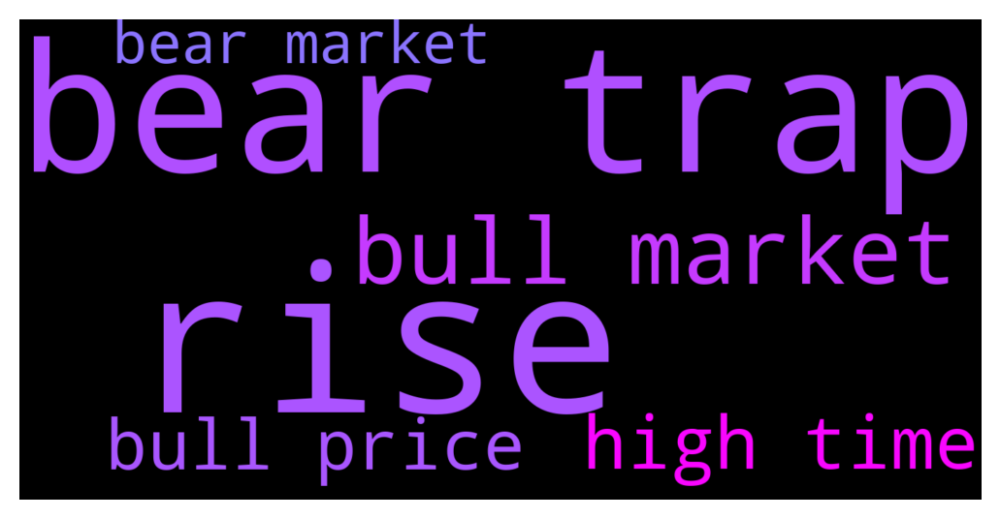

# **@loopringofficial_chat**
 ## Analysis for **2021-12-14** - **2021-12-15**.

---

## 📊 **Basic Stats**

**n_messages_sent**: 103

---

---

## 🔝 **Top keywords and related messages**

1. **rise**

    @Dgust3 --- *The last rise could have been a bear trap. Although typically a bear trap doesn't rise above the previous all time high. Still bitcoin could go down to 10 over the next 2 years* **--->** [TG Discussion](https://t.me/loopringofficial_chat/17217)

    @mahaliaetz05 --- *A slow rise to 100k mayyybe 150k i think is reasonable.* **--->** [TG Discussion](https://t.me/loopringofficial_chat/17205)

2. **bear trap**

    @Sergcryp --- *Same with those DCAing, because after the bear season, they'll be fuckin' rich 🤑💰🔥* **--->** [TG Discussion](https://t.me/loopringofficial_chat/17098)

    @rufused01 --- *Where does everyone think Bitcoin will raise to until it hits a bear market for good??? How long do you think the bear market will last or if we even do have one?* **--->** [TG Discussion](https://t.me/loopringofficial_chat/17198)

    @baltasar078 --- *Not sure if we'll see LRC this after this bear season, the price will shoot up to the moon 🚀* **--->** [TG Discussion](https://t.me/loopringofficial_chat/17082)

    @mahaliaetz05 --- *This is just how the market gets, but after the bear the Bulls 🚀🚀💯* **--->** [TG Discussion](https://t.me/loopringofficial_chat/17045)

    @Dgust3 --- *The last rise could have been a bear trap. Although typically a bear trap doesn't rise above the previous all time high. Still bitcoin could go down to 10 over the next 2 years* **--->** [TG Discussion](https://t.me/loopringofficial_chat/17217)

    @bennycole001 --- *This isn’t scary or deep enough. I want better deals. I missed the 2018 bear and I am forever sad about it… that was the last prolonged chance at plebs accumulating real caches of sats.* **--->** [TG Discussion](https://t.me/loopringofficial_chat/17202)

3. **bull market**

    @rufused01 --- *Where does everyone think Bitcoin will raise to until it hits a bear market for good??? How long do you think the bear market will last or if we even do have one?* **--->** [TG Discussion](https://t.me/loopringofficial_chat/17198)

    @mahaliaetz05 --- *This is just how the market gets, but after the bear the Bulls 🚀🚀💯* **--->** [TG Discussion](https://t.me/loopringofficial_chat/17045)

    @Sergcryp --- *bing bong. we are in an epic gigantomachy that is redefining the relativity of global markets.* **--->** [TG Discussion](https://t.me/loopringofficial_chat/17228)

    @campli065 --- *Keep holding. We're still in an incomplete Bull market.* **--->** [TG Discussion](https://t.me/loopringofficial_chat/17200)

    @Eustaquioemilly51 --- *I think that’s over now with the institutional money involved. It’s going to be a supply and demand type up/down like the regular stock market. It’ll still go up and to the right tho* **--->** [TG Discussion](https://t.me/loopringofficial_chat/17227)

    @loliver044 --- *Price will skyrocket with the next bull wave* **--->** [TG Discussion](https://t.me/loopringofficial_chat/17107)

4. **high time**

    @rufused01 --- *No other good BUY than now The best time to get in on LRC was few years ago, the next best time is now* **--->** [TG Discussion](https://t.me/loopringofficial_chat/17246)

    @Dgust3 --- *The last rise could have been a bear trap. Although typically a bear trap doesn't rise above the previous all time high. Still bitcoin could go down to 10 over the next 2 years* **--->** [TG Discussion](https://t.me/loopringofficial_chat/17217)

    @helena995 --- *As some person I think you have to be patient for a few months and by spring I expect to see a new all time high.* **--->** [TG Discussion](https://t.me/loopringofficial_chat/17220)

    @rocwaysalan1 --- *Will get back up eventually, but all this are a waste of time* **--->** [TG Discussion](https://t.me/loopringofficial_chat/17178)

    @rufused01 --- *I just see the dip as a trying time, and also an opportunity to invest in solid projects (LRC)* **--->** [TG Discussion](https://t.me/loopringofficial_chat/17051)

    @rocwaysalan1 --- *Pump is near buy now get your bonus and sale high when the pump comes.* **--->** [TG Discussion](https://t.me/loopringofficial_chat/17141)

5. **bull price**

    @baltasar078 --- *Not sure if we'll see LRC this after this bear season, the price will shoot up to the moon 🚀* **--->** [TG Discussion](https://t.me/loopringofficial_chat/17082)

    @mahaliaetz05 --- *This is just how the market gets, but after the bear the Bulls 🚀🚀💯* **--->** [TG Discussion](https://t.me/loopringofficial_chat/17045)

    @campli065 --- *Keep holding. We're still in an incomplete Bull market.* **--->** [TG Discussion](https://t.me/loopringofficial_chat/17200)

    @loliver044 --- *Price will skyrocket with the next bull wave* **--->** [TG Discussion](https://t.me/loopringofficial_chat/17107)

    @ismailluk03 --- *Filling up my bag for the next Bull season🚀 #LAMBO* **--->** [TG Discussion](https://t.me/loopringofficial_chat/17119)

    @biglcountrygirl --- *Once prices rise again, we're back in a bull run that will last until prices drop again, if they ever do. Guaranteed.* **--->** [TG Discussion](https://t.me/loopringofficial_chat/17208)

6. **bear market**

    @Sergcryp --- *Same with those DCAing, because after the bear season, they'll be fuckin' rich 🤑💰🔥* **--->** [TG Discussion](https://t.me/loopringofficial_chat/17098)

    @rufused01 --- *Where does everyone think Bitcoin will raise to until it hits a bear market for good??? How long do you think the bear market will last or if we even do have one?* **--->** [TG Discussion](https://t.me/loopringofficial_chat/17198)

    @baltasar078 --- *Not sure if we'll see LRC this after this bear season, the price will shoot up to the moon 🚀* **--->** [TG Discussion](https://t.me/loopringofficial_chat/17082)

    @mahaliaetz05 --- *This is just how the market gets, but after the bear the Bulls 🚀🚀💯* **--->** [TG Discussion](https://t.me/loopringofficial_chat/17045)

    @Dgust3 --- *The last rise could have been a bear trap. Although typically a bear trap doesn't rise above the previous all time high. Still bitcoin could go down to 10 over the next 2 years* **--->** [TG Discussion](https://t.me/loopringofficial_chat/17217)

    @bennycole001 --- *This isn’t scary or deep enough. I want better deals. I missed the 2018 bear and I am forever sad about it… that was the last prolonged chance at plebs accumulating real caches of sats.* **--->** [TG Discussion](https://t.me/loopringofficial_chat/17202)

