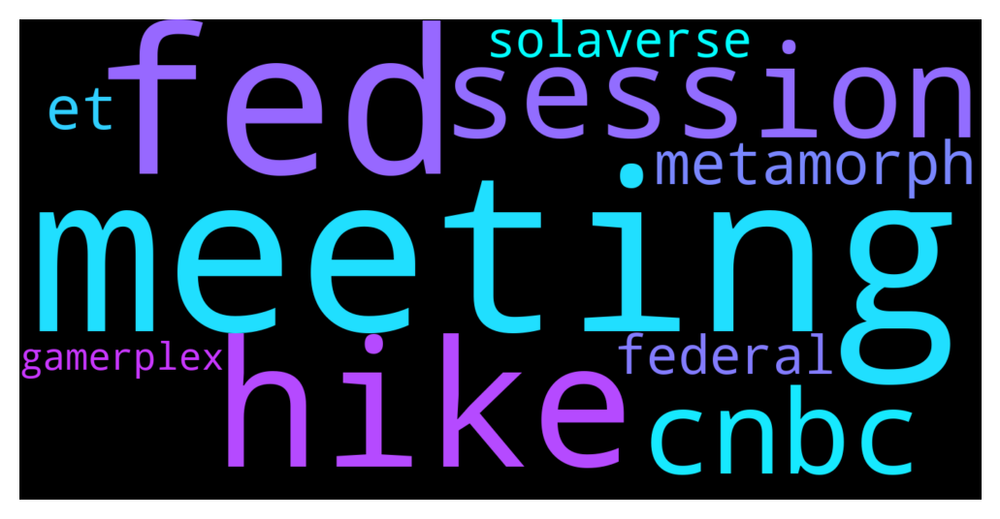

# **@solana**
 ## Analysis for **2021-12-14** - **2021-12-15**.

---

## 📊 **Basic Stats**

**n_messages_sent**: 630

---

---

## 🔝 **Top keywords and related messages**

1. **meeting**

    @C --- *Oh the FEDs meeting 2.0 at 21;00 CET will make btc bullish then a coll will intervene and bullish again.* **--->** [TG Discussion](https://t.me/solana/868934)

    @Ali_kurd_boy --- *Hello, was the Federal Reserve meeting held?    Does anyone know what happened?* **--->** [TG Discussion](https://t.me/solana/869333)

    @Ali_kurd_boy --- *To recap… The dollar was bought Sunday night, and all through Monday’s U.S. session, and then in the overnight markets it was bought some more, before turning around and ending the overnight session down... Dollar traders were all giddy about the FOMC meeting tomorrow, where they believe that Jerome Powell, will make some mention of a rate hike… Just the mention of a rate hike, will get these guys all giddy, like school girls, and I just have one question to ask them… How much of a rate hike do you see coming, if and when it does come? Gold AND Silver both gained yesterday, but is getting sold in the early morning trading today…* **--->** [TG Discussion](https://t.me/solana/869068)

    @C --- *• The Fed will double the pace of the taper to $30 billion at its December meeting, which would roughly end the $120 billion in monthly asset purchases by March, according to the CNBC Fed Survey.  • The central bank will then hike rates three times in each of the next two years, starting in June 2022, the survey respondents predict. On cnbc you can read more* **--->** [TG Discussion](https://t.me/solana/868710)

    @C --- *Fed meeting 14:30 est, 2:30 ET, 21:00 GMT* **--->** [TG Discussion](https://t.me/solana/869059)

2. **fed**

    @C --- *Oh the FEDs meeting 2.0 at 21;00 CET will make btc bullish then a coll will intervene and bullish again.* **--->** [TG Discussion](https://t.me/solana/868934)

    @Ali_kurd_boy --- *Hello, was the Federal Reserve meeting held?    Does anyone know what happened?* **--->** [TG Discussion](https://t.me/solana/869333)

    @C --- *• The Fed will double the pace of the taper to $30 billion at its December meeting, which would roughly end the $120 billion in monthly asset purchases by March, according to the CNBC Fed Survey.  • The central bank will then hike rates three times in each of the next two years, starting in June 2022, the survey respondents predict. On cnbc you can read more* **--->** [TG Discussion](https://t.me/solana/868710)

    @C --- *Fed meeting 14:30 est, 2:30 ET, 21:00 GMT* **--->** [TG Discussion](https://t.me/solana/869059)

    @C --- *Holy shit i’m in love with SOL, while eth etc all fall, SOL is holding strong. @jjjiah FED* **--->** [TG Discussion](https://t.me/solana/869201)

    @Ali_kurd_boy --- *Hello everyone, does the Federal Reserve press conference today have an impact on Solana's price?* **--->** [TG Discussion](https://t.me/solana/868997)

3. **hike**

    @Ali_kurd_boy --- *To recap… The dollar was bought Sunday night, and all through Monday’s U.S. session, and then in the overnight markets it was bought some more, before turning around and ending the overnight session down... Dollar traders were all giddy about the FOMC meeting tomorrow, where they believe that Jerome Powell, will make some mention of a rate hike… Just the mention of a rate hike, will get these guys all giddy, like school girls, and I just have one question to ask them… How much of a rate hike do you see coming, if and when it does come? Gold AND Silver both gained yesterday, but is getting sold in the early morning trading today…* **--->** [TG Discussion](https://t.me/solana/869068)

4. **session**

    @Ali_kurd_boy --- *To recap… The dollar was bought Sunday night, and all through Monday’s U.S. session, and then in the overnight markets it was bought some more, before turning around and ending the overnight session down... Dollar traders were all giddy about the FOMC meeting tomorrow, where they believe that Jerome Powell, will make some mention of a rate hike… Just the mention of a rate hike, will get these guys all giddy, like school girls, and I just have one question to ask them… How much of a rate hike do you see coming, if and when it does come? Gold AND Silver both gained yesterday, but is getting sold in the early morning trading today…* **--->** [TG Discussion](https://t.me/solana/869068)

    @Phani --- *india government not tel bill in winter session yeaaaa👍👍👍👍👍👍👍👍* **--->** [TG Discussion](https://t.me/solana/869029)

5. **cnbc**

    @C --- *• The Fed will double the pace of the taper to $30 billion at its December meeting, which would roughly end the $120 billion in monthly asset purchases by March, according to the CNBC Fed Survey.  • The central bank will then hike rates three times in each of the next two years, starting in June 2022, the survey respondents predict. On cnbc you can read more* **--->** [TG Discussion](https://t.me/solana/868710)

6. **metamorph**

    @mahib45 --- *Solana NFT marketplace :  1️⃣ Metaplex Metaplex is a decentralized protocol that will allow creators to mint and auction non-fungible tokens on the Solana blockchain.   🔗 https://www.metaplex.com  2️⃣ Lollapalooza  🔗 https://lollapalooza.live-nfts.com  3️⃣ Solanart Solanart is the first fully-fledged NFT marketplace on Solana. Get quick and easy access to digital collectibles and explore, buy and sell NFTs from different collections and artists.  🔗 https://solanart.io  4️⃣ Solarians The very first NFT on Solana   🔗 https://solarians.click/  5️⃣ Frakt FRAKT is the first generative art NFT collection on Solana.  🔗 https://frakt.art  6️⃣ Gamerplex GAMERPLEX is an NFT marketplace based on the Solana network.  🔗 https://www.gamerplex.io  7️⃣ONO Ono is a next generation curated NFT marketplace designed with creators first built on Metaplex & Solana.  🔗 https://www.ono.art  8️⃣ Solaverse Solaverse is a Solana Comic Universe NFT/SFT store built with Metaplex.   🔗 https://solaverse.art  9️⃣ Supercoders Supercoders/Metamorph is a neural network lion tamer. It is a home of the MetaMorph AI machine ft. wild and wonderful animated NFT art collections minted on Solana.  🔗 https://supercoders.metamorph.buzz  1️⃣0️⃣ SWANLANA Swanlana is a decentralized, Exchange and NFT Marketplace mixing social media.  🔗 https://swanlana.com  1️⃣1️⃣ DigitalEyes Open NFT marketplace for Solana  🔗 digitaleyes.market  1️⃣2️⃣ Magic Eden  🔗 https://magiceden.io  1️⃣3️⃣ SolanaMoneky business  🔗 https://market.solanamonkey.business  1️⃣4️⃣ Solsea  🔗 solsea.io* **--->** [TG Discussion](https://t.me/solana/869235)

7. **et**

    @mahib45 --- *Check this out👇🏻 https://coinmarketcap.com/currencies/solana/markets/  Or https://www.coingecko.com/en/coins/solana#markets  You can also buy on DEXs by connecting your wallet with DEXs. For DEXs - https://t.me/solana/481292   Please note that our admins won't DM you first* **--->** [TG Discussion](https://t.me/solana/869214)

    @mahib45 --- *Check it out link below on how you can buy SOL here - https://coinmarketcap.com/currencies/solana/markets/  Or https://www.coingecko.com/en/coins/solana#markets  You can also buy on DEXs by connecting your wallet with DEXs. For DEXs - https://t.me/solana/481292   Please note that our admins won't DM you first* **--->** [TG Discussion](https://t.me/solana/868304)

    @cryptolover1987 --- *Check this out👇🏻 https://coinmarketcap.com/currencies/solana/markets/  Or https://www.coingecko.com/en/coins/solana#markets  You can also buy on DEXs by connecting your wallet with DEXs. For DEXs - https://t.me/solana/481292   Please note that our admins won't DM you first* **--->** [TG Discussion](https://t.me/solana/869096)

    @cryptolover1987 --- *I just transferred SOL from trust wallet to Binance. And it’s working perfectly fine. So guys please don’t try to post any negative comments here.* **--->** [TG Discussion](https://t.me/solana/867555)

    @mahib45 --- *Solana NFT marketplace :  1️⃣ Metaplex Metaplex is a decentralized protocol that will allow creators to mint and auction non-fungible tokens on the Solana blockchain.   🔗 https://www.metaplex.com  2️⃣ Lollapalooza  🔗 https://lollapalooza.live-nfts.com  3️⃣ Solanart Solanart is the first fully-fledged NFT marketplace on Solana. Get quick and easy access to digital collectibles and explore, buy and sell NFTs from different collections and artists.  🔗 https://solanart.io  4️⃣ Solarians The very first NFT on Solana   🔗 https://solarians.click/  5️⃣ Frakt FRAKT is the first generative art NFT collection on Solana.  🔗 https://frakt.art  6️⃣ Gamerplex GAMERPLEX is an NFT marketplace based on the Solana network.  🔗 https://www.gamerplex.io  7️⃣ONO Ono is a next generation curated NFT marketplace designed with creators first built on Metaplex & Solana.  🔗 https://www.ono.art  8️⃣ Solaverse Solaverse is a Solana Comic Universe NFT/SFT store built with Metaplex.   🔗 https://solaverse.art  9️⃣ Supercoders Supercoders/Metamorph is a neural network lion tamer. It is a home of the MetaMorph AI machine ft. wild and wonderful animated NFT art collections minted on Solana.  🔗 https://supercoders.metamorph.buzz  1️⃣0️⃣ SWANLANA Swanlana is a decentralized, Exchange and NFT Marketplace mixing social media.  🔗 https://swanlana.com  1️⃣1️⃣ DigitalEyes Open NFT marketplace for Solana  🔗 digitaleyes.market  1️⃣2️⃣ Magic Eden  🔗 https://magiceden.io  1️⃣3️⃣ SolanaMoneky business  🔗 https://market.solanamonkey.business  1️⃣4️⃣ Solsea  🔗 solsea.io* **--->** [TG Discussion](https://t.me/solana/869235)

    @cryptolover1987 --- *Kindly submit a ticket for help from their support team!  https://help.phantom.app/hc/en-us/requests/new* **--->** [TG Discussion](https://t.me/solana/869036)

8. **federal**

    @Ali_kurd_boy --- *Hello, was the Federal Reserve meeting held?    Does anyone know what happened?* **--->** [TG Discussion](https://t.me/solana/869333)

    @Ali_kurd_boy --- *Hello everyone, does the Federal Reserve press conference today have an impact on Solana's price?* **--->** [TG Discussion](https://t.me/solana/868997)

9. **solaverse**

    @mahib45 --- *Solana NFT marketplace :  1️⃣ Metaplex Metaplex is a decentralized protocol that will allow creators to mint and auction non-fungible tokens on the Solana blockchain.   🔗 https://www.metaplex.com  2️⃣ Lollapalooza  🔗 https://lollapalooza.live-nfts.com  3️⃣ Solanart Solanart is the first fully-fledged NFT marketplace on Solana. Get quick and easy access to digital collectibles and explore, buy and sell NFTs from different collections and artists.  🔗 https://solanart.io  4️⃣ Solarians The very first NFT on Solana   🔗 https://solarians.click/  5️⃣ Frakt FRAKT is the first generative art NFT collection on Solana.  🔗 https://frakt.art  6️⃣ Gamerplex GAMERPLEX is an NFT marketplace based on the Solana network.  🔗 https://www.gamerplex.io  7️⃣ONO Ono is a next generation curated NFT marketplace designed with creators first built on Metaplex & Solana.  🔗 https://www.ono.art  8️⃣ Solaverse Solaverse is a Solana Comic Universe NFT/SFT store built with Metaplex.   🔗 https://solaverse.art  9️⃣ Supercoders Supercoders/Metamorph is a neural network lion tamer. It is a home of the MetaMorph AI machine ft. wild and wonderful animated NFT art collections minted on Solana.  🔗 https://supercoders.metamorph.buzz  1️⃣0️⃣ SWANLANA Swanlana is a decentralized, Exchange and NFT Marketplace mixing social media.  🔗 https://swanlana.com  1️⃣1️⃣ DigitalEyes Open NFT marketplace for Solana  🔗 digitaleyes.market  1️⃣2️⃣ Magic Eden  🔗 https://magiceden.io  1️⃣3️⃣ SolanaMoneky business  🔗 https://market.solanamonkey.business  1️⃣4️⃣ Solsea  🔗 solsea.io* **--->** [TG Discussion](https://t.me/solana/869235)

10. **gamerplex**

    @mahib45 --- *Solana NFT marketplace :  1️⃣ Metaplex Metaplex is a decentralized protocol that will allow creators to mint and auction non-fungible tokens on the Solana blockchain.   🔗 https://www.metaplex.com  2️⃣ Lollapalooza  🔗 https://lollapalooza.live-nfts.com  3️⃣ Solanart Solanart is the first fully-fledged NFT marketplace on Solana. Get quick and easy access to digital collectibles and explore, buy and sell NFTs from different collections and artists.  🔗 https://solanart.io  4️⃣ Solarians The very first NFT on Solana   🔗 https://solarians.click/  5️⃣ Frakt FRAKT is the first generative art NFT collection on Solana.  🔗 https://frakt.art  6️⃣ Gamerplex GAMERPLEX is an NFT marketplace based on the Solana network.  🔗 https://www.gamerplex.io  7️⃣ONO Ono is a next generation curated NFT marketplace designed with creators first built on Metaplex & Solana.  🔗 https://www.ono.art  8️⃣ Solaverse Solaverse is a Solana Comic Universe NFT/SFT store built with Metaplex.   🔗 https://solaverse.art  9️⃣ Supercoders Supercoders/Metamorph is a neural network lion tamer. It is a home of the MetaMorph AI machine ft. wild and wonderful animated NFT art collections minted on Solana.  🔗 https://supercoders.metamorph.buzz  1️⃣0️⃣ SWANLANA Swanlana is a decentralized, Exchange and NFT Marketplace mixing social media.  🔗 https://swanlana.com  1️⃣1️⃣ DigitalEyes Open NFT marketplace for Solana  🔗 digitaleyes.market  1️⃣2️⃣ Magic Eden  🔗 https://magiceden.io  1️⃣3️⃣ SolanaMoneky business  🔗 https://market.solanamonkey.business  1️⃣4️⃣ Solsea  🔗 solsea.io* **--->** [TG Discussion](https://t.me/solana/869235)

