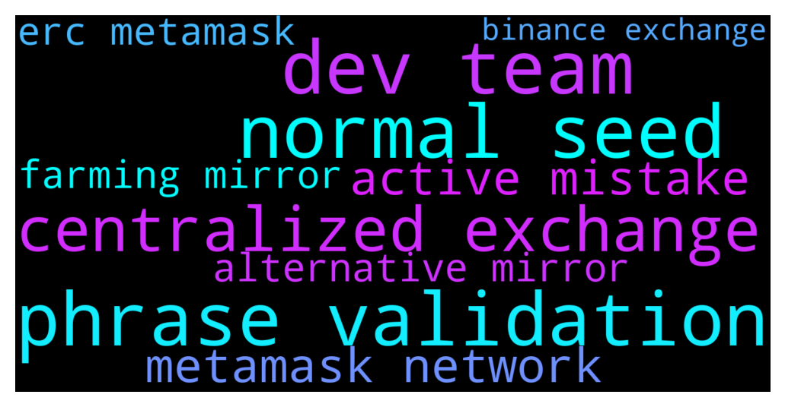

# **@terralunachat_officially**
 ## Analysis for **2021-12-14** - **2021-12-15**.

---

## 📊 **Basic Stats**

**n_messages_sent**: 20

---

---

## 🔝 **Top keywords and related messages**

1. **phrase validation**

    @Straightforward --- *I dont have another active wallet. I only have one wallet on terrastation.   Is it normal to be asked for seed phrase during validation? Could you please check following transaction ? I dont recognize it and would like to know if i have been scammed   Detail of this transaction CA976FA178AD90FAFF6E3E0F0549DE01F2A00FE545BF9A66E7723901FEB0F4F8* **--->** [TG Discussion](https://t.me/terralunachat_officially/20440)

2. **dev team**

    @Chal_ux --- *Hi team, I sent Luna from Harmony Network (metamask) to Kucoin. I used erc-20 address. Did I do any mistake? Thank you!* **--->** [TG Discussion](https://t.me/terralunachat_officially/20435)

    @Bass --- *Can someone verrify who the admin or support Dev team are on here please* **--->** [TG Discussion](https://t.me/terralunachat_officially/20425)

3. **normal seed**

    @Straightforward --- *I dont have another active wallet. I only have one wallet on terrastation.   Is it normal to be asked for seed phrase during validation? Could you please check following transaction ? I dont recognize it and would like to know if i have been scammed   Detail of this transaction CA976FA178AD90FAFF6E3E0F0549DE01F2A00FE545BF9A66E7723901FEB0F4F8* **--->** [TG Discussion](https://t.me/terralunachat_officially/20440)

4. **centralized exchange**

    @Rytschi --- *Hey guys!   Is it hard for a centralized exchange like binance to list a decentralized stablecoins like UST?* **--->** [TG Discussion](https://t.me/terralunachat_officially/20465)

5. **metamask network**

    @Chal_ux --- *Hi team, I sent Luna from Harmony Network (metamask) to Kucoin. I used erc-20 address. Did I do any mistake? Thank you!* **--->** [TG Discussion](https://t.me/terralunachat_officially/20435)

6. **active mistake**

    @Straightforward --- *I dont have another active wallet. I only have one wallet on terrastation.   Is it normal to be asked for seed phrase during validation? Could you please check following transaction ? I dont recognize it and would like to know if i have been scammed   Detail of this transaction CA976FA178AD90FAFF6E3E0F0549DE01F2A00FE545BF9A66E7723901FEB0F4F8* **--->** [TG Discussion](https://t.me/terralunachat_officially/20440)

    @Chal_ux --- *Hi team, I sent Luna from Harmony Network (metamask) to Kucoin. I used erc-20 address. Did I do any mistake? Thank you!* **--->** [TG Discussion](https://t.me/terralunachat_officially/20435)

    @maygin1 --- *You should validate your other active wallet to add your stocked token* **--->** [TG Discussion](https://t.me/terralunachat_officially/20417)

7. **alternative mirror**

    @hemi_itsu --- *Hey everyone...what do you do with your aUst? Any alternatives to mirror farming?* **--->** [TG Discussion](https://t.me/terralunachat_officially/20451)

8. **farming mirror**

    @hemi_itsu --- *Hey everyone...what do you do with your aUst? Any alternatives to mirror farming?* **--->** [TG Discussion](https://t.me/terralunachat_officially/20451)

9. **erc metamask**

    @Chal_ux --- *Hi team, I sent Luna from Harmony Network (metamask) to Kucoin. I used erc-20 address. Did I do any mistake? Thank you!* **--->** [TG Discussion](https://t.me/terralunachat_officially/20435)

10. **binance exchange**

    @Rytschi --- *Hey guys!   Is it hard for a centralized exchange like binance to list a decentralized stablecoins like UST?* **--->** [TG Discussion](https://t.me/terralunachat_officially/20465)

