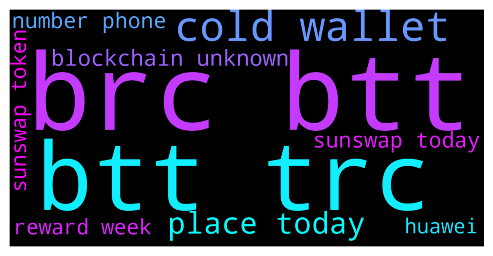

# **@tronnetworkEN**
 ## Analysis for **2021-12-14** - **2021-12-15**.

---

## 📊 **Basic Stats**

**n_messages_sent**: 258

---

---

## 🔝 **Top keywords and related messages**

1. **brc btt**

    @Carlos_TRX --- *BTTC Contracts:  BTT TRC20 TAFjULxiVgT4qWk6UZwjqwZXTSaGaqnVp4  BTT BRC20 0x0000000000000000000000000000000000001010  BTT_e BRC20 0x65676055e58b02e61272cedec6e5c6d56badfb86  BTT_b BRC20 0xcbb9edf6775e39748ea6483a7fa6a385cd7e9a4e  TRX BRC20 0xedf53026aea60f8f75fca25f8830b7e2d6200662   Only BTT TRC20 is compatible with staking in https://wallet.bt.io/staking* **--->** [TG Discussion](https://t.me/tronnetworkEN/3768754)

    @Pouyahamii --- *How change bttc with btt in trust wallet???* **--->** [TG Discussion](https://t.me/tronnetworkEN/3764790)

    @PiterSpain --- *Must use Tronlink.org app and BTT as TRC token* **--->** [TG Discussion](https://t.me/tronnetworkEN/3768104)

    @Mickey --- *Hello, please tell me, is there any point in keeping Btt until the end and when will the de-activation take place in order to understand how long to wait? Thank you so much for your answer.* **--->** [TG Discussion](https://t.me/tronnetworkEN/3767551)

    @Carlos_TRX --- *there was a redenomination in BTT and this is the name that has been assigned to the old token* **--->** [TG Discussion](https://t.me/tronnetworkEN/3766575)

    @PiterSpain --- *None. Ethereum can't work natively on TRON but you can use the BTTC bridge and move your ETH/BNB/TRX/BTT between chains  t.me/BTTBitTorrent* **--->** [TG Discussion](https://t.me/tronnetworkEN/3766432)

2. **btt trc**

    @PiterSpain --- *🎉Today is the day 🎉   😍 Super excited to announce that #SunSwap V2.0 is now LIVE!   💻With the launching of the #SunSwap V2.0, #SunSwap has made significant progress in improving its functionalities and user experience   🖱️Come & Experience at: SUNSwap.com  📑What’s new on #SunSwap V2.0   ✅Enable add liquidity to trading pairs of any two TRC-20 tokens ✅Add a routing protocol that supports the optimal swap path ✅Add a one-click liquidity migration feature of V1 & V1.5 mobility to V2.0   👉View more: https://sunswap.zendesk.com/hc/en-us/articles/4411922184217-Brand-New-SunSwap-V2-Upgrade* **--->** [TG Discussion](https://t.me/tronnetworkEN/3768497)

    @Carlos_TRX --- *BTTC Contracts:  BTT TRC20 TAFjULxiVgT4qWk6UZwjqwZXTSaGaqnVp4  BTT BRC20 0x0000000000000000000000000000000000001010  BTT_e BRC20 0x65676055e58b02e61272cedec6e5c6d56badfb86  BTT_b BRC20 0xcbb9edf6775e39748ea6483a7fa6a385cd7e9a4e  TRX BRC20 0xedf53026aea60f8f75fca25f8830b7e2d6200662   Only BTT TRC20 is compatible with staking in https://wallet.bt.io/staking* **--->** [TG Discussion](https://t.me/tronnetworkEN/3768754)

    @Pouyahamii --- *How change bttc with btt in trust wallet???* **--->** [TG Discussion](https://t.me/tronnetworkEN/3764790)

    @PiterSpain --- *Must use Tronlink.org app and BTT as TRC token* **--->** [TG Discussion](https://t.me/tronnetworkEN/3768104)

    @Mickey --- *Hello, please tell me, is there any point in keeping Btt until the end and when will the de-activation take place in order to understand how long to wait? Thank you so much for your answer.* **--->** [TG Discussion](https://t.me/tronnetworkEN/3767551)

    @Carlos_TRX --- *there was a redenomination in BTT and this is the name that has been assigned to the old token* **--->** [TG Discussion](https://t.me/tronnetworkEN/3766575)

3. **cold wallet**

    @PiterSpain --- *TRX? You can't buy the mainnet TRX cryptocurrency there, only the wrapped version non usable on TRON Network  If you want real mainnet TRX buy in /exchanges and use Tronlink.org wallet to keep them safe* **--->** [TG Discussion](https://t.me/tronnetworkEN/3767426)

    @amelsenbac --- *Go Tronics, vote Vote Everyday! Bitpay accepts the Coinbase wallet, vote guys, we need to show up for them to notice us...#TRON  https://twitter.com/bitpay/status/1458977852230180868?s=21* **--->** [TG Discussion](https://t.me/tronnetworkEN/3768731)

    @Pouyahamii --- *How change bttc with btt in trust wallet???* **--->** [TG Discussion](https://t.me/tronnetworkEN/3764790)

    @agentpiki --- *Go to bt.io and link your trust wallet then swap* **--->** [TG Discussion](https://t.me/tronnetworkEN/3764792)

    @agentpiki --- *Not. I think of it as this:  A Whale bought TRX from binance and transferred the amount to cold wallet (ledger probably), or to hot wallet, for staking / freezing.* **--->** [TG Discussion](https://t.me/tronnetworkEN/3767931)

    @EVA659EVA --- *Any other opinion? Care to share?  My opinion is that whales are withdrawing their fund from binance as they wont be trading anytime soon. Its always safer to store your fund in a cold wallet than storing in an exchange.* **--->** [TG Discussion](https://t.me/tronnetworkEN/3767955)

4. **place today**

    @PiterSpain --- *🎉Today is the day 🎉   😍 Super excited to announce that #SunSwap V2.0 is now LIVE!   💻With the launching of the #SunSwap V2.0, #SunSwap has made significant progress in improving its functionalities and user experience   🖱️Come & Experience at: SUNSwap.com  📑What’s new on #SunSwap V2.0   ✅Enable add liquidity to trading pairs of any two TRC-20 tokens ✅Add a routing protocol that supports the optimal swap path ✅Add a one-click liquidity migration feature of V1 & V1.5 mobility to V2.0   👉View more: https://sunswap.zendesk.com/hc/en-us/articles/4411922184217-Brand-New-SunSwap-V2-Upgrade* **--->** [TG Discussion](https://t.me/tronnetworkEN/3768497)

    @Mickey --- *Hello, please tell me, is there any point in keeping Btt until the end and when will the de-activation take place in order to understand how long to wait? Thank you so much for your answer.* **--->** [TG Discussion](https://t.me/tronnetworkEN/3767551)

    @Carlos_TRX --- *Yes u are spreading without evidences pls share me the hash and i will check the impact price, i did today a lot of swaps in sunswap v2 and it works perfect like always* **--->** [TG Discussion](https://t.me/tronnetworkEN/3768807)

    @Xxxpunk --- *The launch of sun v 2.0 will take place today, don't miss it !🏈 Sunswap v2.0 , token sun 👍* **--->** [TG Discussion](https://t.me/tronnetworkEN/3767887)

    @Xxxpunk --- *The launch of sun v 2.0 will take place today, don't miss it !  Sunswap v2.0 , token sun 👍* **--->** [TG Discussion](https://t.me/tronnetworkEN/3767821)

    @agentpiki --- *How did you get your TRX in the first place? Isn't that the same channel for exit?* **--->** [TG Discussion](https://t.me/tronnetworkEN/3767908)

5. **blockchain unknown**

    @EVA659EVA --- *But it doesnt say tron was transferred. It says usdt tranferred from bianance to unknown and blockchain is tron. Sorry i m abit confused. Just want to clarify how i can interpret it correctly.* **--->** [TG Discussion](https://t.me/tronnetworkEN/3767967)

    @EVA659EVA --- *Anyone knows what this means? Whales are backing out?  🚨🚨🚨🚨🚨🚨🚨🚨🚨🚨 117,821,096 USDT ($117,821,096) transfered from Binance to Unknown Blockchain: Tron* **--->** [TG Discussion](https://t.me/tronnetworkEN/3767920)

    @PiterSpain --- *Bought in some BSC dex? You have the wrapped version from other blockchain. You don't have TRX TRON  However if you buy with card probably you have the Mainet one. Check if your deposit address starts by T to confirm is from TRON* **--->** [TG Discussion](https://t.me/tronnetworkEN/3767477)

    @agentpiki --- *bt.io  visit and read  it is basically the bridge of all major blockchains in and out of tron  also the layer-2 protocol of tron which offers cheapest fee* **--->** [TG Discussion](https://t.me/tronnetworkEN/3767883)

    @Carlos_TRX --- *Sure, from poloniex u can send eth in the TRON blockchain choosing trc chain, and you will enjoy of a faster and cheaper chain than eth chain mate  👍🏻* **--->** [TG Discussion](https://t.me/tronnetworkEN/3766285)

    @Dankdabsalot --- *And in that standpoint,  let's say you play csgo and they used blockchain nfts for the skins. It creates more reassurance and value to the skin its self  because with a database whose to say a dev isn't making another 10-30 super rare knife skins in csgo for a few thousand in profit a pop and hiding it? Idk man many ways to use it in games though.* **--->** [TG Discussion](https://t.me/tronnetworkEN/3765545)

6. **number phone**

    @joem123tel --- *Phone was on charger whole night and do i use this Huawei* **--->** [TG Discussion](https://t.me/tronnetworkEN/3767930)

    @agentpiki --- *You really love china. Tron is where you belong and so is your phone huawei 😂* **--->** [TG Discussion](https://t.me/tronnetworkEN/3767942)

    @Giannislis --- *You don't need that. You gotta create an account, either with your email or phone number, once you confirm your phone number/email you're good to go.* **--->** [TG Discussion](https://t.me/tronnetworkEN/3767524)

    @Kamran Aslanov 123 --- *There are too many scammers here and they are trying to fool people with fake number pictures, smart people can find out who the pictures belong to and the number is fake* **--->** [TG Discussion](https://t.me/tronnetworkEN/3768480)

7. **sunswap today**

    @PiterSpain --- *🎉Today is the day 🎉   😍 Super excited to announce that #SunSwap V2.0 is now LIVE!   💻With the launching of the #SunSwap V2.0, #SunSwap has made significant progress in improving its functionalities and user experience   🖱️Come & Experience at: SUNSwap.com  📑What’s new on #SunSwap V2.0   ✅Enable add liquidity to trading pairs of any two TRC-20 tokens ✅Add a routing protocol that supports the optimal swap path ✅Add a one-click liquidity migration feature of V1 & V1.5 mobility to V2.0   👉View more: https://sunswap.zendesk.com/hc/en-us/articles/4411922184217-Brand-New-SunSwap-V2-Upgrade* **--->** [TG Discussion](https://t.me/tronnetworkEN/3768497)

    @Winklancer11 --- *1) You can Buy Trx and transfer to tronlink and stake in S.R voting.  2) You can stake in liquidity pool at sunswap  3) You can supply in justlend..  4) You can stake win, dice, live at wink. org   there are many options...* **--->** [TG Discussion](https://t.me/tronnetworkEN/3764865)

    @Carlos_TRX --- *Yes u are spreading without evidences pls share me the hash and i will check the impact price, i did today a lot of swaps in sunswap v2 and it works perfect like always* **--->** [TG Discussion](https://t.me/tronnetworkEN/3768807)

    @suPerJack0 --- *Sunswap upgrade. U can claim and unstake* **--->** [TG Discussion](https://t.me/tronnetworkEN/3767704)

    @Xxxpunk --- *The launch of sun v 2.0 will take place today, don't miss it !🏈 Sunswap v2.0 , token sun 👍* **--->** [TG Discussion](https://t.me/tronnetworkEN/3767887)

    @Xxxpunk --- *The launch of sun v 2.0 will take place today, don't miss it !  Sunswap v2.0 , token sun 👍* **--->** [TG Discussion](https://t.me/tronnetworkEN/3767821)

8. **reward week**

    @Fabs_trx --- *On Justlend rewards are partially delivered once a week (usually on Tuesday but can be delayed)* **--->** [TG Discussion](https://t.me/tronnetworkEN/3767870)

    @agentpiki --- *Go to bt.io  Check the rewards calculator on top.* **--->** [TG Discussion](https://t.me/tronnetworkEN/3768847)

    @agentpiki --- *Yes, but rewards will be given once a week. Don't worry.* **--->** [TG Discussion](https://t.me/tronnetworkEN/3767864)

    @agentpiki --- *The rewards are frozen, and will be distributed to you once a week for total of 24 weeks* **--->** [TG Discussion](https://t.me/tronnetworkEN/3767737)

    @JPG --- *All of my tokens are being displayed in the wallet yet the total seems to amount to 0. And when i go into JustLend i see an absurd amount of $ on the mining rewards* **--->** [TG Discussion](https://t.me/tronnetworkEN/3767517)

9. **sunswap token**

    @PiterSpain --- *🎉Today is the day 🎉   😍 Super excited to announce that #SunSwap V2.0 is now LIVE!   💻With the launching of the #SunSwap V2.0, #SunSwap has made significant progress in improving its functionalities and user experience   🖱️Come & Experience at: SUNSwap.com  📑What’s new on #SunSwap V2.0   ✅Enable add liquidity to trading pairs of any two TRC-20 tokens ✅Add a routing protocol that supports the optimal swap path ✅Add a one-click liquidity migration feature of V1 & V1.5 mobility to V2.0   👉View more: https://sunswap.zendesk.com/hc/en-us/articles/4411922184217-Brand-New-SunSwap-V2-Upgrade* **--->** [TG Discussion](https://t.me/tronnetworkEN/3768497)

    @Carlos_TRX --- *there was a redenomination in BTT and this is the name that has been assigned to the old token* **--->** [TG Discussion](https://t.me/tronnetworkEN/3766575)

    @Winklancer11 --- *1) You can Buy Trx and transfer to tronlink and stake in S.R voting.  2) You can stake in liquidity pool at sunswap  3) You can supply in justlend..  4) You can stake win, dice, live at wink. org   there are many options...* **--->** [TG Discussion](https://t.me/tronnetworkEN/3764865)

    @Fervent4thefuture --- *hi I am staking tronpad tokens and am in a tier, when i go to the staking page it says i have earned rewaeds. can i simply press the stake now option to add my tokens to my current stake? are there any penalties toward my current stake in regards to my ido allocation if i add more tokens mid stake? I apologize but I checked both tronpad tg and no speaking aloud. can you help me please* **--->** [TG Discussion](https://t.me/tronnetworkEN/3765289)

    @vokcbl --- *So my tokens are safe? And my usdt Tron is also safe? I don't need to worry with transferring any of it out of precaution?* **--->** [TG Discussion](https://t.me/tronnetworkEN/3767299)

    @agentpiki --- *bt.io  visit the website and swap there  btw, bttc is not the new token. its BTT* **--->** [TG Discussion](https://t.me/tronnetworkEN/3766568)

10. **huawei**

    @joem123tel --- *Phone was on charger whole night and do i use this Huawei* **--->** [TG Discussion](https://t.me/tronnetworkEN/3767930)

    @agentpiki --- *You really love china. Tron is where you belong and so is your phone huawei 😂* **--->** [TG Discussion](https://t.me/tronnetworkEN/3767942)

