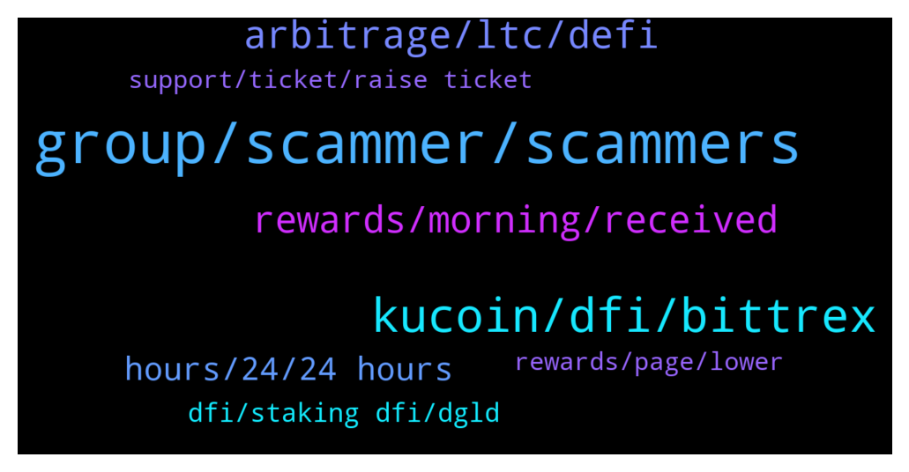

# **@CakeDeFi_EN**
 ## Analysis for **2021-12-15** - **2021-12-16**.

---

## 📊 **Basic Stats**

**n_messages_sent**: 362

---

---

## 🔝 **Top keywords and related messages**

1. **group, scammer, scammers**

    @christina --- *Can anyone confirm Daniel Basista is not a scammer* **--->** [TG Discussion](https://t.me/CakeDeFi_EN/153102)

    @christina --- *Thank you all! Daniel Batista is a scammer. Not to be confused with Daniel Baptista.* **--->** [TG Discussion](https://t.me/CakeDeFi_EN/153110)

    @DmgBautista --- *Sorry did not understood what you are trying to say 😕* **--->** [TG Discussion](https://t.me/CakeDeFi_EN/153471)

    @NicholasLiew --- *Can we compile a list of known scammers and pin it* **--->** [TG Discussion](https://t.me/CakeDeFi_EN/153095)

    @mydearmayme --- *Can’t admin do anything to protect us from scammers* **--->** [TG Discussion](https://t.me/CakeDeFi_EN/153086)

    @Larry --- *Bernd Mack guys is the name watch out* **--->** [TG Discussion](https://t.me/CakeDeFi_EN/153459)

2. **kucoin, dfi, bittrex**

    @DmgBautista --- *Or you can send it to bittrex, convert into USDT and the USD or EUR, directly to your bank. Other option is DFX.swiss. Soecifically designed for DFI, no KYC under 900 EUR and with off-ramp capability ;)* **--->** [TG Discussion](https://t.me/CakeDeFi_EN/153429)

    @Careluna1201 --- *Kucoin the same, so we are pretty much stuck. If you need you money now now you are in trouble. It would be nice to have more Exchanges to work with.* **--->** [TG Discussion](https://t.me/CakeDeFi_EN/153049)

    @Joel --- *What do you send? DFI? AFAIK CoinBase doesn’t trade DFI.* **--->** [TG Discussion](https://t.me/CakeDeFi_EN/153409)

    @Patrick --- *Hey guys, i bought dfi tokens ok bittrex but now i cannot send them to my dfi desktop app since days because they have maintenance on this currency. Does any body know how long it will take?* **--->** [TG Discussion](https://t.me/CakeDeFi_EN/153595)

    @Bef --- *Why usdt? Why not defi into eur?* **--->** [TG Discussion](https://t.me/CakeDeFi_EN/153392)

    @Bence --- *withdrew some DFI from cake to kucoin like 2hrs ago and it still hasn’t arrived, cake says transaction is complete, how come?* **--->** [TG Discussion](https://t.me/CakeDeFi_EN/153405)

3. **arbitrage, ltc, defi**

    @enalettin --- *Cake please speeds up LTC withdrawals i don't know what's security metrics you apply but there is a balance between security and customer satisfaction ,,🤪* **--->** [TG Discussion](https://t.me/CakeDeFi_EN/153542)

    @enalettin --- *Cake defi not want us to make arbitrage profit i guess i sold for LTC on defi wallet then send it cake and then to other exchange it is still pending (white list address) it is more than 9 hours. it is ltc protocol what is preventing them so long to pump it on to the ltc network* **--->** [TG Discussion](https://t.me/CakeDeFi_EN/153507)

    @Roman --- *Hey I know cake customer support is usually really busy and don't wish to add more work but how long can we expect to wait for a reply? On the website it says 5 business days but I've been waiting over 2 weeks for a reply now.* **--->** [TG Discussion](https://t.me/CakeDeFi_EN/153157)

    @Resul069 --- *When I deposit $50, can I withdraw the $30 gift immediately? thats right ok ?* **--->** [TG Discussion](https://t.me/CakeDeFi_EN/152996)

    @enalettin --- *Yes but please admit at least the fact that cakes withdrawal process is way slow comparing other exchanges* **--->** [TG Discussion](https://t.me/CakeDeFi_EN/153515)

    @Michael_Schredl --- *Take a look at https://defiscan.live/dex, there you see the current APR - Cake takes a 7 day average* **--->** [TG Discussion](https://t.me/CakeDeFi_EN/153176)

4. **rewards, morning, received**

    @Willian --- *A lot people didn't receive the LM reward this morning i think* **--->** [TG Discussion](https://t.me/CakeDeFi_EN/153472)

    @brandoncjl --- *have LM rewards been delayed today? have not received it yet* **--->** [TG Discussion](https://t.me/CakeDeFi_EN/153022)

    @Michael_Schredl --- *Rewards will level out over time. Check the next cycle, everything should be fine* **--->** [TG Discussion](https://t.me/CakeDeFi_EN/153611)

    @jackluo --- *scammers keep msg us, is any staff working on the problem of no rewards this morning?* **--->** [TG Discussion](https://t.me/CakeDeFi_EN/153467)

    @Willian --- *Why are rewards stuck again, no rewards this morning* **--->** [TG Discussion](https://t.me/CakeDeFi_EN/153439)

    @Willian --- *I noticed that lost rewards are not re issued... So that's bad* **--->** [TG Discussion](https://t.me/CakeDeFi_EN/153488)

5. **hours, 24, 24 hours**

    @jackluo --- *Nice speech. So is it delayed or wat* **--->** [TG Discussion](https://t.me/CakeDeFi_EN/153047)

    @Happy --- *Apparently it only takes up to an hour on the defichain lightwallet. How come there is such a disparity between wait times?* **--->** [TG Discussion](https://t.me/CakeDeFi_EN/153651)

    @fabioandreatta --- *Can take up to 24 hours* **--->** [TG Discussion](https://t.me/CakeDeFi_EN/153626)

    @Michael_Schredl --- *It can take up to 24 hours* **--->** [TG Discussion](https://t.me/CakeDeFi_EN/153724)

    @DmgBautista --- *Answers may take up to 24h, maybe a bit more on weekends* **--->** [TG Discussion](https://t.me/CakeDeFi_EN/153506)

    @enalettin --- *Sometimes it takes hours sometime minutes* **--->** [TG Discussion](https://t.me/CakeDeFi_EN/153363)

6. **dfi, staking dfi, dgld**

    @ClaudioAI --- *Can someone tell me how can solve this problem? How to cleared negative DFI balance?* **--->** [TG Discussion](https://t.me/CakeDeFi_EN/153345)

    @PPAnPR --- *Thank you for the reply Any path forward to get these resolved? Lending also blocked in US 😒* **--->** [TG Discussion](https://t.me/CakeDeFi_EN/153726)

    @Juan --- *Problem with dfi , we are too reliant on a hand few of exchanges* **--->** [TG Discussion](https://t.me/CakeDeFi_EN/153037)

    @ClaudioAI --- *i cant see this but support team says. i have- 0.19709527 DFI negative amount. Do i have to deposit DFI from a different exchange for this?* **--->** [TG Discussion](https://t.me/CakeDeFi_EN/153361)

    @nadastropovic --- *I think i’ve got my answer, in staking DFI since the rewards are mainly in DFI right?* **--->** [TG Discussion](https://t.me/CakeDeFi_EN/153660)

    @nadastropovic --- *If i LM dGME/dUSD on cake, are the rewards autocompouned in LM or staking DFI?* **--->** [TG Discussion](https://t.me/CakeDeFi_EN/153659)

7. **support, ticket, raise ticket**

    @enalettin --- *Applied for support and except for an auto message i received nothing* **--->** [TG Discussion](https://t.me/CakeDeFi_EN/153503)

    @fabioandreatta --- *Everything is working, please contact Support so that they can check your account.* **--->** [TG Discussion](https://t.me/CakeDeFi_EN/153257)

    @itmlgife --- *Ok. So you are already in contact with the support team then. If that is the case, they should give you solution options. Did you ask them for some?* **--->** [TG Discussion](https://t.me/CakeDeFi_EN/153362)

    @bentansg --- *Same here. I have emailed support as well, pending their response also.* **--->** [TG Discussion](https://t.me/CakeDeFi_EN/153593)

    @DmgBautista --- *Yup, received them in the morning. Please raise a ticket for support in the app or website, support will check on you 😉* **--->** [TG Discussion](https://t.me/CakeDeFi_EN/153478)

    @Willian --- *How do I raise a ticket in the app* **--->** [TG Discussion](https://t.me/CakeDeFi_EN/153494)

