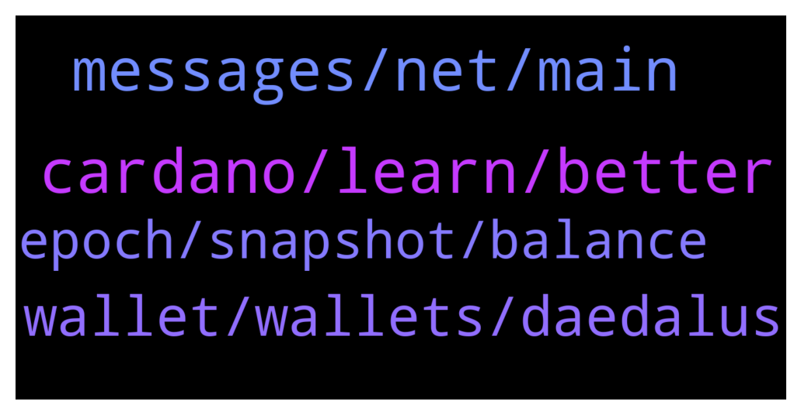

# **@Cardano**
 ## Analysis for **2021-12-15** - **2021-12-16**.

---

## 📊 **Basic Stats**

**n_messages_sent**: 95

---

---

## 🔝 **Top keywords and related messages**

1. **cardano, learn, better**

    @Sydney --- *Yup yup, I read that and thought it was poor “journalism” for sure, just couldn’t think of the flaw myself, but knew someone could! I certainly agree, Cardano will take sometime to develop but I think that speaks to its benefit. It’s about development, not hype and pumping. I myself have dropped everything to learn to be a developer myself. So I’m in it way more than the investment.* **--->** [TG Discussion](https://t.me/Cardano/759589)

    @Mr_Johnathan --- *yeah, those articles are just pure FUD. It's like people are paying to make cardano look bad. The major "fault" with cardano is that it's taking a lot longer than other projects to fully mature. But if you can wait a bit, then I'm confident you will be pleasantly rewarded.* **--->** [TG Discussion](https://t.me/Cardano/759586)

    @Sydney --- *Hey everyone, I read this article this morning and was wondering what peoples thoughts were on it? Does anyone see this as a concern? https://dailycoin.com/decentralized-10-cardano-whale-controls-94-of-all-ada-in-supply/* **--->** [TG Discussion](https://t.me/Cardano/759581)

    @glitch04 --- *Probably a few of the ama's* **--->** [TG Discussion](https://t.me/Cardano/759066)

    @Sydney --- *Oh totally, the more I learn about it the more I realize it is leaps and bounds theoretically compared to other projects. Makes me pretty excited. Im fairly new to Haskell as well but joined the Emurgo Academy program and am super excited to learn and dive in head first. I think Cardano is gonna change so much of the world!* **--->** [TG Discussion](https://t.me/Cardano/759591)

    @ExInfernis --- *thanks a lot for the info* **--->** [TG Discussion](https://t.me/Cardano/759113)

2. **messages, net, main**

    @adaantonwihardja --- *you will find it in the menu somewhere that switch from main net to test net* **--->** [TG Discussion](https://t.me/Cardano/759046)

    @Mpd03 --- *It wasn’t a dm it was on the main channel* **--->** [TG Discussion](https://t.me/Cardano/759024)

    @QuickOne_Validator --- *where you can specify the destination address* **--->** [TG Discussion](https://t.me/Cardano/759301)

    @TheBigBossK --- *No one legit would be DMing you first.* **--->** [TG Discussion](https://t.me/Cardano/759019)

    @Tanmaygupta397 --- *What network should i choose ?* **--->** [TG Discussion](https://t.me/Cardano/759305)

    @echion --- *Is there a similar command to determine the current ISPO for the group here or an overview page where you can look it up?* **--->** [TG Discussion](https://t.me/Cardano/759491)

3. **wallet, wallets, daedalus**

    @real_ahmadkamal --- *greeting guys, i would like to ask. i'm facing problem to connect my nami wallet in sundaeswap. how to adjust my nami wallet connection for testnet?* **--->** [TG Discussion](https://t.me/Cardano/759035)

    @ExInfernis --- *Hi, I have question for Daedalus and Yoroi. Can I have at the same time my ada on both wallets or when I download yoroi and create wallet there my ada will be transferred from the daedalus to yoroi?* **--->** [TG Discussion](https://t.me/Cardano/759102)

    @Tanmaygupta397 --- *Hi guys  A quick question  How can i transfer my Ada from binance to another wallet like metamask or trust wallet ??* **--->** [TG Discussion](https://t.me/Cardano/759299)

    @Mr_Johnathan --- *at least spend a few minutes reading the report. here's a hint. they make no distinction between exchange wallets and user wallets.* **--->** [TG Discussion](https://t.me/Cardano/759582)

    @Mpd03 --- *Has anyone heard of revalidating the wallet when it’s not working ? Is the wallet down ?* **--->** [TG Discussion](https://t.me/Cardano/759033)

    @glitch04 --- *Just pair your existing wallet with Yoroi* **--->** [TG Discussion](https://t.me/Cardano/759111)

4. **epoch, snapshot, balance**

    @glitch04 --- *Snapshot is the transition between epochs. the epochs are always offset so it appears in a future epoch when there are changes made (n+2)* **--->** [TG Discussion](https://t.me/Cardano/759342)

    @glitch04 --- *The next epoch transition is where the new balance snapshot is taken which you will then see the increase in rewards in a future epoch.   EX you increase the balance in 308 > snapshot is taken at beginning of 309 > rewards for 309 arrive with the new adjustment in epoch 311* **--->** [TG Discussion](https://t.me/Cardano/759374)

    @glitch04 --- *Snapshot was taken at the start of the epoch rewards for 308 arrive in 310* **--->** [TG Discussion](https://t.me/Cardano/759351)

    @perplex --- *are staking rewards taken on a snapshot at the end of an epoch? or based on the time  during the epoch when you produce blocks of your ada balance?* **--->** [TG Discussion](https://t.me/Cardano/759336)

    @glitch04 --- *So smaller changes in balance are hard to notice in rewards payout between the results of a pools performance as all pools have a fluctuation from epoch to epoch.* **--->** [TG Discussion](https://t.me/Cardano/759384)

    @perplex --- *yea, i understand that part, but say half way through a epoch, i double my ADA, that will start earning rewards as soon as your pool mints a new block?* **--->** [TG Discussion](https://t.me/Cardano/759369)

