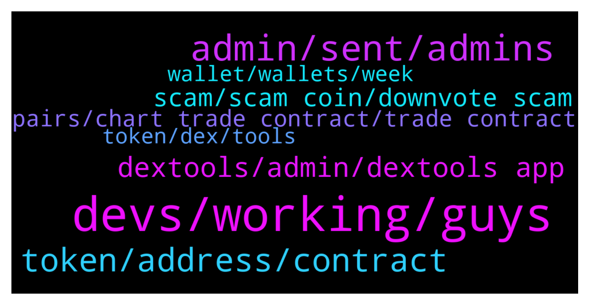

# **@DEXToolsCommunity**
 ## Analysis for **2021-12-14** - **2021-12-16**.

---

## 📊 **Basic Stats**

**n_messages_sent**: 220

---

---

## 🔝 **Top keywords and related messages**

1. **devs, working, guys**

    @JoeyDieleman --- *Yes thats what i told you:  https://t.me/DEXToolsCommunity/312848* **--->** [TG Discussion](https://t.me/DEXToolsCommunity/312880)

    @prep_mb --- *they want this to be done urgently.* **--->** [TG Discussion](https://t.me/DEXToolsCommunity/312675)

    @bastardganpunk --- *Yes, devs are working on integrations 🙂* **--->** [TG Discussion](https://t.me/DEXToolsCommunity/312832)

    @CryptoSadt --- *yes, we submitted the details but they are slow... you know😂* **--->** [TG Discussion](https://t.me/DEXToolsCommunity/313512)

    @stanes --- *I just checked, it's already verified, I am for warding it to the devs.* **--->** [TG Discussion](https://t.me/DEXToolsCommunity/313514)

    @stanes --- *Oh, ok, I understand now. Ok, let me forward the issue to the devs.* **--->** [TG Discussion](https://t.me/DEXToolsCommunity/312812)

2. **admin, sent, admins**

    @ty_flush --- *Have tried that option as well. Funny I am the owner of the group :|* **--->** [TG Discussion](https://t.me/DEXToolsCommunity/313784)

    @henriquesmbc --- *@FredericDEXT Can anyone tell me if this guy is from the real DETools team?* **--->** [TG Discussion](https://t.me/DEXToolsCommunity/312709)

    @napascual --- *That's not Frederic tag btw, it's @FredericDEXT. But he has tons of Dms so don't wait for him to respond immediately* **--->** [TG Discussion](https://t.me/DEXToolsCommunity/313819)

    @HappylandNakamoto --- *I would like my news to appear on your website* **--->** [TG Discussion](https://t.me/DEXToolsCommunity/312859)

    @jimmyvee --- *do you have the link to that chat, pls* **--->** [TG Discussion](https://t.me/DEXToolsCommunity/313811)

    @stanes --- *Don't pay anybody asking you to. Admins never DM first or ask for fund.* **--->** [TG Discussion](https://t.me/DEXToolsCommunity/313501)

3. **token, address, contract**

    @Gaex99 --- *Hi, I am writing this message as a token has not been added on your website, looking for the address of the contract on which I invested unfortunately another token comes out that has stolen our address.  The address is the following:   0x88da4f413263ead8a6b5d71b5b0583ff964ee2c9   I hope it will be resolved soon because the matter is very urgent, thanks* **--->** [TG Discussion](https://t.me/DEXToolsCommunity/312808)

    @stanes --- *Not sure what you are talking about... Nobody can steal the contract address...* **--->** [TG Discussion](https://t.me/DEXToolsCommunity/312810)

    @CryptoSadt --- *Hi we also do not see our new token listed... may I have info about?* **--->** [TG Discussion](https://t.me/DEXToolsCommunity/313480)

    @JswapFinanceShona --- *Hello sir, what funds do I need to submit to show the token information on the platform page* **--->** [TG Discussion](https://t.me/DEXToolsCommunity/313499)

    @jimmyvee --- *@stanes - I don't see any other way to contact you so I'm reaching out here.  I participated in the April 2021 raise for $BUMP Bumper Finance. @frederic will not respond to DM's on TG.  I am due my tokens from that deal.  Can you please let me know when we'll receive the tokens, and/or who I should contact regarding this matter.  Thanks.* **--->** [TG Discussion](https://t.me/DEXToolsCommunity/313816)

    @CryptoSadt --- *Stanes can you take the Contract Details from Coingecko? or I can send a pdf to you...* **--->** [TG Discussion](https://t.me/DEXToolsCommunity/313525)

4. **dextools, admin, dextools app**

    @robin_set_b --- *hello admin please help me with info about Dextool adds* **--->** [TG Discussion](https://t.me/DEXToolsCommunity/312652)

    @Theasker --- *sorry. I can't configure dextools on a channel. can you help me? I have added the bot to the channel, set it as admin and tried to do the /setpair but it does nothing.* **--->** [TG Discussion](https://t.me/DEXToolsCommunity/313423)

    @gil_era --- *Is it known if there are any plans to add other chains to Dextools?* **--->** [TG Discussion](https://t.me/DEXToolsCommunity/312826)

    @prep_mb --- *3 people contacted me and they are saying as dextools official member* **--->** [TG Discussion](https://t.me/DEXToolsCommunity/313094)

    @SeaHeng --- *Does Dextools support Avalanche Network Protocol?* **--->** [TG Discussion](https://t.me/DEXToolsCommunity/312908)

    @stanes --- *If you are talking about bridging your DEXT, you can by using Anyswap: https://anyswap.exchange/#/bridge We don't have a bridge integrated on Dextools.* **--->** [TG Discussion](https://t.me/DEXToolsCommunity/313344)

5. **scam, scam coin, downvote scam**

    @JunLOA --- *How do we downvote scam coin?* **--->** [TG Discussion](https://t.me/DEXToolsCommunity/313139)

    @JunLOA --- *Smart? We need to downvote scam coin But we have to pay first* **--->** [TG Discussion](https://t.me/DEXToolsCommunity/313188)

    @Gaex99 --- *They have stoled the contract adress writing it on the name* **--->** [TG Discussion](https://t.me/DEXToolsCommunity/312811)

    @sertezx --- *Frederic scammers using dextools trending and rugging people* **--->** [TG Discussion](https://t.me/DEXToolsCommunity/313286)

    @napascual --- *Feel free to share the scam coin here, there are a lot of community members willing to help* **--->** [TG Discussion](https://t.me/DEXToolsCommunity/313190)

    @JoeyDieleman --- *It was a scammer giving the wrong user* **--->** [TG Discussion](https://t.me/DEXToolsCommunity/312843)

6. **pairs, chart trade contract, trade contract**

    @sertezx --- *Ftm pairs not shows real price* **--->** [TG Discussion](https://t.me/DEXToolsCommunity/313614)

    @MegaTed --- *Is there a pair problem again?* **--->** [TG Discussion](https://t.me/DEXToolsCommunity/313330)

    @stanes --- *DEXT PANCAKESWAP PAIR Chart and trade: https://www.dextools.io/app/pancakeswap/pair-explorer/0x4b729d5d871057f3a9c424792729217cde72410d Contract: 0xe91a8d2c584ca93c7405f15c22cdfe53c29896e3* **--->** [TG Discussion](https://t.me/DEXToolsCommunity/313626)

    @stanes --- *DEXT UNISWAP PAIR Chart and trade: https://www.dextools.io/app/uniswap/pair-explorer/0xa29fe6ef9592b5d408cca961d0fb9b1faf497d6d Contract: 0xfb7b4564402e5500db5bb6d63ae671302777c75a  DEXT PANCAKESWAP PAIR Chart and trade: https://www.dextools.io/app/pancakeswap/pair-explorer/0x4b729d5d871057f3a9c424792729217cde72410d Contract: 0xe91a8d2c584ca93c7405f15c22cdfe53c29896e3* **--->** [TG Discussion](https://t.me/DEXToolsCommunity/312890)

    @omobolaji --- *stanes yes I  am talking about bridging , I have to move my BNB to Eth or vice versa but I go CEX* **--->** [TG Discussion](https://t.me/DEXToolsCommunity/313368)

    @No.One --- *Yeah all bsc pairs and hot trends* **--->** [TG Discussion](https://t.me/DEXToolsCommunity/313334)

7. **wallet, wallets, week**

    @Ms4crypto --- *yeah, its been just about a week now that i cant see ever..all the other wallets works but bsc..i always had issue with since day one but now its just doesnt want to load at all ever* **--->** [TG Discussion](https://t.me/DEXToolsCommunity/312899)

    @Ms4crypto --- *another question, its been about a week that i have this for bsc wallet info. Any idea why?* **--->** [TG Discussion](https://t.me/DEXToolsCommunity/312891)

    @Scalperdog --- *Why I can´t swap to Binance Wallet ?* **--->** [TG Discussion](https://t.me/DEXToolsCommunity/312823)

    @stanes --- *Mmmh strange... Ok send me your wallet address in DM please, I will ask the devs to have a look.* **--->** [TG Discussion](https://t.me/DEXToolsCommunity/312902)

    @Ms4crypto --- *fianally got my wallet figured out..* **--->** [TG Discussion](https://t.me/DEXToolsCommunity/312875)

    @napascual --- *If it persists feel free to dm me the transaction and your wallet* **--->** [TG Discussion](https://t.me/DEXToolsCommunity/313197)

