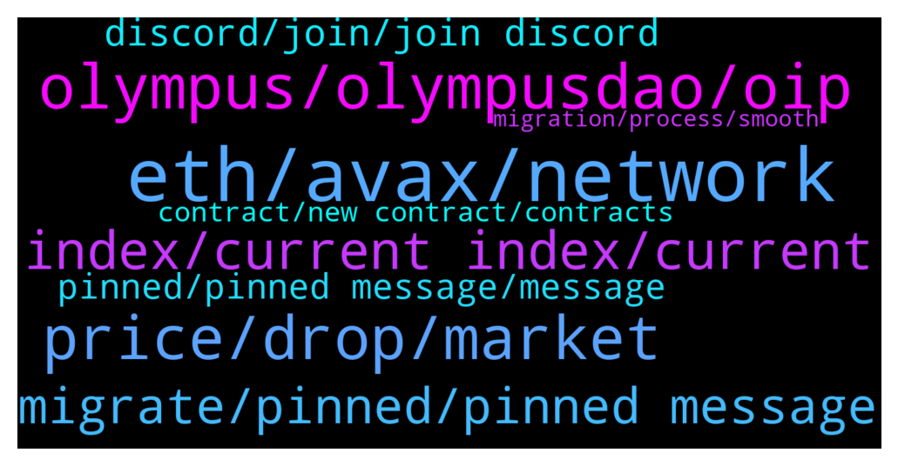

# **@OlympusTG**
 ## Analysis for **2021-12-15** - **2021-12-16**.

---

## 📊 **Basic Stats**

**n_messages_sent**: 2413

---

---

## 🔝 **Top keywords and related messages**

1. **eth, avax, network**

    @Poopoo (never dm first) --- *yes if your gOHM is in AVAX you won't see it, only available for ETH network, my guess is it will be available in other network very soon, please be patient the devs are working on a lot of things now* **--->** [TG Discussion](https://t.me/OlympusTG/122742)

    @Poopoo (never dm first) --- *Are you on the website Stake page? I can see mine, gOHM and staked balance, are you on the Ethereum network, only available in the Eth network now.* **--->** [TG Discussion](https://t.me/OlympusTG/122737)

    @RightNow_3005 --- *Anyone else pondering the prospect of gOHM on ETH being duplicated on Pulsechain when it forks (next month?) from ethereum?  Maybe something to factor in to our investment strategies* **--->** [TG Discussion](https://t.me/OlympusTG/121247)

    @ANDREAS --- *But I have 2 address OHM. (OHM V1 and OHM V2) who i buy with ethereum? Ok* **--->** [TG Discussion](https://t.me/OlympusTG/123225)

    @cryptokvon --- *yup, just search gohm and can sell for eth if needed* **--->** [TG Discussion](https://t.me/OlympusTG/123661)

    @eslam_sameh --- *Is thus will move them from etherium to avalanche* **--->** [TG Discussion](https://t.me/OlympusTG/123200)

2. **olympus, olympusdao, oip**

    @bigmushroom --- *Google OlympusDAO v2 medium post, in short, it's getting ready for 4, 4* **--->** [TG Discussion](https://t.me/OlympusTG/124018)

    @TeamJakePaul --- *Olympus is backed by 1 DAI each. That’s the lowest it can go. HODL!* **--->** [TG Discussion](https://t.me/OlympusTG/120739)

    @MelnykNikola --- *only if Olympus lasts that long* **--->** [TG Discussion](https://t.me/OlympusTG/120756)

    @Sactown1978 --- *I have some wsOHM I bought on traderjoe. What’s should I do with it since Olympus going V2?* **--->** [TG Discussion](https://t.me/OlympusTG/121432)

    @frizurd --- *gonna read up on olympus v2* **--->** [TG Discussion](https://t.me/OlympusTG/122192)

    @stacyd82d --- *It is used o calculate a few of the different opportunities Olympus offers my ohmie.* **--->** [TG Discussion](https://t.me/OlympusTG/123332)

3. **price, drop, market**

    @Al_S1919 --- *I just see how the situation develops. The price keeps decreasing, the backing keeps decreasing as well.* **--->** [TG Discussion](https://t.me/OlympusTG/122475)

    @CBMallorca --- *Price is falling Apy is falling … Crazy …* **--->** [TG Discussion](https://t.me/OlympusTG/122899)

    @Dean --- *Price drop they need some sort of promo 👎🏽* **--->** [TG Discussion](https://t.me/OlympusTG/122959)

    @cdp279 --- *Cool sir. The market is down. We know. Thanks for reiterating* **--->** [TG Discussion](https://t.me/OlympusTG/122981)

    @cdp279 --- *The whole market is down man. Come on. Think a little* **--->** [TG Discussion](https://t.me/OlympusTG/122962)

    @Ap0l1o --- *market correction man... chill and do not watch the price* **--->** [TG Discussion](https://t.me/OlympusTG/123610)

4. **index, current index, current**

    @Max --- *The online example is based on a hypothetic index of 10 and the current is around 50.* **--->** [TG Discussion](https://t.me/OlympusTG/123414)

    @Poopoo (never dm first) --- *no it is sOHM = gOHM*index* **--->** [TG Discussion](https://t.me/OlympusTG/121826)

    @Blockchain_OB --- *10% price of OHM.  gOHM price = OHM price * index.  Index goes up 0.1 each rebase.  That is 10% the price of OHM* **--->** [TG Discussion](https://t.me/OlympusTG/123699)

    @Poopoo (never dm first) --- *in terms of amount, it is sOHM number = gOHM x current index* **--->** [TG Discussion](https://t.me/OlympusTG/121830)

    @lookmovie --- *so  gOHM will always forever correlates to "sOHM x current index"? they can't go up or down separately?* **--->** [TG Discussion](https://t.me/OlympusTG/122429)

    @Al_S1919 --- *another question: still, is gOHM the product of sOHM and the index or vice versa? That is, is gOHM calculated as the following: gOHM = sOHM * index?* **--->** [TG Discussion](https://t.me/OlympusTG/121824)

5. **migrate, pinned, pinned message**

    @Poopoo (never dm first) --- *yes you need to migrate eventually so... best to read pinned message here* **--->** [TG Discussion](https://t.me/OlympusTG/122057)

    @Poopoo (never dm first) --- *if not please join the Discord to ask the question, or there may be indeed something still being worked on, please be patient, you have 2 months to migrate, don't freak out please* **--->** [TG Discussion](https://t.me/OlympusTG/122142)

    @Poopoo (never dm first) --- *started but not completed, you can migrate now, see pinned message* **--->** [TG Discussion](https://t.me/OlympusTG/124777)

    @Poopoo (never dm first) --- *as far as I know you need to migrate, see pinned message* **--->** [TG Discussion](https://t.me/OlympusTG/121775)

    @Poopoo (never dm first) --- *it has started but not completed yet, in progress, you can already migrate though, see pinned message* **--->** [TG Discussion](https://t.me/OlympusTG/124679)

    @ANDREAS --- *Cameron Fraser: When should I migrate?  ANDREAS CHATZIPEROS: Man, the gohm don't have stake 😝* **--->** [TG Discussion](https://t.me/OlympusTG/122295)

6. **discord, join, join discord**

    @Poopoo (never dm first) --- *join the Discord Ohmies if you haven't* **--->** [TG Discussion](https://t.me/OlympusTG/121979)

    @stacyd82d --- *You can talk. I was in a live chat a few weeks back and had the ability to chat. Look for upcoming meeting on discord and join in* **--->** [TG Discussion](https://t.me/OlympusTG/121036)

    @dannymoonbags --- *Ok, so there isn’t anywhere to actually talk on discord just read?* **--->** [TG Discussion](https://t.me/OlympusTG/121029)

    @Poopoo (never dm first) --- *why can't you ask in the Discord?* **--->** [TG Discussion](https://t.me/OlympusTG/122043)

    @AArunass --- *Can't post here anything, Can't ask on discord* **--->** [TG Discussion](https://t.me/OlympusTG/122040)

    @dannymoonbags --- *It looks like there are live meetings with audio but no channels to txt like in here. Am I trippin?* **--->** [TG Discussion](https://t.me/OlympusTG/121037)

7. **pinned, pinned message, message**

    @Poopoo (never dm first) --- *yes, don't rush it, read the info in the pinned message* **--->** [TG Discussion](https://t.me/OlympusTG/124803)

    @CBMallorca --- *There should be an unique pinned message explaining all clear for the Users step by step* **--->** [TG Discussion](https://t.me/OlympusTG/124446)

    @Poopoo (never dm first) --- *in the mean time, read up the information in the pinned message* **--->** [TG Discussion](https://t.me/OlympusTG/122148)

    @Alushii_1 --- *Watch the tx and click where it says "more"* **--->** [TG Discussion](https://t.me/OlympusTG/123089)

    @Poopoo (never dm first) --- *what did you do, yes you can buy under AVAX, gOHM info all in pinned message* **--->** [TG Discussion](https://t.me/OlympusTG/122244)

    @Ap0l1o --- *Sorry, I am very busy at the moment with some private matters. You can find all the information you need in the pinned messages.* **--->** [TG Discussion](https://t.me/OlympusTG/124441)

8. **contract, new contract, contracts**

    @Poopoo (never dm first) --- *Make sure contract addresses are correct and added to your wallet too. Please refer to our documentation for a detailed link to all of the other DAO related V2 contracts: https://docs.olympusdao.finance/main/contracts/tokens* **--->** [TG Discussion](https://t.me/OlympusTG/122372)

    @Kred88 --- *all contract are correct... on my https://app.olympusdao.finance/ i see my gOHM, on https://synapseprotocol.com/?inputCurrency=gOHM&outputCurrency=gOHM&outputChain=137 i can't see my gOHM on ETH* **--->** [TG Discussion](https://t.me/OlympusTG/122376)

    @Poopoo (never dm first) --- *Contract addresses 合约地址: OHMv1: https://analytics.sushi.com/tokens/0x383518188C0C6d7730D91b2c03a03C837814a899 OHMv2: https://analytics.sushi.com/tokens/0x64aa3364f17a4d01c6f1751fd97c2bd3d7e7f1d5 sOHMv1: https://etherscan.io/token/0x04F2694C8fcee23e8Fd0dfEA1d4f5Bb8c352111F sOHMv2: https://etherscan.io/token/0x04906695D6D12CF5459975d7C3C03356E4Ccd460 Please refer to our documentation for a detailed link to all of the other DAO related V2 contracts 请到官网的Docs查看其他V2的合约: https://docs.olympusdao.finance/main/contracts/tokens* **--->** [TG Discussion](https://t.me/OlympusTG/124650)

    @Ap0l1o --- *Maybe because there is new contract for V2* **--->** [TG Discussion](https://t.me/OlympusTG/122661)

    @Poopoo (never dm first) --- *what's the analytics you're after, it may be a bit messy now due to the migration of contract addresses, once it is complete, we actually have analytics dashboard available, given the owner actually updates them with new contract addresses* **--->** [TG Discussion](https://t.me/OlympusTG/121584)

    @Ap0l1o --- *you did not had the correct contract* **--->** [TG Discussion](https://t.me/OlympusTG/123938)

