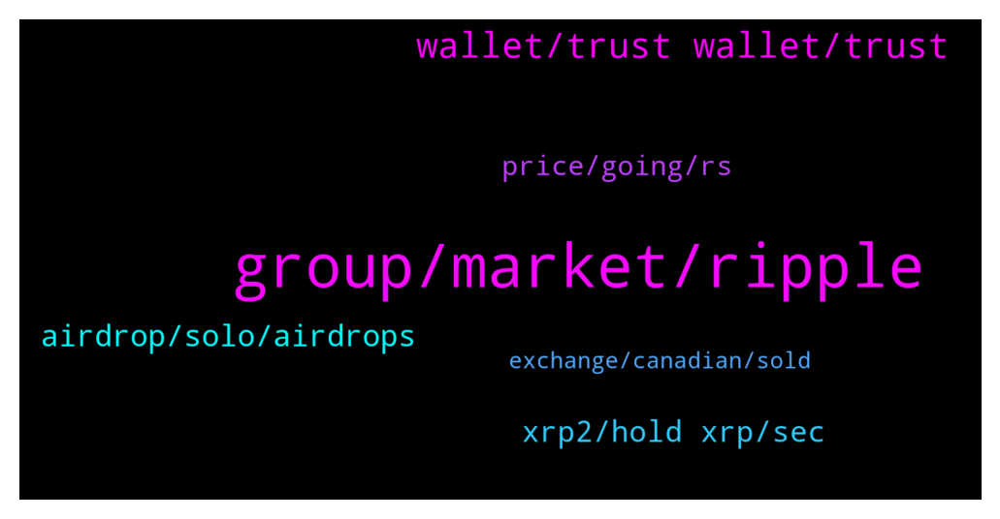

# **@Ripple**
 ## Analysis for **2021-12-15** - **2021-12-16**.

---

## 📊 **Basic Stats**

**n_messages_sent**: 224

---

---

## 🔝 **Top keywords and related messages**

1. **group, market, ripple**

    @cyrilfielding --- *What can you advice me on then* **--->** [TG Discussion](https://t.me/Ripple/3022910)

    @AROpitz --- *In my opinion, it’s already closed. All of them only waiting for the best time to publish. If they announce it before Christmas 🎄 it can destroy some families, in case of SEC won. In case ripple is King (won) so Christmas can be really good for some families… so let’s pray for a wonderful Christmas 🎄* **--->** [TG Discussion](https://t.me/Ripple/3023068)

    @Brian --- *Question on your opinions...  Do you guys think the trial ends by 1/14/22 since that's when expert discovery ends?  I heard somewhere that it's in the SEC's best interest to not let things get further than that.  Are they officially in the trial phase if they let that date go by without settling?  Thanks!* **--->** [TG Discussion](https://t.me/Ripple/3023063)

    @Decrypt_Crypt --- *Why the hell is all market red.btc is not that much down😅* **--->** [TG Discussion](https://t.me/Ripple/3022728)

    @JesusJames --- *Its called (XRP AIRDROPS ) on twitter* **--->** [TG Discussion](https://t.me/Ripple/3022960)

    @Tinkabellagal --- *Beginning is cool to watch 😃* **--->** [TG Discussion](https://t.me/Ripple/3022636)

2. **wallet, trust wallet, trust**

    @hamzaalqaisi80 --- *I want to add on trust wallet* **--->** [TG Discussion](https://t.me/Ripple/3022618)

    @Big_pumping --- *Hi guys quick question can I send xrp from trust wallet to my xrp binance wallet* **--->** [TG Discussion](https://t.me/Ripple/3022234)

    @JesusJames --- *never connect your wallet to anything like that its a scam* **--->** [TG Discussion](https://t.me/Ripple/3022858)

    @Hendrikhaverkamp22 --- *Hold on ledger and bit hot wallet* **--->** [TG Discussion](https://t.me/Ripple/3022753)

    @lnnovate --- *I would use exodus or a hardware wallet for the best* **--->** [TG Discussion](https://t.me/Ripple/3022246)

    @Top_of_mind --- *nice, but there is no ice in the wallet* **--->** [TG Discussion](https://t.me/Ripple/3022346)

3. **airdrop, solo, airdrops**

    @Tinkabellagal --- *Not eligible for solo snapshot and others To get airdrops* **--->** [TG Discussion](https://t.me/Ripple/3022574)

    @Riiggo --- *Do you know what the ratio is xrp to solo for the airdrop?* **--->** [TG Discussion](https://t.me/Ripple/3022580)

    @Wild Born --- *Will binance holders receive xrp airdrop* **--->** [TG Discussion](https://t.me/Ripple/3023030)

    @Agtryap --- *Solo airdrop xrp holder, solo 4$ now  ratio 1:1. Xrp moon soon* **--->** [TG Discussion](https://t.me/Ripple/3022629)

    @Jake_ripple_XRP --- *100's of airdrops for XRP hodlers? Is there a list somewhere and any danger in using ToolKit with any?* **--->** [TG Discussion](https://t.me/Ripple/3022957)

    @MyWii --- *hi i have signed up Bitrue and moved my xrp there. is that all i need do to receive the solo airdrop or do i need do anything else? thx in advance for any pointers.* **--->** [TG Discussion](https://t.me/Ripple/3022678)

4. **xrp2, hold xrp, sec**

    @LeonVi73 --- *no Binance uses XRP bep2 and Binance-Peg XRP* **--->** [TG Discussion](https://t.me/Ripple/3022240)

    @Tinkabellagal --- *Afaik But it’s not xrpl xrp It’s bep 20* **--->** [TG Discussion](https://t.me/Ripple/3022569)

    @specialpatrolgroup --- *Xrp2 is scammy. I’d not touch it for a while.* **--->** [TG Discussion](https://t.me/Ripple/3022377)

    @Hendrikhaverkamp22 --- *Need xrp to flyy and retire🤣✌* **--->** [TG Discussion](https://t.me/Ripple/3022771)

    @ahmed1137867 --- *if i hold xrp in enchange also i wont be eligible right* **--->** [TG Discussion](https://t.me/Ripple/3022576)

    @Top_of_mind --- *xrp2 does not exist, there is only one xrp and it is # 1* **--->** [TG Discussion](https://t.me/Ripple/3022401)

5. **price, going, rs**

    @AROpitz --- *XRP Price is going back to 0,006€  Many investors (family) will loss money. Think about thanksgiving* **--->** [TG Discussion](https://t.me/Ripple/3023070)

    @JesusJames --- *nothing is going on Xrp is moving with the Market as it should be everything is just fine* **--->** [TG Discussion](https://t.me/Ripple/3022896)

    @Ghost_shell --- *Hoping to see xrp near 100 rs soon* **--->** [TG Discussion](https://t.me/Ripple/3023270)

    @Ghost_shell --- *Xrp has hold up the prices near 60 rs remarkably* **--->** [TG Discussion](https://t.me/Ripple/3023264)

    @Luuquyquang --- *Xrp ico price ?  Thanks 😍* **--->** [TG Discussion](https://t.me/Ripple/3022567)

    @Mir --- *Guy i want to buy more Xrp .. in usa .. please let me know where* **--->** [TG Discussion](https://t.me/Ripple/3022273)

6. **exchange, canadian, sold**

    @Pahlavimohammadreza --- *Canadian exchange deletes xrp. Do they know something we do not know? Has xrp failed and does a Canadian exchange want to protect its investors? What is the matter? I have put all my assets in xrp.  Please tell me if anyone knows anything. Should we sell and get out? Do xrp owners think of small shareholders?🤔🤔I'm very worried.* **--->** [TG Discussion](https://t.me/Ripple/3023127)

    @Bharani2Dharan --- *Most xrp holders sold because of canadian platforms delisted xrp* **--->** [TG Discussion](https://t.me/Ripple/3022814)

    @Pahlavimohammadreza --- *The court ruling will be announced on January 14 to January 19. The Canadian exchange office has given users the opportunity to remove xrp from the exchange office until January 13 (before the court ruling). This is ridiculous.😠* **--->** [TG Discussion](https://t.me/Ripple/3023130)

    @Msmsms12345 --- *Hii guys is it true exchange are delisting xrp...? Is it possible* **--->** [TG Discussion](https://t.me/Ripple/3022649)

    @WallStreetCRYPTO7527 --- *An exchange needs to have liquidity when xrp moons - this was a super small exchange. Second, Ripple is not going to want paper hands involved in the liquidity hub. I predict they will remove xrp from all exchanges and convince some people to trade for songbird, flare etc.* **--->** [TG Discussion](https://t.me/Ripple/3023243)

    @laugavlagar --- *I wouldn’t worry about Canadian exchanges delisting anything. You can still buy, trade xrp on all big exchange and wallets outside of us and canada. If Europe or Asia start delisting then start worrying but unlikely that will happen* **--->** [TG Discussion](https://t.me/Ripple/3023132)

