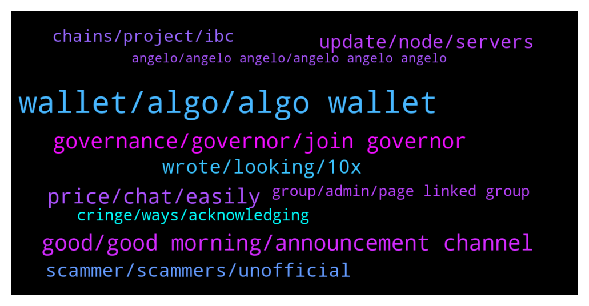

# **@algorand**
 ## Analysis for **2021-12-15** - **2021-12-16**.

---

## 📊 **Basic Stats**

**n_messages_sent**: 287

---

---

## 🔝 **Top keywords and related messages**

1. **wallet, algo, algo wallet**

    @MackDenver --- *Hey X Y, the mobile wallet is having some syncing issues, we are working on fixing it. Your balance is in the right place just not updated* **--->** [TG Discussion](https://t.me/algorand/322093)

    @OGPoorMan --- *when i use my algo wallet it says failed transaction try again later* **--->** [TG Discussion](https://t.me/algorand/322474)

    @OGPoorMan --- *when i use the algorand wallet it doesn't give errors. i confirm and nothing happens.* **--->** [TG Discussion](https://t.me/algorand/322472)

    @chassoux --- *Hi guys, I’ve send my USDT from KuCoin to Algorand Wallet, now I can see my USDT on AlgoExplorer and on Tinyman, but not in my Wallet. Any ideas? I have enough ALGO in my Algorand Wallet and I’ve clicked on Add new asset and then Approve, but USDT just won’t show* **--->** [TG Discussion](https://t.me/algorand/322092)

    @Ruckies --- *anyone's official algo wallet not updating number of coins after a swap?* **--->** [TG Discussion](https://t.me/algorand/322008)

    @Y12_D --- *Hi all, when I want to withdraw ALGO tokens from myalgo wallet I see "Remaining balance below minimum required" how much I need to save the minimum on it?* **--->** [TG Discussion](https://t.me/algorand/322131)

2. **good, good morning, announcement channel**

    @MackDenver --- *Please make sure to stay safe and report them all.* **--->** [TG Discussion](https://t.me/algorand/322101)

    @Rev Okereke --- *Good morning good people in the platform. I am new here and am from West Africa, precisely a Nigeria. Thanks so much* **--->** [TG Discussion](https://t.me/algorand/321849)

    @Manuel --- *Does anyone here have the Phone of privat Jet 🤩😂* **--->** [TG Discussion](https://t.me/algorand/321742)

    @MackDenver --- *Good day, guys! How is everyone doing today?* **--->** [TG Discussion](https://t.me/algorand/321933)

    @OGPoorMan --- *are you messaging me DM right now?* **--->** [TG Discussion](https://t.me/algorand/322478)

    @Pillonina --- *Hello, I found out that you cooperate with Defactor?* **--->** [TG Discussion](https://t.me/algorand/322020)

3. **governance, governor, join governor**

    @jumpfetus --- *looking forward to just putting everything into governance and not worrying about yieldly anymore* **--->** [TG Discussion](https://t.me/algorand/322334)

    @angelo9007 --- *hi there, here is some information about Governance https://algorand.foundation/gov-faq* **--->** [TG Discussion](https://t.me/algorand/321822)

    @Prash_Agarwal --- *Hello...am i allowed to join the governor program now even though i did not join as a governor in the 1st program... ?* **--->** [TG Discussion](https://t.me/algorand/321795)

    @MackDenver --- *Participants who have committed their $ALGO for the governance, they will receive their rewards.* **--->** [TG Discussion](https://t.me/algorand/322451)

    @MackDenver --- *Hello there,  Governance rewards will be distributed before the end of Q1, 2022.* **--->** [TG Discussion](https://t.me/algorand/322449)

    @Jasperow --- *How about the reward for the last governance* **--->** [TG Discussion](https://t.me/algorand/322430)

4. **price, chat, easily**

    @Tiny_Philosopher_784 --- *So you're saying take the next comment to the price chat* **--->** [TG Discussion](https://t.me/algorand/322287)

    @chassoux --- *I don’t really mind, it means supply is cut off, bullish news* **--->** [TG Discussion](https://t.me/algorand/322285)

    @AHMAD --- *I want to talk to the charge and not with the curious* **--->** [TG Discussion](https://t.me/algorand/321643)

    @MackDenver --- *Let's take the trading chat to @algorand_price please, everyone.* **--->** [TG Discussion](https://t.me/algorand/322517)

    @Yooper_5 --- *If you want to speculate on prices, there’s another chat for that.* **--->** [TG Discussion](https://t.me/algorand/321668)

    @cutesy_irrefragability --- *it can easily cross $4 by the end of this year* **--->** [TG Discussion](https://t.me/algorand/322510)

5. **wrote, looking, 10x**

    @pabloyabo --- *It is unrelated; it was a bug that we think it was there for a while but we need to confirm it* **--->** [TG Discussion](https://t.me/algorand/322340)

    @hostodi --- *This is a certified hood classic* **--->** [TG Discussion](https://t.me/algorand/322545)

    @belgentino --- *I m gonna have to torn my flat down and try to find it* **--->** [TG Discussion](https://t.me/algorand/322421)

    @R --- *Interesting - tinyman looks like more what I am looking for* **--->** [TG Discussion](https://t.me/algorand/322190)

    @R --- *Has anyone been able to find it? Is it purchasable?* **--->** [TG Discussion](https://t.me/algorand/322186)

    @MackDenver --- *Hello there, where did you find it?* **--->** [TG Discussion](https://t.me/algorand/322022)

6. **scammer, scammers, unofficial**

    @Kmw81 --- *Becareful lot of scammers . But there is one unofficial for discussion @algorand_price* **--->** [TG Discussion](https://t.me/algorand/321847)

    @chassoux --- *And asking this question has attracted so many scammers it’s unbelievable* **--->** [TG Discussion](https://t.me/algorand/322099)

    @Leugim_21 --- *Careful with someone sending you Direct Messages, those are Scams, Bots, Pretexters, please ignore.* **--->** [TG Discussion](https://t.me/algorand/321875)

    @R --- *Dont talk to anyone outside the chat . They are yahoo naija odogwu scammers* **--->** [TG Discussion](https://t.me/algorand/322405)

    @sfin_sf --- *use an exchange, you’re asking to get scam DM’s with a message like that* **--->** [TG Discussion](https://t.me/algorand/322355)

    @Pablo_cast --- *As I read in twitter time ago... Hipsters calling himselves code artisans that write code in Starbucks with a MacBook using sublime text with a .io domain* **--->** [TG Discussion](https://t.me/algorand/322162)

7. **update, node, servers**

    @letrungka --- *I expect that you update a bout technology, many peopole here consisering it* **--->** [TG Discussion](https://t.me/algorand/322459)

    @minimalist_stranger --- *Any Algorand admin here? Maybe something should be up as a pinned message to reassure the community about the “glitches” in the ecosystem.  Yieldly ambassador/admin mentioned something about node issues. Probably good to get ahead of it and update the community here and on Reddit (have you seen the panicky posts?)* **--->** [TG Discussion](https://t.me/algorand/322351)

    @Leugim_21 --- *Alright, so algorand is bouncing, due to nature of what you are explaning migrating servers, I wish you could alert us ahead, due to nature of investments and so on.* **--->** [TG Discussion](https://t.me/algorand/322330)

    @pabloyabo --- *We are migrating part of the infrastructure, and we are changing servers every day. We plan to migrate from Algorand Indexer and Algorand Node APIs to our own to scale better all the infrastructure; that is why we are changing things constantly lately. We expect to solve these issues soon.* **--->** [TG Discussion](https://t.me/algorand/322320)

    @MackDenver --- *Try reloading the app and make sure you are using the latest version* **--->** [TG Discussion](https://t.me/algorand/322042)

    @MackDenver --- *We will post any new updates on our technology once we have them. We are already working on a few things in the background* **--->** [TG Discussion](https://t.me/algorand/322460)

8. **chains, project, ibc**

    @MackDenver --- *Hey Yozza, I'm not sure what are you talking about. Algorand and Stellar are different blockchain in the crypto space.* **--->** [TG Discussion](https://t.me/algorand/322448)

    @patrick_crypto --- *As I recall, IBC is still having things use Tendermint and Atom..  so you can have ‘other’ chains make use of Cosmos/IBC. Algorand co-chains should just use Algorand consensus.* **--->** [TG Discussion](https://t.me/algorand/322213)

    @zechuzu --- *sorry want to ask, is algorand creating sign on stellar?* **--->** [TG Discussion](https://t.me/algorand/322439)

    @LifeMachine4 --- *Thanks for the info. I guess I wasn't sure how exactly a CO-Chain passes state info to the main chain as I thought Co-chains might have a different consensus mechanism than Algorand main chains.  While it's indeed true that IBC is most utilized by Tendermint Core chains, IBC is a chain agnostic generalizable communication standard designed for cross-chain communication between modern fast-finality BFT chains.  Will be interesting to learn more about Co-Chains as things progress.* **--->** [TG Discussion](https://t.me/algorand/322217)

    @zZeoneo --- *Hi friends, I'm a big fan of the ALGORAND project and I've been studying a lot about it. I was recently researching more about the project and I heard some rumors that this will have a partnership with the Atom cosmos network, I was very interested in this news, because it seems this cosmos network is an old project but it has only just started to interconnect all blockchains . I would like to know from you, what is your opinion? Because if this partnership really happens, it will be fascinating to see our project interconnecting with all blockchains through this Atom cosmos project. What do you think?* **--->** [TG Discussion](https://t.me/algorand/322532)

    @LifeMachine4 --- *Anyone know what the communication mechanism/protocol is between hypothesized Algorand Co-Chains? Also, given the fast finality properties of Algorand, are there any plans or talks for Algorand to utilize IBC as a standard interblockchain/co-chain communication protocol/standard?* **--->** [TG Discussion](https://t.me/algorand/322212)

9. **cringe, ways, acknowledging**

    @juquinbu --- *It is, sadly, a very common human trait.* **--->** [TG Discussion](https://t.me/algorand/322544)

    @leupagus --- *Cringe. Creepy. Disturbing. Inappropriate. All the same.* **--->** [TG Discussion](https://t.me/algorand/321903)

    @Leugim_21 --- *I'm old enough to say that word 'cringe' changed the whole internet way of describe how they feel* **--->** [TG Discussion](https://t.me/algorand/321902)

    @Leugim_21 --- *I have to agree in many ways, the feelings problem, the cancel culture, people are getting fed up of all that. There are better ways to check on the whole picture, but we can't be THAT cold either, this is Algorand let's have fun.* **--->** [TG Discussion](https://t.me/algorand/321894)

    @leupagus --- *I don't know. Wasn't here earlier. But some of the stuff that comes out is super cringe.* **--->** [TG Discussion](https://t.me/algorand/321901)

    @leupagus --- *If anything they're just connecting all the dots* **--->** [TG Discussion](https://t.me/algorand/321645)

10. **group, admin, page linked group**

    @ChadDadd --- *Is this the official algo group on TG? I found another one as well.* **--->** [TG Discussion](https://t.me/algorand/321838)

    @Tim --- *Can you unblock me from that group? Never been able to join...* **--->** [TG Discussion](https://t.me/algorand/322518)

    @ChadDadd --- *Yes the website link brought me here but I found a different group on TG with same name.* **--->** [TG Discussion](https://t.me/algorand/321845)

    @Kmw81 --- *Which page linked you to the other group . If you check official website this is the group* **--->** [TG Discussion](https://t.me/algorand/321844)

    @ChadDadd --- *I figured because the page linked me but the other group has more members so I wanted to ask.* **--->** [TG Discussion](https://t.me/algorand/321841)

    @MackDenver --- *Yes, there is a Chinese group  https://t.me/AlgorandFoundationCN* **--->** [TG Discussion](https://t.me/algorand/322045)

