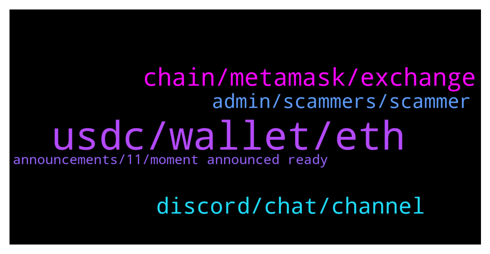

# **@avalancheavax**
 ## Analysis for **2021-12-15** - **2021-12-16**.

---

## 📊 **Basic Stats**

**n_messages_sent**: 324

---

---

## 🔝 **Top keywords and related messages**

1. **usdc, wallet, eth**

    @Stage5Financial --- *Best place to earn interest on USDC in the avalanche ecosystem? What kind of APRs can I get?* **--->** [TG Discussion](https://t.me/avalancheavax/313865)

    @AlessandroPap --- *Can someone give me some testnet avax? Got nonce too low from this faucet https://faucet.avax-test.network/ and now i can't retry...* **--->** [TG Discussion](https://t.me/avalancheavax/313590)

    @Albert --- *Oh so Avalanche is using the Ethereum network? Now it makes sense.* **--->** [TG Discussion](https://t.me/avalancheavax/313510)

    @euroog --- *Might I suggest you jump into the Orca telegram and ask these questions? You can borrow to the limit of the LTV. If your borrow percent increase above the LTV because of decrease in price of your collateral you get partially liquidated. You can borrow as little as you want. The only restriction is that you can max borrow up to the percentage specified by the LTV, eg. 70%. Each vault states the LTV so you can see what you maximally can borrow.  YieldYak is the only platform whose interestbearing token receipts can be deposited into Orca. Here's a video on it, but they've added more vaults since it was published: https://youtu.be/zft6CenpjAU* **--->** [TG Discussion](https://t.me/avalancheavax/313477)

    @oathtobarbatos --- *Please, move any price discussion to the trading group. https://t.me/avalanche_trading* **--->** [TG Discussion](https://t.me/avalancheavax/313726)

    @cresuss --- *"AVAXLAND"  Avaxland is the first ever City Builder play-to-earn on the Avalanche blockchain! 🔺 Have you always dreamed of being Emin Gün Sirer's neighbor? It will soon be possible!  Support an Avalanche Community project with a unique business model, which aims to democratize play-to-earn games. 💵 Join us on our social networks to learn more about the world of Avaxland and participate in the first sale of houses (NFTs) from the unique "Founder's Edition" collection that will take place on Kalao. 🏤  Website: https://avaxland.io/  Twitter: https://twitter.com/Avaxland_game Telegram : https://t.me/avaxlandofficial  Discord : https://discord.gg/Bndeqj4aPA* **--->** [TG Discussion](https://t.me/avalancheavax/313501)

2. **chain, metamask, exchange**

    @Nicolas_A --- *wallet.avax.network for X and P chain. If you just want to interact with dapps you can simply use Metamask* **--->** [TG Discussion](https://t.me/avalancheavax/313988)

    @Koolblade --- *If an exchange can support to receive or send C Chain to AVAX wallet, I can just use this C Chain address instead of X Chain available?  It will save time to change from X chain to C Chain in AVAX wallet, yeah?* **--->** [TG Discussion](https://t.me/avalancheavax/313933)

    @blue sky --- *I'm newbie... Can you please explain about using the chains* **--->** [TG Discussion](https://t.me/avalancheavax/313538)

    @diov0 --- *if a cex accepts c-chain then ypu just send from your metamask and done* **--->** [TG Discussion](https://t.me/avalancheavax/313936)

    @Koolblade --- *Hi, what is the difference of X chain and C chain?  Can I send AVAX funds from any exchange to C chain in AVAX wallet?* **--->** [TG Discussion](https://t.me/avalancheavax/313916)

    @JimWelder --- *C-Chain is for smart contract - used in defi platform (C for Contract). X-chain is used in eXchanges where AVAX is traded.* **--->** [TG Discussion](https://t.me/avalancheavax/313920)

3. **discord, chat, channel**

    @Nicolas_A --- *? Not sure I understand what you are asking* **--->** [TG Discussion](https://t.me/avalancheavax/314011)

    @Nicolas_A --- *Have to ask in the wonderland socials* **--->** [TG Discussion](https://t.me/avalancheavax/314103)

    @nguyenkt96 --- *I want to follow the channel so I don't miss the events, not group chat* **--->** [TG Discussion](https://t.me/avalancheavax/314029)

    @Benspi222 --- *Hi how can go to discord ? i try to go and a have direct banned …* **--->** [TG Discussion](https://t.me/avalancheavax/313390)

    @Nicolas_A --- *Enabling stickers in a channel with 40k members isn’t the best idea but there are plenty of stickers about Avalanche* **--->** [TG Discussion](https://t.me/avalancheavax/313741)

    @Benspi222 --- *@Nicolas_A Hello can i you ask something in DM* **--->** [TG Discussion](https://t.me/avalancheavax/313544)

4. **admin, scammers, scammer**

    @Benspi222 --- *Is almost impossible to know who is a admin 😂 so many scammer here* **--->** [TG Discussion](https://t.me/avalancheavax/313578)

    @unclebossman --- *Scammers, don't even bother dm'ing me or calling me lmao* **--->** [TG Discussion](https://t.me/avalancheavax/313471)

    @Johnstonekina --- *Be very careful mate, the admin would never dm you….* **--->** [TG Discussion](https://t.me/avalancheavax/313577)

    @Darius --- *So what do you think? Is it legit? Or another scam coin?* **--->** [TG Discussion](https://t.me/avalancheavax/313661)

    @Nicolas_A --- *And in this group you just have to look for the admin tag* **--->** [TG Discussion](https://t.me/avalancheavax/313580)

    @Johnstonekina --- *You wouldn’t get a dm from the admin, you can only contact him from the members board…i guess* **--->** [TG Discussion](https://t.me/avalancheavax/313581)

5. **announcements, 11, moment announced ready**

    @PatrickSutton --- *Ser, pls. All those announcements in last week. Brain is 💩  Also, John Wu on Yahoo finance TV today at 11:45 am et. Little PR peak for the community* **--->** [TG Discussion](https://t.me/avalancheavax/314055)

    @Nicolas_A --- *Well technically speaking 👉👈 it got "leaked" in the morning therefore it's a few hours past 7 days 😛* **--->** [TG Discussion](https://t.me/avalancheavax/314054)

    @Nicolas_A --- *It will be the same format* **--->** [TG Discussion](https://t.me/avalancheavax/313974)

    @Viro --- *Has yet to be released I believe* **--->** [TG Discussion](https://t.me/avalancheavax/313967)

    @Nicolas_A --- *I don't know when it will be ready* **--->** [TG Discussion](https://t.me/avalancheavax/313574)

    @Michael --- *I’m gonna have to figure it out  thanks* **--->** [TG Discussion](https://t.me/avalancheavax/313485)

