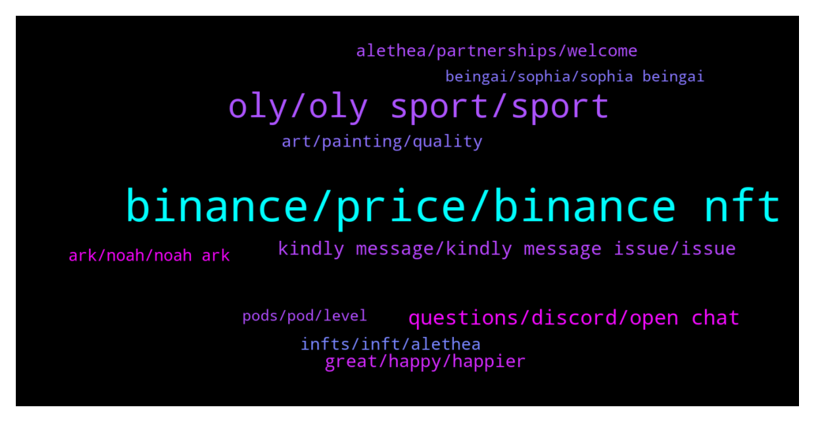

# **@binancenfts**
 ## Analysis for **2021-12-15** - **2021-12-16**.

---

## 📊 **Basic Stats**

**n_messages_sent**: 481

---

---

## 🔝 **Top keywords and related messages**

1. **binance, price, binance nft**

    @VishalS71244724 --- *How to get creater on binance nft marketplace* **--->** [TG Discussion](https://t.me/binancenfts/410220)

    @Marek733 --- *on twitter is this: Buy $BNFT now Min 0.35 $BNB & Get 5 $BNB* **--->** [TG Discussion](https://t.me/binancenfts/410292)

    @ChibiMaya_bnb --- *tomorrow we will know, it is auction, so it depends on how much people wants to spend for one, but as only 20 a day, 100 total, 1/1... it will be high cost but high value too. check tomorrow on web.* **--->** [TG Discussion](https://t.me/binancenfts/409520)

    @markfrog2000 --- *Hi guys) who can help me with some advise about NFT,please DM me.* **--->** [TG Discussion](https://t.me/binancenfts/409492)

    @Baleemann --- *And WonderHero NFT hasn't been distributed also* **--->** [TG Discussion](https://t.me/binancenfts/410015)

    @rajpatil_5008 --- *Sir how can i transfer nft to binance* **--->** [TG Discussion](https://t.me/binancenfts/409476)

2. **oly, oly sport, sport**

    @anh27032 --- *Do you think you can provide jobs to the unemployed in the future? Can they make a living from Oly sport #OLYSPORT* **--->** [TG Discussion](https://t.me/binancenfts/410156)

    @Teherabyaya --- *Any player can participate in the 12-horse races? Or any requirement?What are the advantages of OLY Sport owning a LAND?#OLYSPORT* **--->** [TG Discussion](https://t.me/binancenfts/410122)

    @Vipinkhadase --- *Can you please tell us about the Breeding mechanism of Oly Sport? What do users need to be able to breed their NFTs? How many do we have to hold and what specific should NFTs have? Can same NFTs be used multiple times for breeding or only once? #OLYSPORT* **--->** [TG Discussion](https://t.me/binancenfts/410127)

    @borsha3 --- *Can it be cared for like a normal horse? Is there feed for horse?#OLYSPORT* **--->** [TG Discussion](https://t.me/binancenfts/410151)

    @Anon905 --- *@Kenikky when WIN NFT HORSE AMA reward distribute ? Please distribute 😭😭😭😭* **--->** [TG Discussion](https://t.me/binancenfts/410008)

    @jimmy_olysport --- *Really no one is attempting to build out a game in the scope that we are envisioning.  Especially as a metaverse where virtual land is backed by real land - we are the first NFT game to do this globally.  But we do have other contenders in the horse racing eSport field.  However - again - this is like comparing the tip of the iceberg with the iceberg itself, as eSport horseracing is just 1 pillar of our gaming mechanics.  This article summarizes our competitive advantage well: https://sports.yahoo.com/horse-racing-metaverse-expands-startup-140009621.html* **--->** [TG Discussion](https://t.me/binancenfts/410056)

3. **questions, discord, open chat**

    @cybersomeone --- *hey all, super jazzed to be here and answer any questions you may have!* **--->** [TG Discussion](https://t.me/binancenfts/409199)

    @Kenikky --- *So we will now open up the chat for everyone to write their questions. @Metavurse could you reply to your favourite ones?* **--->** [TG Discussion](https://t.me/binancenfts/409195)

    @alex_olysport --- *and I guess that's it for the 5 questions!* **--->** [TG Discussion](https://t.me/binancenfts/410167)

    @Kenikky --- *Ok guys, reply to your favourite questions 🙂* **--->** [TG Discussion](https://t.me/binancenfts/410159)

    @Kenikky --- *Ok, get ready for the flood of questions haha* **--->** [TG Discussion](https://t.me/binancenfts/409204)

    @Kenikky --- *Get your questions ready. I will open the chat only for 1 minute. And add at the end of the question #OLYSPORT* **--->** [TG Discussion](https://t.me/binancenfts/410086)

4. **kindly message, kindly message issue, issue**

    @Sahib_BNB --- *@Ahmedvo112 , 🚫Dont DM me , kindly message here your issue ⚠️* **--->** [TG Discussion](https://t.me/binancenfts/409643)

    @Sahib_BNB --- *@Jaden25 , 🚫Dont DM me , kindly message here your issue ⚠️* **--->** [TG Discussion](https://t.me/binancenfts/408789)

    @Kenikky --- *⚠️ATTENTION: Please, don´t panic, you´re not muted nor banned. ⚠️* **--->** [TG Discussion](https://t.me/binancenfts/410033)

    @NftCollector09 --- *Just discuss it via DM, don't discuss it here Afraid of getting spam* **--->** [TG Discussion](https://t.me/binancenfts/409142)

    @Sahib_BNB --- *@guterman077 , 🚫Dont DM me , kindly message here your issue ⚠️* **--->** [TG Discussion](https://t.me/binancenfts/409059)

    @cryptoworld1222 --- *sorry im speak only english this* **--->** [TG Discussion](https://t.me/binancenfts/408914)

5. **great, happy, happier**

    @hamzazafar7 --- *i think everyone fine n happy being here* **--->** [TG Discussion](https://t.me/binancenfts/409532)

    @Kenikky --- *That's amazing, i'll check it out* **--->** [TG Discussion](https://t.me/binancenfts/409166)

    @Kenikky --- *Happy to have you here 🙂* **--->** [TG Discussion](https://t.me/binancenfts/409536)

    @koalasu --- *Im so glad my question was answered, love has no limitations! 🌈❤* **--->** [TG Discussion](https://t.me/binancenfts/409339)

    @Kenikky --- *Was great having you with us* **--->** [TG Discussion](https://t.me/binancenfts/409303)

    @Kenikky --- *it's great to have you with us* **--->** [TG Discussion](https://t.me/binancenfts/409151)

6. **art, painting, quality**

    @Buriza --- *The object is tied to a physical painting, if you buy NFT - you can contact me and write the address to which the original painting will be sent, with the artist's signature and New Year's greetings!* **--->** [TG Discussion](https://t.me/binancenfts/409853)

    @goodnightunderworld --- *A unique painting, painted from scratch during the year, is available in a single copy* **--->** [TG Discussion](https://t.me/binancenfts/409798)

    @plutoniumgame --- *I applied, but I don't think anyone even looked at it! We have enough variety, already drawing the second pack of characters!* **--->** [TG Discussion](https://t.me/binancenfts/408849)

    @plutoniumgame --- *I sent a request for our digital art, nft, but no response, why binans placed all sorts of pixel geeks but not respond to a really good project?* **--->** [TG Discussion](https://t.me/binancenfts/408832)

    @goodnightunderworld --- *The painting is already waiting for its place in some private collection of a connoisseur of real art 🙏🏻* **--->** [TG Discussion](https://t.me/binancenfts/409808)

    @Dark_Axe777 --- *m ready to pay i need a good artist who can create high quality art* **--->** [TG Discussion](https://t.me/binancenfts/409587)

7. **alethea, partnerships, welcome**

    @Kenikky --- *It's a really exciting project with some interesting tech behind it* **--->** [TG Discussion](https://t.me/binancenfts/409154)

    @ahsiT03 --- *What are the project plans and the stages for their realization?#AletheaAI* **--->** [TG Discussion](https://t.me/binancenfts/409259)

    @gau3732 --- *Will there be some kind of curation on Alethea's part to prevent misuse? And if so will it be by some kind of DAO?  OpenAI seems to have a strong stand on limiting access to approved customers and use cases...I am wondering where Alethea Will stand on this?#AletheaAI* **--->** [TG Discussion](https://t.me/binancenfts/409219)

    @plutoniumgame --- *Remove, quality project... Leave this... and be at ease with a sense of accomplishment :)* **--->** [TG Discussion](https://t.me/binancenfts/408840)

    @Black4_L --- *S@Metavurse  Welcome   🙂   I just scanned through your website, could this therefore mean that any nft outside Alethea can be migrated to Alethea and trained towards AI intelligence or just Alethea nfts or is that something on your roadmap.I’m very passionate about charity giving.Have u considered contributions to charities through your funds received from this project which I think is gonna be insanely successful* **--->** [TG Discussion](https://t.me/binancenfts/409214)

    @Kenikky --- *Can you please introduce your project and the problems you want to solve / Solutions you are proposing?* **--->** [TG Discussion](https://t.me/binancenfts/410043)

8. **infts, inft, alethea**

    @zeroman000 --- *what is  iNFTS means? #AletheaAI* **--->** [TG Discussion](https://t.me/binancenfts/409264)

    @Sonersonerx --- *What do you think about the future of INFTs?  Could this be the new trend? thanks for AMA* **--->** [TG Discussion](https://t.me/binancenfts/409228)

    @cocoteaaa --- *I’ve seen the collection of iNFTs in your website and I’m really amazed. Are there limited supplies of iNFTs? Does all of iNFTs have a unique intelligence or characteristic that won’t be present to other iNFTs? @Metavurse @cybersomeone #AletheaAI* **--->** [TG Discussion](https://t.me/binancenfts/409224)

    @Darkness221 --- *Hi, What can I do with iNFTs? Can I use it outside your platform?* **--->** [TG Discussion](https://t.me/binancenfts/409221)

    @Kenikky --- *So tell us more, What is an iNFT?* **--->** [TG Discussion](https://t.me/binancenfts/409161)

    @Metavurse --- *Fantastic question and the answer is yes, we have a very long-term roadmap and part of that is bringing all NFTs to life as an iNFT. We are adding new use-cases to current NFTs that exist on multiple chains, though we are ETH only right now.* **--->** [TG Discussion](https://t.me/binancenfts/409281)

9. **ark, noah, noah ark**

    @Metavurse --- *Here is an example of what you can currently do at Noah's Ark with one of our supported communities* **--->** [TG Discussion](https://t.me/binancenfts/409172)

    @petrichorcnr --- *I am amazed by your innovative project. In order to be a real and sustainable source of income in the future, will the artificial intelligence robots in the Noah's Ark ecosystem be able to design nft when they come to the stage of making their own decisions over time?Will they be able to write a music or movie script? @Metavurse* **--->** [TG Discussion](https://t.me/binancenfts/409241)

    @Abrahamhossain --- *Does it a play to earn game?Do we need to invest anything in the beginning to start playing this Noah's Ark?  Which category of players or gamers are you targeting?  #AletheaAI* **--->** [TG Discussion](https://t.me/binancenfts/409271)

    @Teherabyaya --- *I love the vibrancy and positivity of studio designers' work!   Do you have a picture of what the interior of your Noah’s Ark looks like?  Would love to know what kind of  work environment and creativity? #AletheaAI* **--->** [TG Discussion](https://t.me/binancenfts/409260)

    @Metavurse --- *Here is an video from Noah's Ark* **--->** [TG Discussion](https://t.me/binancenfts/409180)

    @Metavurse --- *Perfect Intro!  Noah’s Ark is Alethea’s Intelligent Metaverse. Noah’s Ark has a bold aim: to preserve and evolve the culture, stories and collective intelligence of the human species. You can visit Noah’s Ark by signing up on www.alethea.ai - you will automatically have a few credits so you can meet and start interacting with iNFTs today.* **--->** [TG Discussion](https://t.me/binancenfts/409165)

10. **pods, pod, level**

    @hamzazafar7 --- *If I’ve trained my Pod up with an amazing personality and don’t want to attach it to any NFT,  Can I sell it as is? @AltheaAl* **--->** [TG Discussion](https://t.me/binancenfts/409275)

    @Kenikky --- *How does train to earn work?* **--->** [TG Discussion](https://t.me/binancenfts/409171)

    @cybersomeone --- *@Ivar_Boneless3 this is our first collection of Generation 1 pods. Any pods sold in the future will be part of a different generation* **--->** [TG Discussion](https://t.me/binancenfts/409293)

    @mrSN321 --- *What do we get when we buy a Pod? And What can be done with a Pod? #AletheaAI* **--->** [TG Discussion](https://t.me/binancenfts/409270)

    @AndrewNG55945 --- *How does one upgrade their Pod from Level 1 Intelligence Level to Level 2 and Level 3 and so forth? #AletheaAI* **--->** [TG Discussion](https://t.me/binancenfts/409258)

    @Ivar_Boneless3 --- *Will there be more Pods in the future? When will you release the next batch?#AletheaAI* **--->** [TG Discussion](https://t.me/binancenfts/409250)

