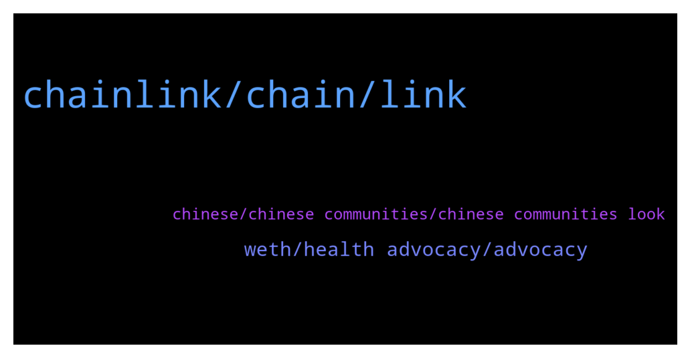

# **@chainlinkofficial**
 ## Analysis for **2021-12-15** - **2021-12-16**.

---

## 📊 **Basic Stats**

**n_messages_sent**: 180

---

---

## 🔝 **Top keywords and related messages**

1. **chainlink, chain, link**

    @nam_nguyenson --- *https://www.chainlinkecosystem.com/ecosystem/cryptomines/  CryptoMines integrated Chainlink VRF. It is not a partnership though just to clarify.* **--->** [TG Discussion](https://t.me/chainlinkofficial/355125)

    @SantiagoHernandezH --- *Hi everyone! Do any of you know the correct method of withdrawing LINK from my node after connecting the node wallet to Metamask? Everytime I try to move my links from the node to another wallet the nonce changes, the node is unable to update that nonce and then is unable to validate any subsequent transaction.* **--->** [TG Discussion](https://t.me/chainlinkofficial/355360)

    @EresDev --- *Hey Marc, I have added my contract twice on your keeper app for BSC testnet. Everytime it deducted 5 LINK tokens from owner, but there is nothing in "My upkeeps"* **--->** [TG Discussion](https://t.me/chainlinkofficial/355292)

    @Ravi_Sugarland --- *Actually I need to get in touch with BD team for Partnership. We need chain link support in our project* **--->** [TG Discussion](https://t.me/chainlinkofficial/355382)

    @MelkboerJan --- *Chainlink faucet is failing to send* **--->** [TG Discussion](https://t.me/chainlinkofficial/355169)

    @iamthekeeper --- *I know nothing so please can someone help me to understand how the LINK token is used? Is it used in running the network? I'm just wondering why the constantly growing adoption of Chainlink isn't reflected in the value of the token? Tnx* **--->** [TG Discussion](https://t.me/chainlinkofficial/355437)

2. **weth, health advocacy, advocacy**

    @spicystimuli --- *hey there! So you can either purchase 1, 3, or 10 DigiBudz, and the unit price decreases depending on the bundle. It is 0.06 wETH per Bud for 1 DigiBud, 0.05 wETH each for 3 DigiBudz, and 0.04 wETH each for 10 DigiBudz (plus a small gas fee in Matic)* **--->** [TG Discussion](https://t.me/chainlinkofficial/355565)

    @whitecryptocow --- *DigiBudz are truly unique creatures–there is nothing like them out there! The backstory: before the first spring blossom there was a secluded field of wildflowers that were tainted by radioactive byproducts from a secret underground lab run by crazy scientists experimenting with the forces of nature. When it was time for the flowers to bloom, out popped the DigiBudz!* **--->** [TG Discussion](https://t.me/chainlinkofficial/355536)

    @whitecryptocow --- *DigiBudz is a 10k generative NFT project dedicated to mental health advocacy. Our goal is for DigiBudz PFP’s be a symbol for those you can talk to without judgment. DigiBudz is a play on “digital buddiez” and we have grown our community through avenues such as twitter and discord. Some things we do to promote mental health advocacy includes our “Therapeutic Tuesday” twitter spaces, our “Real Talk” channel on discord, and we plan to donate 10 wETH to a community chosen charity focused on mental health advocacy after 75% of DigiBudz have been minted.* **--->** [TG Discussion](https://t.me/chainlinkofficial/355532)

    @whitecryptocow --- *Thanks for having us Marc. I'm Jonathan one of the Co-Founders and lead developers for DigiBudz.* **--->** [TG Discussion](https://t.me/chainlinkofficial/355526)

    @marcromeron --- *OK. How do I purchase DigiBudz?* **--->** [TG Discussion](https://t.me/chainlinkofficial/355576)

    @marcromeron --- *What is the best way for someone watching today to get started with DigiBudz?* **--->** [TG Discussion](https://t.me/chainlinkofficial/355563)

3. **chinese, chinese communities, chinese communities look**

    @侃币振华 --- *Is there a Chinese community group?* **--->** [TG Discussion](https://t.me/chainlinkofficial/355446)

    @marcromeron --- *Hi there, we do have several Chinese communities, please take a look here:      https://blog.chain.link/chainlink-chinese-communities/ (official)      https://t.me/chainlinkfans (unofficial)* **--->** [TG Discussion](https://t.me/chainlinkofficial/355519)

    @Linkederic --- *Hi there, we do have several Chinese communities, please take a look here:    https://blog.chain.link/chainlink-chinese-communities/ (official)    https://t.me/chainlinkfans (unofficial)* **--->** [TG Discussion](https://t.me/chainlinkofficial/355356)

    @nam_nguyenson --- *Hi there, we do have several Chinese communities, please take a look here:    https://blog.chain.link/chainlink-chinese-communities/ (official)    https://t.me/chainlinkfans (unofficial)* **--->** [TG Discussion](https://t.me/chainlinkofficial/355157)

    @lamntt --- *oh i cant find vietnamese community* **--->** [TG Discussion](https://t.me/chainlinkofficial/355116)

    @B4s3d --- *I'm no admin, but you're welcome. There should be a Vietnamese community as well that you can join if you want.* **--->** [TG Discussion](https://t.me/chainlinkofficial/355115)

