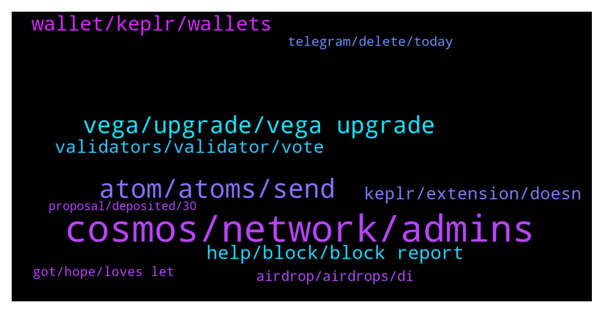

# **@cosmosproject**
 ## Analysis for **2021-12-15** - **2021-12-16**.

---

## 📊 **Basic Stats**

**n_messages_sent**: 654

---

---

## 🔝 **Top keywords and related messages**

1. **cosmos, network, admins**

    @UniLuk --- *Cosmos is so undervalued in relation to the hyped chains* **--->** [TG Discussion](https://t.me/cosmosproject/454273)

    @ZoltanAtom --- *Please join Cosmos nfts community and learn more!  https://t.me/CosmosNFTs* **--->** [TG Discussion](https://t.me/cosmosproject/454288)

    @RevolverZZ --- *I read it but can we use now the Gravity bridge?* **--->** [TG Discussion](https://t.me/cosmosproject/454149)

    @garisborfield --- *Hello cosmos - cronos bridge dont Work ?* **--->** [TG Discussion](https://t.me/cosmosproject/455042)

    @Armond --- *Does anyone know when exchanges are going to allow ATOM withdrawls again? I know the upgrade was completed yesterday* **--->** [TG Discussion](https://t.me/cosmosproject/454500)

    @mariosuperdigital --- *Don’t forget to join us for a Community Update on Twitter Spaces today and learn all about the First Cellars to Launch with @taariqlewis, @zakimanian and the Volume Data Science Team with @uniquedivine & @sunraghupathi!  ⏳ 09:30AM PST / 5:30PM UTC ✅ RSVP 👉 https://twitter.com/i/spaces/1djxXPmLjXzxZ* **--->** [TG Discussion](https://t.me/cosmosproject/454241)

2. **atom, atoms, send**

    @TicoJohnny --- *Hey there, if you need to buy ATOM, you could get it from multiple exchanges, such as Coinbase or Huobi, here is a full list of exchanges: https://messari.io/asset/cosmos/markets* **--->** [TG Discussion](https://t.me/cosmosproject/453748)

    @max --- *where can I stake ATOM ?* **--->** [TG Discussion](https://t.me/cosmosproject/455035)

    @xxbananas --- *lowe story of almost million atoms* **--->** [TG Discussion](https://t.me/cosmosproject/454402)

    @AtomJazz --- *Well you need around 0.005 ATOM for gas* **--->** [TG Discussion](https://t.me/cosmosproject/454482)

    @xxbananas --- *i am not talking about price, i hold atom since april 2019* **--->** [TG Discussion](https://t.me/cosmosproject/454334)

    @arthurparraga13 --- *In binance the atom network is suspended* **--->** [TG Discussion](https://t.me/cosmosproject/453772)

3. **vega, upgrade, vega upgrade**

    @Matt_Blocks_United --- *Yes, it's because they didn't update with Vega yesterday. We missed it too. Give them a break and please be patient. I'm sure they'll be back online soon. The update takes like an hour to install. Ours is in the process of updating.* **--->** [TG Discussion](https://t.me/cosmosproject/454225)

    @ZoltanAtom --- *Vega upgrade did happen on Cosmos Hub almost two days ago.Binance and other cexs should upgrade their systems/nodes! Unfortunately cexs do not pay attention and not make upgrade process faster.* **--->** [TG Discussion](https://t.me/cosmosproject/455018)

    @ZoltanAtom --- *Hi there, it’s because Of Vega Upgrade. You should contact Binance or Coinbase and ask them to this upgrade process.* **--->** [TG Discussion](https://t.me/cosmosproject/455011)

    @ZoltanAtom --- *Yes,unfortunately Binance still couldn’t finish or start Vega upgrade!* **--->** [TG Discussion](https://t.me/cosmosproject/455047)

    @AtomJazz --- *Upgrade has been completed 2 days ago. Everything is working flawlessly on our side* **--->** [TG Discussion](https://t.me/cosmosproject/454753)

    @AtomJazz --- *Wdym? Everything is back up after the Vega upgrade* **--->** [TG Discussion](https://t.me/cosmosproject/454339)

4. **wallet, keplr, wallets**

    @Umer148 --- *I tried 2 3 times but I can't send my cosmos from keplr wallet* **--->** [TG Discussion](https://t.me/cosmosproject/454884)

    @ZoltanAtom --- *If your funds are on cex, you should move your atoms to Keplr Wallet and start to stake them there. Here is link and step by step guide;   https://t.co/eSyDVJMFAD?amp=1  And a step by step guide: https://medium.com/chainapsis/how-to-use-keplr-wallet-40afc80907f6* **--->** [TG Discussion](https://t.me/cosmosproject/454227)

    @AtomJazz --- *Probably the problem with the wallet provider then. We had the Vega upgrade a couple of days ago and they probably didn't upgrade their infrastructure. I'd suggest you to import your mnemonic to Keplr or Cosmostation and start unbonding process there* **--->** [TG Discussion](https://t.me/cosmosproject/454842)

    @cristian_manta --- *yes, it's a question regarding my wallet actually. I'd rather prefer to discuss in private* **--->** [TG Discussion](https://t.me/cosmosproject/454117)

    @cynarix --- *From terra station to Terra wallet in Keplr* **--->** [TG Discussion](https://t.me/cosmosproject/454164)

    @Matt_Blocks_United --- *You are welcome to stake with our node at Blocks United.   You can find us and stake in Guarda, Rainbow, Trust Wallet, Ledger Live, Keplr and Cosmostation.   We have a great staking tutorial on our blog, with video that walks you through the process from beginning to end using Cosmostation and Keplr. There are instructions for Ledger Live in the post.  You can check it out here https://blocksunited.com/how-to-stake-cosmos-atom-tokens/  Let me know how else I can help.* **--->** [TG Discussion](https://t.me/cosmosproject/455083)

5. **help, block, block report**

    @Julián --- *Yeah somone with your name, b3 careful* **--->** [TG Discussion](https://t.me/cosmosproject/453806)

    @DaGetawayDriver --- *Don't have my seed phrase on me ATM haha* **--->** [TG Discussion](https://t.me/cosmosproject/455061)

    @ZoltanAtom --- *If someone dm to you.block and report it immediately!* **--->** [TG Discussion](https://t.me/cosmosproject/455060)

    @ZoltanAtom --- *Please in English or carry conversation to dm!* **--->** [TG Discussion](https://t.me/cosmosproject/455074)

    @ZoltanAtom --- *Hi, how can I help you ?* **--->** [TG Discussion](https://t.me/cosmosproject/454112)

    @ProfiVL --- *Good afternoon.  I cannot revoke delegation, who can help me?* **--->** [TG Discussion](https://t.me/cosmosproject/454836)

6. **validators, validator, vote**

    @Matt_Blocks_United --- *The Evmos airdrop rules are really vague. Regarding exclusions it says, "You have delegated a significant proportion of your tokens to centralized exchanges or 0% commission validators."  Normally it's large 0% commission nodes that are a problem. Not mom and pop shops like us, who are simply offering a promotion.   Every airdrop is different and they are allowed to make the rules. In general, 0% commission nodes are a huge problem for networks because they get too big, delegators are fickle and go with free, maybe not aware of the potential downside of staking with a 0% node.  The Shade airdrop excludes stakers with 0% commission nodes in the top 25 largest from receiving the airdrop bonus. Those delegators still receive the airdrop, but not the bonus.   Currently our Cosmos node is #127 so even though we're 0% commission for another 2 weeks, our delegators qualify to receive the Shade bonus.  Regarding Evmos, hopefully we'll receive it. I hope people post more specific information than what I found.* **--->** [TG Discussion](https://t.me/cosmosproject/454630)

    @UnityChaos --- *Kinda surprised by how many medium sized validators failed to do the upgrade and are now getting jailed... probably not a bad idea for everyone to check if the validators they delegate to are actually paying attention and upgrading, cuz if they're not you're missing out on rewards* **--->** [TG Discussion](https://t.me/cosmosproject/454195)

    @ZoltanAtom --- *For example cex validators are generally excluded from airdrops. The reason is for this cex validators are not contributing within Cosmos.* **--->** [TG Discussion](https://t.me/cosmosproject/453870)

    @ragnatela29 --- *Is it free yes? The vote* **--->** [TG Discussion](https://t.me/cosmosproject/455077)

    @ZoltanAtom --- *Hi there,I don’t know how to check past votes of validators. On Cosmoscan you can see their latest vote afaik. But you can easy check your votes on mintscan.* **--->** [TG Discussion](https://t.me/cosmosproject/454105)

    @Cordtus --- *Yes it's fine I've used it. You need to stake and vote to claim your full amount. Only stake 0.25 or so to save some for fees and for voting later.* **--->** [TG Discussion](https://t.me/cosmosproject/454921)

7. **keplr, extension, doesn**

    @EzioCrypto87 --- *Anyone having issues loggin on kpler or is it down* **--->** [TG Discussion](https://t.me/cosmosproject/453695)

    @garisborfield --- *I have keplr but i cant go on the Web with* **--->** [TG Discussion](https://t.me/cosmosproject/455007)

    @AtomJazz --- *Probably best to write to keplr support then https://keplr.crunch.help/* **--->** [TG Discussion](https://t.me/cosmosproject/454901)

    @EzioCrypto87 --- *Ok so i uninstalled keplr due to loggin issues but  now to relog how is it done.?* **--->** [TG Discussion](https://t.me/cosmosproject/453830)

    @Epikur --- *>>> If you have Android device, then you can try Keplr extension with Kiwi browser. But only thing doesn't work is delegating the coins. I am using it daily  >>> Nice! Wouldnt recommend it to new people tho hence there could be some compatibility issues and they would think that they are doing something wrong 🙂  >>> Yes, issues does exist.   1. You can't delegate to validator (it just doesn't show the tx confirmation modal)  2. Sometimes it opens extension tabs infinitely  3. .... maybe other  >>> Brave Android doesn't support extensions, just checked. Yandex does, but it doesn't work properly, Keplr extension UI messed up, unusable  ...  Just checked the Ungoogled Chrome with extensions, can't install the Keplr extension. Maybe browser version is outdated, it doesn't understand the new manifest version.   Opera Android doesn't support extensions too, so only variant left is Kiwi browser.* **--->** [TG Discussion](https://t.me/cosmosproject/454231)

    @garisborfield --- *Hello how to configure with metamask or navigate with Keplr ?* **--->** [TG Discussion](https://t.me/cosmosproject/455005)

8. **airdrop, airdrops, di**

    @perry11741 --- *OK thanks - how much is airdrop ?* **--->** [TG Discussion](https://t.me/cosmosproject/454940)

    @Gonzalez --- *How can I join the airdrop please?* **--->** [TG Discussion](https://t.me/cosmosproject/454696)

    @Prometheus_Zeus --- *I am not sure if this is legit, even in the Juno Chat they have no idea about this two Airdrops ..* **--->** [TG Discussion](https://t.me/cosmosproject/454563)

    @Prometheus_Zeus --- *is someone from thre Team familar with the Moneta Airdrop and the FOT Airdrop?* **--->** [TG Discussion](https://t.me/cosmosproject/454543)

    @AustrianSchoolB --- *My airdrop is dead basically if I can’t find someone to send some dust? 🙈* **--->** [TG Discussion](https://t.me/cosmosproject/454030)

    @Epikur --- *Shade Airdrop, Game airdrop, Bostrom airdrop* **--->** [TG Discussion](https://t.me/cosmosproject/453964)

9. **telegram, delete, today**

    @Danoolee --- *https://mobile.twitter.com/johnniecosmos/status/1469551784867864576  There is also an obvious Telegrambot which ensures youe 22,5 Grav if you complete a few tasks, but to me it looks quite scammy* **--->** [TG Discussion](https://t.me/cosmosproject/454262)

    @Ariamel --- *yep thx, didn't realize I was already there. Also not one to delete my messages as mundane as they come. Have a good week! Over and out.* **--->** [TG Discussion](https://t.me/cosmosproject/454552)

    @leonoorbitcanna --- *Sorry i am a bit obstinate today 😉* **--->** [TG Discussion](https://t.me/cosmosproject/454398)

    @Matt_Blocks_United --- *This is all the info there is for now. https://evmos.blog/the-evmos-rektdrop-abbe931ba823  Also, join this Telegram channel http://t.me/CosmosAirdropsNews* **--->** [TG Discussion](https://t.me/cosmosproject/454947)

    @oguzhan01010101 --- *Thanks. İs there any telegram starport* **--->** [TG Discussion](https://t.me/cosmosproject/454784)

    @Cordtus --- *It has been this way for a long time now unfortunately. telegram developer doesn't seem to care or they would add some kind of verification step.* **--->** [TG Discussion](https://t.me/cosmosproject/454390)

10. **got, hope, loves let**

    @ZoltanAtom --- *I guess so. Never done it before.* **--->** [TG Discussion](https://t.me/cosmosproject/454169)

    @ZoltanAtom --- *Please read the blog post. 👆* **--->** [TG Discussion](https://t.me/cosmosproject/454145)

    @Cordtus --- *You can be whatever you want to be 😅 ok I need some air* **--->** [TG Discussion](https://t.me/cosmosproject/454400)

    @TicoJohnny --- *Hope you do as well 😏* **--->** [TG Discussion](https://t.me/cosmosproject/454553)

    @AtomJazz --- *Awesome. So you're an OG too* **--->** [TG Discussion](https://t.me/cosmosproject/454336)

    @koriagi --- *oh okay hahah yeah happens 😂* **--->** [TG Discussion](https://t.me/cosmosproject/454037)

