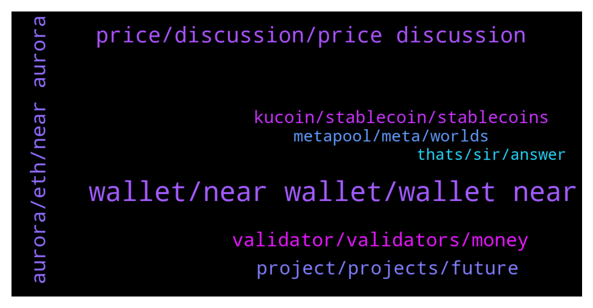

# **@cryptonear**
 ## Analysis for **2021-12-15** - **2021-12-16**.

---

## 📊 **Basic Stats**

**n_messages_sent**: 1147

---

---

## 🔝 **Top keywords and related messages**

1. **wallet, near wallet, wallet near**

    @bailey_12 --- *Lol. I still using the wallet normal, check on your end.* **--->** [TG Discussion](https://t.me/cryptonear/238847)

    @JOJOUPUP --- *Dear Near Team,  anything wrong happening to Near wallet,  why the balance and staking amount all appears 0 while there is some $near in wallet and staked ?* **--->** [TG Discussion](https://t.me/cryptonear/238701)

    @Timmy --- *near wallet isn't compatible with trisolaris?* **--->** [TG Discussion](https://t.me/cryptonear/240746)

    @Timmy --- *forget it, i'll do my own research. thanks for the help for those who helped me navigate the wallet* **--->** [TG Discussion](https://t.me/cryptonear/240798)

    @iamkemoo --- *you can buy near on wallet.near.org or you buy on exchanges and send it to you wallet* **--->** [TG Discussion](https://t.me/cryptonear/239687)

    @Jiddah005 --- *I have withdrawn wnear to binance wallet almost 7hours now didn't get, please is there a way to retrieve the transaction?* **--->** [TG Discussion](https://t.me/cryptonear/239268)

2. **price, discussion, price discussion**

    @ThePro --- *So how i can buy and see the price?* **--->** [TG Discussion](https://t.me/cryptonear/241321)

    @Hushmanny1 --- *I get near wey I won sell, like $1800 worth if interested DM me now* **--->** [TG Discussion](https://t.me/cryptonear/238132)

    @Kripto_Raptor --- *we should have limit orders for traders soon(on a dex) haha 😊. so hard to catch such wicks anyways* **--->** [TG Discussion](https://t.me/cryptonear/238904)

    @infamousX --- *hey there, anyone have recommendations how a decent exchange for US traders* **--->** [TG Discussion](https://t.me/cryptonear/241094)

    @rahulgoel007 --- *Guys trade/price discussion in below group https://t.me/merchantsofnear* **--->** [TG Discussion](https://t.me/cryptonear/239266)

    @larry_lang --- *yeah pls go to this channel for price prediction https://t.me/merchantsofnear* **--->** [TG Discussion](https://t.me/cryptonear/238939)

3. **aurora, eth, near aurora**

    @小猪 --- *any one can send 0.1 aurora to my address？just for gas，i will return 0.2 to you* **--->** [TG Discussion](https://t.me/cryptonear/239885)

    @Kripto_Raptor --- *simple, use Aurora bridge Near > Aurora it's almost free* **--->** [TG Discussion](https://t.me/cryptonear/239614)

    @kv9990 --- *Yup there's Skyward Finance and NearPad on Aurora* **--->** [TG Discussion](https://t.me/cryptonear/239754)

    @larry_lang --- *Yeah it's not easy building on Near using Rust language tbh so Near made aurora L2 Evm to attract more Dapps* **--->** [TG Discussion](https://t.me/cryptonear/239012)

    @Putin --- *currently i want to transact on web3, transfer assets from near to aurora but impediment is to do it on pc. it's very inconvenient* **--->** [TG Discussion](https://t.me/cryptonear/240567)

    @TheGo1denBull --- *TRISOLARIS is within the Aurora ecosystem. Use metamask to connect and use rainbow to transfer your near to Aurora.* **--->** [TG Discussion](https://t.me/cryptonear/240754)

4. **validator, validators, money**

    @why --- *turns out, if you chose bad validator, you will get les APY* **--->** [TG Discussion](https://t.me/cryptonear/238194)

    @why --- *but wait, restraunt can be different in quality. so i just try to understand, is there any differents between validators ?* **--->** [TG Discussion](https://t.me/cryptonear/238053)

    @Purple --- *i think the quality is in uptime of the validator* **--->** [TG Discussion](https://t.me/cryptonear/238054)

    @why --- *i just try to understand how to choose correct validator* **--->** [TG Discussion](https://t.me/cryptonear/238080)

    @Kripto_Raptor --- *there is no such bad validator, all it depends on up time.* **--->** [TG Discussion](https://t.me/cryptonear/238197)

    @Purple --- *when staking in near wallet, why do some validators have higher fees?  Do they all have the same apr?* **--->** [TG Discussion](https://t.me/cryptonear/238026)

5. **project, projects, future**

    @FritzWagner --- *Well, no. This project really wants to bring more democracy and freedom to the world.* **--->** [TG Discussion](https://t.me/cryptonear/240534)

    @kv9990 --- *Good question 😊 Because it has potential to be in top 10 projects soon ✌️❤️* **--->** [TG Discussion](https://t.me/cryptonear/240217)

    @Adam --- *Ok... so where do we think the future of this project sits?* **--->** [TG Discussion](https://t.me/cryptonear/239041)

    @Adam --- *I mean I made some money 😂 but I feel this has damaged the project* **--->** [TG Discussion](https://t.me/cryptonear/238667)

    @Anon000 --- *🔊We are setting up a new model for content creation.! Please help us by telling us which content you would love to see featured as an article? 🙏  https://twitter.com/NEARWEEK/status/1471421311507390468* **--->** [TG Discussion](https://t.me/cryptonear/241276)

    @Adam --- *Whats the next goal for this project to move it to top 10?* **--->** [TG Discussion](https://t.me/cryptonear/238989)

6. **kucoin, stablecoin, stablecoins**

    @Crypto_Beni --- *I'm not sure about this but this is something like the OUSD? It's listed on Kucoin* **--->** [TG Discussion](https://t.me/cryptonear/241015)

    @Kripto_Raptor --- *binance and kucoin withdrawals seems functioning* **--->** [TG Discussion](https://t.me/cryptonear/240411)

    @Bern --- *Surprise it’s taking so long.  Perhaps due to Kucoin* **--->** [TG Discussion](https://t.me/cryptonear/239166)

    @vlhai --- *One user in US deposited near in cryto.com succeeded yesterday, so I think it's good to try and compare speed with kucoin.* **--->** [TG Discussion](https://t.me/cryptonear/239183)

    @vlhai --- *Kucoin have some problem with deposit right now, you are the 2nd case today, bro!* **--->** [TG Discussion](https://t.me/cryptonear/239184)

    @FritzWagner --- *Go to binance or kucoin my friend* **--->** [TG Discussion](https://t.me/cryptonear/238136)

7. **metapool, meta, worlds**

    @iamkemoo --- *OIN is just awesome! Stake your stNEAR from MetaPool and receive 30% APY + the 11% APY on $NEAR you already get. And when you collateralize your stNEAR to get nUSDO you would get 207% APY payed out in $OIN, and you would still receive your $NEAR rewards from MetaPool. This is mind blowing!!* **--->** [TG Discussion](https://t.me/cryptonear/241574)

    @why --- *thats what i mean. i decided try metapool* **--->** [TG Discussion](https://t.me/cryptonear/238201)

    @kv9990 --- *You can do that from metapool site 😉* **--->** [TG Discussion](https://t.me/cryptonear/240276)

    @Kripto_Raptor --- *yeah, metapool is fine and comes with a couple of benefits.* **--->** [TG Discussion](https://t.me/cryptonear/238213)

    @FritzWagner --- *but with metapool it can be instant !!! That's the cool thing with metapool* **--->** [TG Discussion](https://t.me/cryptonear/238069)

    @FritzWagner --- *and with metapool I get 10%* **--->** [TG Discussion](https://t.me/cryptonear/238085)

