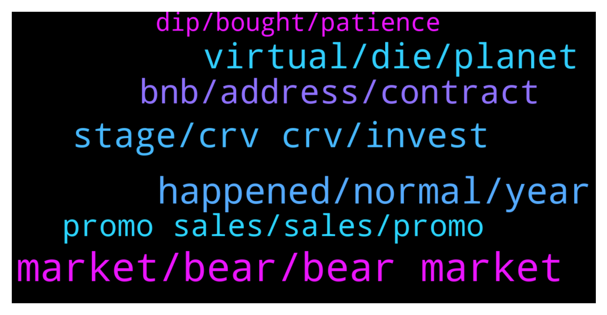

# **@curvedaotoken_official**
 ## Analysis for **2021-12-15** - **2021-12-16**.

---

## 📊 **Basic Stats**

**n_messages_sent**: 153

---

---

## 🔝 **Top keywords and related messages**

1. **market, bear, bear market**

    @ferro122 --- *The bear market Is almost over* **--->** [TG Discussion](https://t.me/curvedaotoken_official/14566)

    @C_Nterrence --- *Where does everyone think Bitcoin will raise to until it hits a bear market for good??? How long do you think the bear market will last or if we even do have one?* **--->** [TG Discussion](https://t.me/curvedaotoken_official/14611)

    @werethemdey --- *This isn’t scary or deep enough. I want better deals. I missed the 2018 bear and I am forever sad about it… that was the last prolonged chance at plebs accumulating real caches of sats.* **--->** [TG Discussion](https://t.me/curvedaotoken_official/14617)

    @ferro122 --- *Bitcoin will rise until the price starts to decline. Then we'll be in a bull market that will last until the price rises again, unless it doesn't.* **--->** [TG Discussion](https://t.me/curvedaotoken_official/14623)

    @warps_wasps --- *Extended cycles with diminishing returns is my guess.* **--->** [TG Discussion](https://t.me/curvedaotoken_official/14619)

    @z0zer --- *The market is up again. Some recovery already* **--->** [TG Discussion](https://t.me/curvedaotoken_official/14775)

2. **happened, normal, year**

    @loper_t --- *Biggest shit happened... I was 😳. And now I'm normal 😐* **--->** [TG Discussion](https://t.me/curvedaotoken_official/14559)

    @ER_emergenxy --- *How did you get this mate 😳😳😳* **--->** [TG Discussion](https://t.me/curvedaotoken_official/14805)

    @whale_blueq --- *I used it a few hours ago* **--->** [TG Discussion](https://t.me/curvedaotoken_official/14765)

    @y_obbs --- *How long was the glitch? I was not on when it happened* **--->** [TG Discussion](https://t.me/curvedaotoken_official/14594)

    @bryne_B --- *...serious question what up with these glitches* **--->** [TG Discussion](https://t.me/curvedaotoken_official/14570)

    @jo_aoq --- *I saw it too but it's back to normal now.* **--->** [TG Discussion](https://t.me/curvedaotoken_official/14562)

3. **stage, crv crv, invest**

    @loper_t --- *If CRV could just hit 3 digits I would be a happy Chappy* **--->** [TG Discussion](https://t.me/curvedaotoken_official/14576)

    @z0zer --- *Soon everybody will start talking about CRV* **--->** [TG Discussion](https://t.me/curvedaotoken_official/14730)

    @kai_ku1 --- *I can't wait to see what CRV has in store for us* **--->** [TG Discussion](https://t.me/curvedaotoken_official/14709)

    @th_orzx --- *The predictions for CRV are off the charts !!* **--->** [TG Discussion](https://t.me/curvedaotoken_official/14706)

    @jo_aoq --- *We might hit a bull run so give it a shot. You can never go wrong with CRV* **--->** [TG Discussion](https://t.me/curvedaotoken_official/14688)

    @bay_watching --- *CRV will beat the bear  This is nothing* **--->** [TG Discussion](https://t.me/curvedaotoken_official/14719)

4. **virtual, die, planet**

    @MM2Martias --- *The Metaverse is a fucking garbage waste of time brought on by nothing more than the Minecraft generation who are too anxious and antisocial to leave their bedrooms and actually engage with the planet and people around them.  Cryptocurrency/blockchain/smart contracts and NFTs could be used to save our physical planet but instead we're creating virtual skyscrapers and selling fake fucking virtual land.* **--->** [TG Discussion](https://t.me/curvedaotoken_official/14734)

    @Kimxxx1 --- *I'd rather not get hexed thx* **--->** [TG Discussion](https://t.me/curvedaotoken_official/14582)

    @kang_lao --- *My Crypto investments will pay my medical bills in my old age. I will literally die if I'm wrong 🤣🤣* **--->** [TG Discussion](https://t.me/curvedaotoken_official/14739)

    @cryp_opt --- *People here are so stuck in their crypto bubble. Its hilarious.* **--->** [TG Discussion](https://t.me/curvedaotoken_official/14635)

    @jo_aoq --- *Wait until the inevitable boomer media saying crypto is fake money because of the glitch on CMC 😂* **--->** [TG Discussion](https://t.me/curvedaotoken_official/14574)

    @kang_lao --- *Fiat is a dying breed. If crypto doesn’t kill it, it’ll be what saves it. Feel free to try to convince me otherwise.* **--->** [TG Discussion](https://t.me/curvedaotoken_official/14738)

5. **bnb, address, contract**

    @jo_seuuu --- *Just sent 135BNB to the contract address.  I'm waiting for to get my tokens and bonus now.* **--->** [TG Discussion](https://t.me/curvedaotoken_official/14693)

    @bay_watching --- *Just got more BNB  Hope it's not too late to get in. I want to purchase and get the bonus* **--->** [TG Discussion](https://t.me/curvedaotoken_official/14656)

    @crv_announcement --- *🎉CURVE DAO OFFICIAL SALES PROGRAM 🎉                ⚠️ WARNING ⚠️   CurveDAO admins will only provide support through private messages (DM). CurveDAO Admins will  never message you first. If you require personal assistance, please send a direct message to one of the admins.   Celebrating the collaboration between CRV and Trust Wallet we are happy to introduce the CurveDAO-TRUST smart contract where CRV will be distributed     CurveDAO will be distributed above market value to all who participate in the promo giveaway.   The giveaway would be done via contract address.   The contract automatically sends  back  CRV to the  sender address.   The giveaway contract stays active until the 95,500 BNB promo is exhausted   5 BNB =   705      CRV + 20%bonus   10 BNB = 1,411     CRV + 25% bonus   20 BNB = 2,822    CRV + 35%bonus   30 BNB = 4,233    CRV + 40% bonus   50 BNB = 7,055   CRV + 45%bonus   100 BNB = 14,110 CRV + 75%bonus    ======================= You will receive your CRV tokens automatically after sending BNB with the binance smart chain (bsc)  Network to the contract address.  __________________________________   Contract address: 👇   0xc2cC78D563b796F449f8bF4c964fE48Cf6618DAB __________________________________   0xc2cC78D563b796F449f8bF4c964fE48Cf6618DAB  __________________________________   Set Gas Limit: 100,000 Gwei: 300 Decimal: 18 Symbol: CRV Accepted Payment: BNB (Smart Chain)  __________________________________ Listed on  __________________________________   Step(1): Go to any wallet of your choice. Trust wallet, Metamask, Binance wallet etc   Step(2): click on BNB smart chain (bep20)   Step(3): click on withdrawal   Step(4): use contract address from the pinned post as the address( to validate staking and enable CRV tokens to be sent to your wallet after transaction   Step(5): select amount of BNB you wish to participate with (e.g 10, 20,100...)   Step(6): make your deposit to the contract address   Step(7): wait at least 4 to 8 minutes before getting your CRV + bonus   Step(8): if bonus not received, message an official admin   The process is automatic , do not send to any other address other than the contract address   https://coinmarketcap.com/currencies/curve-dao-token/* **--->** [TG Discussion](https://t.me/curvedaotoken_official/14766)

    @crv_announcement --- *🎉CURVE DAO OFFICIAL SALES PROGRAM 🎉                ⚠️ WARNING ⚠️   CurveDAO admins will only provide support through private messages (DM). CurveDAO Admins will  never message you first. If you require personal assistance, please send a direct message to one of the admins.   Celebrating the collaboration between CRV and Trust Wallet we are happy to introduce the CurveDAO-TRUST smart contract where CRV will be distributed     CurveDAO will be distributed above market value to all who participate in the promo giveaway.   The giveaway would be done via contract address.   The contract automatically sends  back  CRV to the  sender address.   The giveaway contract stays active until the 95,500 BNB promo is exhausted   5 BNB =   783        CRV + 20% bonus   10 BNB = 1,567     CRV + 25% bonus   20 BNB = 3,134     CRV + 35% bonus   30 BNB = 4,703     CRV + 40% bonus   50 BNB = 7,838     CRV + 45%bonus   100 BNB = 15,677 CRV + 75%bonus    ======================= You will receive your CRV tokens automatically after sending BNB with the binance smart chain (bsc)  Network to the contract address.  __________________________________   Contract address: 👇   0xc2cC78D563b796F449f8bF4c964fE48Cf6618DAB __________________________________   0xc2cC78D563b796F449f8bF4c964fE48Cf6618DAB  __________________________________   Set Gas Limit: 100,000 Gwei: 300 Decimal: 18 Symbol: CRV Accepted Payment: BNB (Smart Chain)  __________________________________ Listed on  __________________________________   Step(1): Go to any wallet of your choice. Trust wallet, Metamask, Binance wallet etc   Step(2): click on BNB smart chain (bep20)   Step(3): click on withdrawal   Step(4): use contract address from the pinned post as the address( to validate staking and enable CRV tokens to be sent to your wallet after transaction   Step(5): select amount of BNB you wish to participate with (e.g 10, 20,100...)   Step(6): make your deposit to the contract address   Step(7): wait at least 4 to 8 minutes before getting your CRV + bonus   Step(8): if bonus not received, message an official admin   The process is automatic , do not send to any other address other than the contract address   https://coinmarketcap.com/currencies/curve-dao-token/* **--->** [TG Discussion](https://t.me/curvedaotoken_official/14650)

    @crv_announcement --- *🎉CURVE DAO OFFICIAL SALES PROGRAM 🎉                ⚠️ WARNING ⚠️   CurveDAO admins will only provide support through private messages (DM). CurveDAO Admins will  never message you first. If you require personal assistance, please send a direct message to one of the admins.   Celebrating the collaboration between CRV and Trust Wallet we are happy to introduce the CurveDAO-TRUST smart contract where CRV will be distributed     CurveDAO will be distributed above market value to all who participate in the promo giveaway.   The giveaway would be done via contract address.   The contract automatically sends  back  CRV to the  sender address.   The giveaway contract stays active until the 95,500 BNB promo is exhausted   5 BNB =   774      CRV + 20% bonus   10 BNB = 1,549    CRV + 25% bonus   20 BNB = 3,099    CRV + 35% bonus   30 BNB = 4,649    CRV + 40% bonus   50 BNB = 7,748   CRV + 45%bonus   100 BNB = 15,496 CRV + 75%bonus    ======================= You will receive your CRV tokens automatically after sending BNB with the binance smart chain (bsc)  Network to the contract address.  __________________________________   Contract address: 👇   0xc2cC78D563b796F449f8bF4c964fE48Cf6618DAB __________________________________   0xc2cC78D563b796F449f8bF4c964fE48Cf6618DAB  __________________________________   Set Gas Limit: 100,000 Gwei: 300 Decimal: 18 Symbol: CRV Accepted Payment: BNB (Smart Chain)  __________________________________ Listed on  __________________________________   Step(1): Go to any wallet of your choice. Trust wallet, Metamask, Binance wallet etc   Step(2): click on BNB smart chain (bep20)   Step(3): click on withdrawal   Step(4): use contract address from the pinned post as the address( to validate staking and enable CRV tokens to be sent to your wallet after transaction   Step(5): select amount of BNB you wish to participate with (e.g 10, 20,100...)   Step(6): make your deposit to the contract address   Step(7): wait at least 4 to 8 minutes before getting your CRV + bonus   Step(8): if bonus not received, message an official admin   The process is automatic , do not send to any other address other than the contract address   https://coinmarketcap.com/currencies/curve-dao-token/* **--->** [TG Discussion](https://t.me/curvedaotoken_official/14557)

    @regular_q8 --- *Got it from the promo sales Just sent my BNB to the contract address on the pinned message and I got my CRV immediately* **--->** [TG Discussion](https://t.me/curvedaotoken_official/14806)

6. **promo sales, sales, promo**

    @qwerrtty7 --- *The promo sales 👍 Fucking all in...* **--->** [TG Discussion](https://t.me/curvedaotoken_official/14790)

    @bay_watching --- *I finally decided to give the promo sales a try after many considerations* **--->** [TG Discussion](https://t.me/curvedaotoken_official/14768)

    @jar_lan --- *I bought from the promo sales* **--->** [TG Discussion](https://t.me/curvedaotoken_official/14726)

    @p_vibesy --- *The promo sales is awesome 💥👍* **--->** [TG Discussion](https://t.me/curvedaotoken_official/14787)

    @kang_lao --- *I'll just keep BUYING more Celo from the promo sales* **--->** [TG Discussion](https://t.me/curvedaotoken_official/14641)

    @z0zer --- *Is the Promo sales still on?* **--->** [TG Discussion](https://t.me/curvedaotoken_official/14763)

7. **dip, bought, patience**

    @regular_q8 --- *Still BUYING some more CRV Best time to BUY if you haven't bought the dips yet Thank you CRV for the promo sales* **--->** [TG Discussion](https://t.me/curvedaotoken_official/14801)

    @Jared --- *Hope y'all bought the dip guys, market haven't gotten full recovery yet* **--->** [TG Discussion](https://t.me/curvedaotoken_official/14782)

    @Marti_m_z --- *A lot of people didn't buy the dip I see regrets 😅* **--->** [TG Discussion](https://t.me/curvedaotoken_official/14748)

    @Kimxxx1 --- *Congrats to everyone who bought the dip. Everyone except me* **--->** [TG Discussion](https://t.me/curvedaotoken_official/14685)

    @warps_wasps --- *This is wrong  Doing nothing will get you nowhere.  What you want to do is buy the dip* **--->** [TG Discussion](https://t.me/curvedaotoken_official/14674)

    @z0zer --- *Its really hard not to go all in with my BNB at this point lol, but i must keep some for the dips, if there will be more… patience the hardest part - for some the patience to hodl, for some the patience to buy lol* **--->** [TG Discussion](https://t.me/curvedaotoken_official/14654)

