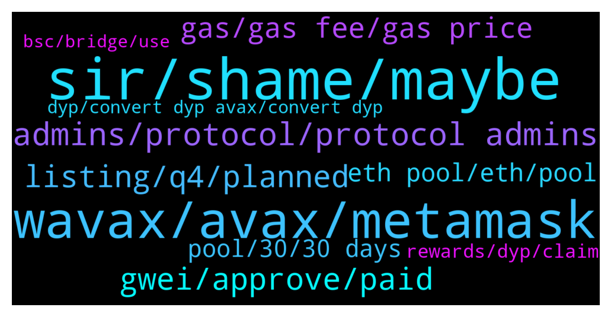

# **@dypfinance**
 ## Analysis for **2021-12-15** - **2021-12-16**.

---

## 📊 **Basic Stats**

**n_messages_sent**: 405

---

---

## 🔝 **Top keywords and related messages**

1. **sir, shame, maybe**

    @Georg --- *it was with DAI, maybe that's the problem* **--->** [TG Discussion](https://t.me/dypfinance/230084)

    @JulienRayleigh --- *That doesn't answer my question sir 😅* **--->** [TG Discussion](https://t.me/dypfinance/230011)

    @iamJubi --- *Hello. you can convert here https://app.pangolin.exchange/#/swap?&outputCurrency=0x961c8c0b1aad0c0b10a51fef6a867e3091bcef17* **--->** [TG Discussion](https://t.me/dypfinance/229692)

    @sb3ee --- *This is the type of thing I don’t need.* **--->** [TG Discussion](https://t.me/dypfinance/230334)

    @sb3ee --- *That’s correct, i can let them populate* **--->** [TG Discussion](https://t.me/dypfinance/230344)

    @sinaht --- *appreciate it Jubi you were very helpful* **--->** [TG Discussion](https://t.me/dypfinance/229678)

2. **wavax, avax, metamask**

    @iamJubi --- *Hello. Yes you need WAVAX.  These are the supported assets if you want to deposit v2 DYP farm- avalanche network (WAVAX, USDC.e, USDT.e, WETH.e, PNG, QI, DAI.e, XAVA, WBTC.e, LINK.e, or iDYP) and earn WAVAX/ETH/DYP as rewards. link https://dyp.finance/farmv2/avax* **--->** [TG Discussion](https://t.me/dypfinance/229694)

    @DhoniMSD516 --- *Read this Consider a scenario wherein you deposit WAVAX worth $1000. The smart contract will do all the work for you, that means you no longer need to manually add liquidity to Pangolin if you join farming. You just need to complete two transactions on our dApp: approve & deposit; and all the work is done automatically by the smart contract. In our case, the smart contract will split the WAVAX worth $1000 in two parts: WAVAX worth $750 is added to Pangolin AVAX/iDYP LP and WAVAX worth $250 is sent to DYP Staking with up to 140% APY.* **--->** [TG Discussion](https://t.me/dypfinance/230281)

    @sinaht --- *Wavax is avax in bep20 right?* **--->** [TG Discussion](https://t.me/dypfinance/230141)

    @Tom --- *I just deposited WAVAX in lock V2 farm. Do I need to do anything else? Are rewards paid only in Wavax?* **--->** [TG Discussion](https://t.me/dypfinance/229699)

    @sinaht --- *Ok where should I do that? in MetaMask or else?* **--->** [TG Discussion](https://t.me/dypfinance/230139)

    @Tom --- *I just discovered Dyp a ax farm with 60 days lock yielding 2000%. Do I have to wrap my Ava’s to wavax before supplying Liquidity?* **--->** [TG Discussion](https://t.me/dypfinance/229693)

3. **admins, protocol, protocol admins**

    @Cj --- *any eta when this contract stops today? https://app.dyp.finance/constant-staking-120  after it stops, my dyps can be withdrawn right?* **--->** [TG Discussion](https://t.me/dypfinance/230250)

    @sinaht --- *they are both audited and are under dyp rule right? I mean both are safe* **--->** [TG Discussion](https://t.me/dypfinance/229676)

    @DhoniMSD516 --- *Hello yes we have security audits from 3 companies and a 24/7 security oracle from certik monitors our smart contracts https://dyp.finance/audit* **--->** [TG Discussion](https://t.me/dypfinance/229844)

    @hemanrock --- *you can send it your metamask or trustwallet address by ERC20 withdrawal mode.  after you receive. you can simply go through https://dyp.finance/farmv2/eth and this article for reference https://dypfinance.medium.com/c08cb2fa11cd* **--->** [TG Discussion](https://t.me/dypfinance/229963)

    @iamJubi --- *Yes both are audited by Peckshield and Blockchain Consilium. Check the security audits here https://dyp.finance/audit* **--->** [TG Discussion](https://t.me/dypfinance/229677)

    @DhoniMSD516 --- *yes if you claim the iDYP is sent to your wallet and you can trade* **--->** [TG Discussion](https://t.me/dypfinance/229541)

4. **gwei, approve, paid**

    @timdyp --- *Just did a test transaction now, $20 for approve and $300 for deposit. But the Gwei is 127.* **--->** [TG Discussion](https://t.me/dypfinance/229887)

    @shinigamikami --- *I paid $230 to deposit at 91 gwei* **--->** [TG Discussion](https://t.me/dypfinance/230332)

    @ringLeader96 --- *So I can modify the GWEI for the “max priority fee”? Cause that’s what currently raising the price* **--->** [TG Discussion](https://t.me/dypfinance/230234)

    @timdyp --- *It depends on current Gwei, here are the fees paid a couple of hours ago before the Gwei went up:  - for farming we paid around $10 to approve the transaction and $110 to deposit the asset. That means a total of $120 to join one of the farming pools. - for staking we paid around $6 to approve the transaction and $40 to deposit the asset. That means a total of $46 to join one of the staking pools. - for buyback we paid around $6 to approve the transaction and $85 to deposit the asset. That means a total of $91 to join one of the buyback pools.  Right now, the fees are higher because Gwei almost doubled.* **--->** [TG Discussion](https://t.me/dypfinance/229925)

    @Jorzico --- *Not sure but in my days I paid $250* **--->** [TG Discussion](https://t.me/dypfinance/230069)

    @ringLeader96 --- *Yes I understand, however even after adjusting gwei it’s asking for hundreds of dollars (I know in reality it’ll be much less), and I can’t complete the transaction because I don’t have enough funds to cover* **--->** [TG Discussion](https://t.me/dypfinance/230310)

5. **listing, q4, planned**

    @hemanrock --- *it is still in Q4. please wait for official announcement.* **--->** [TG Discussion](https://t.me/dypfinance/229575)

    @InGoyalWeTrust --- *There was supposed to be a Tier 1 CEX listing in December, when can we expect that?* **--->** [TG Discussion](https://t.me/dypfinance/229573)

    @Al19bn --- *When is exchange listing? last day of dec?* **--->** [TG Discussion](https://t.me/dypfinance/230358)

    @trader_broi --- *Launchpad or tier 1 listing will be 1st ?* **--->** [TG Discussion](https://t.me/dypfinance/230292)

    @Loverboy --- *I can buy and keep right before its been listed again?* **--->** [TG Discussion](https://t.me/dypfinance/229824)

    @hemanrock --- *more details will be announced in upcoming.* **--->** [TG Discussion](https://t.me/dypfinance/229595)

6. **gas, gas fee, gas price**

    @hemanrock --- *please check this and this was about few hours ago https://t.me/dypfinance/229925  But now the gas price might be high or low* **--->** [TG Discussion](https://t.me/dypfinance/230070)

    @Momo --- *maybe using binance smart chain will be bettee for gas fee just suggestions* **--->** [TG Discussion](https://t.me/dypfinance/230162)

    @iamJubi --- *Though the higher the gas limit, the success rate is higher.* **--->** [TG Discussion](https://t.me/dypfinance/230123)

    @Hustler --- *Is it worth buying on high gas fee as well ?* **--->** [TG Discussion](https://t.me/dypfinance/230015)

    @hemanrock --- *Now gas price might be high. please check back later. few hours ago Tim has paid, $10 to approve the transaction and $110 to deposit the asset.* **--->** [TG Discussion](https://t.me/dypfinance/230014)

    @Hustler --- *Gas fee is still way High* **--->** [TG Discussion](https://t.me/dypfinance/230005)

7. **eth pool, eth, pool**

    @uBrown --- *Lol because I see Eth pool is bigger* **--->** [TG Discussion](https://t.me/dypfinance/230327)

    @hemanrock --- *No. it wont work on ETH Pool. for ETH pool WETH is the one of asset for deposit.* **--->** [TG Discussion](https://t.me/dypfinance/230010)

    @JulienRayleigh --- *So it dont work with ETH pool ?* **--->** [TG Discussion](https://t.me/dypfinance/230009)

    @hemanrock --- *No. WETH.e wont work on ETH Pool.* **--->** [TG Discussion](https://t.me/dypfinance/230012)

    @JulienRayleigh --- *Hi guys, is it normal that i invest USDC on ETH pool and finally i have WETH?* **--->** [TG Discussion](https://t.me/dypfinance/230295)

    @sb3ee --- *Tell me, how fat are ETH rewards, I’m bailing on my POOL at AVAX, dropping $250 for gas +, to invest in it* **--->** [TG Discussion](https://t.me/dypfinance/230351)

8. **pool, 30, 30 days**

    @sb3ee --- *What time is pool reward today i forget, 11, 10, or 9 EST* **--->** [TG Discussion](https://t.me/dypfinance/230347)

    @hemanrock --- *for short duration ofc the rewards will be accordingly.  If you wish to choose for longer period then there are 30/60/90 day pools available. APY is also different for each.* **--->** [TG Discussion](https://t.me/dypfinance/230093)

    @timdyp --- *4 times more rewards allocated for the 90 days pool compared with the no lock time pool.* **--->** [TG Discussion](https://t.me/dypfinance/229998)

    @DhoniMSD516 --- *Hey which pools? We recently launched all the pools* **--->** [TG Discussion](https://t.me/dypfinance/230325)

    @uBrown --- *Please can you help me check remaining time for Claim in wavax pool v3* **--->** [TG Discussion](https://t.me/dypfinance/229837)

    @uBrown --- *When can we see New pool on avalanche* **--->** [TG Discussion](https://t.me/dypfinance/230323)

9. **rewards, dyp, claim**

    @chunshern90 --- *How about the rewards? Will be in dyp token?* **--->** [TG Discussion](https://t.me/dypfinance/230193)

    @SunilSPawar --- *Is it normal for rewards to drop in bsc staking. I had 567 dyp available to be claimed as of yesterday but now 528. Admins can you please shed some light on this. This Bsc V2 staking* **--->** [TG Discussion](https://t.me/dypfinance/229934)

    @timdyp --- *Yes, the UNCLAIMED DYP rewards can go UP or DOWN based on iDYP and BNB price. It was already answered a couple of times before.* **--->** [TG Discussion](https://t.me/dypfinance/229936)

    @hemanrock --- *https://dyp.finance/farmv2/eth  you can deposit one of the supported assets (WETH, WBTC, USDC, USDT, DAI, LINK, or iDYP) and earn WETH/USDT and DYP as rewards  https://dypfinance.medium.com/c08cb2fa11cd* **--->** [TG Discussion](https://t.me/dypfinance/229984)

    @raid_off --- *If I had deposited cake , in end of period of staking , I will get my cake + dyp award ?* **--->** [TG Discussion](https://t.me/dypfinance/229655)

    @cazjp --- *I see dyp rewards being accumulated but no weth rewards.* **--->** [TG Discussion](https://t.me/dypfinance/230115)

10. **dyp, convert dyp avax, convert dyp**

    @Tom --- *How is iDYP different from DYP??* **--->** [TG Discussion](https://t.me/dypfinance/230378)

    @DhoniMSD516 --- *Hey welcome you can start reading about DYP here https://t.me/dypfinance/229271* **--->** [TG Discussion](https://t.me/dypfinance/229814)

    @Alex --- *how to convert dyp to avax?* **--->** [TG Discussion](https://t.me/dypfinance/229690)

    @Abulsagga --- *hi guys if i want to move my dyp to metamask from gateio i can only send over erc with 120 dyp fees, anyone knows any other way?* **--->** [TG Discussion](https://t.me/dypfinance/230255)

    @DhoniMSD516 --- *DYP is listed on multiple CEX and DEX already* **--->** [TG Discussion](https://t.me/dypfinance/229827)

    @DhoniMSD516 --- *This group is related to official DYP Project* **--->** [TG Discussion](https://t.me/dypfinance/229822)

