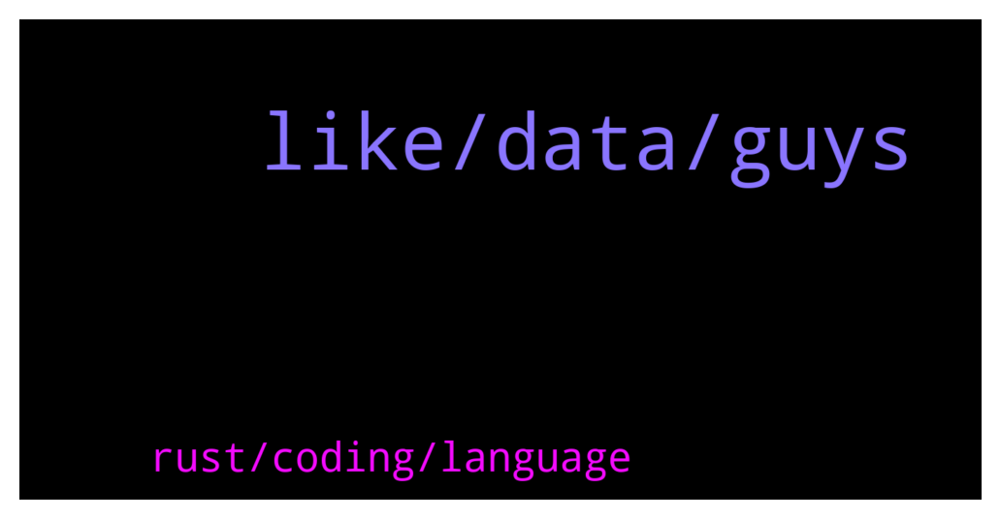

# **@lobsters_chat**
 ## Analysis for **2021-12-15** - **2021-12-16**.

---

## 📊 **Basic Stats**

**n_messages_sent**: 414

---

---

## 🔝 **Top keywords and related messages**

1. **like, data, guys**

    @blockminded --- *Look in their recent tweets and replies there’s a few codes knocking about* **--->** [TG Discussion](https://t.me/lobsters_chat/308051)

    @farm42 --- *https://www.phishfort.com/blog/web3-phishing-has-finally-arrived   They already did a Web3 cloaking attack.* **--->** [TG Discussion](https://t.me/lobsters_chat/308043)

    @coine_r --- *Ethereum Foundation launches incentive program for client teams  https://www.theblockcrypto.com/linked/127497/ethereum-foundation-launches-incentive-program-for-client-teams?utm_source=telegram&utm_medium=social* **--->** [TG Discussion](https://t.me/lobsters_chat/307548)

    @fallingdi --- *Mochi creator promises to restore USDM peg  Is this even possible?  https://twitter.com/mochidefi/status/1470807170941919235?s=21* **--->** [TG Discussion](https://t.me/lobsters_chat/307568)

    @farm42 --- *https://twitter.com/officer_cia/status/1418018953742409738?s=21 check out this thread and also check:  https://arxiv.org/pdf/2106.10740.pdf  https://arxiv.org/pdf/2106.00667.pdf  https://www.preprints.org/manuscript/202107.0231/v1/download  should help ya* **--->** [TG Discussion](https://t.me/lobsters_chat/307895)

    @farm42 --- *This manual should help: https://medium.com/notonlymaths/using-latex-on-medium-6200fc8d0783  Also check out:   https://www.quora.com/How-can-I-use-LaTeX-in-Medium  https://medium.com/@kiranachyutuni/how-to-embed-beautiful-math-equations-in-medium-a041a64dd4e3* **--->** [TG Discussion](https://t.me/lobsters_chat/307865)

2. **rust, coding, language**

    @marcuszeto --- *Hi friends, I’ve decided to learn coding from scratch, any recommendations on which coding language I should start with first?* **--->** [TG Discussion](https://t.me/lobsters_chat/307997)

    @coine_r --- *Might as well learn C and Haskell just because* **--->** [TG Discussion](https://t.me/lobsters_chat/308029)

    @marcuszeto --- *Interesting thoughts, I guess I’ll start off with JS first and work ym way up from there 👀* **--->** [TG Discussion](https://t.me/lobsters_chat/308019)

    @nickbtts --- *According to Stack Overflow's 2020 Developer Survey, JavaScript currently stands as the most commonly-used language in the world (69.7%), followed by HTML/CSS (62.4%), SQL (56.9%), Python (41.6%) and Java (38.4%). It is also the most sought-out programming language by hiring managers in the Americas.  SQL might also be a good starting point for chain-native people, as you can easily add value to projects through Dune etc* **--->** [TG Discussion](https://t.me/lobsters_chat/308015)

    @yic_alex --- *As long as you dont go with something exotic the language does not matter. Pick something thats prevalent in the area you want to build in later. The best approach for learning, from my experience, is to pick a small project you are passionate about and just start building. Basically just start and whenever you get stuck google / read docs.* **--->** [TG Discussion](https://t.me/lobsters_chat/308008)

    @gonzogirl --- *I'd strongly suggest you start learning rust and go. These are 2 top needed languages to actually build the web* **--->** [TG Discussion](https://t.me/lobsters_chat/308007)

