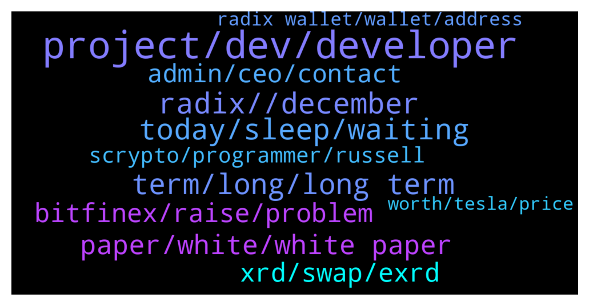

# **@radix_dlt**
 ## Analysis for **2021-12-15** - **2021-12-16**.

---

## 📊 **Basic Stats**

**n_messages_sent**: 708

---

---

## 🔝 **Top keywords and related messages**

1. **project, dev, developer**

    @Rich_Launchpool --- *Sorry, any inventive for Devs to build here?* **--->** [TG Discussion](https://t.me/radix_dlt/321705)

    @radixmatt --- *That's exactly why we just launched the developers hub at: https://developers.radixdlt.com/  You'll find links there to a new set of Scrypto docs - and in those docs you'll find tutorials, reference material, even a couple of videos to lead you through some things. https://docs.radixdlt.com/main/scrypto/introduction.html* **--->** [TG Discussion](https://t.me/radix_dlt/321360)

    @Rich_Launchpool --- *Quite a few projects have tried this model. None have worked that I can think of, perhaps you can highlight one that has, lmk* **--->** [TG Discussion](https://t.me/radix_dlt/321715)

    @Blind5ight --- *That's the reason you get the dev tools out there before deploying them on mainnet* **--->** [TG Discussion](https://t.me/radix_dlt/322081)

    @Blind5ight --- *I recommend these 2 entries into  1) scale-ability & compose-ability: https://www.radixdlt.com/post/cerberus-infographic-series-chapter-i 2) build-ability: https://www.radixdlt.com/post/the-problem-with-smart-contracts-today Extra) dev incentives: https://www.radixdlt.com/post/on-ledger-recurring-developer-revenue-incentives-to-buidl  That should get you a get overview* **--->** [TG Discussion](https://t.me/radix_dlt/321709)

    @mx471 --- *You can find a list of already announced projects here: https://www.radixlist.com/ and this Discord: https://discord.gg/r26fRKkq (e.g. Ociswap 😉)* **--->** [TG Discussion](https://t.me/radix_dlt/321818)

2. **radix, , december**

    @N --- *now this is great. Someone with more than 608K follower tweets about Radix:https://twitter.com/crypto_birb/status/1470906190158831617* **--->** [TG Discussion](https://t.me/radix_dlt/320877)

    @Blind5ight --- *btw, you're a game dev, have you checked out radixverse.art/port already? would be keen to know your opinion on it :)* **--->** [TG Discussion](https://t.me/radix_dlt/322095)

    @az17428 --- *Anyone tried radix-collection? Is it worth it?* **--->** [TG Discussion](https://t.me/radix_dlt/321434)

    @Jazzer9F --- *🎉NEW RADIX REPORT IS NOW LIVE!🎉  In the last Radix Report of 2021 we have some juicy updates from the marketing and development teams, plus news on the latest efforts from the Radix Marketing Council.  Full Report: https://www.radixdlt.com/post/radix-report-9th-december* **--->** [TG Discussion](https://t.me/radix_dlt/321949)

    @Jazzer9F --- *The November Radix Roundtable is now live.   Catch up with Piers, Russell, Matt, & Adam from RDX Works as they talk about:  🖥 The Scrypto Debut ✅ Community Scrypto code examples 🛠 Radix API refactor 📣 2022 marketing plans & more!  Watch now: https://youtu.be/HUTBCoz5esE* **--->** [TG Discussion](https://t.me/radix_dlt/321865)

    @coopsagainsttheworld --- *Hello team radix!! Just saw this in Belsize Park (London)* **--->** [TG Discussion](https://t.me/radix_dlt/320682)

3. **today, sleep, waiting**

    @Lexluttt --- *How hard is it to get it? On a pain scale between 1 to 10?* **--->** [TG Discussion](https://t.me/radix_dlt/321860)

    @Magal36 --- *What's wrong with you today? 😂😂* **--->** [TG Discussion](https://t.me/radix_dlt/322077)

    @mx471 --- *This must be what it feels like to wake up in the morning and have to pay a billion for your bread* **--->** [TG Discussion](https://t.me/radix_dlt/320782)

    @Sandeep --- *everything is back to normal guys* **--->** [TG Discussion](https://t.me/radix_dlt/320832)

    @DeepFuckingValeu --- *I have no clue, about anything today, my head is empty more or less* **--->** [TG Discussion](https://t.me/radix_dlt/322144)

    @RadixMonk --- *apparently this started 8 hours ago? idk how i heard about this so late* **--->** [TG Discussion](https://t.me/radix_dlt/321863)

4. **term, long, long term**

    @aus87 --- *seems like the world should just decide on one and go for it* **--->** [TG Discussion](https://t.me/radix_dlt/321165)

    @DeepFuckingValeu --- *Maybe im overly optimistic but is it really a problem that we are under the radar right now? I feel that in time we will get exposure anyway once people open their eyes, people think im blind for not knowing that FC Barcelona is, I think people are blind for not knowing about Radix* **--->** [TG Discussion](https://t.me/radix_dlt/322135)

    @Maciej --- *This is what I expect but would be great to have some more precise announcement soon, as this is the next stage. ;)* **--->** [TG Discussion](https://t.me/radix_dlt/321174)

    @Radstakes --- *Here's the announcement.  No specific time has been given but it will be today: http://go.radixdlt.com/Scrypto-is-Coming* **--->** [TG Discussion](https://t.me/radix_dlt/320974)

    @korone_stan --- *The downside to exploding in hype too early* **--->** [TG Discussion](https://t.me/radix_dlt/322094)

    @Luke --- *I just want to know how long until 6je event do I can Guage this correctly.* **--->** [TG Discussion](https://t.me/radix_dlt/320953)

5. **paper, white, white paper**

    @Blind5ight --- *New DeFi white paper as well Ima have to sit down and get thru all this grade A content!* **--->** [TG Discussion](https://t.me/radix_dlt/321421)

    @Ben_XRD --- *How many pages is the White Paper @Blind5ight? ;)* **--->** [TG Discussion](https://t.me/radix_dlt/321454)

    @Blind5ight --- *Noice! Make sure to check out: https://t.me/c/1349022698/4 ;)* **--->** [TG Discussion](https://t.me/radix_dlt/321931)

    @Blind5ight --- *Join here: https://t.me/+dFWBy3ILuTVkYTVk  The answers are literal copy pastes out of the linked articles* **--->** [TG Discussion](https://t.me/radix_dlt/322182)

    @Blind5ight --- *Make sure to read thru this diamond paper ;) https://t.me/radix_dlt/321474* **--->** [TG Discussion](https://t.me/radix_dlt/321593)

    @az17428 --- *Yeah clearly. But it's comments on the official page* **--->** [TG Discussion](https://t.me/radix_dlt/321377)

6. **xrd, swap, exrd**

    @iphonecliniq --- *Is there a way to convert exrd to xrd in long run* **--->** [TG Discussion](https://t.me/radix_dlt/321007)

    @AlyG7 --- *How do we convert our XRD back to eXRD?* **--->** [TG Discussion](https://t.me/radix_dlt/320911)

    @Wekkel --- *My XRD deposit was received and confirmed within minutes the other day* **--->** [TG Discussion](https://t.me/radix_dlt/320738)

    @az17428 --- *Are people staking more or less XRD now? Where can I find this info* **--->** [TG Discussion](https://t.me/radix_dlt/320828)

    @Arri9 --- *This was the answer   Thank you for confirming.   It appears that we have been having recent issues with the XRD node. However, note that our specialist are currently working to deploy a fix as soon as possible. Your patience is greatly appreciated.* **--->** [TG Discussion](https://t.me/radix_dlt/321744)

    @LetLoveLeadYou --- *I’ve done basic verification. Can I use that to buy and withdraw XRD?* **--->** [TG Discussion](https://t.me/radix_dlt/320983)

7. **bitfinex, raise, problem**

    @Blind5ight --- *Bitfinex withdrawal issues -Dec 16, 2021  Source: https://www.reddit.com/r/Radix/comments/rhlbqv/bitfinex_invalid_withdrawal_address/* **--->** [TG Discussion](https://t.me/radix_dlt/321914)

    @dbrigon --- *Annoying, but I withdrew from Bitfinex about a week ago with no problem. Must be a new issue.* **--->** [TG Discussion](https://t.me/radix_dlt/322216)

    @Alfred_Dulaire --- *Bitfinex down for the moment you’ll have to wait* **--->** [TG Discussion](https://t.me/radix_dlt/321930)

    @Radstakes --- *It happens from time to time. You can raise a ticket with Bitfinex but if you try again later it normally gets resolved in a few hours. Happened to me a few times and someone else was reporting the same earlier* **--->** [TG Discussion](https://t.me/radix_dlt/321677)

    @Blind5ight --- *You're not the first to report this There must be something on-going at Bitfinex's end  (If anybody contacted bfx support, let us know in here :)* **--->** [TG Discussion](https://t.me/radix_dlt/321752)

    @Artistizen --- *Bitfinex is very slow in recieving XRD. To the point where they have to occationally verify it manually. In my case it is taking days.  If you have not recieved within a few epochs (approx. 30 mins per epoch) I would raise a ticket immediatelly. The funds are not lost, they will find it - just not instantly.* **--->** [TG Discussion](https://t.me/radix_dlt/320734)

8. **radix wallet, wallet, address**

    @Arri9 --- *Do anybody knows I have xrd on bitfinex and I want them to send to my radix wallet.But bitfinex said invalide adres ?I used it multiple times and other adressen to* **--->** [TG Discussion](https://t.me/radix_dlt/321615)

    @CodyPham --- *Hi, Pls help. Anyone have issue withdraw form Bitfinex. I copy and paste radix address but they note it "invalid address" I still used this address in last time* **--->** [TG Discussion](https://t.me/radix_dlt/321999)

    @Dex (No reply to all DM) --- *Hi, would like to check if rest of you are facing problems with  withdrawal of XRD from Bitfinex... The Bitfinex withdrawal could not recognize Radix address anymore 😡* **--->** [TG Discussion](https://t.me/radix_dlt/322016)

    @Jaran --- *hey guys can somebody help me with radix wallet/bitfinex transfer? i copied the desktop wallet address to bitfinex but it says invalid adress* **--->** [TG Discussion](https://t.me/radix_dlt/321928)

    @MrPipsSociety --- *Hi. I am copying my address from official radix wallet to bitfinex withdraw section and it is saying invalid address  I have double checked the address is the same being copied and pasted  Any ideas ?* **--->** [TG Discussion](https://t.me/radix_dlt/321667)

    @Smwau2001 --- *Does anyone know with Bitfinex why it wont accept my radix address?* **--->** [TG Discussion](https://t.me/radix_dlt/321891)

9. **admin, ceo, contact**

    @rubydacheryyyy --- *Let’s get a Ivan on tech x piers interview* **--->** [TG Discussion](https://t.me/radix_dlt/321038)

    @itallion --- *Hi, please can I speak to an Admin / Dev?* **--->** [TG Discussion](https://t.me/radix_dlt/321959)

    @Luck_Anderso --- *hi who is the admin here ?* **--->** [TG Discussion](https://t.me/radix_dlt/321482)

    @Mik3ology --- *That's why I'm asking. Not that I'll be applying, I just have an idea I'd like to share but don't know who to DM* **--->** [TG Discussion](https://t.me/radix_dlt/321922)

    @korone_stan --- *I think Hoskinson is an incredible talent in terms of public speaking and explaining ideas in an engaging way. He really should just be a professor instead* **--->** [TG Discussion](https://t.me/radix_dlt/322107)

    @Luck_Anderso --- *Actually I need talk about a partnership to a new project from Gains Associates. Can I DM you ?* **--->** [TG Discussion](https://t.me/radix_dlt/321484)

10. **scrypto, programmer, russell**

    @mx471 --- *Getting started with Scrypto! https://www.youtube.com/watch?v=Mu8L-BJFfQM  Russell’s Radiswap Review https://www.youtube.com/watch?v=Iblv3xeg4HM* **--->** [TG Discussion](https://t.me/radix_dlt/321562)

    @mx471 --- *Soon the requests from other projects to implement Scrypto will be coming in en masse* **--->** [TG Discussion](https://t.me/radix_dlt/321521)

    @Johan --- *Where can I find detailed tutorials on the Scrypto language or when will you start publishing material on the subject that will serve as a source of learning, since at the moment I find very little information on how to use the language.* **--->** [TG Discussion](https://t.me/radix_dlt/321352)

    @mx471 --- *I am also not a programmer (anymore, I used to do some Windows & Linux scripting & web development but not professionally) but I want to try to build a casino on Scrypto* **--->** [TG Discussion](https://t.me/radix_dlt/321180)

    @Maciej --- *What can I say, patience was never my strong side! 😂  Jokes aside, what you just wrote is fine and answers my question. I fully agree that making things right is absolutely priority. Fingers crossed for you and the team and I can't wait to try Scrypto myself, though not being a programmer. ;)* **--->** [TG Discussion](https://t.me/radix_dlt/321178)

    @TaserFace6937 --- *Why not become Scrypto Sam?  developers.radixdlt.com* **--->** [TG Discussion](https://t.me/radix_dlt/321657)

