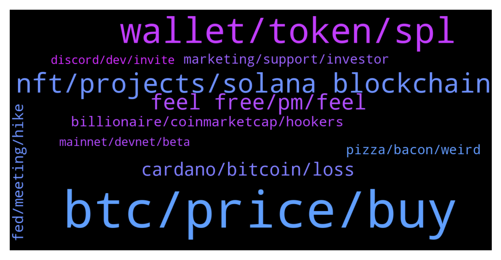

# **@solana**
 ## Analysis for **2021-12-15** - **2021-12-16**.

---

## 📊 **Basic Stats**

**n_messages_sent**: 460

---

---

## 🔝 **Top keywords and related messages**

1. **btc, price, buy**

    @Anwar --- *Hi Admin, I saw a promotion for Solana holders that they receive bonus today. Is it true. Can you please confirm* **--->** [TG Discussion](https://t.me/solana/870415)

    @mahib45 --- *It’s time once again to award the Squid Prize, the biannual celebration of the people who make the Solana community great.   This time, we want to hear from you.   https://solanalabs.typeform.com/to/yzDfzVnC  The Squid Prize is named after its first winner, the illustrious  fordudesake, for their contributions to the community.  The winner of the December 2021 prize will get $20,000 in USDC and will be passed the unique Squid Prize NFT.  If you know someone who has made the Solana universe a little friendlier, take a few minutes to write a nomination for them here:   https://solanalabs.typeform.com/to/yzDfzVnC  Nominations close on December 17th, and the winner will be announced close to the end of the year. Good luck! 🦑* **--->** [TG Discussion](https://t.me/solana/868386)

    @IlProfSassaroli --- *Totally true.i am an holder of Solana since end of July. But It Always hard see your portfolio go down from the top to today. I already holding all my Sol but the prospettive of years of bear market ....i don't know what to do now....😕* **--->** [TG Discussion](https://t.me/solana/868422)

    @Banause1337 --- *I am not negative, otherwise I would not have bought a solana. but if someone had told you for 1 month that the SOL would have dropped back to $ 150 you would also have said that it WILL NOT be true.* **--->** [TG Discussion](https://t.me/solana/868336)

    @AKNTEN --- *Why is SOL following BTC price ? Then why not invest in BTC better than SOL ? Then Why is it following BTC ?* **--->** [TG Discussion](https://t.me/solana/870234)

    @Solomon --- *It means you don't understand Solana Network* **--->** [TG Discussion](https://t.me/solana/870037)

2. **wallet, token, spl**

    @ligenj --- *5 days ago i transfer Solana from Hotbit exchange to Phantom wallet, and i didnt got tokens. 🙁      scammer fck off on private.!!* **--->** [TG Discussion](https://t.me/solana/869573)

    @DirtyChacha --- *Hi team … just created a new adres in my phantom wallet … i received 5000000 suspicious tokens this night next to my solana … how can delete them ? Just managed of my token list ?* **--->** [TG Discussion](https://t.me/solana/869015)

    @OsmnBr --- *I register whitelist in solanium and try connect wallet but it said could not authenticate wallet. What does it mean ? and what should I do ?* **--->** [TG Discussion](https://t.me/solana/869609)

    @js_0009 --- *Hello I withdrew SOL from KuCoin using SPL. The transactions shows completed on Kucoin but searching for Transaction hash shows string not found. This happend on Dec 13, when there were problems with SOL network. Kucoin support has not been responsive so far. Is there some information you can give me? Scammers, pls don't dm me* **--->** [TG Discussion](https://t.me/solana/870473)

    @CryptoLollyPop --- *hello, I don't know if this is a question for here. I made a spl token and did everything as in the documentation, and after registering the token, in my phantom wallet instead of the token being displayed as a token, it is displayed in the nfts section, can someone tell me how to solve this problem* **--->** [TG Discussion](https://t.me/solana/868654)

    @Nestor --- *My sole balance is gone from Math Wallet's wallet. I would make a transaction on Radium. Only I didn't. After that it disappeared. I do not know what to do. There is a transaction there. I don't know if there's a way to recover. If I can't, I'm suing Solana.* **--->** [TG Discussion](https://t.me/solana/868800)

3. **nft, projects, solana blockchain**

    @RealPrinceOla --- *Hello! Please kindly do your own research before investing into any crypto project. However, you can check below urls to know some of the projects which are available on Solana blockchain. Note that project listed on the website doesn't means that Solana team recommend these projects for investment purposes and also projects that are not mentioned in the website doesn't mean they are not real too.   1️⃣ https://solana.com/ecosystem  2️⃣ https://twitter.com/Solana_Mates (Latest updates on new projects)  3️⃣ https://solanabeach.io/tokens* **--->** [TG Discussion](https://t.me/solana/869848)

    @DmitrSS --- *good morning guys, can you tell me pls where i can see information about validators? i want to stake my sol, but i cant choose validator, thx* **--->** [TG Discussion](https://t.me/solana/868955)

    @oguzhan01010101 --- *İs there a list of launchpad for solana* **--->** [TG Discussion](https://t.me/solana/869886)

    @Daniel --- *More News!  Solana Ventures Launches $150 Million Fund for Crypto-Games  With contributions from the development teams, Solana's blockchain will host a number of crypto-games, including the Star Atlas (ATLAS/POLIS) sci-fi simulation game and play-to-earn fantasy game, Aurory (AURY).* **--->** [TG Discussion](https://t.me/solana/869632)

    @Space_Force --- *PLEASE📍📍 Can someone tell me where I can go to see charts for projects on Solano. Somewhere like poocoin on bsc or dextools on eth.* **--->** [TG Discussion](https://t.me/solana/870072)

    @DirtyChacha --- *Haha on a xtz gaming called tezotopia indeed, i am part of a team called Belgian Mafia … but i am new on phantom, solana and solamids 😉* **--->** [TG Discussion](https://t.me/solana/869024)

4. **feel free, pm, feel**

    @Monterrey_Rice --- *Always good! How you doing today* **--->** [TG Discussion](https://t.me/solana/870407)

    @mahib45 --- *Hello 👋  How may we help you?* **--->** [TG Discussion](https://t.me/solana/869649)

    @cryptolover1987 --- *Sorry i didn’t get you on this. Can you elaborate more please ?* **--->** [TG Discussion](https://t.me/solana/870159)

    @Har --- *Guys, how can I share one image* **--->** [TG Discussion](https://t.me/solana/868826)

    @BSConlineCEO --- *hello can I speak with the amdin?* **--->** [TG Discussion](https://t.me/solana/870078)

    @jjjiah --- *Guys, what happened today that was really interesting?* **--->** [TG Discussion](https://t.me/solana/869199)

5. **cardano, bitcoin, loss**

    @BarnZ010 --- *All crypto follow bitcoin price. 🤷‍♂️* **--->** [TG Discussion](https://t.me/solana/870248)

    @yaaazteq --- *Buy low, sell high.  Stop over complicating it!  crypto* **--->** [TG Discussion](https://t.me/solana/868319)

    @yaaazteq --- *Are YOU bullish📈 or bearish📉 on the crypto market into 2022?* **--->** [TG Discussion](https://t.me/solana/869481)

    @C --- *I’m bullish on the crypto market for 2022 and 2023 if macro economics don’t fuck it up. I’m still expecting shit to happen with evergrande which will bring a domino effect* **--->** [TG Discussion](https://t.me/solana/869490)

    @Lydian7b --- *Don't pick crypto just by watching the news. Connect wallets for each network, defi, p2e, buy nft, use real dapps and choose crypto, chains without smart contracts are now garbage* **--->** [TG Discussion](https://t.me/solana/869597)

    @supreetkay --- *Crypto prices always drop during the holidays and Chinese New Year. Literally every year* **--->** [TG Discussion](https://t.me/solana/868479)

6. **fed, meeting, hike**

    @C --- *I’ll actually post a short few subjets of the fed meeting today;* **--->** [TG Discussion](https://t.me/solana/869545)

    @C --- *• The Fed will double the pace of the taper to $30 billion at its December meeting, which would roughly end the $120 billion in monthly asset purchases by March, according to the CNBC Fed Survey.  • The central bank will then hike rates three times in each of the next two years, starting in June 2022, the survey respondents predict. On cnbc you can read more* **--->** [TG Discussion](https://t.me/solana/868710)

    @Ali_kurd_boy --- *Hello, was the Federal Reserve meeting held?    Does anyone know what happened?* **--->** [TG Discussion](https://t.me/solana/869333)

    @Ali_kurd_boy --- *To recap… The dollar was bought Sunday night, and all through Monday’s U.S. session, and then in the overnight markets it was bought some more, before turning around and ending the overnight session down... Dollar traders were all giddy about the FOMC meeting tomorrow, where they believe that Jerome Powell, will make some mention of a rate hike… Just the mention of a rate hike, will get these guys all giddy, like school girls, and I just have one question to ask them… How much of a rate hike do you see coming, if and when it does come? Gold AND Silver both gained yesterday, but is getting sold in the early morning trading today…* **--->** [TG Discussion](https://t.me/solana/869068)

    @C --- *Fed meeting 14:30 est, 2:30 ET, 21:00 GMT* **--->** [TG Discussion](https://t.me/solana/869059)

    @C --- *Oh the FEDs meeting 2.0 at 21;00 CET will make btc bullish then a coll will intervene and bullish again.* **--->** [TG Discussion](https://t.me/solana/868934)

7. **billionaire, coinmarketcap, hookers**

    @Hggh --- *I tried moving my coins out 😂 been a billionaire for some hours* **--->** [TG Discussion](https://t.me/solana/868661)

    @yaaazteq --- *How did it feel to be a trillionaire for a couple hours?😂* **--->** [TG Discussion](https://t.me/solana/868620)

    @YMK21070 --- *Is everyone seeing all the coins just shoot up or is my wallet messed up?* **--->** [TG Discussion](https://t.me/solana/868499)

    @juliarhr --- *does anyone know what is going on on coinmarketcap?* **--->** [TG Discussion](https://t.me/solana/868621)

    @C --- *You will end up seeing me on the news as crypto billionaire spends his fortune on coke and hookers before going bankrupt* **--->** [TG Discussion](https://t.me/solana/869608)

    @C --- *For a second i could have paid my university loan and used everything on hookers and coke* **--->** [TG Discussion](https://t.me/solana/868625)

8. **marketing, support, investor**

    @lyc9968 --- *Hello administrator, about the promotion and cooperation of Chinese market, which person in charge should I contact.* **--->** [TG Discussion](https://t.me/solana/868976)

    @mahib45 --- *Hello 👋  Please reach out to hotbit technical support for more assist ❤* **--->** [TG Discussion](https://t.me/solana/869579)

    @cryptolover1987 --- *Please reach out to https://t.me/SolFlare_Wallet for assistance on this* **--->** [TG Discussion](https://t.me/solana/870157)

    @mahib45 --- *Hello! Thanks for reaching out! You can contact through 📧  1. For any query or question hello@solana.com   2. Request for proposal/marketing/AMA/exchange listing growth@solana.com* **--->** [TG Discussion](https://t.me/solana/868993)

    @MCMREP_Tomtom --- *Hello! I work with a highly skilled team of marketing professionals that I think could be a great asset to your team and long term marketing. References Available. Is there someone I could speak with or would you be okay with me dropping information about our services? Thank you!* **--->** [TG Discussion](https://t.me/solana/869866)

    @faucetmillionaire --- *If anybody is interested to be a investor/partner on 2 faucet sites. I need investor of 2000$. Projects already working i can show results, feel free to DM me all of you. Cheers.* **--->** [TG Discussion](https://t.me/solana/870273)

9. **pizza, bacon, weird**

    @C --- *Blasphemy you infidel! 😂 i’ve actually seen someone in napels making pizza with banana’s.. lets not talk about it, weird experience. So what about yours Mont?* **--->** [TG Discussion](https://t.me/solana/868679)

    @Monterrey_Rice --- *Hahaha so no pineapple on pizza huh??* **--->** [TG Discussion](https://t.me/solana/868674)

    @Monterrey_Rice --- *What’s your favorite type of pizza?* **--->** [TG Discussion](https://t.me/solana/868671)

    @C --- *How i feel after i eat pizza and see how people lost their panic attack* **--->** [TG Discussion](https://t.me/solana/868668)

    @Monterrey_Rice --- *Man I’m in Texas so give me Canadian bacon and jalapeños and mushrooms!!* **--->** [TG Discussion](https://t.me/solana/868690)

    @C --- *Goodmorning bacon boy how was dreaming of bacon?* **--->** [TG Discussion](https://t.me/solana/870399)

10. **mainnet, devnet, beta**

    @user0227 --- *DeFiYield launches $DEFI token and they indicated that they would try to launch it your chain this corresponds to reality ?* **--->** [TG Discussion](https://t.me/solana/869837)

    @WhatsUpCripto --- *I don’t think so, but im sure they will try to fix this, a lot of demand on sol blockchain that’s good* **--->** [TG Discussion](https://t.me/solana/868396)

    @Boggs_dBoss --- *Can someone explain how Mainnet works ?* **--->** [TG Discussion](https://t.me/solana/869316)

    @mahib45 --- *◦ Devnet tokens are not real  ◦ Devnet includes a token faucet for airdrops for application testing  ◦ Devnet may be subject to ledger resets  ◦ Devnet typically runs a newer software version than Mainnet Beta  Check this out for more detail  🔗 https://docs.solana.com/clusters* **--->** [TG Discussion](https://t.me/solana/869305)

    @C --- *Even though there are some issues regarding new projects, today the new patch came out for mainnet (v1,9) to withold acts like $CHICKS high transfers, Opera project is a huge one for Q1, Mainnet beta is approx march finished, Multiple NFT marketplaces are in regarding to watch SOL for partnerships. Co founder Twitch Kan wants to build a NFT marketplace on Sol. Who knows what more will happen. The beta transfer is a huge one though. TPS target is 700k.* **--->** [TG Discussion](https://t.me/solana/869504)

    @mahib45 --- *Hello 👋   A mainnet is an independent blockchain running its own network with its own technology and protocol* **--->** [TG Discussion](https://t.me/solana/869319)

