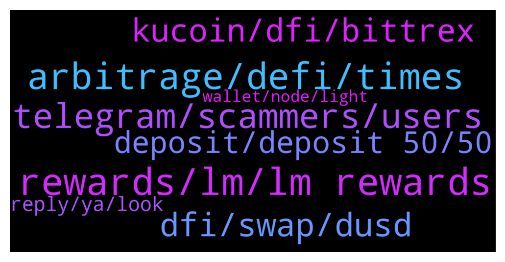

# **@CakeDeFi_EN**
 ## Analysis for **2021-12-16** - **2021-12-17**.

---

## 📊 **Basic Stats**

**n_messages_sent**: 362

---

---

## 🔝 **Top keywords and related messages**

1. **rewards, lm, lm rewards**

    @Willian --- *A lot people didn't receive the LM reward this morning i think* **--->** [TG Discussion](https://t.me/CakeDeFi_EN/153472)

    @jackluo --- *scammers keep msg us, is any staff working on the problem of no rewards this morning?* **--->** [TG Discussion](https://t.me/CakeDeFi_EN/153467)

    @fabioandreatta --- *!Support contact our CS team, they can check if your deposit was in time & if so you will get the bonus. We pay what we promote, always. In most cases the deposit is too late or not enough. Click the link below & ask our support to check* **--->** [TG Discussion](https://t.me/CakeDeFi_EN/154212)

    @Michael_Schredl --- *Daily Cashflow are your daily rewards - I think, you have to wait for the next payout, then it gets displayed correctly  Yes, team is looking into it!* **--->** [TG Discussion](https://t.me/CakeDeFi_EN/153982)

    @Willian --- *Why are rewards stuck again, no rewards this morning* **--->** [TG Discussion](https://t.me/CakeDeFi_EN/153439)

    @Willian --- *I noticed that lost rewards are not re issued... So that's bad* **--->** [TG Discussion](https://t.me/CakeDeFi_EN/153488)

2. **arbitrage, defi, times**

    @enalettin --- *Yes but please admit at least the fact that cakes withdrawal process is way slow comparing other exchanges* **--->** [TG Discussion](https://t.me/CakeDeFi_EN/153515)

    @enalettin --- *Cake please speeds up LTC withdrawals i don't know what's security metrics you apply but there is a balance between security and customer satisfaction ,,🤪* **--->** [TG Discussion](https://t.me/CakeDeFi_EN/153542)

    @enalettin --- *Cake defi not want us to make arbitrage profit i guess i sold for LTC on defi wallet then send it cake and then to other exchange it is still pending (white list address) it is more than 9 hours. it is ltc protocol what is preventing them so long to pump it on to the ltc network* **--->** [TG Discussion](https://t.me/CakeDeFi_EN/153507)

    @enalettin --- *is it normal for a ltc transfer out From Cake to take longer than 2 hours?* **--->** [TG Discussion](https://t.me/CakeDeFi_EN/153368)

    @enalettin --- *is there a dark mode theme for cake?* **--->** [TG Discussion](https://t.me/CakeDeFi_EN/153369)

    @Derrick --- *Let me be totally honest I signed  up for Cakedefi but don't understand what  to do next Can someone help me?? How does it all work?* **--->** [TG Discussion](https://t.me/CakeDeFi_EN/153813)

3. **telegram, scammers, users**

    @whiskyzulu13 --- *@fabioandreatta @Michael_Schredl these scammers individually messaged me but refused to pick up my call* **--->** [TG Discussion](https://t.me/CakeDeFi_EN/154085)

    @enalettin --- *There are some spammers in this group when someone asks for a help sends dm to that person.* **--->** [TG Discussion](https://t.me/CakeDeFi_EN/153349)

    @Willian --- *Got a message from a scammer name Daniel baptista as well, blocked and reported hope that helped to kick him* **--->** [TG Discussion](https://t.me/CakeDeFi_EN/153893)

    @Larry --- *Bernd Mack guys is the name watch out* **--->** [TG Discussion](https://t.me/CakeDeFi_EN/153459)

    @Happy --- *Can someone on the mod team report and block this guy please* **--->** [TG Discussion](https://t.me/CakeDeFi_EN/153657)

    @默默啃书小凳子~ --- *There also have 2 Daniel Batista, this one is fake one* **--->** [TG Discussion](https://t.me/CakeDeFi_EN/153670)

4. **dfi, swap, dusd**

    @ClaudioAI --- *Can someone tell me how can solve this problem? How to cleared negative DFI balance?* **--->** [TG Discussion](https://t.me/CakeDeFi_EN/153345)

    @SebastianThees --- *This will ruin the btc dfi pool. Let's see. 😂* **--->** [TG Discussion](https://t.me/CakeDeFi_EN/154088)

    @Michael_Schredl --- *You can't swap DFI to DOGE on Cake* **--->** [TG Discussion](https://t.me/CakeDeFi_EN/153685)

    @DoEvtgInLove --- *Swap DFI to DOGE on Cake to withdraw. Besides XLM, its another cheap method to send DFI out* **--->** [TG Discussion](https://t.me/CakeDeFi_EN/153684)

    @bentansg --- *Hi, I just got my LM rewards for btc-dfi and dusd-dfi (xx dfi) and noticed that it's significantly lower (avg is abt xx dfi) than what I have been getting even though the interest did not go down that much. Appreciate your help in finding out what happened pls. Thanx* **--->** [TG Discussion](https://t.me/CakeDeFi_EN/153608)

    @nadastropovic --- *If i LM dGME/dUSD on cake, are the rewards autocompouned in LM or staking DFI?* **--->** [TG Discussion](https://t.me/CakeDeFi_EN/153659)

5. **kucoin, dfi, bittrex**

    @Bence --- *withdrew some DFI from cake to kucoin like 2hrs ago and it still hasn’t arrived, cake says transaction is complete, how come?* **--->** [TG Discussion](https://t.me/CakeDeFi_EN/153405)

    @TwoDsireCrypto --- *Because it is complete at Cake it is now up to KuCoin* **--->** [TG Discussion](https://t.me/CakeDeFi_EN/153420)

    @TimescapeHD --- *Anybody else waiting so long for withdraws to kucoin? Almost 8 hours and it didnt even got confirmed by cake* **--->** [TG Discussion](https://t.me/CakeDeFi_EN/153346)

    @enalettin --- *You can withdraw to kucoin as i did it many Times you lose if you do send by wrong protocol such as using dfi protocol where the destination wallet is not DfI supported* **--->** [TG Discussion](https://t.me/CakeDeFi_EN/153357)

    @DmgBautista --- *Or you can send it to bittrex, convert into USDT and the USD or EUR, directly to your bank. Other option is DFX.swiss. Soecifically designed for DFI, no KYC under 900 EUR and with off-ramp capability ;)* **--->** [TG Discussion](https://t.me/CakeDeFi_EN/153429)

    @nadastropovic --- *You can send your DFI on kucoin, then change it to USDT, use your UDST to buy Stellar, send it to your Coinbase Pro account, then sell your Stellar to USD or EUR and then whithdraw your money on your account. In Europe and Revolut it takes 5s to have the money on the account.* **--->** [TG Discussion](https://t.me/CakeDeFi_EN/153390)

6. **deposit, deposit 50, 50**

    @marketwarriorfx --- *I signed up through the brave ad that was deposit 25 usd and get   a welcome bonus, I did that and now im told that i needed to deposit 50 usd or more in one deposit, that was not waht brave ad said* **--->** [TG Discussion](https://t.me/CakeDeFi_EN/154202)

    @rucoph --- *You want me to do deposit before getting  it?* **--->** [TG Discussion](https://t.me/CakeDeFi_EN/154007)

    @Michael_Schredl --- *Did you make your first deposit?* **--->** [TG Discussion](https://t.me/CakeDeFi_EN/154006)

    @aloscher --- *Does anyone know how the $30 deposit bonus works?* **--->** [TG Discussion](https://t.me/CakeDeFi_EN/153778)

    @vorpalmusic --- *Hey guys, I have access to a small but monied audience and I'm trying to encourage them to stake a bitcoin at Cake this month. People are asking about counterparty risk and I can't really find any information on the website. What kind of rights do we have if Cake gets hacked or suddenly implodes or whatever? (I've been a happy customer for years and am not worried about this, but my acquaintances would like some reassurance that I can't seem to find by myself).* **--->** [TG Discussion](https://t.me/CakeDeFi_EN/154154)

    @enalettin --- *i mean come on we are on crypto because regular current financial system is slow but then we hear three days i don't want to sound too pessimistic but just it doesn't fit the narrative i support cake dfi dex but this is a big pain in the butt.* **--->** [TG Discussion](https://t.me/CakeDeFi_EN/153545)

7. **reply, ya, look**

    @DmgBautista --- *Sorry did not understood what you are trying to say 😕* **--->** [TG Discussion](https://t.me/CakeDeFi_EN/153471)

    @Larry --- *Can u guys see my number?* **--->** [TG Discussion](https://t.me/CakeDeFi_EN/153457)

    @Kassius84 --- *Hey, take a look at this blog post 😎👍 https://blog.cakedefi.com/cake-simply-explained/* **--->** [TG Discussion](https://t.me/CakeDeFi_EN/153817)

    @Shuckti --- *Curios to know what they reply ya!* **--->** [TG Discussion](https://t.me/CakeDeFi_EN/153602)

    @gsf_wolfi --- *Ahh okay i see, u looked liked a sammer 😂* **--->** [TG Discussion](https://t.me/CakeDeFi_EN/153676)

    @DmgBautista --- *As a matter of fact, let me double check mine also 😅* **--->** [TG Discussion](https://t.me/CakeDeFi_EN/153475)

