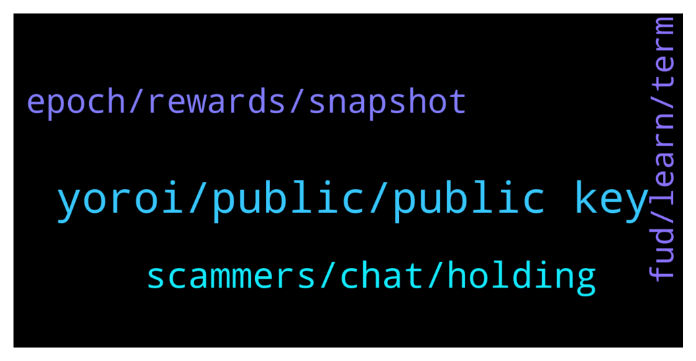

# **@Cardano**
 ## Analysis for **2021-12-16** - **2021-12-17**.

---

## 📊 **Basic Stats**

**n_messages_sent**: 105

---

---

## 🔝 **Top keywords and related messages**

1. **yoroi, public, public key**

    @iiLap --- *Why would it be? It is a full-node wallet, means it needs exactly the same spec/requirements as a full cardano-node needs. Even, behind the scene a full cardano-node is running.* **--->** [TG Discussion](https://t.me/Cardano/759920)

    @Tanmaygupta397 --- *Hi guys  A quick question  How can i transfer my Ada from binance to another wallet like metamask or trust wallet ??* **--->** [TG Discussion](https://t.me/Cardano/759299)

    @Rene1234 --- *I need a wallet that is fast and is working. This wallet is verifying the blockchain most of the times* **--->** [TG Discussion](https://t.me/Cardano/759928)

    @QuickOne_Validator --- *where you can specify the destination address* **--->** [TG Discussion](https://t.me/Cardano/759301)

    @iiLap --- *Similar to a bitcoin full node which requires more than a TB storage.* **--->** [TG Discussion](https://t.me/Cardano/759923)

    @oOOEricOOo --- *What is the difference between “full” or “light” for a wallet type? I would consider Yoroi since its on iOS too, and i have a ledger nano s.* **--->** [TG Discussion](https://t.me/Cardano/759820)

2. **scammers, chat, holding**

    @Johnnytav --- *Forget it... just block the chat! already been banned too because ive been rude with scammers, then they reported me... shame on telegram* **--->** [TG Discussion](https://t.me/Cardano/759712)

    @TheBigBossK --- *I banned the first couple of dozens, then I started replying with "how do you feel running a scam?" or something, they just don't reply lol* **--->** [TG Discussion](https://t.me/Cardano/759707)

    @Bsdklund --- *Just think guys thats a not good indicator ... Only 10% wallet holding 94% of ada lol .. just think if they sell it then where we see the ada ? Just think ... Ada tweet that we hit 2 million wallets then why only 6 % ada Holding 90% wallet thats mean 1.8 million wallets just holding 6% lf ada mean 2 billon ada and other 31 billon token just only 10% mean 0.2 millon wallets .. wow .. thats very creepy and we think about this* **--->** [TG Discussion](https://t.me/Cardano/759766)

    @TheBigBossK --- *Why is my message getting deleted?* **--->** [TG Discussion](https://t.me/Cardano/759731)

    @glitch04 --- *Don't respond to anyone that dm's you acting like support they are scammers* **--->** [TG Discussion](https://t.me/Cardano/759819)

    @Tanmaygupta397 --- *Hi  I would like to inform the community  As soon as i posted a query yesterday  Several frauds and hackers contacted me saying they are the admin of this group or they are from the official support group etc etc* **--->** [TG Discussion](https://t.me/Cardano/759642)

3. **epoch, rewards, snapshot**

    @glitch04 --- *The next epoch transition is where the new balance snapshot is taken which you will then see the increase in rewards in a future epoch.   EX you increase the balance in 308 > snapshot is taken at beginning of 309 > rewards for 309 arrive with the new adjustment in epoch 311* **--->** [TG Discussion](https://t.me/Cardano/759374)

    @glitch04 --- *Snapshot is the transition between epochs. the epochs are always offset so it appears in a future epoch when there are changes made (n+2)* **--->** [TG Discussion](https://t.me/Cardano/759342)

    @glitch04 --- *Snapshot was taken at the start of the epoch rewards for 308 arrive in 310* **--->** [TG Discussion](https://t.me/Cardano/759351)

    @perplex --- *are staking rewards taken on a snapshot at the end of an epoch? or based on the time  during the epoch when you produce blocks of your ada balance?* **--->** [TG Discussion](https://t.me/Cardano/759336)

    @perplex --- *yea, i understand that part, but say half way through a epoch, i double my ADA, that will start earning rewards as soon as your pool mints a new block?* **--->** [TG Discussion](https://t.me/Cardano/759369)

    @glitch04 --- *So smaller changes in balance are hard to notice in rewards payout between the results of a pools performance as all pools have a fluctuation from epoch to epoch.* **--->** [TG Discussion](https://t.me/Cardano/759384)

4. **fud, learn, term**

    @ChrisSTR8 --- *It is up to us to change that by voting daily for Cardano* **--->** [TG Discussion](https://t.me/Cardano/759271)

    @Bsdklund --- *In cardano Whale 🐋 twitter account recently tweet about NFT .. that  I AM SORRY TO SAY THAT CARDANO NFTs DOESN'T EXIST . PACK IT UP BOIS ... Is this is fud ?* **--->** [TG Discussion](https://t.me/Cardano/759566)

    @TheBigBossK --- *I meant long-term projects like Cardano, not "s***coins" on Cardano platform* **--->** [TG Discussion](https://t.me/Cardano/759734)

    @Lgbeano --- *Just another post trying to FUD Cardano.. they come thick and fast, it's relentless. It's down to people to listen to it or not, either way it only takes a few weeks and people move on to the next FUD topic.* **--->** [TG Discussion](https://t.me/Cardano/759772)

    @Sydney --- *Yup yup, I read that and thought it was poor “journalism” for sure, just couldn’t think of the flaw myself, but knew someone could! I certainly agree, Cardano will take sometime to develop but I think that speaks to its benefit. It’s about development, not hype and pumping. I myself have dropped everything to learn to be a developer myself. So I’m in it way more than the investment.* **--->** [TG Discussion](https://t.me/Cardano/759589)

    @ExInfernis --- *It was an irony to some messary report that didnt include cardano* **--->** [TG Discussion](https://t.me/Cardano/759572)

