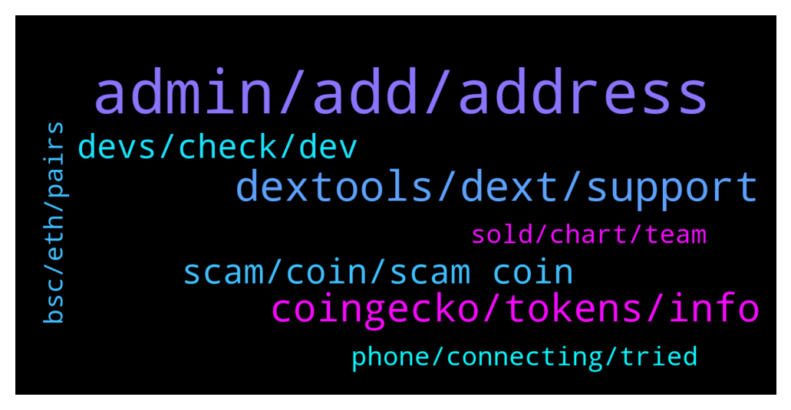

# **@DEXToolsCommunity**
 ## Analysis for **2021-12-15** - **2021-12-17**.

---

## 📊 **Basic Stats**

**n_messages_sent**: 234

---

---

## 🔝 **Top keywords and related messages**

1. **admin, add, address**

    @DonatoGzman --- *No badge just an angry bear* **--->** [TG Discussion](https://t.me/DEXToolsCommunity/314263)

    @napascual --- *That's not Frederic tag btw, it's @FredericDEXT. But he has tons of Dms so don't wait for him to respond immediately* **--->** [TG Discussion](https://t.me/DEXToolsCommunity/313819)

    @stanes --- *Don't pay anybody asking you to. Admins never DM first or ask for fund.* **--->** [TG Discussion](https://t.me/DEXToolsCommunity/313501)

    @ty_flush --- *I'll be here should you find anything ;)* **--->** [TG Discussion](https://t.me/DEXToolsCommunity/313794)

    @stanes --- *I hope he can see your badge 😅* **--->** [TG Discussion](https://t.me/DEXToolsCommunity/314270)

    @ty_flush --- *set_pair command on bot tells me only admin can do this but I am admin* **--->** [TG Discussion](https://t.me/DEXToolsCommunity/313778)

2. **dextools, dext, support**

    @nachivacrypto --- *Hi, can I ask where does dextools obtain token information from , eg. website, socials etc? Is it something that is submitted to dextools or just referenced from another source? Thanks.* **--->** [TG Discussion](https://t.me/DEXToolsCommunity/314080)

    @napascual --- *This is DEXT support. That should be asked on the private Dext Force chat* **--->** [TG Discussion](https://t.me/DEXToolsCommunity/313810)

    @LighthalzenFR --- *hello, could i contact someone to get a scam copy token removed from dextools?* **--->** [TG Discussion](https://t.me/DEXToolsCommunity/313544)

    @prep_mb --- *Hello, how to update telegram link in dextools token?* **--->** [TG Discussion](https://t.me/DEXToolsCommunity/313062)

    @WilmerToro17 --- *Hey guys. Is it legit that Tango Chain is a dext force ventures backed project?* **--->** [TG Discussion](https://t.me/DEXToolsCommunity/313921)

    @stanes --- *If you are talking about bridging your DEXT, you can by using Anyswap: https://anyswap.exchange/#/bridge We don't have a bridge integrated on Dextools.* **--->** [TG Discussion](https://t.me/DEXToolsCommunity/313344)

3. **coingecko, tokens, info**

    @JswapFinanceShona --- *Hello sir, what funds do I need to submit to show the token information on the platform page* **--->** [TG Discussion](https://t.me/DEXToolsCommunity/313499)

    @jimmyvee --- *@stanes - I don't see any other way to contact you so I'm reaching out here.  I participated in the April 2021 raise for $BUMP Bumper Finance. @frederic will not respond to DM's on TG.  I am due my tokens from that deal.  Can you please let me know when we'll receive the tokens, and/or who I should contact regarding this matter.  Thanks.* **--->** [TG Discussion](https://t.me/DEXToolsCommunity/313816)

    @bastardganpunk --- *can you sent the tokenpair link please?* **--->** [TG Discussion](https://t.me/DEXToolsCommunity/314318)

    @CryptoSadt --- *Hi we also do not see our new token listed... may I have info about?* **--->** [TG Discussion](https://t.me/DEXToolsCommunity/313480)

    @jimmyvee --- *Bumper Finance will launch on Uniswap momentarily.  We did this presale back in April 2021.  @FredericDEXT do you have an ETA on when we will receive tokens?* **--->** [TG Discussion](https://t.me/DEXToolsCommunity/313806)

    @kasparnoe --- *Hi who can i contact to fix a market cap error for a project called Captain Inu, its showing up incorrectly. Been contacting via email, twitter ,etc but with no luck. Can someone lead me to the right contact that can help me further with this issue?* **--->** [TG Discussion](https://t.me/DEXToolsCommunity/314317)

4. **scam, coin, scam coin**

    @JunLOA --- *How do we downvote scam coin?* **--->** [TG Discussion](https://t.me/DEXToolsCommunity/313139)

    @JunLOA --- *Smart? We need to downvote scam coin But we have to pay first* **--->** [TG Discussion](https://t.me/DEXToolsCommunity/313188)

    @napascual --- *That's a different check actually, there are a ton of possible scams, not only honeypots* **--->** [TG Discussion](https://t.me/DEXToolsCommunity/313915)

    @nate102 --- *Sure but in my opinion from what I see 90% of the scams are just high tax or honeypot. Other ones automatically blacklist anyone that buys etc* **--->** [TG Discussion](https://t.me/DEXToolsCommunity/313916)

    @nate102 --- *Maybe an automatic honeypot check after idk 5 minutes after trades on a token have happened would be a good idea for this? There’s no reason a coin should be honeypot or have high 99% tax if trades have occurred on the token already* **--->** [TG Discussion](https://t.me/DEXToolsCommunity/313914)

    @napascual --- *We've just removed most of the scam coins from the wallet info. Feel free to report any extra scam token* **--->** [TG Discussion](https://t.me/DEXToolsCommunity/313208)

5. **devs, check, dev**

    @stanes --- *I just checked, it's already verified, I am for warding it to the devs.* **--->** [TG Discussion](https://t.me/DEXToolsCommunity/313514)

    @DonatoGzman --- *as soon as I can acces my acct I will also check for that* **--->** [TG Discussion](https://t.me/DEXToolsCommunity/313906)

    @FredericDEXT --- *We will check, thanks for reporting* **--->** [TG Discussion](https://t.me/DEXToolsCommunity/313225)

    @CryptoSadt --- *yes, we submitted the details but they are slow... you know😂* **--->** [TG Discussion](https://t.me/DEXToolsCommunity/313512)

    @hmk18990 --- *one of the devs will check it* **--->** [TG Discussion](https://t.me/DEXToolsCommunity/314339)

    @JoeyDieleman --- *If this fails let me know but I'm pretty sure this is the issue* **--->** [TG Discussion](https://t.me/DEXToolsCommunity/313801)

6. **bsc, eth, pairs**

    @Drbolavet1 --- *Can I move from bsc to eth on dextols* **--->** [TG Discussion](https://t.me/DEXToolsCommunity/313337)

    @DonatoGzman --- *I have. Tried switching from the eth to bsc is the same* **--->** [TG Discussion](https://t.me/DEXToolsCommunity/314282)

    @omobolaji --- *stanes yes I  am talking about bridging , I have to move my BNB to Eth or vice versa but I go CEX* **--->** [TG Discussion](https://t.me/DEXToolsCommunity/313368)

    @napascual --- *We've had an issue with bsc, we're fixing it already* **--->** [TG Discussion](https://t.me/DEXToolsCommunity/313358)

    @No.One --- *Yeah all bsc pairs and hot trends* **--->** [TG Discussion](https://t.me/DEXToolsCommunity/313334)

    @stanes --- *When did you buy? It can take a while if it's on the bsc side.* **--->** [TG Discussion](https://t.me/DEXToolsCommunity/313196)

7. **sold, chart, team**

    @huseyincelikorg --- *please remove my token dexpage   " Team of this token has sold at least 2.032 BNB. Be aware of this token!" alert remove, please   https://www.dextools.io/app/bsc/pair-explorer/0x0fc72d759e875c619e7af9b20495c6894d194332  mytoken contract adress : bsc on 0xd35c64b94939ff214c1af79b6966f79a9c57e5c7* **--->** [TG Discussion](https://t.me/DEXToolsCommunity/313518)

    @pro_at_all --- *Not showing trades on time or bug is there* **--->** [TG Discussion](https://t.me/DEXToolsCommunity/314335)

    @Drcrypto --- *it says the team sold but they did not, this was just an early LP provider* **--->** [TG Discussion](https://t.me/DEXToolsCommunity/313880)

    @sertezx --- *Ftm pairs not shows real price* **--->** [TG Discussion](https://t.me/DEXToolsCommunity/313614)

    @stanes --- *DEXT PANCAKESWAP PAIR Chart and trade: https://www.dextools.io/app/pancakeswap/pair-explorer/0x4b729d5d871057f3a9c424792729217cde72410d Contract: 0xe91a8d2c584ca93c7405f15c22cdfe53c29896e3* **--->** [TG Discussion](https://t.me/DEXToolsCommunity/313626)

    @pro_at_all --- *Please fix this chart not showing trades on time* **--->** [TG Discussion](https://t.me/DEXToolsCommunity/314325)

