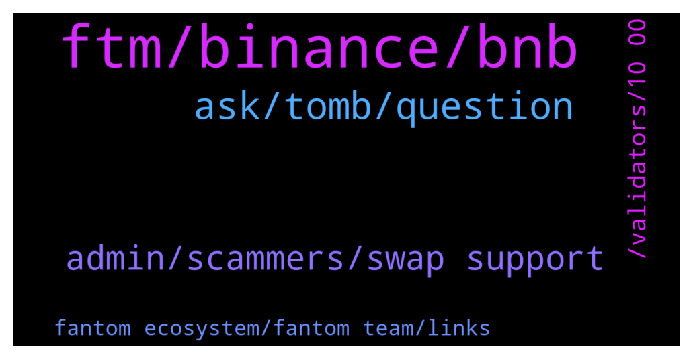

# **@Fantom_English**
 ## Analysis for **2021-12-16** - **2021-12-17**.

---

## 📊 **Basic Stats**

**n_messages_sent**: 159

---

---

## 🔝 **Top keywords and related messages**

1. **ftm, binance, bnb**

    @yandot99 --- *Why my withdrawal FTM from BSC to FANTOM address is not receive ?* **--->** [TG Discussion](https://t.me/Fantom_English/612177)

    @store_manag3r --- *Will this be ERC only or is opera supported as well?* **--->** [TG Discussion](https://t.me/Fantom_English/612215)

    @first_irfan --- *If ftm has their own binance cloud. Is it will fix this suspend thing?* **--->** [TG Discussion](https://t.me/Fantom_English/612473)

    @Janevietani --- *Helpful tip:   if you want a cheaper alternative than bridging ftm and paying eth gas From binance,crypto.com or kucoin, get BNB and withdraw as BNB BEP20, then use https://spookyswap.finance/bridge To bridge BNB BEP20 to BNB Fantom Then use spookyswap to swap BNB Fantom to FTM  You will need ftm gas for transaction. Use the faucet https://www.mentasuave01-tools.com/* **--->** [TG Discussion](https://t.me/Fantom_English/612630)

    @Claudiu --- *Found my FTM tokens... They were sent as anyFMT....not sure what that means. Now, have you ever had to swap anyFTM to FTM? How you one do it? 😁Metamask does not have that option yet..* **--->** [TG Discussion](https://t.me/Fantom_English/612561)

    @Daryoosh_As_1999 --- *We sent from trustwallet to Coolwallet pro did not show inventory Then we connected the Coolwallet pro to the trustwallet. The open inventory inside the trustwallet was zero* **--->** [TG Discussion](https://t.me/Fantom_English/612156)

2. **ask, tomb, question**

    @pajamasfreak --- *Which wallet did you send to* **--->** [TG Discussion](https://t.me/Fantom_English/612155)

    @vesqm --- *well maybe it helps to ask the question here, if it's a good question it will get noticed.* **--->** [TG Discussion](https://t.me/Fantom_English/612590)

    @Ahmad_B0 --- *What is a Phantom Contract to Buy at a Pancake Swap?* **--->** [TG Discussion](https://t.me/Fantom_English/612693)

    @koun_44 --- *Hello everybody Is anyone staking on tomb ?* **--->** [TG Discussion](https://t.me/Fantom_English/612502)

    @Claudiu --- *Oh.... Clicked on it. Liquidity = 0 on all of the coins .... Hmmmm... Reloading the page...* **--->** [TG Discussion](https://t.me/Fantom_English/612546)

    @Janevietani --- *use your exchange maybe. its depend on where do you live, what exchange you can use* **--->** [TG Discussion](https://t.me/Fantom_English/612661)

3. **admin, scammers, swap support**

    @JOANNE --- *Admin please do something about these scammers in this group, I joined just now and lot of scammers already text me* **--->** [TG Discussion](https://t.me/Fantom_English/612004)

    @slickrick6 --- *You need to be vigilant. Nothing we can do about scammers messaging you* **--->** [TG Discussion](https://t.me/Fantom_English/612008)

    @vesqm --- *what do you need a dev for?* **--->** [TG Discussion](https://t.me/Fantom_English/612588)

    @Claudiu --- *Thanks youuuu. Yep... Lots of spam coming my way ha haaa. But this is still the best way to solve these tiny issues. Scammers come get me ha haaa* **--->** [TG Discussion](https://t.me/Fantom_English/612565)

    @pietpatati --- *You know Howe dumb that sounds .. with your fake advertisment* **--->** [TG Discussion](https://t.me/Fantom_English/612400)

    @Joe_Nazir --- *Remove Emre please. I trust no one want scammers in the group* **--->** [TG Discussion](https://t.me/Fantom_English/612363)

4. **, validators, 10 00**

    @ll --- *some validators give a bit of bonus* **--->** [TG Discussion](https://t.me/Fantom_English/612684)

    @Sverrir --- *Does all validators have same Apr at Fantom network staking?* **--->** [TG Discussion](https://t.me/Fantom_English/612679)

    @Janevietani --- *there is another one but its 29 nov . this was share by validator https://bootstraps.ultimatenodes.io/fantom/pruned/* **--->** [TG Discussion](https://t.me/Fantom_English/612083)

    @WSFLotus --- *Correction: Dec. 18th (10:00 AM UTC) — Dec. 21th (10:00 AM UTC)* **--->** [TG Discussion](https://t.me/Fantom_English/612646)

    @abz352 --- *If I check deposits, its erc20 only currently. May change in the future* **--->** [TG Discussion](https://t.me/Fantom_English/612334)

    @Temp --- *I am having a hard time finding this in the docs* **--->** [TG Discussion](https://t.me/Fantom_English/611972)

5. **fantom ecosystem, fantom team, links**

    @Janevietani --- *those tip are to enter fantom ecosystem not into fiat* **--->** [TG Discussion](https://t.me/Fantom_English/612657)

    @ftmfiends --- *Problem is Fantom is dominated by cheerleaders not investors* **--->** [TG Discussion](https://t.me/Fantom_English/612455)

    @bharathcoorg --- *Hello Fantomians, Please suggest some of the Good staking providers in Fantom Ecosystem.* **--->** [TG Discussion](https://t.me/Fantom_English/612374)

    @Joe_Nazir --- *Please do not upload links if you are not part of official Fantom team.  Worth mention people should not click any links to avoid phishing unless from the official Fantom team.* **--->** [TG Discussion](https://t.me/Fantom_English/612364)

    @Abdullah --- *Will fantom ever go up people* **--->** [TG Discussion](https://t.me/Fantom_English/611909)

    @investonaut --- *is there any resource for Fantom on gamefy ?* **--->** [TG Discussion](https://t.me/Fantom_English/612110)

