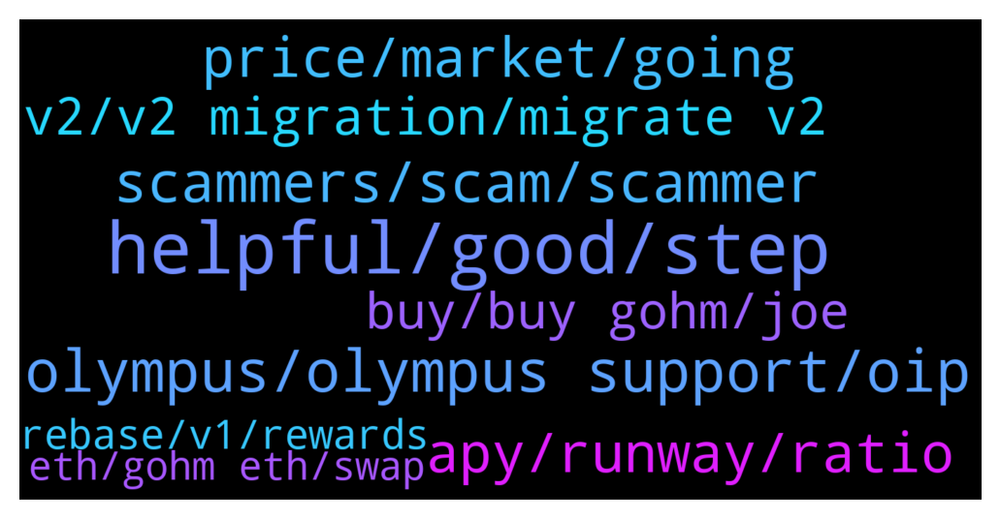

# **@OlympusTG**
 ## Analysis for **2021-12-16** - **2021-12-17**.

---

## 📊 **Basic Stats**

**n_messages_sent**: 1526

---

---

## 🔝 **Top keywords and related messages**

1. **helpful, good, step**

    @Poopoo (never dm first) --- *where did you get yours? see here: https://docs.olympusdao.finance/main/contracts/tokens* **--->** [TG Discussion](https://t.me/OlympusTG/124610)

    @bike4peace --- *just because I hang out with you and you want me to make babies so our kids can play together and transfer gOHM* **--->** [TG Discussion](https://t.me/OlympusTG/125394)

    @Rusowsky --- *Man congrats! I’m not there yet, and that's why I don't have time😂 Super happy for you ser!!!!* **--->** [TG Discussion](https://t.me/OlympusTG/123625)

    @Poopoo (never dm first) --- *learn how to find information instead of asking* **--->** [TG Discussion](https://t.me/OlympusTG/124175)

    @GUICenter --- *Thanks, I'll keep watching for it.* **--->** [TG Discussion](https://t.me/OlympusTG/123950)

    @pacificnorriswest --- *Do you guys know @bike4peace is soul cool 😎* **--->** [TG Discussion](https://t.me/OlympusTG/123852)

2. **olympus, olympus support, oip**

    @bigmushroom --- *Google OlympusDAO v2 medium post, in short, it's getting ready for 4, 4* **--->** [TG Discussion](https://t.me/OlympusTG/124018)

    @Poopoo (never dm first) --- *Missing or incorrect data?  • Olympus v2 is currently being launched. • APY is lower as we have to leave some supply in OHM v1 for now (including in liquidity). This will change over time. • Website, app, and Dune dashboards may temporarily show incorrect data for treasury value, backing, and runway.  🙏🏽 Please be patient and don't rely on that data until the launch has been completed.* **--->** [TG Discussion](https://t.me/OlympusTG/123777)

    @Nitin --- *Can anyone help how olympus makes money* **--->** [TG Discussion](https://t.me/OlympusTG/124429)

    @Poopoo (never dm first) --- *go to Olympus website - Docs - search current index* **--->** [TG Discussion](https://t.me/OlympusTG/124173)

    @thuthur --- *And I thought that Olympus would be a nice way to balance the drops on the market 😅😅* **--->** [TG Discussion](https://t.me/OlympusTG/125800)

    @stacyd82d --- *It is used o calculate a few of the different opportunities Olympus offers my ohmie.* **--->** [TG Discussion](https://t.me/OlympusTG/123332)

3. **scammers, scam, scammer**

    @mayoketchup --- *Oh dude shitt. Scammers are bitches* **--->** [TG Discussion](https://t.me/OlympusTG/124485)

    @Brent Louis --- *Why was my message deleted ?  I said this is the username of the person who scammed me !!  @shogunf1x* **--->** [TG Discussion](https://t.me/OlympusTG/124510)

    @RockyT31 --- *Guys I just got scammed.  I’m so stupid. On ohm website I asked for help/support (in forum).  Took me to an identical website  - the chat 💬 operator said send a secure text box to help manually connect to wallet. It’s asked me for seed phrase. (Yeah I know) and within minutes all my assets cleared out* **--->** [TG Discussion](https://t.me/OlympusTG/124481)

    @Ap0l1o --- *Because that is not who is the scammer* **--->** [TG Discussion](https://t.me/OlympusTG/124518)

    @Ossyboi --- *Man you are about to be spammed by 50 scammers claiming to be support. Do not engage* **--->** [TG Discussion](https://t.me/OlympusTG/123520)

    @Ap0l1o --- *Don’t google, lots of scam there* **--->** [TG Discussion](https://t.me/OlympusTG/124020)

4. **price, market, going**

    @Ap0l1o --- *market correction man... chill and do not watch the price* **--->** [TG Discussion](https://t.me/OlympusTG/123610)

    @Cen_Boplin --- *Oh I am in it, just concerned with all that’s happening, price drop, treasury drop, backing drop, all are bad signs.* **--->** [TG Discussion](https://t.me/OlympusTG/123607)

    @jianye --- *why is market value of treasury asset dropping dramatically these days, these asset cannot be withdrawn if I understand correctly* **--->** [TG Discussion](https://t.me/OlympusTG/123963)

    @mengjack22 --- *the bond discounts look a bit wacky right now* **--->** [TG Discussion](https://t.me/OlympusTG/124597)

    @rhythmmaster --- *I think people are freaking out because even though the price falls, they see the accrual of more ohm.  Where as with gohm, you just see a value, and if you wake up and see a lower value of 10k USD, the first response is to think it is not increasing because the numbers aren't in your face.  My 2 cents worth anyway* **--->** [TG Discussion](https://t.me/OlympusTG/124611)

    @cdp279 --- *lol  the best is - "why price go down? DEVS do something!!!"* **--->** [TG Discussion](https://t.me/OlympusTG/125848)

5. **apy, runway, ratio**

    @Ravish83 --- *Apy didnt increase it s error or what 4000%* **--->** [TG Discussion](https://t.me/OlympusTG/123776)

    @r0b0k1d --- *Wrong. The key is to understand the difference between APY and APR.* **--->** [TG Discussion](https://t.me/OlympusTG/125528)

    @Poopoo (never dm first) --- *dynamic, apy and runway are related, usually less apy > longer runway, and they are both impacted by bonding as well, please join the Discord to ask this question, you'll get better answer there* **--->** [TG Discussion](https://t.me/OlympusTG/124648)

    @Max --- *I know they are related and that the change in APY changes the runway. . But is this relation (or ratio) dynamic or static? PD: if nobody can answer I will ask on discord of course* **--->** [TG Discussion](https://t.me/OlympusTG/124661)

    @Daus_666 --- *Is there any difference in APY between v1 and v2? V1 APY is very low atm.* **--->** [TG Discussion](https://t.me/OlympusTG/124559)

    @syberk1d --- *The less people that are staked into the project, the more the apy goes up,   I’m also confused here as what it looks like on paper is  More people have staked for it to drop in apy so drastically, when in actual fact we pretty much can safely assume it’s the opposite since the migration, more people have been uneasy with it, and complaining, so I put my money on it that more people would of no doubt in staked and got out, thus , the apy should of gone up due to this, I’ve lost a lot of faith in Olympus, I have more faith in my wonderland bag than Olympus now, feel like they have robbed us of nearly 50% of potential 3,3  future gains* **--->** [TG Discussion](https://t.me/OlympusTG/124918)

6. **v2, v2 migration, migrate v2**

    @DD0820 --- *i understand there will be plebs who cry and whine and say “oh i invested in $1000, whatever” but the V2 migration does cause some confusion and these things do weigh on credibility. the price whiners are silly, but the V2 migration speed and professionalism is something project team needs to take responsibility for* **--->** [TG Discussion](https://t.me/OlympusTG/125349)

    @Aetheramd --- *How do u migrate to v2 and what are the benefits?* **--->** [TG Discussion](https://t.me/OlympusTG/124440)

    @Cali_millionaire --- *Is there any way to know if I moved to V2?* **--->** [TG Discussion](https://t.me/OlympusTG/125615)

    @hans331 --- *How do I migrate from V1 to V2 version?  Is there a procedure?* **--->** [TG Discussion](https://t.me/OlympusTG/124381)

    @James --- *How do I know if I for sure migrated to V2? Is there a way to verify from the stake page if I migrated correctly onto V2?* **--->** [TG Discussion](https://t.me/OlympusTG/124140)

    @hamedabdo7 --- *Ok what’s the changes in v2 for people?* **--->** [TG Discussion](https://t.me/OlympusTG/123144)

7. **buy, buy gohm, joe**

    @Poopoo (never dm first) --- *Buy gOHM on trader joe (AVAX) gOHM contract address on AVAX: 0x321e7092a180bb43555132ec53aaa65a5bf84251  What is gOHM: https://twitter.com/OlympusDAO/status/1465410905542385677  gOHM documentation: https://docs.olympusdao.finance/main/contracts/tokens#gohm* **--->** [TG Discussion](https://t.me/OlympusTG/124604)

    @Ro_2060 --- *I used swaped my wsohm to gohm using traderJoe not sure if this was the cheapest way* **--->** [TG Discussion](https://t.me/OlympusTG/125691)

    @SEC_HEAD --- *I still have one last question how to stake gohm bought from trader joe to olympusdao.finance* **--->** [TG Discussion](https://t.me/OlympusTG/124635)

    @GSG_AP --- *What can I do with gOHM? Is there LP pools where I can supply gOHM for extra yield?* **--->** [TG Discussion](https://t.me/OlympusTG/123843)

    @BigChicken --- *Does anybody know how to sell from gohm?* **--->** [TG Discussion](https://t.me/OlympusTG/124868)

    @A --- *what’s the fastest cheapest way to get and stake gOHM?* **--->** [TG Discussion](https://t.me/OlympusTG/124252)

8. **rebase, v1, rewards**

    @GSG_AP --- *Question regarding rebase, is every rebasing happening every 8 hrs without delay?  If so, the rebase moments should always be at the same times of the day but it seems it changes everyday* **--->** [TG Discussion](https://t.me/OlympusTG/125190)

    @taxram --- *Sorry if this was discussed already but I haven’t checked in a while, I haven’t gotten the rebase in a while. Is there something I’m missing?* **--->** [TG Discussion](https://t.me/OlympusTG/124758)

    @vdt153 --- *has the rebases on fsohm stopped? getting double hit, falling ohm price and no rebases either* **--->** [TG Discussion](https://t.me/OlympusTG/123112)

    @brunomigrodrigues --- *Hi, I have some sOHM v2, but my APY stopped appearing the last few days. Have not had any rebase since.* **--->** [TG Discussion](https://t.me/OlympusTG/125487)

    @bangjingjing --- *Hello, Is v1 still get rebase reward ?* **--->** [TG Discussion](https://t.me/OlympusTG/125107)

    @vk55 --- *so my sohm isn’t accumulating rebases anymore…will they be added later?* **--->** [TG Discussion](https://t.me/OlympusTG/123985)

