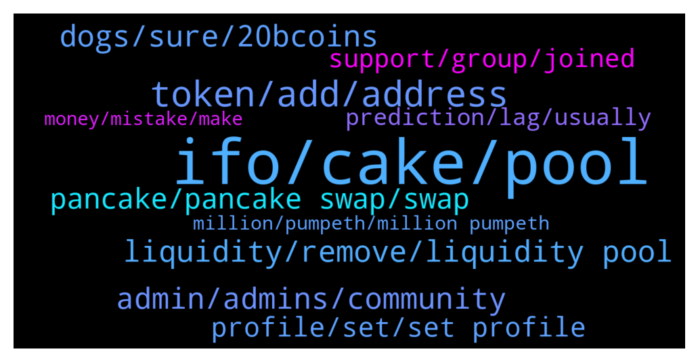

# **@PancakeSwap**
 ## Analysis for **2021-12-16** - **2021-12-17**.

---

## 📊 **Basic Stats**

**n_messages_sent**: 1373

---

---

## 🔝 **Top keywords and related messages**

1. **ifo, cake, pool**

    @Dom --- *I got a Question :) Whta is the Differenz ? What is the real price i can buy IFO 2$ or 8,19$ ? Every IFO has 2 Prices by unlimited Sale ? Pls give Feedback :D    Price per PORTO: $2 Price per PORTO with fee: ~$8,19    Price per SANTOS: $2.5 Price per SANTOS with fee: ~$6,11* **--->** [TG Discussion](https://t.me/PancakeSwap/2199394)

    @HAITIENLK --- *stake pool ifo 7 days, you have avarage balance, it's that is ticket/credit for join IFO 21/12 bro.* **--->** [TG Discussion](https://t.me/PancakeSwap/2193979)

    @FinanceVPN --- *"The new IFO CAKE Pool is currently not included in the voting power calculation. We are aware of this issue and are coming up with a fix."  I don't understand how the voting  power is reletive with new ifo cake pool? @Luukku1* **--->** [TG Discussion](https://t.me/PancakeSwap/2193889)

    @Luukku1 --- *APR/APY values are influenced by:  - Cake price  - Liquidity for that reward token which is related with price  - Total staked cake amount in that pool  - Total reward token allocation / reward per block for that pool  - Token’s price* **--->** [TG Discussion](https://t.me/PancakeSwap/2193535)

    @CryptoKel --- *I'm trying to stake. I already have cake* **--->** [TG Discussion](https://t.me/PancakeSwap/2197694)

    @ch9211 --- *The IFO credits that you get from Cake pool to buy new projects launches, are these tokens that you buy from IFO allocations always vested for a certain period of time, or you can sell them whenever you want?.* **--->** [TG Discussion](https://t.me/PancakeSwap/2201541)

2. **token, add, address**

    @matlunga --- *guys can you tell me if there are some scam token here?* **--->** [TG Discussion](https://t.me/PancakeSwap/2194298)

    @Tonio_cryptonio --- *guys I have found a stealth launch and I was wondering if there could be any way to find out something about the contract...maybe someone has a suggestion? the token is gamefever* **--->** [TG Discussion](https://t.me/PancakeSwap/2195072)

    @ch9211 --- *But I’m at least guaranteed that I’ll be able to buy at least some tokens, I’m just not guaranteed how many?* **--->** [TG Discussion](https://t.me/PancakeSwap/2194371)

    @Ceddi200 --- *Here you can check whether the token you bought is a scam. Paste the smart contract address! 👇👇👇👇👇 https://honeypot.rugdoc.io/* **--->** [TG Discussion](https://t.me/PancakeSwap/2194309)

    @SecuestPcs --- *It is about token contract.  You can contact with token group/team.* **--->** [TG Discussion](https://t.me/PancakeSwap/2195173)

    @CakeCompounder --- *Cheaper to research a token BEFORE you buy it. 😬* **--->** [TG Discussion](https://t.me/PancakeSwap/2192775)

3. **liquidity, remove, liquidity pool**

    @Nirsick --- *Hello, I want to remove liquidity from my own coin to get my bnbs back, but when I press on remove and then confirm nothing happens. How can I do it?* **--->** [TG Discussion](https://t.me/PancakeSwap/2195658)

    @Tobal --- *Hi, I added liquidity to a pool for revenue coin yesterday and now I can’t find it, and when I search for it it says that I don’t have a liquidity or pool active, help!* **--->** [TG Discussion](https://t.me/PancakeSwap/2199310)

    @MyMoneyIsHere --- *It launched today, of course. I received all my coins from first transaction, liquidity had nothing to do with it. All coins there. Tried buying more, then this happened. So as more liquidity comes, my coins deposit, not sure what you mean by that* **--->** [TG Discussion](https://t.me/PancakeSwap/2193604)

    @Shiraz --- *The question is if I am the first liquidity provider in pancake that means tha token is new on pancake because I created the token so the question is if this happen than how can I calculate the price of token on pancake the price is mentioned 1 bnb = _token but what's the formula behind it* **--->** [TG Discussion](https://t.me/PancakeSwap/2195502)

    @lucarpintero --- *How can we chek on SYL/WBNB liquidity provider how many reward we are earning* **--->** [TG Discussion](https://t.me/PancakeSwap/2195832)

    @Rugendinger the Third --- *Hi how do I remove liquidity from this pair "Cake-LP"* **--->** [TG Discussion](https://t.me/PancakeSwap/2193095)

4. **dogs, sure, 20bcoins**

    @xXxGreenBullxXx --- *ALWAYS! get you adress from there, yw* **--->** [TG Discussion](https://t.me/PancakeSwap/2194650)

    @donzzyy --- *😂😂😂😂 we should play a game or put up a pole I'm sure someone will get it correct 💯😊* **--->** [TG Discussion](https://t.me/PancakeSwap/2192729)

    @Chu hua --- *Lol 😂 tf  Thats better now* **--->** [TG Discussion](https://t.me/PancakeSwap/2195397)

    @CakeCompounder --- *Your dog is beautiful, bro 🙏🏽* **--->** [TG Discussion](https://t.me/PancakeSwap/2201513)

    @Caketoshi --- *Hahaha 😂 because you are asking* **--->** [TG Discussion](https://t.me/PancakeSwap/2195048)

    @K --- *Thank you guys I will be aware next time😩* **--->** [TG Discussion](https://t.me/PancakeSwap/2192767)

5. **admin, admins, community**

    @CakeCompounder --- *Hey,   My fellow admin replied to you bro   https://t.me/PancakeSwap/2195049* **--->** [TG Discussion](https://t.me/PancakeSwap/2195086)

    @majesticman123 --- *is there any admin on or no?* **--->** [TG Discussion](https://t.me/PancakeSwap/2195124)

    @Obaito --- *Advertencia: Administradores nunca envían mensajes privados. Cuidado con los estafadores!* **--->** [TG Discussion](https://t.me/PancakeSwap/2196097)

    @eddy51342001 --- *Who can reply lol? Admins should know these answers..* **--->** [TG Discussion](https://t.me/PancakeSwap/2195092)

    @Minitw --- *Im new is luukku admin ?* **--->** [TG Discussion](https://t.me/PancakeSwap/2194669)

    @BigHenry31 --- *Because there is none. I'm trying to get a legit admin to dm me back* **--->** [TG Discussion](https://t.me/PancakeSwap/2195253)

6. **pancake, pancake swap, swap**

    @BigHenry31 --- *So basically there is zero pancake swap support and you have to do your own research and figure it out yourself* **--->** [TG Discussion](https://t.me/PancakeSwap/2195306)

    @adraza2000 --- *Pancake swap plz Louche any gaming project  Or meta project* **--->** [TG Discussion](https://t.me/PancakeSwap/2193790)

    @shane89p --- *Has anyone purchased $Mcc on pancake swap? Can’t work out if it’s available on here or not* **--->** [TG Discussion](https://t.me/PancakeSwap/2192611)

    @edvardsmiezitis --- *thanks, great first experience with pancake swap :(* **--->** [TG Discussion](https://t.me/PancakeSwap/2192576)

    @NotRichEnough --- *When can we expect to see a fix on pancake swap predictions* **--->** [TG Discussion](https://t.me/PancakeSwap/2195998)

    @Kevin --- *Good day os pancake swap down?* **--->** [TG Discussion](https://t.me/PancakeSwap/2194870)

7. **profile, set, set profile**

    @TomorrowlandForLife --- *But you said you can’t create the profile. What did you try?* **--->** [TG Discussion](https://t.me/PancakeSwap/2193008)

    @fitzkie --- *Help Please. Troubleshoot has nothing.  I am trying to set up a profile.  First step worked, got the Collectible.  STEP 2 does NOT work.  Step 2 is Set Profile Picture.  Says to choose collectible, so I choose the NFT I bought and paid for.  and then the enable button becomes clickable? (turns blue/green)   I then click enable and nothing happens.  How to complete step 2?* **--->** [TG Discussion](https://t.me/PancakeSwap/2199557)

    @SoFarSoGood007 --- *Hi does anyone know why it is not proceed when I set name for profile, I clicked confirm but it is not move next step* **--->** [TG Discussion](https://t.me/PancakeSwap/2194743)

    @supnan --- *I must have tried 10 times to set up profile.  How many times do I have to pay before it lets me set it up  Always spinning when I put in name  Anyone else have this issue* **--->** [TG Discussion](https://t.me/PancakeSwap/2192996)

    @Inv_million --- *Which one of these is best to use as profile?* **--->** [TG Discussion](https://t.me/PancakeSwap/2198942)

    @joeparys --- *Still not working for profile… when will this be fixed smh* **--->** [TG Discussion](https://t.me/PancakeSwap/2192553)

8. **support, group, joined**

    @Jorge --- *Is it normal to join and receive a call* **--->** [TG Discussion](https://t.me/PancakeSwap/2192145)

    @Luxury hotel & Flight B/F Class booker --- *Is there a SUPPORT in this group?  A guy named SUPPORT dm me one minute ago.* **--->** [TG Discussion](https://t.me/PancakeSwap/2196327)

    @Almaraghi85 --- *I just joined today and i got like 20 calls from 20 different help desk accounts 😂😂😂* **--->** [TG Discussion](https://t.me/PancakeSwap/2193451)

    @eugene_fedchenko --- *Oh, ok, thank you btw is it ok that after I joined that chat Im getting numerous messages from different help/support guys  look pretty much like a scam* **--->** [TG Discussion](https://t.me/PancakeSwap/2195634)

    @joda2673 --- *Yo, what's up with all the support members that are texting me? All say they are from the support team but it seems kinda fishy* **--->** [TG Discussion](https://t.me/PancakeSwap/2193959)

    @David690 --- *I joined 30 minutes ago and got like 5 calls, what a nightmare* **--->** [TG Discussion](https://t.me/PancakeSwap/2192155)

9. **prediction, lag, usually**

    @Sanjith_an --- *What has happened to prediction? My money is stuck.* **--->** [TG Discussion](https://t.me/PancakeSwap/2199643)

    @Luukku1 --- *No problelm, block and report all, dont answer!* **--->** [TG Discussion](https://t.me/PancakeSwap/2196088)

    @rpoole69 --- *It started on Dec 10th at 7:00 am EST, so tomorrow at same time I assume, since they are 7 days* **--->** [TG Discussion](https://t.me/PancakeSwap/2194454)

    @KunalBhatia --- *I again 28125, I did not get the reward even after correct prediction. So previously, one out of 28035, 36,40,41 and now this.  Can you please check and help ?* **--->** [TG Discussion](https://t.me/PancakeSwap/2192456)

    @Greg --- *I cleaned up and started again but still pending. What is the average waiting time* **--->** [TG Discussion](https://t.me/PancakeSwap/2198713)

    @HAITIENLK --- *because it's relate nft, need time to load. if have problem, please wait, or reload bro. don't worry.* **--->** [TG Discussion](https://t.me/PancakeSwap/2199583)

10. **million, pumpeth, million pumpeth**

    @Chris --- *What but before I bought the 70 million it clearly showed that I owned 69,080,000* **--->** [TG Discussion](https://t.me/PancakeSwap/2197527)

    @Ben --- *Looks like you have 139 million pumpeth* **--->** [TG Discussion](https://t.me/PancakeSwap/2197499)

    @Chris --- *Yes I made 1 transaction for 69 million pumpeth and then 2nd transaction was for 70 million pumpeth* **--->** [TG Discussion](https://t.me/PancakeSwap/2197485)

    @Chris --- *I bought 69 million then I bought over 70 million* **--->** [TG Discussion](https://t.me/PancakeSwap/2197404)

    @Chris --- *Hai Tien I meant I have purchased over 80 million pump eth and now it's only showing I have 135 thousand* **--->** [TG Discussion](https://t.me/PancakeSwap/2197391)

    @Chris --- *I have purchased over 80 million pumpeth and now it's only showing 130 thousand* **--->** [TG Discussion](https://t.me/PancakeSwap/2197337)

