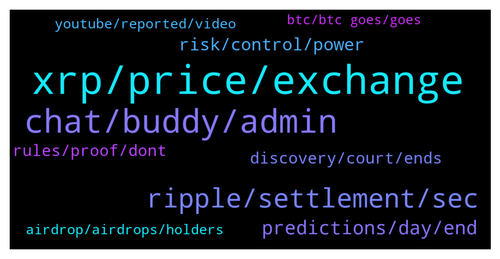

# **@Ripple**
 ## Analysis for **2021-12-16** - **2021-12-17**.

---

## 📊 **Basic Stats**

**n_messages_sent**: 327

---

---

## 🔝 **Top keywords and related messages**

1. **xrp, price, exchange**

    @Letum9 --- *You saw the coin marketcap glitch but are telling me to go and check liquidity stats on the same or similar places yet know they were manipulated a few day ago. FAIL.* **--->** [TG Discussion](https://t.me/Ripple/3023614)

    @Pahlavimohammadreza --- *Canadian exchange deletes xrp. Do they know something we do not know? Has xrp failed and does a Canadian exchange want to protect its investors? What is the matter? I have put all my assets in xrp.  Please tell me if anyone knows anything. Should we sell and get out? Do xrp owners think of small shareholders?🤔🤔I'm very worried.* **--->** [TG Discussion](https://t.me/Ripple/3023127)

    @marianmp --- *Can anyone remember how much it took for Xrp to reach from 10s of cents to almost 4 dollars ....??? I'm curios how agresive was the pump* **--->** [TG Discussion](https://t.me/Ripple/3023554)

    @Steve_Uilaoghaire --- *In the U S, only place I could find to but x r p is Uphold. I applied to be part of Upholds referral program. I got five people to buy $500 or more each Which qualified me for $10 in Bitcoin  They cheated me out of it, said denied, but never got a reason. That in itself makes me worry about uphold* **--->** [TG Discussion](https://t.me/Ripple/3023436)

    @marianmp --- *People sold their house ,cars and so on.....to buy xrp 😂* **--->** [TG Discussion](https://t.me/Ripple/3023575)

    @megahitte --- *Dont look at the charts just know that xrp will be 10 dollars before new years* **--->** [TG Discussion](https://t.me/Ripple/3023945)

2. **chat, buddy, admin**

    @Eesmer_06 --- *I don't understand exactly what you are wondering* **--->** [TG Discussion](https://t.me/Ripple/3023707)

    @JesusJames --- *what does your bio say in English  ?* **--->** [TG Discussion](https://t.me/Ripple/3023703)

    @JesusJames --- *better to keel it in here bro* **--->** [TG Discussion](https://t.me/Ripple/3023677)

    @JesusJames --- *okay ill tell them all later then when you're asleep* **--->** [TG Discussion](https://t.me/Ripple/3023520)

    @Letum9 --- *No worries, miss clicks happen. You should of seen me yawn a few weeks ago and while stretching my arm broke the laptop screen... 😂😂😂 Comedy central* **--->** [TG Discussion](https://t.me/Ripple/3023670)

    @Letum9 --- *I'll stop with the sarcasm though, I think I'm going overboard sometimes with it 😂 my bad..* **--->** [TG Discussion](https://t.me/Ripple/3023667)

3. **ripple, settlement, sec**

    @erik_sz91 --- *What are you talking about? Brad Garlinghouse declared months ago they WON'T settle. They will win.* **--->** [TG Discussion](https://t.me/Ripple/3023350)

    @erik_sz91 --- *If the SEC is like ".... Ok.... Your evidence is great... Just gimme a couple of bucks and end this" (being a "couple of bucks" maybe 500k or so)  maybe they will settle. But ripple won't have a multi millonaire loss just for settle* **--->** [TG Discussion](https://t.me/Ripple/3023375)

    @AROpitz --- *In my opinion, it’s already closed. All of them only waiting for the best time to publish. If they announce it before Christmas 🎄 it can destroy some families, in case of SEC won. In case ripple is King (won) so Christmas can be really good for some families… so let’s pray for a wonderful Christmas 🎄* **--->** [TG Discussion](https://t.me/Ripple/3023068)

    @Jake_ripple_XRP --- *SETTLEMENT.... If the Ripple/XRP vs. SEC case comes to a settlement, it could possibly cost Ripple a huge sum... maybe the requirement of divesting some of their XRP... but this would be fantastic for all parties... if at the end of the day XRP is considered a non-security and gains regulatory clarity from the SEC.... Is there another crypto out there that has regulatory clarity?...... Right.... So, big money and financial institutions will get into XRP unrestrained... This will be OUR DAY... and Ripple's remaining XRP stash will increase in value by billions!! Win, win, win... in every way.... IMO* **--->** [TG Discussion](https://t.me/Ripple/3023502)

    @Rektallstar --- *Yes I know they SAID that. However that's typically not how things go. The legal team may have been proposed a situation to end this with out a bloody expensive battle and in their eyes its a "win". To "TRULY WIN" you gotta take it all the way and hope for the best, in a settlement you have a predetermined outcome with both parties in agreement. Typically the best way to resolve things.* **--->** [TG Discussion](https://t.me/Ripple/3023356)

    @erik_sz91 --- *Let me translate that into more easy language to see if I understand correctly. Settlement would be like Ripple saying "ok, this may be or not a security.... Take this money SEC, and don't bother me again"   and wining would be "Hey SEC, F*ck you, the judge said xrp is not a security, so I owe you nothing" and then xrp going to the moon* **--->** [TG Discussion](https://t.me/Ripple/3023361)

4. **predictions, day, end**

    @Delboy1967 --- *Bitboy hasn't had 1 prediction come true, since I can remember* **--->** [TG Discussion](https://t.me/Ripple/3023162)

    @Andrew --- *We are in a bull run* **--->** [TG Discussion](https://t.me/Ripple/3022923)

    @Riiggo --- *Doubt it will be that much* **--->** [TG Discussion](https://t.me/Ripple/3023839)

    @CyrptocuErgin --- *Hey guys what is the predictions for 12 dec just before snapshot day? Will it go up for one or 2 days and than down again?* **--->** [TG Discussion](https://t.me/Ripple/3023871)

    @Letum9 --- *It will end one day 😛 who cares which date? 😀* **--->** [TG Discussion](https://t.me/Ripple/3023455)

    @CasperLayer1 --- *We coming for IT, Just 1k away. This weekend we go in 44k area. Excatly like i said like all othere predictions this last month* **--->** [TG Discussion](https://t.me/Ripple/3023985)

5. **risk, control, power**

    @marianmp --- *They say they are the future of banking ....it's a real thing ....like a bank not virtual one* **--->** [TG Discussion](https://t.me/Ripple/3023483)

    @marianmp --- *They don't want the average JO to have the power they want to control the power that means MONEY* **--->** [TG Discussion](https://t.me/Ripple/3023527)

    @Eesmer_06 --- *Yeah . I have cashed out many times.* **--->** [TG Discussion](https://t.me/Ripple/3023659)

    @JesusJames --- *its not government funded they rely on fines through enforcement to pay their bills* **--->** [TG Discussion](https://t.me/Ripple/3023544)

    @Letum9 --- *Hold dollars, huge profits. Really I'm not joking. Has a huge APY 😂* **--->** [TG Discussion](https://t.me/Ripple/3023505)

    @Letum9 --- *Billions? Meh, not selling. They can keep their dollars 😂😂😂* **--->** [TG Discussion](https://t.me/Ripple/3023504)

6. **discovery, court, ends**

    @JustNNM --- *This meeting was scheduled from Feb so its not like its new info. Its part of discovery proceedings.* **--->** [TG Discussion](https://t.me/Ripple/3023358)

    @Brian --- *Yeah but this states fact discovery. And that ended in November I believe.* **--->** [TG Discussion](https://t.me/Ripple/3023086)

    @JustNNM --- *They extended Expert Discovery to 1/19/22* **--->** [TG Discussion](https://t.me/Ripple/3023080)

    @Brian --- *Question on your opinions...  Do you guys think the trial ends by 1/14/22 since that's when expert discovery ends?  I heard somewhere that it's in the SEC's best interest to not let things get further than that.  Are they officially in the trial phase if they let that date go by without settling?  Thanks!* **--->** [TG Discussion](https://t.me/Ripple/3023063)

    @Sam --- *And when will this court case be over, I was advised at the beginning of the year that it’ll end in August* **--->** [TG Discussion](https://t.me/Ripple/3023453)

    @Steve_Uilaoghaire --- *I am done with uphold, thanks. All is on a nano ledger now* **--->** [TG Discussion](https://t.me/Ripple/3023448)

7. **rules, proof, dont**

    @JesusJames --- *excatly you dont have proof so do not say them* **--->** [TG Discussion](https://t.me/Ripple/3023960)

    @JesusJames --- *it is the rules of the group that you require proof read them or do not say those things without proof* **--->** [TG Discussion](https://t.me/Ripple/3023953)

    @JesusJames --- *if nobody is answering you they either dont know or dont care go look it up and then maybe tell the group about your results* **--->** [TG Discussion](https://t.me/Ripple/3023598)

    @JesusJames --- *please share your proof with us* **--->** [TG Discussion](https://t.me/Ripple/3023946)

    @marianmp --- *I just heard testamoney of people* **--->** [TG Discussion](https://t.me/Ripple/3023584)

    @JesusJames --- *IMO yes i trust that person* **--->** [TG Discussion](https://t.me/Ripple/3023345)

8. **airdrop, airdrops, holders**

    @erik_sz91 --- *So far the airdrops were Flare (for holders before December 2020) and Sologenic which will happen in the near future. Am i missing airdrops?* **--->** [TG Discussion](https://t.me/Ripple/3022948)

    @Wild Born --- *Will binance holders receive xrp airdrop* **--->** [TG Discussion](https://t.me/Ripple/3023030)

    @Jake_ripple_XRP --- *100's of airdrops for XRP hodlers? Is there a list somewhere and any danger in using ToolKit with any?* **--->** [TG Discussion](https://t.me/Ripple/3022957)

    @hopeagent --- *For the Solo airdrop: Is the airdrop only based on the amount of XRP in your XUMM wallet and not xrp held elsewhere?* **--->** [TG Discussion](https://t.me/Ripple/3023052)

    @Maxim67 --- *Hello  What about the airdrop of spark ? I had ripple on coinbase at 12 dicember 2020  But I have received yet any spark* **--->** [TG Discussion](https://t.me/Ripple/3023743)

    @KN959595 --- *I completely forgot there was an airdrop for XRP* **--->** [TG Discussion](https://t.me/Ripple/3022926)

9. **youtube, reported, video**

    @laugavlagar --- *I’ve reported many times but nada gets done about it by YouTube* **--->** [TG Discussion](https://t.me/Ripple/3023373)

    @specialpatrolgroup --- *That happens everyday. Report it to YouTube and see what happens.* **--->** [TG Discussion](https://t.me/Ripple/3023882)

    @Eesmer_06 --- *I can send you a video if you want. Because I value your opinion.* **--->** [TG Discussion](https://t.me/Ripple/3023648)

    @JustNNM --- *Solo does have a group where they have updates pinned @SOLOGENICxGoSOLO* **--->** [TG Discussion](https://t.me/Ripple/3023856)

    @laugavlagar --- *Apparently 16k +people are watching it* **--->** [TG Discussion](https://t.me/Ripple/3023376)

    @Ryuzakia --- *Yeah and viewers are around 10k😂* **--->** [TG Discussion](https://t.me/Ripple/3023885)

10. **btc, btc goes, goes**

    @megahitte --- *How can there ever be proof of price targets😂 if someone says they think btc will go 100k how would you ever prove that its gonna happen* **--->** [TG Discussion](https://t.me/Ripple/3023956)

    @marianmp --- *If BTC goes up XRP WILL EXPLODE* **--->** [TG Discussion](https://t.me/Ripple/3023836)

    @richguysoon --- *Maybe btc reject and down 😣* **--->** [TG Discussion](https://t.me/Ripple/3023861)

    @specialpatrolgroup --- *The exchanges vary in %. Nexo, Celsius, FTX, youhodler- just dyor* **--->** [TG Discussion](https://t.me/Ripple/3023627)

    @marianmp --- *If BTC goes up xrp will to....specialy now ..... When SEC has been caught red-handed* **--->** [TG Discussion](https://t.me/Ripple/3023467)

    @JJ12342 --- *When btc goes up, all of the coins go up. So not yet bull. Still in polar bear* **--->** [TG Discussion](https://t.me/Ripple/3022928)

