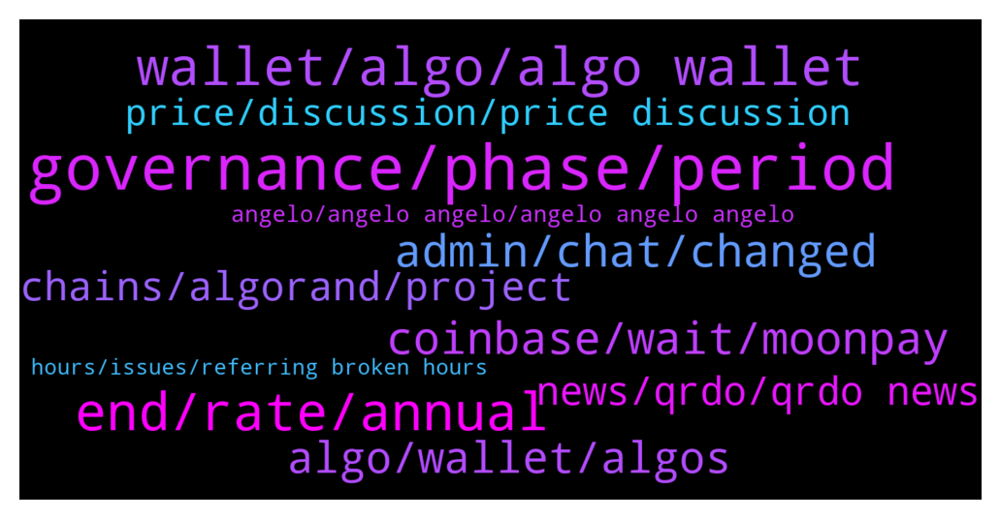

# **@algorand**
 ## Analysis for **2021-12-16** - **2021-12-17**.

---

## 📊 **Basic Stats**

**n_messages_sent**: 258

---

---

## 🔝 **Top keywords and related messages**

1. **governance, phase, period**

    @zacharias1 --- *How many ALGO do I need to allocate to participate effectively in governance* **--->** [TG Discussion](https://t.me/algorand/322572)

    @jumpfetus --- *looking forward to just putting everything into governance and not worrying about yieldly anymore* **--->** [TG Discussion](https://t.me/algorand/322334)

    @MackDenver --- *Participants who have committed their $ALGO for the governance, they will receive their rewards.* **--->** [TG Discussion](https://t.me/algorand/322451)

    @BBeniek --- *Does anyone know what will be approximately the APY for coming government period?* **--->** [TG Discussion](https://t.me/algorand/322556)

    @PingPongDiplomacy --- *It's because staking phase is over.  There's no more algorand allocated to staking rewards because it's governance phase now.  Which is 16% apy.  That was my understanding anyway* **--->** [TG Discussion](https://t.me/algorand/322715)

    @Todd --- *Not everyone has the disposition that a moderator should have.  For many,  the power and position leads to abuse of said powers.* **--->** [TG Discussion](https://t.me/algorand/322525)

2. **wallet, algo, algo wallet**

    @MackDenver --- *Myalgo seems to be working for me, maybe you should try another browser* **--->** [TG Discussion](https://t.me/algorand/322476)

    @OGPoorMan --- *when i use the algorand wallet it doesn't give errors. i confirm and nothing happens.* **--->** [TG Discussion](https://t.me/algorand/322472)

    @OGPoorMan --- *when i use my algo wallet it says failed transaction try again later* **--->** [TG Discussion](https://t.me/algorand/322474)

    @AlgorandReport --- *Unable to sync with Yieldly with Algorand Wallet - ongoing issue...???* **--->** [TG Discussion](https://t.me/algorand/322665)

    @Leugim_21 --- *But, also check wallet support https://www.moonpay.com/buy/algo* **--->** [TG Discussion](https://t.me/algorand/322847)

    @MackDenver --- *Try using MyAlgo web wallet for now, sorry for the inconvenience* **--->** [TG Discussion](https://t.me/algorand/322473)

3. **end, rate, annual**

    @zentaurion --- *Is it really 0.81% APY now?* **--->** [TG Discussion](https://t.me/algorand/322680)

    @hostodi --- *I'm actually not sure which values they're using to get 0.81%. It could potentially be a math mistake? Either way, this is gonna be behind us soon(TM)* **--->** [TG Discussion](https://t.me/algorand/322687)

    @jumpfetus --- *someone mentioned earlier that it was down to like 2.55% but I don't know where these numbers are coming from* **--->** [TG Discussion](https://t.me/algorand/322221)

    @vbncrypto --- *the staking calculator already shows 4.76%* **--->** [TG Discussion](https://t.me/algorand/322220)

    @hostodi --- *It's about 2.55% now but it will be 0.81% and eventually 0 after February* **--->** [TG Discussion](https://t.me/algorand/322682)

    @hostodi --- *You won't even know the exact % for the current quarter until it ends. It depends on how much Algo is eligible at the end. If the same amount of Algo RN is eligible next quarter, the % will be about 16.5%, up from 14.04%* **--->** [TG Discussion](https://t.me/algorand/322569)

4. **coinbase, wait, moonpay**

    @CryptoXCam --- *Anyone else Algo stuck On coinbase pending transfer?* **--->** [TG Discussion](https://t.me/algorand/322646)

    @Leugim_21 --- *to avoid problems with Coinbase, we should start using Moonpay/Tinyman feature, here some details on supported countries https://support.moonpay.com/hc/en-gb/articles/360009279877-What-are-your-supported-countries-states-and-territories-* **--->** [TG Discussion](https://t.me/algorand/322842)

    @MackDenver --- *Hello Meta, it is up to coinbase to resume and process the transactions accordingly. A few other people have also reported similar issues. For now, all you can do now is wait for them to fix everything.* **--->** [TG Discussion](https://t.me/algorand/322764)

    @metazeero --- *Hi- anyone else having issues with Coinbase Algo transfer ? Been there on pending since late last night* **--->** [TG Discussion](https://t.me/algorand/322754)

    @Leugim_21 --- *same here, wait for resolution before opening a ticket with coinbase* **--->** [TG Discussion](https://t.me/algorand/322835)

    @hostodi --- *No, you just have to wait until Coinbase does whatever they need to do* **--->** [TG Discussion](https://t.me/algorand/322676)

5. **admin, chat, changed**

    @Tim --- *Can you unblock me from that group? Never been able to join...* **--->** [TG Discussion](https://t.me/algorand/322518)

    @R --- *Dont talk to anyone outside the chat . They are yahoo naija odogwu scammers* **--->** [TG Discussion](https://t.me/algorand/322405)

    @Leugim_21 --- *so may people trying to scam, I changed my profile picure I dont want they use my face for ilegal issues* **--->** [TG Discussion](https://t.me/algorand/322494)

    @cryptomanmachine --- *Feel free to direct folks to this chat, admin, if they’ve been banned from the other one. The admin of the other one has been a bit of a loose cannon lately. We don’t ban anyone from AlgoFam though so no need to worry.* **--->** [TG Discussion](https://t.me/algorand/322523)

    @MackDenver --- *It is usually the bot that bans people but thanks for letting me know about the group* **--->** [TG Discussion](https://t.me/algorand/322524)

    @MackDenver --- *I am not an admin in the price chat* **--->** [TG Discussion](https://t.me/algorand/322519)

6. **algo, wallet, algos**

    @MackDenver --- *You can stake ALGO just by holding them in your wallet* **--->** [TG Discussion](https://t.me/algorand/322839)

    @hope999999999 --- *Each asset require 0.01 Algo. You have too many asset accounts in your wallet* **--->** [TG Discussion](https://t.me/algorand/322811)

    @Jacob --- *“Effectively” is relative. You need at minimum enough for the gas fees. Eg. 1 Algo + gas fee* **--->** [TG Discussion](https://t.me/algorand/322577)

    @SebastienL --- *Okay but the rewards are bot that great it seems…. Any airdrops coming from algo by holding the coins in Algorand wallet?* **--->** [TG Discussion](https://t.me/algorand/322840)

    @SebastienL --- *Hello team, where is the best place to stake Algo to earn rewards?* **--->** [TG Discussion](https://t.me/algorand/322838)

    @MackDenver --- *For each ASA you add in your algorand wallet, you are required to maintain a small amount of ALGO for that.* **--->** [TG Discussion](https://t.me/algorand/322824)

7. **chains, algorand, project**

    @patrick_crypto --- *As I recall, IBC is still having things use Tendermint and Atom..  so you can have ‘other’ chains make use of Cosmos/IBC. Algorand co-chains should just use Algorand consensus.* **--->** [TG Discussion](https://t.me/algorand/322213)

    @MackDenver --- *Hey Yozza, I'm not sure what are you talking about. Algorand and Stellar are different blockchain in the crypto space.* **--->** [TG Discussion](https://t.me/algorand/322448)

    @zZeoneo --- *Hi friends, I'm a big fan of the ALGORAND project and I've been studying a lot about it. I was recently researching more about the project and I heard some rumors that this will have a partnership with the Atom cosmos network, I was very interested in this news, because it seems this cosmos network is an old project but it has only just started to interconnect all blockchains . I would like to know from you, what is your opinion? Because if this partnership really happens, it will be fascinating to see our project interconnecting with all blockchains through this Atom cosmos project. What do you think?* **--->** [TG Discussion](https://t.me/algorand/322532)

    @zechuzu --- *sorry want to ask, is algorand creating sign on stellar?* **--->** [TG Discussion](https://t.me/algorand/322439)

    @patrick_crypto --- *I’ve never heard of Algorand being associated with Cosmos.* **--->** [TG Discussion](https://t.me/algorand/322546)

    @LifeMachine4 --- *Anyone know what the communication mechanism/protocol is between hypothesized Algorand Co-Chains? Also, given the fast finality properties of Algorand, are there any plans or talks for Algorand to utilize IBC as a standard interblockchain/co-chain communication protocol/standard?* **--->** [TG Discussion](https://t.me/algorand/322212)

8. **news, qrdo, qrdo news**

    @MackDenver --- *You can find the latest news on our announcement channel  https://t.me/algorand_announcements* **--->** [TG Discussion](https://t.me/algorand/322485)

    @NightAlgorand --- *You can see it in the FAQ https://algorand.foundation/gov-faq* **--->** [TG Discussion](https://t.me/algorand/322273)

    @Acehigh24 --- *I believe the $qrdo announcement, check Twitter* **--->** [TG Discussion](https://t.me/algorand/322600)

    @hostodi --- *Remind me what the qrdo news is* **--->** [TG Discussion](https://t.me/algorand/322587)

    @Leugim_21 --- *Thanks for the info, I will wait* **--->** [TG Discussion](https://t.me/algorand/322341)

    @R --- *Ahh - thanks for the valuable info man* **--->** [TG Discussion](https://t.me/algorand/322196)

9. **price, discussion, price discussion**

    @MackDenver --- *Hello Mimo, please refrain from price discussion here* **--->** [TG Discussion](https://t.me/algorand/322734)

    @Tiny_Philosopher_784 --- *So you're saying take the next comment to the price chat* **--->** [TG Discussion](https://t.me/algorand/322287)

    @MackDenver --- *Hello Mimo,  Here you go for price talks: @algorand_price* **--->** [TG Discussion](https://t.me/algorand/322859)

    @Mimo --- *Where can I talk about prices* **--->** [TG Discussion](https://t.me/algorand/322735)

    @cryptomanmachine --- *This is the price discussion for those who get banned from the other one for no reason* **--->** [TG Discussion](https://t.me/algorand/322521)

    @MackDenver --- *Let's take the trading chat to @algorand_price please, everyone.* **--->** [TG Discussion](https://t.me/algorand/322517)

10. **angelo, angelo angelo, angelo angelo angelo**

    @patrick_crypto --- *Or is it “Just Angelo”?    🤪* **--->** [TG Discussion](https://t.me/algorand/322382)

    @angelo9007 --- *Hi I am Angelo, you guys can call me just Angelo 😃* **--->** [TG Discussion](https://t.me/algorand/322379)

    @Leugim_21 --- *Hi "Angelo | i will never dm you first" can we call you just Angelo* **--->** [TG Discussion](https://t.me/algorand/322378)

    @IIIIII_Luca_IIIIII --- *My name is Angelo but everybody calls me "Angelo | i will never dm you first"* **--->** [TG Discussion](https://t.me/algorand/322377)

    @sfin_sf --- *🤔 exactly what a fake angelo would say* **--->** [TG Discussion](https://t.me/algorand/322365)

    @MaksimF --- *Welcome to russian speaking group @algorand_ru 🇷🇺🇺🇦🇧🇾🇰🇿...* **--->** [TG Discussion](https://t.me/algorand/322178)

