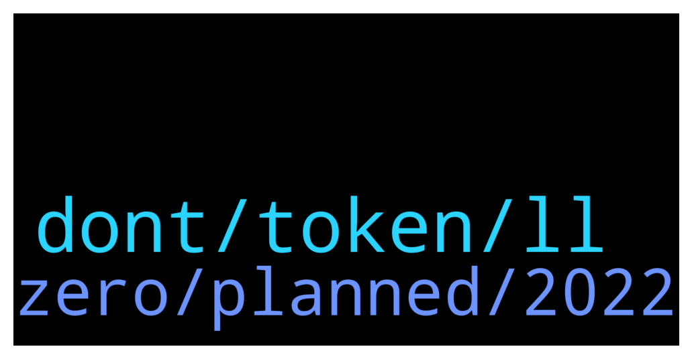

# **@ampnetapxchat**
 ## Analysis for **2021-12-12** - **2021-12-17**.

---

## 📊 **Basic Stats**

**n_messages_sent**: 25

---

---

## 🔝 **Top keywords and related messages**

1. **dont, token, ll**

    @Krabatu --- *just please dont ask us to stake AAPX on Ethereum network 😅* **--->** [TG Discussion](https://t.me/ampnetapxchat/35630)

    @<UNK> --- *We are still considering new token for DAO, but if there is one, it wont be airdropped, rather AAPX holders will stake the tokens to farm Pontoon token* **--->** [TG Discussion](https://t.me/ampnetapxchat/35624)

    @sourmans --- *its gonna be a nightmare to fill taxes form if you guys dont do the freaking Etherscan price update* **--->** [TG Discussion](https://t.me/ampnetapxchat/35611)

    @<UNK> --- *As a holder of AAPX, you will be rewarded regardless of future changes or introduction of new token, We'll use AAPX as a foundation for future development* **--->** [TG Discussion](https://t.me/ampnetapxchat/35699)

    @LootyBooty --- *And please let the staking of presale tokens be an option. So we dont have to claim constantly in order to stske* **--->** [TG Discussion](https://t.me/ampnetapxchat/35632)

    @runex_x1 --- *I think it will stay hard on ampnet, untill it tokenizes some real world assets everybody can buy portions of :).* **--->** [TG Discussion](https://t.me/ampnetapxchat/35665)

2. **zero, planned, 2022**

    @Hoetoevallig --- *And what's actually going on now? All quiet here.* **--->** [TG Discussion](https://t.me/ampnetapxchat/35639)

    @maroraza --- *Hey @mislavjavor any update on this when you are launching this PontoonDAO? if no date any idea in which month its gonna come?* **--->** [TG Discussion](https://t.me/ampnetapxchat/35667)

    @runex_x1 --- *I'm looking forward to January and it will hoepfully pump up the excitement and implement the project's goal (to bring in real work assets).* **--->** [TG Discussion](https://t.me/ampnetapxchat/35651)

    @Tinus_Tussengas_1984 --- *Bullseye, couldn’t agree more. Let’s see what the team has planned for us* **--->** [TG Discussion](https://t.me/ampnetapxchat/35650)

    @PFCBLic --- *Sour what is your total loss on this? You cant beat me😂😛* **--->** [TG Discussion](https://t.me/ampnetapxchat/35615)

    @sourmans --- *zero hope tbh lmao but gotta try* **--->** [TG Discussion](https://t.me/ampnetapxchat/35612)

