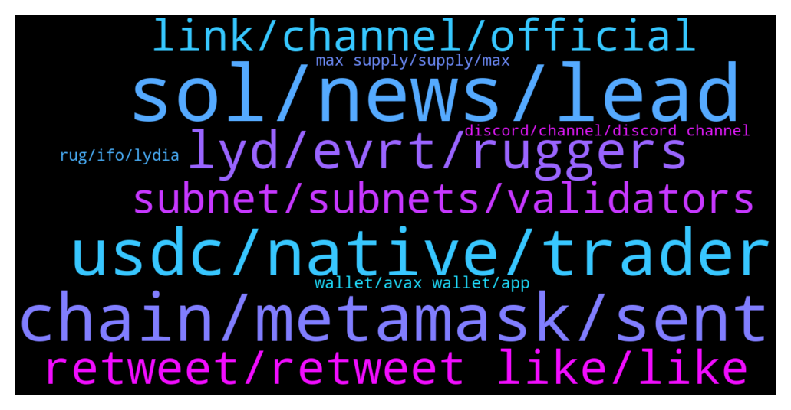

# **@avalancheavax**
 ## Analysis for **2021-12-16** - **2021-12-17**.

---

## 📊 **Basic Stats**

**n_messages_sent**: 382

---

---

## 🔝 **Top keywords and related messages**

1. **sol, news, lead**

    @S1001001001001 --- *Why avax growing even market is dump.* **--->** [TG Discussion](https://t.me/avalancheavax/314581)

    @JoelHarris --- *Where offers the best % on AVAX? Liquid staking/lock-up please* **--->** [TG Discussion](https://t.me/avalancheavax/313788)

    @ramziakram --- *for me,better if they support avax usdc version* **--->** [TG Discussion](https://t.me/avalancheavax/314398)

    @diov0 --- *in 1 year we might touch 5000$ so that 2,5 avax will be worth 15000$ xD* **--->** [TG Discussion](https://t.me/avalancheavax/313910)

    @hossein_barati_93 --- *Thank you. I read the news and about BitGo but I couldn't understand completely. It it an important news? What is should BitGo do with avax? Could you explain simply please?🙏🙏* **--->** [TG Discussion](https://t.me/avalancheavax/314324)

    @Desmond --- *Avax to 240 dollars end by December* **--->** [TG Discussion](https://t.me/avalancheavax/314547)

2. **chain, metamask, sent**

    @Koolblade --- *Hi, what is the difference of X chain and C chain?  Can I send AVAX funds from any exchange to C chain in AVAX wallet?* **--->** [TG Discussion](https://t.me/avalancheavax/313916)

    @Koolblade --- *If an exchange can support to receive or send C Chain to AVAX wallet, I can just use this C Chain address instead of X Chain available?  It will save time to change from X chain to C Chain in AVAX wallet, yeah?* **--->** [TG Discussion](https://t.me/avalancheavax/313933)

    @Nicolas_A --- *wallet.avax.network for X and P chain. If you just want to interact with dapps you can simply use Metamask* **--->** [TG Discussion](https://t.me/avalancheavax/313988)

    @diov0 --- *if a cex accepts c-chain then ypu just send from your metamask and done* **--->** [TG Discussion](https://t.me/avalancheavax/313936)

    @JimWelder --- *C-Chain is for smart contract - used in defi platform (C for Contract). X-chain is used in eXchanges where AVAX is traded.* **--->** [TG Discussion](https://t.me/avalancheavax/313920)

    @Koolblade --- *Metamask can accept both C Chain and X chain?* **--->** [TG Discussion](https://t.me/avalancheavax/313922)

3. **usdc, native, trader**

    @metad3pt --- *I think the issue right now is there is plenty of USDC.e because of the Avalanche bridge, and  that's not going to change. But until USDC is up on Curve, or someone with a lot of native USDC adds liquidity somewhere, AUSD, Pangolin, Embr, Curve, there's a shortage of "native"/circle issued usdc* **--->** [TG Discussion](https://t.me/avalancheavax/314478)

    @Stage5Financial --- *Best place to earn interest on USDC in the avalanche ecosystem? What kind of APRs can I get?* **--->** [TG Discussion](https://t.me/avalancheavax/313865)

    @aco1731 --- *How incentivize that boring liquidity. What the difference from usdc.e to usdc native?* **--->** [TG Discussion](https://t.me/avalancheavax/314365)

    @Nicolas_A --- *There aren’t that much newly minted USDC so the rates aren’t 1:1 at the moment. I would recommend waiting before switching* **--->** [TG Discussion](https://t.me/avalancheavax/314362)

    @Manubalaban --- *I want to deposit in the farm usdc/usdce in trader joe, but if i want to swap usdce to usdc si so huge the slipeage there* **--->** [TG Discussion](https://t.me/avalancheavax/314439)

    @Manubalaban --- *Where can i swap usdc (e) to usdc? I know only trader joe* **--->** [TG Discussion](https://t.me/avalancheavax/314358)

4. **lyd, evrt, ruggers**

    @JimWelder --- *https://twitter.com/davetroy/status/1469714121155387406?t=cMG_C1jrGEEfu-uRR9NCJg&s=19  Shoot Dave troy is on the case @diov0* **--->** [TG Discussion](https://t.me/avalancheavax/313941)

    @oathtobarbatos --- *I think I'm not the right person to discuss this but, you should try taking a screenshot as proof of his actions and show it to one of the admins here like Nicolas, for example* **--->** [TG Discussion](https://t.me/avalancheavax/314254)

    @Yoopez --- *As I see how is managed EVRT, 80% chance it’s him. Shame on lydia who hace pushed him* **--->** [TG Discussion](https://t.me/avalancheavax/314499)

    @Yoopez --- *The guy didn’t know how to do real options bro, it was a fucking joke. Just a cashgrab from lyd. These guys are doing IFO without any research on the team lmao. They just want their 200k$ cut* **--->** [TG Discussion](https://t.me/avalancheavax/314493)

    @Bruno_LGD --- *The LYD fudders are a pain in the ass* **--->** [TG Discussion](https://t.me/avalancheavax/314501)

    @metad3pt --- *right idk how much LYD had to do with  it aside frrom hosting his IFO, but  the polar bear dude is def a shit head and skammed all his investors.* **--->** [TG Discussion](https://t.me/avalancheavax/314502)

5. **retweet, retweet like, like**

    @Shiva_Lee --- *Sure or you can send it to me DM whatever you like* **--->** [TG Discussion](https://t.me/avalancheavax/314561)

    @emcs1974 --- *🔥 Only ✅ Retweet, No 🚫 Like.  https://twitter.com/Cointelegraph/status/1471200943047733250?t=XB3kPtlgqpT661a6FulZVg&s=09* **--->** [TG Discussion](https://t.me/avalancheavax/314347)

    @emcs1974 --- *🔥 Only ✅ Retweet, No 🚫 Like.  https://twitter.com/Cointelegraph/status/1471200943047733250?t=XB3kPtlgqpT661a6FulZVg&s=09  🔥 GO GO GO 🙋‍♂* **--->** [TG Discussion](https://t.me/avalancheavax/314012)

    @emcs1974 --- *🔥 Yes ✅ Retweet, No 🚫 Like.  https://twitter.com/Cointelegraph/status/1471200943047733250?t=XB3kPtlgqpT661a6FulZVg&s=09* **--->** [TG Discussion](https://t.me/avalancheavax/313758)

    @Avaxtor --- *guys lets support our commodity with rt this tweet  https://twitter.com/Cointelegraph/status/1471200943047733250* **--->** [TG Discussion](https://t.me/avalancheavax/313978)

    @maChina77 --- *🔥 Only ✅ Retweet, No 🚫 Like.* **--->** [TG Discussion](https://t.me/avalancheavax/314133)

6. **link, channel, official**

    @Oggy_Raider --- *Cheer 👍 Do you have a link to the official YouTube channel?* **--->** [TG Discussion](https://t.me/avalancheavax/314228)

    @diov0 --- *i am allowed to post links?* **--->** [TG Discussion](https://t.me/avalancheavax/313895)

    @nguyenkt96 --- *are you channel official not group chat?* **--->** [TG Discussion](https://t.me/avalancheavax/314010)

    @Nicolas_A --- *Ah announcement channel got it. Here you go https://t.me/avalanche_announcements* **--->** [TG Discussion](https://t.me/avalancheavax/314035)

    @aldourem --- *or use official with video https://support.avax.network/en/articles/4626956-how-do-i-set-up-metamask-on-avalanche* **--->** [TG Discussion](https://t.me/avalancheavax/313847)

    @kroinik --- *We are winning. Go to the page instead of clicking in the link and you’ll see* **--->** [TG Discussion](https://t.me/avalancheavax/314160)

7. **subnet, subnets, validators**

    @saranshsharma --- *Hi guys we are building something unique on Avalanche subnet, be your icann we call this DNS service meta root here is the prelim paper https://github.com/Cynsar-Foundation/metaRoot* **--->** [TG Discussion](https://t.me/avalancheavax/314556)

    @Electroriot --- *Cool. I’ll use MM. i already use for several other networks* **--->** [TG Discussion](https://t.me/avalancheavax/313839)

    @BabackSh --- *Subnets are fully operational now on the network?* **--->** [TG Discussion](https://t.me/avalancheavax/314473)

    @aldourem --- *here is setup for a network https://ibb.co/FVKtDPL* **--->** [TG Discussion](https://t.me/avalancheavax/313846)

    @Talux --- *So how many AVAX does cost to add a subnet? 750?* **--->** [TG Discussion](https://t.me/avalancheavax/314037)

    @Nicolas_A --- *Cross subnet transfers and permission less subnets are still being worked on. Also other support for other VMs* **--->** [TG Discussion](https://t.me/avalancheavax/314474)

8. **wallet, avax wallet, app**

    @Tyranny5000 --- *theres an old version i think everyone waiting on new avax wallet* **--->** [TG Discussion](https://t.me/avalancheavax/313859)

    @ramziakram --- *setting your wallet for avax network first maybe?  there is tutorial on avax official YouTube channel* **--->** [TG Discussion](https://t.me/avalancheavax/314223)

    @jony --- *What wallet are you using for avax?* **--->** [TG Discussion](https://t.me/avalancheavax/313987)

    @Viro --- *You know if the new avax wallet will have 12, 16 or 24 word security? I would prefer 24 words @Nicolas_A* **--->** [TG Discussion](https://t.me/avalancheavax/313968)

    @CevizliBaklavaWEOS --- *there is a fake telegram channel about some avax wallet mandatory update. Do not fall for it!* **--->** [TG Discussion](https://t.me/avalancheavax/314356)

    @Tyranny5000 --- *reallly... hmm.. other worthy mentions in the news...there has never been any avax wallet yet* **--->** [TG Discussion](https://t.me/avalancheavax/313864)

9. **max supply, supply, max**

    @metad3pt --- *20% staking fee? labeled  as 2% and then changed once a bunch of people joined? cmon, dude was a skam artist* **--->** [TG Discussion](https://t.me/avalancheavax/314485)

    @NickC --- *Is every piece priced the same?* **--->** [TG Discussion](https://t.me/avalancheavax/314305)

    @Veronica --- *Why the max supply has been removed from coinmarketcup ?* **--->** [TG Discussion](https://t.me/avalancheavax/314145)

    @Seth456 --- *35% yieldyak last time I've checked* **--->** [TG Discussion](https://t.me/avalancheavax/313866)

    @Avalanche --- *Not about tapering but the base rate* **--->** [TG Discussion](https://t.me/avalancheavax/313721)

    @Stage5Financial --- *Highest I saw was 12% for single asset. A bit more for LP tokens. I’ll keep checking it though. Thanks* **--->** [TG Discussion](https://t.me/avalancheavax/313868)

10. **rug, ifo, lydia**

    @RealRager --- *‼️ Lydia Finance Red Flag. ‼️  Red flags in the following projects.  A few days ago I already reported that Everst was a scam and they were making a soft rug. Today they have been hacked they say, coincidence.  I also warn about AvaoFinance, ridiculous project without foundations and without product and that from the first moment they receive a liquidity that they keep and the price of the token from the first moment sinks.   But who is behind all this is Lydia Finance, which sooner or later will do the same. Make no mistake, every IFO is an opportunity for soft rug. They thought they found the goose that laid the golden egg, but they have really dug their grave. Run away from Avax Lions.  Run away from Lydia while you still can.* **--->** [TG Discussion](https://t.me/avalancheavax/314414)

    @MarcJunqueras --- *Your team are doing a soft rug every IFO.  Your team didn't do nothing (KYC or multi-signature wallet when create IFO). And you ban people from Lydia Finance for ask about Evrst scam and AvaoFinance soft rug.... And you don't ban @PolarBearEVRT that rug all people.* **--->** [TG Discussion](https://t.me/avalancheavax/314539)

    @MarcJunqueras --- *For what use Sherpa when people doesn't matter scam people... 🤦🏻. I hope Pangolin and JoeTrade close already Evrst already!!* **--->** [TG Discussion](https://t.me/avalancheavax/314578)

    @MarcJunqueras --- *About Lydia...is the same. IFO for slow rug into the holders. But reputation is already lost, and no enter new money, new people. Game over* **--->** [TG Discussion](https://t.me/avalancheavax/314543)

    @Yoopez --- *When you do an IFO you put your reputation on the projects you pushed. You have to act as an advisor So doing real research on the team you push and its skill. If it the same guy you mention, yeah they have a huge responsability on this rug* **--->** [TG Discussion](https://t.me/avalancheavax/314507)

    @emcs1974 --- *Unfortunately there are members like you who don't add value. Stop bothering whoever is working and move on. @Nicolas_A pls.* **--->** [TG Discussion](https://t.me/avalancheavax/314269)

