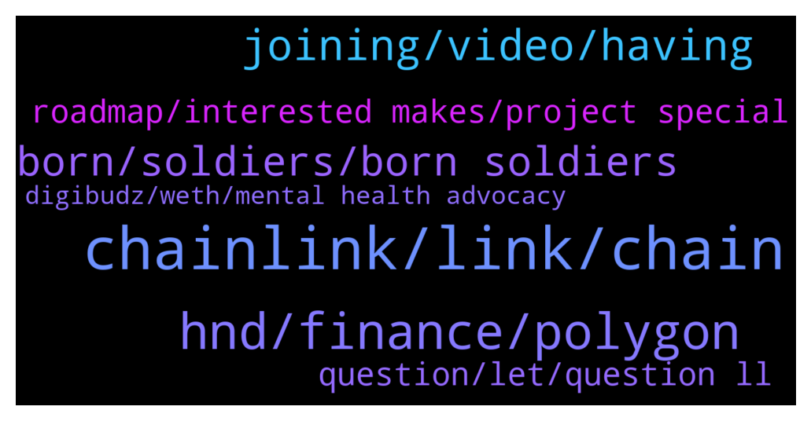

# **@chainlinkofficial**
 ## Analysis for **2021-12-16** - **2021-12-17**.

---

## 📊 **Basic Stats**

**n_messages_sent**: 211

---

---

## 🔝 **Top keywords and related messages**

1. **chainlink, link, chain**

    @SantiagoHernandezH --- *Hi everyone! Do any of you know the correct method of withdrawing LINK from my node after connecting the node wallet to Metamask? Everytime I try to move my links from the node to another wallet the nonce changes, the node is unable to update that nonce and then is unable to validate any subsequent transaction.* **--->** [TG Discussion](https://t.me/chainlinkofficial/355360)

    @EresDev --- *Hey Marc, I have added my contract twice on your keeper app for BSC testnet. Everytime it deducted 5 LINK tokens from owner, but there is nothing in "My upkeeps"* **--->** [TG Discussion](https://t.me/chainlinkofficial/355292)

    @marcromeron --- *Check data.chain.link to see which kind of data we're providing actually.* **--->** [TG Discussion](https://t.me/chainlinkofficial/355810)

    @Linkederic --- *Your node doesnt ever need to have LINK on it, the LINK payments are sent to your oracle/operator contract* **--->** [TG Discussion](https://t.me/chainlinkofficial/355364)

    @Ravi_Sugarland --- *Actually I need to get in touch with BD team for Partnership. We need chain link support in our project* **--->** [TG Discussion](https://t.me/chainlinkofficial/355382)

    @iamthekeeper --- *I know nothing so please can someone help me to understand how the LINK token is used? Is it used in running the network? I'm just wondering why the constantly growing adoption of Chainlink isn't reflected in the value of the token? Tnx* **--->** [TG Discussion](https://t.me/chainlinkofficial/355437)

2. **hnd, finance, polygon**

    @Curl --- *I was unable to find what I'm looking for. Can you explicate whether you provide feeds for crypto options prices or have plans to add them in the near future?* **--->** [TG Discussion](https://t.me/chainlinkofficial/355812)

    @clarabrown0 --- *Hi, is it possible to get SOL/USD* **--->** [TG Discussion](https://t.me/chainlinkofficial/355351)

    @hostileX --- *Hello 👋. Coinmarketcap had these price clitches which are very bad for projects. Are there price tracking website that use your technology. I dont want to use coinmarketcap anymore. Thanks* **--->** [TG Discussion](https://t.me/chainlinkofficial/355371)

    @SantiagoHernandezH --- *So, I only have to charge the node with ETH and that's enough for enabling operations?* **--->** [TG Discussion](https://t.me/chainlinkofficial/355365)

    @marcromeron --- *For those interested to know more about CCIP, visit our official site: https://chain.link/cross-chain* **--->** [TG Discussion](https://t.me/chainlinkofficial/355489)

    @acid_bird --- *So basically not to spend too much time on writing here i will point out to some of the points from that list and everyone can check them out here later (50 are out already) https://twitter.com/The_ReadingApe/status/1471457583852449793  Here are some of those: 1. A decentralized application that enables the lending/borrowing of cryptocurrencies 2. “100 assets across 100 chains” 3. Specializes in providing a stable market for Chainlink secured long-tail assets 4. Assigned 20% of the supply of $HND to Compound DAO because contracts were forked from them 5. Lending protocol that is based around stablecoins and blue-chips 6. Multi-chain is the focus here 7. One of the first protocols on Arbitrum 8. $HND single-side staking had started 9. Jun 24 - Hundred Finance launch 10. Sep 16 - $HND is live at ETH mainnet 11. Sep 25 - Launched on Arbitrum 12. Sep 27 - Collaboration with Dodo on Arbitrum 23. Oct 20 – Awarded $50k for Harmony Launch etc.....* **--->** [TG Discussion](https://t.me/chainlinkofficial/355470)

3. **joining, video, having**

    @CL_MikeZ --- *If anyone is located in Austin, we would love to see you at tonight's meetup! 🤠  https://www.meetup.com/chainlink-austin-connected-smart-contracts/events/282566491/* **--->** [TG Discussion](https://t.me/chainlinkofficial/355592)

    @PolivodaTatiana --- *Thank you both for your time today! And good luck with the launch, I'll be watching 👀🤩* **--->** [TG Discussion](https://t.me/chainlinkofficial/355788)

    @De_an_369 --- *Hey Tatiana, it will be myself and my co-founder Franky D joining you for the AMA today* **--->** [TG Discussion](https://t.me/chainlinkofficial/355708)

    @acid_bird --- *Thank you for having us ser!* **--->** [TG Discussion](https://t.me/chainlinkofficial/355513)

    @marcromeron --- *Thank you very much Jonathan and Suchi for your precious time!!!!* **--->** [TG Discussion](https://t.me/chainlinkofficial/355583)

    @whitecryptocow --- *No problem. Thank you for having us on today.* **--->** [TG Discussion](https://t.me/chainlinkofficial/355584)

4. **born, soldiers, born soldiers**

    @De_an_369 --- *Before you do that, if you want to get a true sense of what Born Soldiers is all about, check out our game trailer 👇  https://www.youtube.com/watch?v=uHHKM1M_Wvc* **--->** [TG Discussion](https://t.me/chainlinkofficial/355774)

    @De_an_369 --- *The best way to get started with Born Soldiers is to join our Discord > https://discord.gg/z9ZEPHdeTd  This is where you will hear all of our project announcements first, meet our awesome community and take part in our daily giveaways. We would love to see you in there!* **--->** [TG Discussion](https://t.me/chainlinkofficial/355773)

    @De_an_369 --- *The best way to reach us is to join our Discord and come and hang out with the other Born Soldiers!* **--->** [TG Discussion](https://t.me/chainlinkofficial/355787)

    @FrankyD95 --- *Born Soldiers: Camps  Each Born Soldiers ERC-721 token holder will be airdropped a land token upon launch of Born Soldiers: Camps, which is the first P2E Zombie survival land ownership game. Players must build, upgrade and maintain their survivors camp to unlock new maps, abilities and earn Shellz. A players Camp will be the base for all aspects of the Born Soldier: Last Hope game upon launch, including the Armoury, Mess Hall and game mode/map selection.  Also, the land can be used to breed new soldiers which can be HODLed, loaned for passive income or sold to new players. Each genesis soldier will be able to train 7 survivors.* **--->** [TG Discussion](https://t.me/chainlinkofficial/355748)

    @De_an_369 --- *Born Soldiers is a collection of 8545 hand-drawn NFTs and is the first zombie survival shooter NFT game with play-to-earn features.  In a sentence, we are COD zombies on the Polygon blockchain!* **--->** [TG Discussion](https://t.me/chainlinkofficial/355726)

    @De_an_369 --- *If you own a Born Soldiers NFT, you get full usage and commercial rights. It also serves as your exclusive access to Born Soldiers: Last Hope, the first-ever post-apocalyptic WWII P2E game that’s already in development.* **--->** [TG Discussion](https://t.me/chainlinkofficial/355732)

5. **roadmap, interested makes, project special**

    @ByelowSeligh --- *Hi guys! When will vrf be online on avalanche?* **--->** [TG Discussion](https://t.me/chainlinkofficial/355684)

    @Andy --- *What do you have to say about DEIP? It's currently in high gear, and everyone is talking about its future.* **--->** [TG Discussion](https://t.me/chainlinkofficial/355723)

    @whitecryptocow --- *Tonight at 10pm CST we will be launching. We then have some very exciting steps to come on our roadmap that we look forward to hitting. You can have a look here  https://www.digibudz.io/roadmap* **--->** [TG Discussion](https://t.me/chainlinkofficial/355573)

    @Joypokkamol --- *There is no formal roadmap. The Whitepaper indicates future features (and some that are now live), this blogpost gives a good overview https://blog.chain.link/chainlink-2-0-lays-foundation-for-adoption-of-hybrid-smart-contracts/* **--->** [TG Discussion](https://t.me/chainlinkofficial/355802)

    @marcromeron --- *Tell us about your project, how does it work?* **--->** [TG Discussion](https://t.me/chainlinkofficial/355530)

    @marcromeron --- *What’s next on your project’s roadmap?* **--->** [TG Discussion](https://t.me/chainlinkofficial/355572)

6. **question, let, question ll**

    @nam_nguyenson --- *Thanks for the clarification @marcromeron 💪* **--->** [TG Discussion](https://t.me/chainlinkofficial/355698)

    @marcromeron --- *@whitecryptocow could you tell us the meaning of this one for example?* **--->** [TG Discussion](https://t.me/chainlinkofficial/355542)

    @marcromeron --- *Let's start with the first question.....* **--->** [TG Discussion](https://t.me/chainlinkofficial/355457)

    @marcromeron --- *And here we go with my last question...* **--->** [TG Discussion](https://t.me/chainlinkofficial/355579)

    @marcromeron --- *From my side I have my last question...* **--->** [TG Discussion](https://t.me/chainlinkofficial/355507)

    @marcromeron --- *Life is beautiful so let's go for the next question...* **--->** [TG Discussion](https://t.me/chainlinkofficial/355562)

7. **digibudz, weth, mental health advocacy**

    @spicystimuli --- *hey there! So you can either purchase 1, 3, or 10 DigiBudz, and the unit price decreases depending on the bundle. It is 0.06 wETH per Bud for 1 DigiBud, 0.05 wETH each for 3 DigiBudz, and 0.04 wETH each for 10 DigiBudz (plus a small gas fee in Matic)* **--->** [TG Discussion](https://t.me/chainlinkofficial/355565)

    @whitecryptocow --- *DigiBudz are truly unique creatures–there is nothing like them out there! The backstory: before the first spring blossom there was a secluded field of wildflowers that were tainted by radioactive byproducts from a secret underground lab run by crazy scientists experimenting with the forces of nature. When it was time for the flowers to bloom, out popped the DigiBudz!* **--->** [TG Discussion](https://t.me/chainlinkofficial/355536)

    @spicystimuli --- *We also have semicolon eyes for some of our DigiBudz, which is symbolic tribute for those that were once suicidal but chose to not end their lives. The reference for this is from "The Semicolon Project"* **--->** [TG Discussion](https://t.me/chainlinkofficial/355552)

    @whitecryptocow --- *DigiBudz is a 10k generative NFT project dedicated to mental health advocacy. Our goal is for DigiBudz PFP’s be a symbol for those you can talk to without judgment. DigiBudz is a play on “digital buddiez” and we have grown our community through avenues such as twitter and discord. Some things we do to promote mental health advocacy includes our “Therapeutic Tuesday” twitter spaces, our “Real Talk” channel on discord, and we plan to donate 10 wETH to a community chosen charity focused on mental health advocacy after 75% of DigiBudz have been minted.* **--->** [TG Discussion](https://t.me/chainlinkofficial/355532)

    @whitecryptocow --- *Thanks for having us Marc. I'm Jonathan one of the Co-Founders and lead developers for DigiBudz.* **--->** [TG Discussion](https://t.me/chainlinkofficial/355526)

    @marcromeron --- *OK. How do I purchase DigiBudz?* **--->** [TG Discussion](https://t.me/chainlinkofficial/355576)

