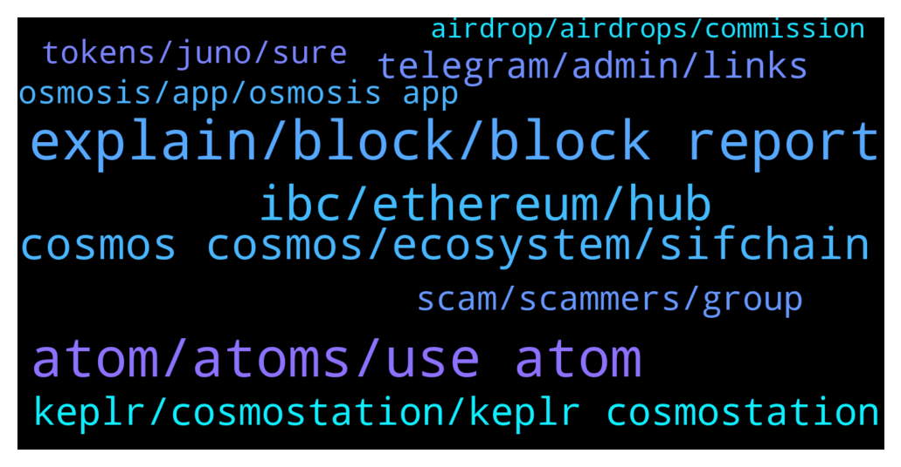

# **@cosmosproject**
 ## Analysis for **2021-12-16** - **2021-12-17**.

---

## 📊 **Basic Stats**

**n_messages_sent**: 654

---

---

## 🔝 **Top keywords and related messages**

1. **explain, block, block report**

    @ShaniNiazi786 --- *Thanks for reply.. I understand.. 💖💖😊😊👍👍💯* **--->** [TG Discussion](https://t.me/cosmosproject/455438)

    @markzilla --- *sure. Thank u) sorry for bothering 🙏* **--->** [TG Discussion](https://t.me/cosmosproject/455615)

    @esclusivo555 --- *Sorry didn’t get you. Can you explain better please? 谢谢* **--->** [TG Discussion](https://t.me/cosmosproject/455096)

    @punumahajan007 --- *Sir , we are getting trained to ban you if you DM us 🙂* **--->** [TG Discussion](https://t.me/cosmosproject/454640)

    @ragnatela29 --- *A message from u too ! A person with your name wrote me* **--->** [TG Discussion](https://t.me/cosmosproject/455298)

    @juquinbu --- *I was only answering the specific question asked. 😉* **--->** [TG Discussion](https://t.me/cosmosproject/455346)

2. **atom, atoms, use atom**

    @Subpreme --- *Hello, is there the possibility to move the ATOMs from the trust wallet to the keystation wallet of the comsos ecosystem to then stake them?  If so, understand what the procedure is like, or if other steps are needed first   Thanks in advance* **--->** [TG Discussion](https://t.me/cosmosproject/455031)

    @Stelio_Kontoss --- *Hello, could I know the best place to stack my atom in order to benefit from the petential airdrops of network ??    Thank you* **--->** [TG Discussion](https://t.me/cosmosproject/455529)

    @max --- *where can I stake ATOM ?* **--->** [TG Discussion](https://t.me/cosmosproject/455035)

    @MasterOfCoin90 --- *Thx for explanation ;), so you are telling that if I want to bridge LUNA with CRO, the gas fee will be on Atom?* **--->** [TG Discussion](https://t.me/cosmosproject/455771)

    @esclusivo555 --- *Hello guys, I have 100 Atom on Keplr which way is the best to stake, with higher interest?* **--->** [TG Discussion](https://t.me/cosmosproject/455092)

    @Jerome --- *Hello,  Cannot purchase atom in Emeris app, any idea why?* **--->** [TG Discussion](https://t.me/cosmosproject/455655)

3. **keplr, cosmostation, keplr cosmostation**

    @Phil --- *Hey all is exodus a good wallet for cosmos* **--->** [TG Discussion](https://t.me/cosmosproject/455326)

    @alireza --- *Cosmos network is going through a network upgrade transfers are not working... I can not send atom cosmos to trust wallet Please help me* **--->** [TG Discussion](https://t.me/cosmosproject/455590)

    @oguzhan01010101 --- *I want to add my keplr wallet to transfer interchain. https://mapofzones.com/ ?* **--->** [TG Discussion](https://t.me/cosmosproject/455105)

    @Matt_Blocks_United --- *You are welcome to stake with our node at Blocks United.   You can find us and stake in Guarda, Rainbow, Trust Wallet, Ledger Live, Keplr and Cosmostation.   We have a great staking tutorial on our blog, with video that walks you through the process from beginning to end using Cosmostation and Keplr. There are instructions for Ledger Live in the post.  You can check it out here https://blocksunited.com/how-to-stake-cosmos-atom-tokens/  Let me know how else I can help.* **--->** [TG Discussion](https://t.me/cosmosproject/455083)

    @AtomJazz --- *Hi. Keplr wallet is the best to stake and collect various airdrops in the ecosystem. You can find tutorials in the pinned message. Cosmostation is also recommended wallet for staking* **--->** [TG Discussion](https://t.me/cosmosproject/455530)

    @AtomJazz --- *Keplr and Cosmostation are the suggested wallets. Exodus is not ideal for Cosmos.* **--->** [TG Discussion](https://t.me/cosmosproject/455132)

4. **ibc, ethereum, hub**

    @Matt_Blocks_United --- *Generally with bridges there are tolls on both sides. Let's say you wanted to bridge an Ethereum token over to Cosmos to save money on transaction fees. You'd need ETH in your Ethereum wallet to enter the bridge and then ATOM in your Cosmos wallet to get your tokens off the bridge and onto Cosmos.* **--->** [TG Discussion](https://t.me/cosmosproject/455774)

    @Zeuscryp --- *How is atom different from ethereum blockchain* **--->** [TG Discussion](https://t.me/cosmosproject/455720)

    @JUAN88 --- *IMO ATOM is just the first IBC Blockchain.  I don't think it's more meaningful than that.* **--->** [TG Discussion](https://t.me/cosmosproject/455574)

    @sophia_marti --- *Gravity bridge has enabled the transfer of ERC20 tokens between Ethereum and Cosmos blockchain* **--->** [TG Discussion](https://t.me/cosmosproject/455663)

    @TicoJohnny --- *They're built separately with their own chain as it stands now. IBC connects them together, in the near future there will be many different opportunities to develop tokens on other chains and have them connected with IBC. For example, smart contracts can be built with Juno and connected to IBC via Juno, and then exchanged on a DEX and then routed through the Cosmos Hub.* **--->** [TG Discussion](https://t.me/cosmosproject/455749)

    @TicoJohnny --- *They are separate sovereign blockchains built into the Cosmos Ecosystem, they aren't built onto or under the Cosmos Hub, they're built alongside it. We will potentially see value accrual with the release of Interchain Accounts, Interchain Security and the hub as a router next year.* **--->** [TG Discussion](https://t.me/cosmosproject/454584)

5. **cosmos cosmos, ecosystem, sifchain**

    @ZoltanAtom --- *Not that complicated!   Once you learn Cosmos dexs and Cosmos vision, you will never go back to others 😎* **--->** [TG Discussion](https://t.me/cosmosproject/455421)

    @AtomJazz --- *This has nothing to do with Cosmos* **--->** [TG Discussion](https://t.me/cosmosproject/454426)

    @honeylocal --- *Man I’m a quick learner but this Cosmos/Osmosis thing is tricky. Lol* **--->** [TG Discussion](https://t.me/cosmosproject/455420)

    @xxbananas --- *nothing with cosmos, apriori to sczmmers!!!i guess* **--->** [TG Discussion](https://t.me/cosmosproject/454430)

    @craccolotto --- *There's something importante that i have to know before starting the journey in Cosmos ?* **--->** [TG Discussion](https://t.me/cosmosproject/454800)

    @ZoltanAtom --- *There are lots of Cosmos contributors. Not just one team. You should start learning more about Cosmos ;  Cosmos.network* **--->** [TG Discussion](https://t.me/cosmosproject/454675)

6. **keplr, cosmostation, keplr cosmostation**

    @TicoJohnny --- *Yeah, no worries. I’d recommended Keplr to you as well you can get a higher reward rate and actually use Cosmos apps as well as choose your preferred validator and participate in governance.* **--->** [TG Discussion](https://t.me/cosmosproject/455348)

    @garisborfield --- *I have keplr but i cant go on the Web with* **--->** [TG Discussion](https://t.me/cosmosproject/455007)

    @latitud2046 --- *Hey does anybody know how to bridge from BSC to KEPLR* **--->** [TG Discussion](https://t.me/cosmosproject/455290)

    @fabiomatos_23 --- *never been there, but i love kebab xD* **--->** [TG Discussion](https://t.me/cosmosproject/454982)

    @alireza --- *What is the comosation??? Or keplr?* **--->** [TG Discussion](https://t.me/cosmosproject/455595)

    @ZoltanAtom --- *What kind of error do you get from Keplr ?* **--->** [TG Discussion](https://t.me/cosmosproject/454888)

7. **telegram, admin, links**

    @andrea_jugg --- *I need help  Is the admin or help support online now* **--->** [TG Discussion](https://t.me/cosmosproject/454957)

    @xxbananas --- *from admin officials... i think so* **--->** [TG Discussion](https://t.me/cosmosproject/454354)

    @ZoltanAtom --- *One important point is that there is no wallet support on telegram! If someone DM to you,block and report ⚠️⚠️* **--->** [TG Discussion](https://t.me/cosmosproject/455439)

    @ZoltanAtom --- *What you mean by “go on the web?”* **--->** [TG Discussion](https://t.me/cosmosproject/455009)

    @fabiomatos_23 --- *When will be an event of COMOS here in Portugal?* **--->** [TG Discussion](https://t.me/cosmosproject/454973)

    @Matt_Blocks_United --- *This is all the info there is for now. https://evmos.blog/the-evmos-rektdrop-abbe931ba823  Also, join this Telegram channel http://t.me/CosmosAirdropsNews* **--->** [TG Discussion](https://t.me/cosmosproject/454947)

8. **scam, scammers, group**

    @Cordtus --- *Only if you promise to scam me really hard* **--->** [TG Discussion](https://t.me/cosmosproject/454394)

    @xxbananas --- *i just inform them to beware of scammers on my own example* **--->** [TG Discussion](https://t.me/cosmosproject/454439)

    @xxbananas --- *then all is straight, i been scammed* **--->** [TG Discussion](https://t.me/cosmosproject/454370)

    @xxbananas --- *so why you let scammers be on your channel?* **--->** [TG Discussion](https://t.me/cosmosproject/454436)

    @ragnatela29 --- *10 private message! This group is impossible* **--->** [TG Discussion](https://t.me/cosmosproject/455291)

    @TicoJohnny --- *They all sit outside of the group lurking, not much we can do about it* **--->** [TG Discussion](https://t.me/cosmosproject/455293)

9. **osmosis, app, osmosis app**

    @ragnatela29 --- *Osmosis is like a pancakeswap of atom ?* **--->** [TG Discussion](https://t.me/cosmosproject/454863)

    @Phil --- *Is that where the osmosis lp is?* **--->** [TG Discussion](https://t.me/cosmosproject/455330)

    @hashaaamm --- *I have used osmosis before. There deposit button always work. But this time funds are missing* **--->** [TG Discussion](https://t.me/cosmosproject/455246)

    @ZoltanAtom --- *You should join Osmosis and learn more about Osmosis;  https://t.me/osmosis_chat* **--->** [TG Discussion](https://t.me/cosmosproject/455418)

    @Armond --- *Gotcha! So if I withdraw ust on osmosis how will it show up on my wallet?* **--->** [TG Discussion](https://t.me/cosmosproject/454987)

    @xxbananas --- *but, hope it will be recovered. at least* **--->** [TG Discussion](https://t.me/cosmosproject/454327)

10. **tokens, juno, sure**

    @TicoJohnny --- *I am sure there will be many with people minting new Juno tokens* **--->** [TG Discussion](https://t.me/cosmosproject/454564)

    @Prometheus_Zeus --- *So you guess they are minted with Junomint and will apear in my Juno Wallet?* **--->** [TG Discussion](https://t.me/cosmosproject/454565)

    @amoljames --- *Hi, I am staking Juno from day 1 (more than 40), I still do not see any Hua dropped to my wallet. Can anyone help?* **--->** [TG Discussion](https://t.me/cosmosproject/454712)

    @craccolotto --- *And the other like guarda Exodus AToken are Always wallet ?* **--->** [TG Discussion](https://t.me/cosmosproject/454797)

    @Vester18 --- *is it possible to find out from which wallet address is, i send my tokens from cosmos station to somewhere and cant find where?* **--->** [TG Discussion](https://t.me/cosmosproject/454488)

    @TicoJohnny --- *All the tokens from the fundraiser have been distributed* **--->** [TG Discussion](https://t.me/cosmosproject/455389)

