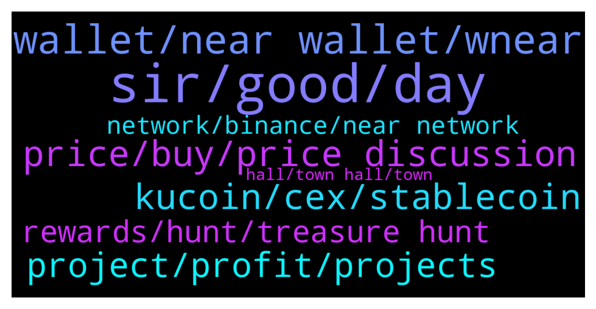

# **@cryptonear**
 ## Analysis for **2021-12-16** - **2021-12-17**.

---

## 📊 **Basic Stats**

**n_messages_sent**: 707

---

---

## 🔝 **Top keywords and related messages**

1. **sir, good, day**

    @Kripto_Raptor --- *come on... if you have other thoughts tell me 😃this is how i summarize my readings* **--->** [TG Discussion](https://t.me/cryptonear/242178)

    @levi_cryptoman --- *You are now famous serr 😂😂* **--->** [TG Discussion](https://t.me/cryptonear/240951)

    @Tuấn --- *lol i saw it thank you sir ❤️* **--->** [TG Discussion](https://t.me/cryptonear/241167)

    @israel_igboze --- *You have motivation.  Hope you're strong? I mean health wise.* **--->** [TG Discussion](https://t.me/cryptonear/241166)

    @larry_lang --- *hmm i need some boost for the day that's all=)))* **--->** [TG Discussion](https://t.me/cryptonear/241164)

    @israel_igboze --- *Hello!  It's morning  It's a bright day Look Forward to good days. Be glad for little help  Be the person you will want to meet.  The FUTURE IS NEAR* **--->** [TG Discussion](https://t.me/cryptonear/241157)

2. **wallet, near wallet, wnear**

    @Timmy --- *near wallet isn't compatible with trisolaris?* **--->** [TG Discussion](https://t.me/cryptonear/240746)

    @Timmy --- *forget it, i'll do my own research. thanks for the help for those who helped me navigate the wallet* **--->** [TG Discussion](https://t.me/cryptonear/240798)

    @Putin --- *I have a little opinion that the dev team will soon develop the NEAR wallet app on IOS/Androi to be able to connect to the web on the phone. Currently web wallet.near.org does not save accounts. and I also don't want to save because it's not secure.* **--->** [TG Discussion](https://t.me/cryptonear/240576)

    @Putin --- *Every time I login to the web, I have to enter 12 characters (this is only on mobile). it only saves on my pc. and I think having an app wallet near on IOS will be much better security* **--->** [TG Discussion](https://t.me/cryptonear/240593)

    @Gramsaed --- *Hi had an transaction on near wallet and I trying to send wNear to cex. 30 min. passed. Did I do a mistake or it will be receive soon* **--->** [TG Discussion](https://t.me/cryptonear/241438)

    @Kripto_Raptor --- *you can have a look at all supported wallets here: https://awesomenear.com/categories/wallets/ (ps. trust wallet has some issues)* **--->** [TG Discussion](https://t.me/cryptonear/240435)

3. **price, buy, price discussion**

    @iamkemoo --- *Hey buddy, for price talks please go to https://t.me/merchantsofnear* **--->** [TG Discussion](https://t.me/cryptonear/241638)

    @iamkemoo --- *for price talks please go to https://t.me/merchantsofnear* **--->** [TG Discussion](https://t.me/cryptonear/241931)

    @infamousX --- *hey there, anyone have recommendations how a decent exchange for US traders* **--->** [TG Discussion](https://t.me/cryptonear/241094)

    @iamkemoo --- *Here is our unofficial price chat https://t.me/merchantsofnear* **--->** [TG Discussion](https://t.me/cryptonear/241633)

    @ThePro --- *So how i can buy and see the price?* **--->** [TG Discussion](https://t.me/cryptonear/241321)

    @larry_lang --- *i think  u would have to go to the price discussion channel to ask about it : https://t.me/merchantsofnear* **--->** [TG Discussion](https://t.me/cryptonear/241469)

4. **kucoin, cex, stablecoin**

    @givemegarments --- *Hi there! I withdraw some near, but it didn't got at kucoin (* **--->** [TG Discussion](https://t.me/cryptonear/241847)

    @geopius1 --- *I sent near to Kucoin since yesterday yesterday and uptil now have not received it. What's the problem plz?* **--->** [TG Discussion](https://t.me/cryptonear/242189)

    @Crypto_Beni --- *I'm not sure about this but this is something like the OUSD? It's listed on Kucoin* **--->** [TG Discussion](https://t.me/cryptonear/241015)

    @kv9990 --- *Same ;) contact Kucoin Support,they forwarded my issue to their technical team ✌️* **--->** [TG Discussion](https://t.me/cryptonear/242030)

    @Kripto_Raptor --- *please contact them again, seems kucoin needs an internal server upgrade many users had same problem but eventually they got it in a few hours or...days at most* **--->** [TG Discussion](https://t.me/cryptonear/242204)

    @kv9990 --- *It's an problem from Kucoin side 👀 I'm too having same problem xD 🌝 Kucoin's on it ✌️😉* **--->** [TG Discussion](https://t.me/cryptonear/242191)

5. **project, profit, projects**

    @cattuongvyy --- *The main purpose of a project is profit. Profit comes from revenue-expenses. Grants from the parties for the project are considered support only and do not count as revenue. I'm looking to dig deep into what the project can actually do. No investor pours money into a project that is not profitable. I am not considering token appreciation here. You misunderstood what I meant. :(* **--->** [TG Discussion](https://t.me/cryptonear/240530)

    @Anon000 --- *🔊We are setting up a new model for content creation.! Please help us by telling us which content you would love to see featured as an article? 🙏  https://twitter.com/NEARWEEK/status/1471421311507390468* **--->** [TG Discussion](https://t.me/cryptonear/241276)

    @FritzWagner --- *Well, no. This project really wants to bring more democracy and freedom to the world.* **--->** [TG Discussion](https://t.me/cryptonear/240534)

    @cattuongvyy --- *practically speaking there won't be any nonprofits at all. We all know that well. All have a purpose behind it, and the deepest is still profit* **--->** [TG Discussion](https://t.me/cryptonear/240552)

    @cryptosellerindia --- *Yes this is a great project i love near ❤️* **--->** [TG Discussion](https://t.me/cryptonear/240982)

    @Kripto_Raptor --- *lets open a forum post and tag all projects* **--->** [TG Discussion](https://t.me/cryptonear/243095)

6. **rewards, hunt, treasure hunt**

    @memoriesadrift --- *I got the treasure hunt rewards too thanks! 😍* **--->** [TG Discussion](https://t.me/cryptonear/242655)

    @Darkmeadow41 --- *When exactly prize distribution ? Really need it* **--->** [TG Discussion](https://t.me/cryptonear/241148)

    @larry_lang --- *ahh yes, we are pushing out for the final reward @memoriesadrift @ten10ten1011 should come in a couple of day, one for quizzes+ treasure hunt and 1 for Aurora AMA i havent forgotten u guys=)))* **--->** [TG Discussion](https://t.me/cryptonear/242484)

    @memoriesadrift --- *Any news on quiz/treasure hunt rewards? 👀* **--->** [TG Discussion](https://t.me/cryptonear/242478)

    @thanano46 --- *You're asking for which rewards sir??* **--->** [TG Discussion](https://t.me/cryptonear/241211)

    @larry_lang --- *We have already distributed to the winners of the Aurora AMA Quiz.👀👀  A.Telegram winners:  @Bcevmmbitgpssfbm @Aflatoon123 @uadeveloper @thanano46 @ten10ten1011  B.Twitter winners: @tuanhungxd87 @pandalucu66 @cudosinichi9 @AndyToshi_cryp @quynhnhu3344   Congratulations, and we hope to see you again in our next one.❤️❤️* **--->** [TG Discussion](https://t.me/cryptonear/242538)

7. **network, binance, near network**

    @infinite_ammo --- *Binance rejected my withdrawals twice. I see "Network congested" status.* **--->** [TG Discussion](https://t.me/cryptonear/240412)

    @kristanto_lioe --- *Anybody has any idea why lately Binance suspend either Deposit or Withdraw.. 🤔* **--->** [TG Discussion](https://t.me/cryptonear/242345)

    @FritzWagner --- *Open binance -> wallet -> spot -> deposit -> near -> near network* **--->** [TG Discussion](https://t.me/cryptonear/240686)

    @supersaiyan_goku --- *What's wrong with Binance, suspend transfer Near, again* **--->** [TG Discussion](https://t.me/cryptonear/241690)

    @Onemobo --- *Also what happened yesterday with the validators being offline causing the network to run slow. And what will be done to prevent stuff like that in future* **--->** [TG Discussion](https://t.me/cryptonear/241495)

    @NEARverse_xd --- *I think the maintenance is over. Now let's see how long the deposits and withdrawals last😂* **--->** [TG Discussion](https://t.me/cryptonear/242351)

