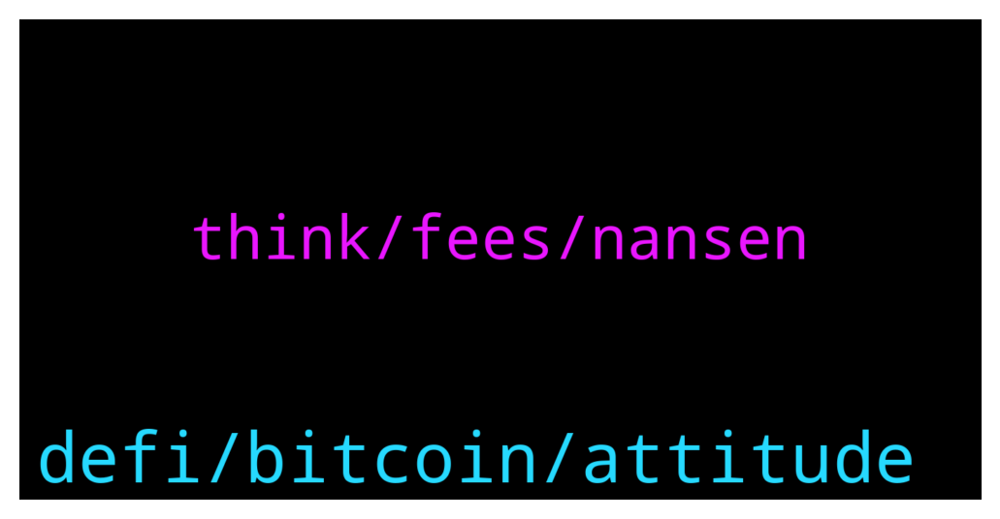

# **@de_fi**
 ## Analysis for **2021-12-16** - **2021-12-17**.

---

## 📊 **Basic Stats**

**n_messages_sent**: 19

---

---

## 🔝 **Top keywords and related messages**

1. **defi, bitcoin, attitude**

    @Ingalandia --- *any bitcoiners here available for community building with a bitcoin defi project? please dm* **--->** [TG Discussion](https://t.me/de_fi/231525)

    @realpeter --- *Don’t miss out on our job openings on DeFi Prime! https://defiprime.pallet.xyz/jobs* **--->** [TG Discussion](https://t.me/de_fi/231612)

    @mtronfi --- *Attitude is the mind's paintbrush; it can color any situation. In the case of PaintSwap, an audit only goes so far. The builders need to provide plenty of transparency before painting solids. #DeFi   https://docs.defisafety.com/master/paint-swap-process-quality-review* **--->** [TG Discussion](https://t.me/de_fi/231561)

    @Classic1092 --- *plz. I was hoping you could help me to decide about participating in the ParamountDax. I want to take part so much! But I have my doubts. I'm already getting my income, but it cannot be so cool for real… Or can it?..* **--->** [TG Discussion](https://t.me/de_fi/231608)

    @Jacobh --- *If you want be the first in every presale and fair launch - check group in my bio* **--->** [TG Discussion](https://t.me/de_fi/231596)

    @Temyt1 --- *Who can teach me DeFi nd how to be profitable* **--->** [TG Discussion](https://t.me/de_fi/231566)

2. **think, fees, nansen**

    @xnatasx --- *Are they messing up their airdrop or something with those fees? https://etherscan.io/tx/0x9681bcf8d00169c9eeb61f025cf4a59de2cef8995462db8a4bb70fe84af94507  Edit: No, expected very high gas to claim.* **--->** [TG Discussion](https://t.me/de_fi/231503)

    @xnatasx --- *Argent's layer 2 now seems public for new users. No fees to create, recover, get fiat into... https://www.argent.xyz/* **--->** [TG Discussion](https://t.me/de_fi/231628)

    @andrewsmartcontract --- *Nansen talking about tokenizing some portion of the platform: https://www.coindesk.com/business/2021/12/16/on-chain-data-hub-nansen-eyes-aggressive-growth-with-75m-raise/* **--->** [TG Discussion](https://t.me/de_fi/231500)

    @dereksilva --- *Nansen raises $75 mln in early-stage funding led by Accel — link* **--->** [TG Discussion](https://t.me/de_fi/231492)

    @ricburton --- *a good friend is in lisbon for a few days looking to get crypto pilled—anyone there? 🇵🇹* **--->** [TG Discussion](https://t.me/de_fi/231511)

    @xiamoli123 --- *Recently, the ETH of cryptocurrency is rising, I think it will break 10,000 DOLLARS, what do you think?* **--->** [TG Discussion](https://t.me/de_fi/231562)

