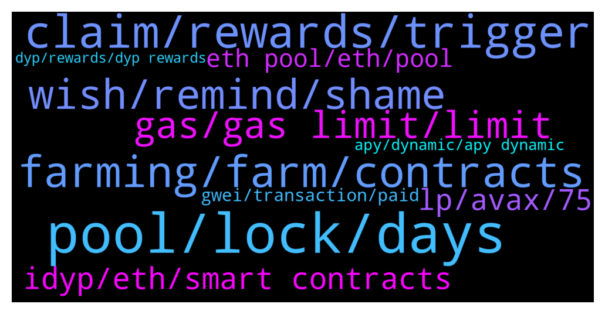

# **@dypfinance**
 ## Analysis for **2021-12-16** - **2021-12-17**.

---

## 📊 **Basic Stats**

**n_messages_sent**: 555

---

---

## 🔝 **Top keywords and related messages**

1. **pool, lock, days**

    @Cj --- *any eta when this contract stops today? https://app.dyp.finance/constant-staking-120  after it stops, my dyps can be withdrawn right?* **--->** [TG Discussion](https://t.me/dypfinance/230250)

    @sb3ee --- *What time is pool reward today i forget, 11, 10, or 9 EST* **--->** [TG Discussion](https://t.me/dypfinance/230347)

    @timdyp --- *It was after 7 months since launch.* **--->** [TG Discussion](https://t.me/dypfinance/229906)

    @DhoniMSD516 --- *Hey which pools? We recently launched all the pools* **--->** [TG Discussion](https://t.me/dypfinance/230325)

    @uBrown --- *When can we see New pool on avalanche* **--->** [TG Discussion](https://t.me/dypfinance/230323)

    @DhoniMSD516 --- *Hey no specific time known, if your lockin time ended you can withdraw even now* **--->** [TG Discussion](https://t.me/dypfinance/230251)

2. **claim, rewards, trigger**

    @hemanrock --- *FOR THE FARMING REWARDS ARE UPDATED EVERY 24 HOURS. you will be able to see at Rewards section.* **--->** [TG Discussion](https://t.me/dypfinance/230045)

    @chunshern90 --- *When claim triggered. my rewards will be update.* **--->** [TG Discussion](https://t.me/dypfinance/230816)

    @shinigamikami --- *Yeah that’s the plan and the good thing is even if nobody claims once someone does you get all previous rewards* **--->** [TG Discussion](https://t.me/dypfinance/230345)

    @DhoniMSD516 --- *On pc/desktop hover on claim to see time for next rewards* **--->** [TG Discussion](https://t.me/dypfinance/230804)

    @shinigamikami --- *Don’t worry about claim if you don’t plan to spend your rewards* **--->** [TG Discussion](https://t.me/dypfinance/230343)

    @Cricascar --- *Is there any clock to see when rewards are distributed?* **--->** [TG Discussion](https://t.me/dypfinance/230415)

3. **farming, farm, contracts**

    @JulienRayleigh --- *WTF 😭😭 I want to put 120$ in farming and have to pay 120$ fees... Sad world 😭* **--->** [TG Discussion](https://t.me/dypfinance/229926)

    @timdyp --- *Honestly we don't like to call other projects competitors because everything that we have done was built from scratch, I mean all the smart contracts have been developed from 0, no forks, etc like 99% of similar projects are doing.* **--->** [TG Discussion](https://t.me/dypfinance/230604)

    @Nana_Y --- *Which chain is the most profitable in the long term for farming?* **--->** [TG Discussion](https://t.me/dypfinance/230467)

    @shinigamikami --- *No farming deposit will cost more than that cause of the multiple calls the contracts makes* **--->** [TG Discussion](https://t.me/dypfinance/230330)

    @Leonid --- *Hey, I have my ETH on binance. What I have to do to farm these?* **--->** [TG Discussion](https://t.me/dypfinance/229961)

    @notsodirty --- *Hi, are farms on bsc chain or eth chain?* **--->** [TG Discussion](https://t.me/dypfinance/230475)

4. **wish, remind, shame**

    @sb3ee --- *That’s correct, i can let them populate* **--->** [TG Discussion](https://t.me/dypfinance/230344)

    @Bossspo --- *Cool 👏👏 I will remind you in case you forget 😉* **--->** [TG Discussion](https://t.me/dypfinance/230595)

    @timdyp --- *No, unfortunately it is clear that you did not read how it works. Here you can find some info from a previous discussion: https://t.me/dypfinance/223784* **--->** [TG Discussion](https://t.me/dypfinance/230779)

    @JulienRayleigh --- *That doesn't answer my question sir 😅* **--->** [TG Discussion](https://t.me/dypfinance/230011)

    @DhoniMSD516 --- *No this is how it is supposed to work* **--->** [TG Discussion](https://t.me/dypfinance/230928)

    @timdyp --- *No worries, that's why I share all the info here :) So I can have someone to remind me.* **--->** [TG Discussion](https://t.me/dypfinance/230596)

5. **gas, gas limit, limit**

    @hemanrock --- *please check this and this was about few hours ago https://t.me/dypfinance/229925  But now the gas price might be high or low* **--->** [TG Discussion](https://t.me/dypfinance/230070)

    @chunshern90 --- *It can be execute. But that require gas fee.* **--->** [TG Discussion](https://t.me/dypfinance/230805)

    @Momo --- *maybe using binance smart chain will be bettee for gas fee just suggestions* **--->** [TG Discussion](https://t.me/dypfinance/230162)

    @Hustler --- *Gas fee is still way High* **--->** [TG Discussion](https://t.me/dypfinance/230005)

    @Hustler --- *Is it worth buying on high gas fee as well ?* **--->** [TG Discussion](https://t.me/dypfinance/230015)

    @iamJubi --- *Though the higher the gas limit, the success rate is higher.* **--->** [TG Discussion](https://t.me/dypfinance/230123)

6. **idyp, eth, smart contracts**

    @DhoniMSD516 --- *The iDYP is part of the new smart contracts strategies, so iDYP will be on every chain (existing and also upcoming) used for farms similar way, we accommodated iDYP airdrop and presale allocation of ETH in BSC for investors to avoid paying high fees* **--->** [TG Discussion](https://t.me/dypfinance/230870)

    @ringLeader96 --- *Is there a way to buy iDYP directly?* **--->** [TG Discussion](https://t.me/dypfinance/230316)

    @error_500 --- *10x, so there isn’t a way to compare the iDYP token across all networks in the same chart view?* **--->** [TG Discussion](https://t.me/dypfinance/230861)

    @error_500 --- *Is there a place where we can see/compare the price of iDYP token (0xbd100d061e120b2c67a24453cf6368e63f1be056) across all network chains (ETH, BSC, AVAX)?* **--->** [TG Discussion](https://t.me/dypfinance/230829)

    @Nefarpan --- *Lmao, that's too much to loose considering the ETH fees.* **--->** [TG Discussion](https://t.me/dypfinance/230775)

    @chunshern90 --- *yeah. understand this concept. But i do have 63.82 IDYP/WAVAX. Where can i check market price for each IDYP/WAVAX?* **--->** [TG Discussion](https://t.me/dypfinance/230284)

7. **lp, avax, 75**

    @chunshern90 --- *my LP deposit - 63.82 IDYP/WAVAX (Valued $1,900.30) <- Is this value fluctuate?* **--->** [TG Discussion](https://t.me/dypfinance/230269)

    @sb3ee --- *Okay this is a question/s for the patient here among us.    Say I staked 5 avax in v2 .  It’s broken to 75:25 avax/ dyp.   That leaves me holding 4 avax  And roughly 200 dyp.   If I hold in LP hypothetically 6 months.  Presuming for my example AVAX does really well as far as future price.  And it doubles in 6 months to $200 an avax.    I withdraw my original avax out of LP will I get my same 5 avax back or will it be lost someway.* **--->** [TG Discussion](https://t.me/dypfinance/230452)

    @Fran77Nc --- *Why is the value of my deposited LP keep going down? I know that the value of crypto has suffered lately but right now is kind of stable and the amount is lower than 2 days ago. What am I missing* **--->** [TG Discussion](https://t.me/dypfinance/230436)

    @sb3ee --- *25 LP tokens 75% avax 25% deposited   Do my LP amount fluctuate or will I withdraw same 25 LP.   Thanks.* **--->** [TG Discussion](https://t.me/dypfinance/230455)

    @timdyp --- *Of course, we have only 75% of the deposited amount subject to risk of the IL.* **--->** [TG Discussion](https://t.me/dypfinance/229915)

    @chunshern90 --- *Is "Deposited LP" considered stable coin? or it'll huge fluctuate?* **--->** [TG Discussion](https://t.me/dypfinance/230711)

8. **eth pool, eth, pool**

    @timdyp --- *DATE: Dec-15-2021 AMOUNT INVESTED: 1 WETH FEES SPENT: $1,371.89 ETH POOLS: No lock time, 3, 30, 60, and 90 days  RESULTS: Dec-15-2022 👀* **--->** [TG Discussion](https://t.me/dypfinance/229910)

    @uBrown --- *Lol because I see Eth pool is bigger* **--->** [TG Discussion](https://t.me/dypfinance/230327)

    @M. --- *has the error now been fixed with V2 Eth / Pool with the wrong APY ??* **--->** [TG Discussion](https://t.me/dypfinance/230792)

    @JulienRayleigh --- *So it dont work with ETH pool ?* **--->** [TG Discussion](https://t.me/dypfinance/230009)

    @hemanrock --- *No. WETH.e wont work on ETH Pool.* **--->** [TG Discussion](https://t.me/dypfinance/230012)

    @hemanrock --- *No. it wont work on ETH Pool. for ETH pool WETH is the one of asset for deposit.* **--->** [TG Discussion](https://t.me/dypfinance/230010)

9. **gwei, transaction, paid**

    @timdyp --- *Just did a test transaction now, $20 for approve and $300 for deposit. But the Gwei is 127.* **--->** [TG Discussion](https://t.me/dypfinance/229887)

    @Momo --- *i already approved for 10 euro and to deposit asking for 270 euro* **--->** [TG Discussion](https://t.me/dypfinance/230158)

    @shinigamikami --- *I paid $230 to deposit at 91 gwei* **--->** [TG Discussion](https://t.me/dypfinance/230332)

    @shinigamikami --- *I was planning to deposit $1k but I will have to wait for at least 60 gwei to do this since my deposit is very small* **--->** [TG Discussion](https://t.me/dypfinance/229894)

    @Jorzico --- *Not sure but in my days I paid $250* **--->** [TG Discussion](https://t.me/dypfinance/230069)

    @cazjp --- *My tx to deposit failed first time but I was charge 150 usd, what can I do to prevent it?* **--->** [TG Discussion](https://t.me/dypfinance/230119)

10. **apy, dynamic, apy dynamic**

    @hemanrock --- *APY is dynamic. it can be increased or decreased.* **--->** [TG Discussion](https://t.me/dypfinance/230081)

    @Cricascar --- *look like apy drops quite a bit no?* **--->** [TG Discussion](https://t.me/dypfinance/230966)

    @DhoniMSD516 --- *If you are asking about APY, it is all dynamic and you can check the APY's on our website under each dApp https://dyp.finance/earnv2* **--->** [TG Discussion](https://t.me/dypfinance/230197)

    @timdyp --- *So first of all the APY is (AT NO BURN), also the  APY will go down based on the number of users that join the pools. So this HIIIIIIGH APY will not last.* **--->** [TG Discussion](https://t.me/dypfinance/229993)

    @DhoniMSD516 --- *Hey the APY is dynamic so it changes* **--->** [TG Discussion](https://t.me/dypfinance/230373)

    @Nefarpan --- *I understand APY is dynamic, and am honestly not trying to be an asshole, just a bit worried and curious. Just trying to make sure am understanding things correctly.* **--->** [TG Discussion](https://t.me/dypfinance/230759)

