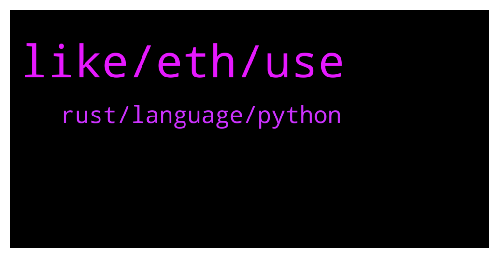

# **@lobsters_chat**
 ## Analysis for **2021-12-16** - **2021-12-17**.

---

## 📊 **Basic Stats**

**n_messages_sent**: 470

---

---

## 🔝 **Top keywords and related messages**

1. **like, eth, use**

    @gas1cent --- *I assumed that the best practice, if you launch a token, is to import OZ's ERC20 and maybe tweak it a little bit, but GEAR doesn’t seem to do that. Same with UNI, although other major projects like YFI, DYDX, SHIBA all use OZ. What are the benefits of doing it from scratch? For reference: https://etherscan.io/address/0xba3335588d9403515223f109edc4eb7269a9ab5d#contracts* **--->** [TG Discussion](https://t.me/lobsters_chat/308179)

    @OxPak --- *gm everyone, 0xPak here, community lead at ApeX Protocol @apexdex   we're a decentralized and non-custodial derivatives protocol that facilitates the creation of perpetual swap markets for any token pair.   we're launching our beta soon, would love to invite lobsters to join us  tg: @apexdex  discord: https://discord.gg/366Puqavwx Twitter: https://twitter.com/OfficialApeXdex* **--->** [TG Discussion](https://t.me/lobsters_chat/307843)

    @ChiTimesChi --- *https://apeboard.finance/ape-bridge  I can recommend using Synapse bridge, though as you can tell by my username, I am a bit biased :)* **--->** [TG Discussion](https://t.me/lobsters_chat/308408)

    @blockminded --- *Look in their recent tweets and replies there’s a few codes knocking about* **--->** [TG Discussion](https://t.me/lobsters_chat/308051)

    @Shaloputik --- *There is a little update about Dydx investor: he has done a tx with request of removing his funds and  he can possibly do it when new epoch starts in 4 days.  In the meantime, we have released a research about Gearbox multiaccounts in testnet😉 https://twitter.com/Shaloputik/status/1471729682718461955* **--->** [TG Discussion](https://t.me/lobsters_chat/308351)

    @yic_alex --- *Also they did derive it from https://github.com/Uniswap/governance/blob/master/contracts/Uni.sol so its not a complete reinvention of the wheel. Not everything has to be OZ.* **--->** [TG Discussion](https://t.me/lobsters_chat/308182)

2. **rust, language, python**

    @marcuszeto --- *Hi friends, I’ve decided to learn coding from scratch, any recommendations on which coding language I should start with first?* **--->** [TG Discussion](https://t.me/lobsters_chat/307997)

    @coine_r --- *Might as well learn C and Haskell just because* **--->** [TG Discussion](https://t.me/lobsters_chat/308029)

    @zhongfu --- *seems very peculiar to suggest that rust and go are the "top needed languages" to "actually build the web"* **--->** [TG Discussion](https://t.me/lobsters_chat/308017)

    @nickbtts --- *According to Stack Overflow's 2020 Developer Survey, JavaScript currently stands as the most commonly-used language in the world (69.7%), followed by HTML/CSS (62.4%), SQL (56.9%), Python (41.6%) and Java (38.4%). It is also the most sought-out programming language by hiring managers in the Americas.  SQL might also be a good starting point for chain-native people, as you can easily add value to projects through Dune etc* **--->** [TG Discussion](https://t.me/lobsters_chat/308015)

    @henkreative30 --- *I have 0 coding knowledge, but asked a few months ago just for learning as you want. And some dev Friends told me the best way is learning JavaScript, basic code things, after this you can try Python or other code languages when you get it* **--->** [TG Discussion](https://t.me/lobsters_chat/308012)

    @yic_alex --- *As long as you dont go with something exotic the language does not matter. Pick something thats prevalent in the area you want to build in later. The best approach for learning, from my experience, is to pick a small project you are passionate about and just start building. Basically just start and whenever you get stuck google / read docs.* **--->** [TG Discussion](https://t.me/lobsters_chat/308008)

