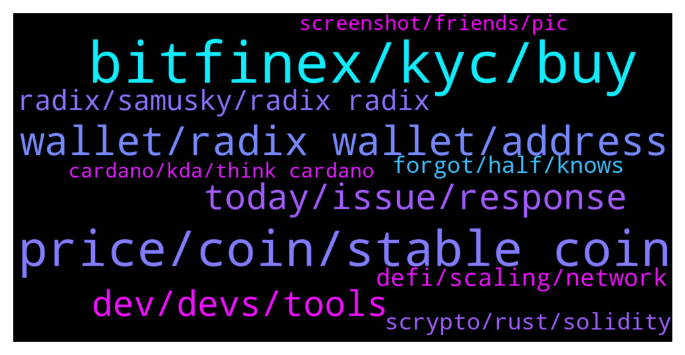

# **@radix_dlt**
 ## Analysis for **2021-12-16** - **2021-12-17**.

---

## 📊 **Basic Stats**

**n_messages_sent**: 837

---

---

## 🔝 **Top keywords and related messages**

1. **bitfinex, kyc, buy**

    @Danba --- *Anyone know how long Bitfinex has been messing up the deposits of XRD now and not being able to credit them. Not too impressive when it is the only exchange for XRD.* **--->** [TG Discussion](https://t.me/radix_dlt/322171)

    @Khan4486 --- *Bitfinex saving us from that whale dumping on us 🙏* **--->** [TG Discussion](https://t.me/radix_dlt/322287)

    @Magal36 --- *Bitfinex is having issues with their node, expect a day or two without withdrawals* **--->** [TG Discussion](https://t.me/radix_dlt/322274)

    @S --- *Bitfinex is the worst exchange in my experience. Every cex is bad but Bitfinex is something else.* **--->** [TG Discussion](https://t.me/radix_dlt/322180)

    @Ben_XRD --- *Sorry Bitfinex is currently the only route to go from XRD to eXRD* **--->** [TG Discussion](https://t.me/radix_dlt/321836)

    @israilito --- *Oooooh 😁, guess I have to create Bitfinex and Buy XRD first* **--->** [TG Discussion](https://t.me/radix_dlt/322980)

2. **price, coin, stable coin**

    @con --- *wow we have higher marketcap than arweave riht??* **--->** [TG Discussion](https://t.me/radix_dlt/322688)

    @Mik3ology --- *Is there a team already researching an XRD stable coin?* **--->** [TG Discussion](https://t.me/radix_dlt/321920)

    @UltraCryptoGirl --- *would have make sense its like a retail store if you have it in walmart then why not in target.* **--->** [TG Discussion](https://t.me/radix_dlt/322729)

    @con --- *marketcap rankings are different from sites...... it is confusing* **--->** [TG Discussion](https://t.me/radix_dlt/322681)

    @Blind5ight --- *There was a job opening at some point referring to stable coin economics* **--->** [TG Discussion](https://t.me/radix_dlt/321921)

    @finnesclown --- *Whats the mc of the coin* **--->** [TG Discussion](https://t.me/radix_dlt/321966)

3. **wallet, radix wallet, address**

    @Mark --- *Bitfinex says my Olympic address is invalid. Was OK a few weeks back* **--->** [TG Discussion](https://t.me/radix_dlt/321750)

    @Arri9 --- *Do anybody knows I have xrd on bitfinex and I want them to send to my radix wallet.But bitfinex said invalide adres ?I used it multiple times and other adressen to* **--->** [TG Discussion](https://t.me/radix_dlt/321615)

    @CodyPham --- *Hi, Pls help. Anyone have issue withdraw form Bitfinex. I copy and paste radix address but they note it "invalid address" I still used this address in last time* **--->** [TG Discussion](https://t.me/radix_dlt/321999)

    @JA --- *Hi people,  For all those who are too paranoic about their seeds phrases.  I'd like to share what I do:  1. I use vmware. 2. I install a clean ISO downloaded DIRECTLY  from microsoft site: https://www.microsoft.com/en-us/software-download/windows10ISO 3. I install Keepass & Radix Wallet inside that virtual machine. No more. 4. The seed never leaves that Windows installation. And I never install ANY other software than keepass & Radix Wallet.     Extra notes: - Just the encrypted keepass file with my seed can exit that isolated windows environment. - When typing your seeds inside the vmware isolated version, you can type lots of text between your safe words. In case you have a keylogger or something. - Never ever store or type or watch your seeds in an "un-clean windows environment", like kmspico, etc. - I still don't know how to disable screenshoting from the guest os.     Not perfect but an extra layer of security, I think.  Hope it helps. JA* **--->** [TG Discussion](https://t.me/radix_dlt/321789)

    @Matus1682 --- *hey anyone got any recent issues with withdrawal from bitfinex. my radix address is suddenly marked as invalid, and it was working previously without a problem. just opened a support ticket.* **--->** [TG Discussion](https://t.me/radix_dlt/322483)

    @Jaran --- *just to double check: radix support told me to validate my radix wallet* **--->** [TG Discussion](https://t.me/radix_dlt/321940)

4. **today, issue, response**

    @Artistizen --- *I have the same issue. It has been days now. A bit frustrating.* **--->** [TG Discussion](https://t.me/radix_dlt/322103)

    @projectShift --- *hey @Jacob_XRD , where's that Rubicon? are you slaking on the job? 🤣* **--->** [TG Discussion](https://t.me/radix_dlt/321541)

    @S --- *but there's so much to do, and so little time. Which reminds me, I should stop with the tg chat for today XD* **--->** [TG Discussion](https://t.me/radix_dlt/322679)

    @nikolandis --- *Does anyone know what's happening here.I* **--->** [TG Discussion](https://t.me/radix_dlt/322458)

    @Radstakes --- *This has happened before to me, seems to be a recurring issue every now and then. Normally just a case of trying later.* **--->** [TG Discussion](https://t.me/radix_dlt/321623)

    @Speakers --- *Shh.. everyone's sleeping. It's been a big day* **--->** [TG Discussion](https://t.me/radix_dlt/321884)

5. **dev, devs, tools**

    @Rich_Launchpool --- *Sorry, any inventive for Devs to build here?* **--->** [TG Discussion](https://t.me/radix_dlt/321705)

    @Blind5ight --- *I recommend these 2 entries into  1) scale-ability & compose-ability: https://www.radixdlt.com/post/cerberus-infographic-series-chapter-i 2) build-ability: https://www.radixdlt.com/post/the-problem-with-smart-contracts-today Extra) dev incentives: https://www.radixdlt.com/post/on-ledger-recurring-developer-revenue-incentives-to-buidl  That should get you a get overview* **--->** [TG Discussion](https://t.me/radix_dlt/321709)

    @Radstakes --- *Check out the new developer hub for more details: http://developers.radixdlt.com* **--->** [TG Discussion](https://t.me/radix_dlt/321720)

    @Blind5ight --- *@Rich_Launchpool , give this a chance if you want to know the approach taken by this project in respect attracting developers: https://youtu.be/PKFmdWqRfy0* **--->** [TG Discussion](https://t.me/radix_dlt/321726)

    @Blind5ight --- *Which type of builders do we want to attract? What type of environment do you create in order to achieve that?* **--->** [TG Discussion](https://t.me/radix_dlt/322143)

    @Blind5ight --- *S , for the full rundown on the build-ability aspect: https://www.radixdlt.com/post/the-problem-with-smart-contracts-today (4-article series)* **--->** [TG Discussion](https://t.me/radix_dlt/322639)

6. **radix, samusky, radix radix**

    @Blind5ight --- *It's not about what I have, it's about what I not have: a life outside of Radix 😁 (Just kidding)* **--->** [TG Discussion](https://t.me/radix_dlt/322972)

    @israilito --- *How wrong way sir? I like Radix too* **--->** [TG Discussion](https://t.me/radix_dlt/322857)

    @mars --- *are there any dex on radix?* **--->** [TG Discussion](https://t.me/radix_dlt/322455)

    @Blind5ight --- *How did you find out about Radix S ?* **--->** [TG Discussion](https://t.me/radix_dlt/322664)

    @Mr_TMA --- *Altcoin Advisor discovered Radix…  https://twitter.com/altcoinadvisor_/status/1471860389914845188?s=21  … and @dogecube* **--->** [TG Discussion](https://t.me/radix_dlt/323017)

    @jafaroff55 --- *What do u mean by ‘their own pages’? Where will people find radix investors?* **--->** [TG Discussion](https://t.me/radix_dlt/322331)

7. **defi, scaling, network**

    @mx471 --- *L1 scaling is not the main problem, but maintaining cross-shard atomic composability is.* **--->** [TG Discussion](https://t.me/radix_dlt/322885)

    @israilito --- *Yeah , separating Computational and Settlement Layers. Same as Polkadot and Eth 2.0. I don't see any problems though* **--->** [TG Discussion](https://t.me/radix_dlt/322871)

    @Jacob_XRD --- *There's more to #DeFi than flash loans and decentralized  exchanges.    This article explores the basics of how passive investing works, and how a $21 trillion industry could be reimagined in DeFi.   https://www.radixdlt.com/post/why-defi-is-the-future-of-passive-index-investing* **--->** [TG Discussion](https://t.me/radix_dlt/322712)

    @NotBen --- *i think solana correctly identified that atomic composability is very important for defi. i don't like how they count network gossip as "transactions" and inflate their tps numbers* **--->** [TG Discussion](https://t.me/radix_dlt/322900)

    @NotBen --- *cross shard atomic composability == L1 scaling* **--->** [TG Discussion](https://t.me/radix_dlt/322888)

    @S --- *Rollups + data availability sharding has nothing to do* **--->** [TG Discussion](https://t.me/radix_dlt/322869)

8. **scrypto, rust, solidity**

    @S --- *Is scrypto human-readable or compiled, btw?* **--->** [TG Discussion](https://t.me/radix_dlt/322630)

    @fpieper --- *You can watch or (skip through) this video - pointing out the differences between Scrypto and Solidity - it is mind blowing even if you don't understand all/much of it.  https://www.youtube.com/watch?v=Iblv3xeg4HM  TLDR: Scrypto is relatively easily readable even if you are not a developer and Solidity is kind of crazy.   Or this short intruduction to Scrypto: https://www.youtube.com/watch?v=Mu8L-BJFfQM I would say even if you don't have much prior developer experience it should be quite easy to follow what is happening in general* **--->** [TG Discussion](https://t.me/radix_dlt/322647)

    @mx471 --- *Soon the requests from other projects to implement Scrypto will be coming in en masse* **--->** [TG Discussion](https://t.me/radix_dlt/321521)

    @mx471 --- *Getting started with Scrypto! https://www.youtube.com/watch?v=Mu8L-BJFfQM  Russell’s Radiswap Review https://www.youtube.com/watch?v=Iblv3xeg4HM* **--->** [TG Discussion](https://t.me/radix_dlt/321562)

    @S --- *Yes. And, speaking as some guy on the internet, looking at the philosophy behind scrypto it makes a lot sense* **--->** [TG Discussion](https://t.me/radix_dlt/322601)

    @S --- *I agree that scrypto most prob. has all of these perks. But more options is always good imho* **--->** [TG Discussion](https://t.me/radix_dlt/322596)

9. **forgot, half, knows**

    @h0ll0wstick --- *yes dats wat i thought so i did that blocktrees to cerberus but doesnt work* **--->** [TG Discussion](https://t.me/radix_dlt/322190)

    @MarkVuong94 --- *U think wrong abt me :)))* **--->** [TG Discussion](https://t.me/radix_dlt/322066)

    @d1scere --- *Opps he was banned already. 🤣* **--->** [TG Discussion](https://t.me/radix_dlt/322089)

    @S --- *ah ofc I forgot about that* **--->** [TG Discussion](https://t.me/radix_dlt/322609)

    @mx471 --- *this was the one I knew existed but forgot the name of* **--->** [TG Discussion](https://t.me/radix_dlt/322426)

    @Blind5ight --- *you forgot the first one, the one that started all this* **--->** [TG Discussion](https://t.me/radix_dlt/322192)

10. **screenshot, friends, pic**

    @TheCodeisTheLaw --- *Does anyone know what they mean by this, I showed them this screenshot and they said "You would still need a class or function once you want to do one other thing in the same file"* **--->** [TG Discussion](https://t.me/radix_dlt/321554)

    @mx471 --- *and blindsight, which makes your name unpleasantly wrong with your persona* **--->** [TG Discussion](https://t.me/radix_dlt/322979)

    @h0ll0wstick --- *But you could say who is using near haha 😄  (I like near i just joke)* **--->** [TG Discussion](https://t.me/radix_dlt/322844)

    @keysoverseas9 --- *and not just one of your friends hehe* **--->** [TG Discussion](https://t.me/radix_dlt/322355)

    @Arri9 --- *Yes even one who looks like the bot* **--->** [TG Discussion](https://t.me/radix_dlt/322168)

    @Arri9 --- *Its your picture an your name* **--->** [TG Discussion](https://t.me/radix_dlt/322154)

