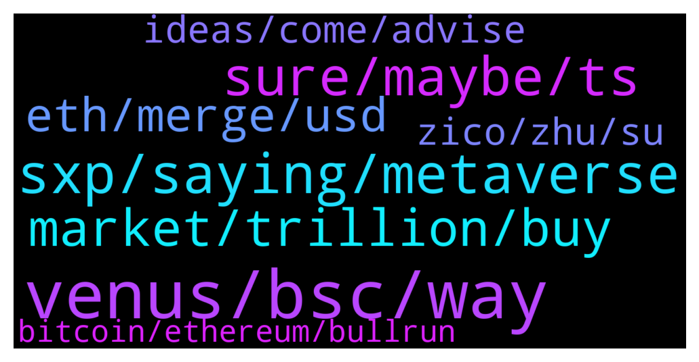

# **@shitpool**
 ## Analysis for **2021-12-16** - **2021-12-17**.

---

## 📊 **Basic Stats**

**n_messages_sent**: 417

---

---

## 🔝 **Top keywords and related messages**

1. **venus, bsc, way**

    @yesbutalsono --- *i have a patagonia puff jacket on rn funny enough* **--->** [TG Discussion](https://t.me/shitpool/709142)

    @wojackdegreate --- *So basically binance. Out of all the defi platforms I trust Venus the most.* **--->** [TG Discussion](https://t.me/shitpool/708278)

    @wojackdegreate --- *Main reasons for Venus are because the farm rewards, and whales selling xvs as soon as they get it. Also binance enabled kyc so it’s hard for big guys to get their money on bsc without using bridges. Plus they shut down the bsc bridge. I think lots of people are fearful of leaving big amounts on bsc. I know I am.* **--->** [TG Discussion](https://t.me/shitpool/708285)

    @grammi --- *There’s just so much dogma and resistance to it that if it ever does break, it’ll be violent and up* **--->** [TG Discussion](https://t.me/shitpool/709232)

    @wojackdegreate --- *First day in awhile I’ve felt like slurpin the dipperino* **--->** [TG Discussion](https://t.me/shitpool/708266)

    @Horselorde --- *Got that feeling too but we’ll see* **--->** [TG Discussion](https://t.me/shitpool/709041)

2. **sxp, saying, metaverse**

    @RecklessCommodities --- *TWO FINANCIAL MARKET INSIDERS: RUSSIAN CENTRAL BANK IS CONSIDERING A BAN ON CRYPTOCURRENCY INVESTMENT IN THE COUNTRY. (FJ)* **--->** [TG Discussion](https://t.me/shitpool/708972)

    @grammi --- *Be real. Crypto isn’t saving poor people and any suggestion otherwise is a false narrative designed to simply pump bags* **--->** [TG Discussion](https://t.me/shitpool/708629)

    @SupreemKai --- *a friend asked for advice on a portfolio for crypto. have advised on usual reliable long term investments -- he said he has 10% reserved for a high risk, high gain short to long term project. I'm thinking TIME, or SPELL... what would the gentlemen in this channel say?* **--->** [TG Discussion](https://t.me/shitpool/709107)

    @wojackdegreate --- *Remember Crypto.com + Bitfinex?   I was saying that there was something fishy in the water & that I had received a credible tip that an individual named, 'Rodolfo Fracassi Ratti Mentone' was directly tied to the leadership of 'crypto.com' via Kris Marszalek (project founder)   Found the Original Digifinex BVI Incorporation Document   Shoutout to 'intel_jakal' once again, one of the absolute best, bar none, when it comes to OSINT investigations.   Please see below:   https://twitter.com/intel_jakal/status/1319602808081895426?s=20* **--->** [TG Discussion](https://t.me/shitpool/708305)

    @Commaximus --- *I think the marketing in crypto rn is very overplayed and trash. I wanted to be innovative. But obviously , when u try this , you will be fucked by MUH LAWS etc.* **--->** [TG Discussion](https://t.me/shitpool/708854)

    @grammi --- *Imagine saying u makeit but in reality answer crypto support tickets* **--->** [TG Discussion](https://t.me/shitpool/708712)

3. **sure, maybe, ts**

    @ziconet --- *so he could really shill it hard* **--->** [TG Discussion](https://t.me/shitpool/708709)

    @issadatboi --- *He will be on some copium soon* **--->** [TG Discussion](https://t.me/shitpool/708441)

    @Xuvinator --- *how the fuck did he get depression?* **--->** [TG Discussion](https://t.me/shitpool/708742)

    @NotTheGodfather --- *but it sucked he had to deal with active sabotage by that group. Some of them were chinese military intelligence guys so maybe ties to CRO? not sure on that last part but there was weird shit going on* **--->** [TG Discussion](https://t.me/shitpool/708296)

    @tg_0S --- *left wp main and dojo but he is active on ts* **--->** [TG Discussion](https://t.me/shitpool/709277)

    @ziconet --- *maybe he held defi down tot he core* **--->** [TG Discussion](https://t.me/shitpool/708746)

4. **market, trillion, buy**

    @MoreMoneyMoreMurder --- *Is the bear market over, should I buy now?* **--->** [TG Discussion](https://t.me/shitpool/708645)

    @kekurikekukaka --- *No, sorry. I never bet on futures, too risky. I only do spot.* **--->** [TG Discussion](https://t.me/shitpool/708413)

    @sumtemm --- *whats current market cap? Is it the 8 mil one?* **--->** [TG Discussion](https://t.me/shitpool/708795)

    @R0mster --- *Nobody is buying this shit scam.* **--->** [TG Discussion](https://t.me/shitpool/709267)

    @Xuvinator --- *some bought ZEC when it first came out* **--->** [TG Discussion](https://t.me/shitpool/708465)

    @kekurikekukaka --- *I'm always trapped in the market, dunno if this counts. Never bought a dip in my life.* **--->** [TG Discussion](https://t.me/shitpool/708515)

5. **eth, merge, usd**

    @ziconet --- *nothign has changed we are still going to 0.15 ethbtc minimum.* **--->** [TG Discussion](https://t.me/shitpool/708652)

    @RecklessCommodities --- *Can be used as a collateral on ETH network* **--->** [TG Discussion](https://t.me/shitpool/708614)

    @ziconet --- *@Saj_le_Great   https://www.tradingview.com/x/iWRzpO6Q/  Figured i'd give you an update on when i told you last year to buy eth all in.  Did you buy? If you did you'd have 3x more btc right now at these levels. Oh and btw we're going to 0.15+ and flipping bitcoin fro the merge. Just checking in on how you're doing etc etc.* **--->** [TG Discussion](https://t.me/shitpool/708458)

    @ziconet --- *https://www.tradingview.com/x/9XrTOguW/ last chance for cheap eth* **--->** [TG Discussion](https://t.me/shitpool/708367)

    @sumtemm --- *Ethbtc daily lookin like reversal/bottom is in so far* **--->** [TG Discussion](https://t.me/shitpool/708460)

    @ziconet --- *btc is going to 180k minimum , eth will go to 0.15 minimum* **--->** [TG Discussion](https://t.me/shitpool/708432)

6. **zico, zhu, su**

    @Babar_the_elephant --- *So in a couple months zico will go back to his Bitcoin copy paste memes and bullet points. Or whatever other crypto he's paid to shill* **--->** [TG Discussion](https://t.me/shitpool/708605)

    @michael_ssss --- *We are all Zico (except jdk)* **--->** [TG Discussion](https://t.me/shitpool/708900)

    @Xuvinator --- *so when augusto goes cocky bearish, we buy. when zico gives a call and says 99% confident, we sell?* **--->** [TG Discussion](https://t.me/shitpool/708454)

    @BearishWhale --- *Zhu is a big dog now, thats y. People love vcs unloading dogshit on their heads* **--->** [TG Discussion](https://t.me/shitpool/709058)

    @RecklessCommodities --- *I repeat again; Zico is washed up, trade your book, don't bother..* **--->** [TG Discussion](https://t.me/shitpool/708905)

    @monkey993 --- *Zico puts his balls on the line publically* **--->** [TG Discussion](https://t.me/shitpool/708896)

7. **ideas, come, advise**

    @AsianFever --- *Pack it up, back to bear* **--->** [TG Discussion](https://t.me/shitpool/708705)

    @Breddao --- *Lmao it's great reading all these steps as you totally figured all out especially last time when not even step 1 worked out* **--->** [TG Discussion](https://t.me/shitpool/708893)

    @ziconet --- *show me your trades , with a call out and a timestamp and then i'll respect you* **--->** [TG Discussion](https://t.me/shitpool/708914)

    @kimpatt --- *well, imagination works both ways lol ... we can go up too but only confirmation can tell where we lead to* **--->** [TG Discussion](https://t.me/shitpool/709178)

    @sumtemm --- *Feels like if we are going to go up, we need to shakeout a bit harder* **--->** [TG Discussion](https://t.me/shitpool/709161)

    @RecklessCommodities --- *just the way you do it* **--->** [TG Discussion](https://t.me/shitpool/708784)

