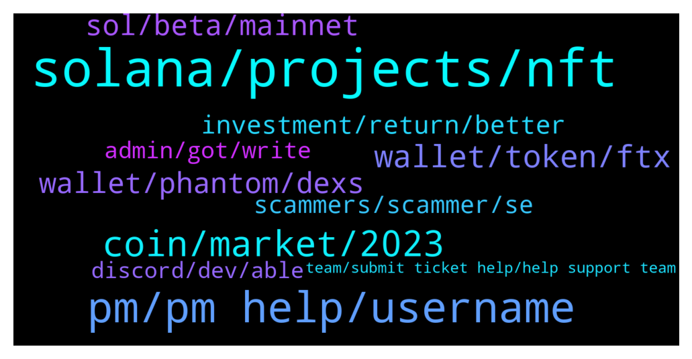

# **@solana**
 ## Analysis for **2021-12-16** - **2021-12-17**.

---

## 📊 **Basic Stats**

**n_messages_sent**: 372

---

---

## 🔝 **Top keywords and related messages**

1. **solana, projects, nft**

    @Darmak1 --- *Hello I am on call with someone from administrator of solana is this true call?* **--->** [TG Discussion](https://t.me/solana/870882)

    @Anwar --- *Hi Admin, I saw a promotion for Solana holders that they receive bonus today. Is it true. Can you please confirm* **--->** [TG Discussion](https://t.me/solana/870415)

    @sechannn --- *nope bro, you can just check ecosystem site and see the codi* **--->** [TG Discussion](https://t.me/solana/869794)

    @RealPrinceOla --- *Hello! Please kindly do your own research before investing into any crypto project. However, you can check below urls to know some of the projects which are available on Solana blockchain. Note that project listed on the website doesn't means that Solana team recommend these projects for investment purposes and also projects that are not mentioned in the website doesn't mean they are not real too.   1️⃣ https://solana.com/ecosystem  2️⃣ https://twitter.com/Solana_Mates (Latest updates on new projects)  3️⃣ https://solanabeach.io/tokens* **--->** [TG Discussion](https://t.me/solana/869848)

    @cryptolover1987 --- *Hello !!  Try this👇🏻👇🏻 Yield farming/ lending/borrowing platforms :  1️⃣ Oxygen  It is a DeFi Prime Brokerage Protocol built for the future to support 100s of millions of people. It can help you, as a holder of digital assets, generate liquidity, earn yield, borrow assets to go short, get trading leverage against portfolio of assets.   🔗https://www.oxygen.org/  2️⃣Solaris  It is a Lending/Borrowing protocol that brings Flashloans to Solana blockchain (inspired by Aave and Compound)  🔗https://solana.com/ecosystem/solaris  3️⃣ Orca  you can provide liquidity to a trading pool to earn trading fees.  🔗https://www.orca.so/pools  4️⃣ Raydium  🔗 https://raydium.io/farms/  5️⃣ Jet protocol  Jet Protocol is a borrowing and lending protocol built on the Solana blockchain.  🔗 https://www.jetprotocol.io  6️⃣ Solfarm SolFarm is the first yield aggregation platform built on Solana with auto-compounding vault strategies.  🔗 https://solfarm.io  7️⃣ Solend Soled is an algorithmic, decentralized protocol for lending and borrowing.   🔗 https://solend.fi* **--->** [TG Discussion](https://t.me/solana/871356)

    @Boggs_dBoss --- *Hello.. it’s been a while here , what new project does the solana have ?* **--->** [TG Discussion](https://t.me/solana/871059)

2. **pm, pm help, username**

    @KING OF THE SNOT --- *don't need help just saying hello to everyone* **--->** [TG Discussion](https://t.me/solana/871468)

    @theminakof --- *Эта конченная сеть вообще собирается работать сегодня?* **--->** [TG Discussion](https://t.me/solana/871500)

    @mahib45 --- *Hello 👋  I already replied you ❤* **--->** [TG Discussion](https://t.me/solana/870520)

    @Monterrey_Rice --- *Always good! How you doing today* **--->** [TG Discussion](https://t.me/solana/870407)

    @cryptolover1987 --- *Try with different username.  Or try this : http://solana.com/discord* **--->** [TG Discussion](https://t.me/solana/870064)

    @BSConlineCEO --- *hello can I speak with the amdin?* **--->** [TG Discussion](https://t.me/solana/870078)

3. **coin, market, 2023**

    @C --- *I’m bullish on the crypto market for 2022 and 2023 if macro economics don’t fuck it up. I’m still expecting shit to happen with evergrande which will bring a domino effect* **--->** [TG Discussion](https://t.me/solana/869490)

    @yaaazteq --- *Are YOU bullish📈 or bearish📉 on the crypto market into 2022?* **--->** [TG Discussion](https://t.me/solana/869481)

    @user0227 --- *DeFiYield launches $DEFI token and they indicated that they would try to launch it your chain this corresponds to reality ?* **--->** [TG Discussion](https://t.me/solana/869837)

    @BarnZ010 --- *All crypto follow bitcoin price. 🤷‍♂️* **--->** [TG Discussion](https://t.me/solana/870248)

    @mariamuo --- *Crypto is highly fluctuating. Its value can go up and down multiple times throughout the day.* **--->** [TG Discussion](https://t.me/solana/869712)

    @gandryeanb --- *Both of them is good in their on way, we came to this crypto zone because of money, so stop marrying token/coin, and start looking up for opportunity* **--->** [TG Discussion](https://t.me/solana/869867)

4. **wallet, token, ftx**

    @OsmnBr --- *I register whitelist in solanium and try connect wallet but it said could not authenticate wallet. What does it mean ? and what should I do ?* **--->** [TG Discussion](https://t.me/solana/869609)

    @domskalis --- *I have a problem with Radyium swap..  I make a transaction with ledger (phantom) to buy with solana some $Real.  The first transaction was for SWAP (raydium-route-swap)  And then, my solana disappeared.  I have a transaction on solscan and the address where i have sent solana it’s the same that i made all my transaction to buy any asset. But now my solana are disappeared* **--->** [TG Discussion](https://t.me/solana/870780)

    @Aqibe06 --- *CQ22JutSvvzUuETPeAKPFVZfKKgLFU5JA5aw41J3FHkw plz help I sended 0.004 sol I received but after ward I again'sended 0.14sol but I not received in my ftx wallet solletio to ftx plzzz help* **--->** [TG Discussion](https://t.me/solana/871456)

    @jinxiuba --- *The SOL wallet does not display an icon, cannot delete the linked account, and refund the rental fee* **--->** [TG Discussion](https://t.me/solana/871270)

    @ligenj --- *5 days ago i transfer Solana from Hotbit exchange to Phantom wallet, and i didnt got tokens. 🙁      scammer fck off on private.!!* **--->** [TG Discussion](https://t.me/solana/869573)

    @Bhaskar --- *I just what to know the anatomy of how the limited edition non-fungible tokens work on Solana.  Say, I have created a 3D Sword and I would like to mint 100 only out of 3D Sword file.  I am a little confused about how it works Solona SPL Token. Following is my idea on the workflow on how to achieve that. Please correct me if I am wrong and let me know the right way to do that.  1. Create a Token using spl-token create-token --decimals 0 (ex. this creates token with id TOKEN_ADDRESS_0001)  2. Mint the token using spl-token mint TOKEN_ADDRESS_0001 100 {SOME_OTHER_ADDRESS} (see 100 tokens i am minting)  3. Then disable further minting of that token using spl-token authorize TOKEN_ADDRESS_0001 mint --disable* **--->** [TG Discussion](https://t.me/solana/869980)

5. **wallet, phantom, dexs**

    @mahib45 --- *Hello  Which wallet are you using?* **--->** [TG Discussion](https://t.me/solana/869410)

    @mahib45 --- *Check this out👇🏻 https://coinmarketcap.com/currencies/solana/markets/  Or https://www.coingecko.com/en/coins/solana#markets  You can also buy on DEXs by connecting your wallet with DEXs. For DEXs - https://t.me/solana/481292   Please note that our admins won't DM you first* **--->** [TG Discussion](https://t.me/solana/869603)

    @FalconerBlake --- *Where can i get help with my phantom wallet not properly working? It shows the tokens but It will not show the totals for the tokens in my wallet. Help?* **--->** [TG Discussion](https://t.me/solana/871298)

    @C --- *Multiple wallets from binance to whatever* **--->** [TG Discussion](https://t.me/solana/869625)

    @therealthinkright --- *You can check Atomic Wallet ..it pretty cool on mobile* **--->** [TG Discussion](https://t.me/solana/869937)

    @Antbar84 --- *Watch on Solflare wallet! Good luck and don’t worry man* **--->** [TG Discussion](https://t.me/solana/870798)

6. **sol, beta, mainnet**

    @Krageland --- *why is it that minting Sol requires so much bandwidth? Internet service should be at least 300Mbit/s symmetric, commercial. 1GBit/s preferred* **--->** [TG Discussion](https://t.me/solana/870090)

    @JOHN --- *hello please .someone can you show me the prediction price of solana in this two 2 days ?* **--->** [TG Discussion](https://t.me/solana/870148)

    @medivici --- *Hey all I need to move some SOL around. Is the network back up?* **--->** [TG Discussion](https://t.me/solana/870152)

    @Carlessio --- *if sol becomes  a lil bigger and more stable it can easily reach the thousand mark in month.* **--->** [TG Discussion](https://t.me/solana/869487)

    @wi11iams --- *Guys my prediction was right sol is getting to 180 🤩* **--->** [TG Discussion](https://t.me/solana/869467)

    @marco_s15 --- *Nope, sol is better ad newer* **--->** [TG Discussion](https://t.me/solana/870235)

7. **investment, return, better**

    @C --- *Depends on your return rate, amount of investment and the quick ratio- RTV- RVV Ratio’s* **--->** [TG Discussion](https://t.me/solana/869646)

    @MoeDuli --- *Suppose the initial investment is $10k. Which would be better? 1 or 2?* **--->** [TG Discussion](https://t.me/solana/869647)

    @Abi... --- *So so bullish ... I'll advice taking profits though* **--->** [TG Discussion](https://t.me/solana/869495)

    @MoeDuli --- *Risk analysis...which investment is better:  1. A guaranteed 60% yearly return with a 0.1% chance of losing it all  2. A speculative yearly return that ranges from 0% - 100% with a 20% drawdown possibility* **--->** [TG Discussion](https://t.me/solana/869637)

    @hlokj568 --- *For me, investment is both a sport and entertainment.* **--->** [TG Discussion](https://t.me/solana/871061)

    @javier --- *We got companies with best investment offer why not start and earn huge profits* **--->** [TG Discussion](https://t.me/solana/870823)

8. **scammers, scammer, se**

    @Consultwithtee --- *Please family stay away from these scammers. I called them out and they kicked me out😂🤷🏾‍♀️. Idc I hope someone out of those 33,000 saw my msg before I was booted. You don’t do that to ppl that’s wrong.  I hope everyone has a beautiful day!!! ❤️❤️❤️❤️❤️* **--->** [TG Discussion](https://t.me/solana/870571)

    @redemptionAlliance --- *I'm not like the majority of people in here who are either scammers or fraudsters, am genuine as in I really have premium trading signals for free and anyone can use them* **--->** [TG Discussion](https://t.me/solana/869900)

    @IIIIII_Luca_IIIIII --- *Many thanks! I dodged like 10 scammer 😂* **--->** [TG Discussion](https://t.me/solana/871431)

    @C --- *You can on a broker like binance etc.* **--->** [TG Discussion](https://t.me/solana/871155)

    @DesktopCommando --- *5x Customer Support - 8 x Admins - 2 x Help desk - 3 x Tech support - 7 x Moderators - Need to clean the scammers from the members section* **--->** [TG Discussion](https://t.me/solana/870764)

    @MarcBMW --- *Your going to get pm from every scammer in here  Do not respond to the PM they're thieves* **--->** [TG Discussion](https://t.me/solana/871247)

9. **admin, got, write**

    @Minitw --- *Hallo i got busd i want to swap it is support or admin online* **--->** [TG Discussion](https://t.me/solana/871245)

    @SamundraSen --- *I want to talk with admin* **--->** [TG Discussion](https://t.me/solana/870659)

    @Gracy --- *dear admin, if i have any question about my withdrawal then where should i write?* **--->** [TG Discussion](https://t.me/solana/870685)

    @Serdal CAN --- *Solet can I write in private please help me all my balance is gone* **--->** [TG Discussion](https://t.me/solana/869432)

    @Larry --- *Admin will not Dm, I got Dm from support team too* **--->** [TG Discussion](https://t.me/solana/870859)

    @Mars --- *Hallo i got busd i want to swap it is support or admin online* **--->** [TG Discussion](https://t.me/solana/870843)

10. **discord, dev, able**

    @cryptolover1987 --- *▫️Join us in the Discord for technical support from the dev team 🔗 https://discord.com/invite/pquxPsq  ✅Click on #role and select the emoji "Community " 👨‍🌾 on Carl -bot. And then go back to the general section again.  Then you will able to send message!* **--->** [TG Discussion](https://t.me/solana/871428)

    @mahib45 --- *Hello 👋  Phantom has no telegram group or telegram moderator!* **--->** [TG Discussion](https://t.me/solana/871307)

    @xshustin --- *Sadly it says that the invite cant be excepted, I already tried to change my username to various versions* **--->** [TG Discussion](https://t.me/solana/870084)

    @xshustin --- *Are you able to join the solana discord server? Discord does just nothing when I want to accept an invite* **--->** [TG Discussion](https://t.me/solana/870061)

    @mahib45 --- *Hello,  Join us in the Discord for technical support from the dev team!  🔗https://solana.com/discord  ✅Click on #role and select the emoji "Community or dev" 👨‍🌾 on Carl -bot. And then go back to the general section again.  Then you will able to send message!* **--->** [TG Discussion](https://t.me/solana/871153)

    @cryptolover1987 --- *Hello,  Join us in the Discord for technical support from the dev team!  🔗https://solana.com/discord  ✅Click on #role and select the emoji "Community or dev" 👨‍🌾 on Carl -bot. And then go back to the general section again.  Then you will able to send message!* **--->** [TG Discussion](https://t.me/solana/870000)

