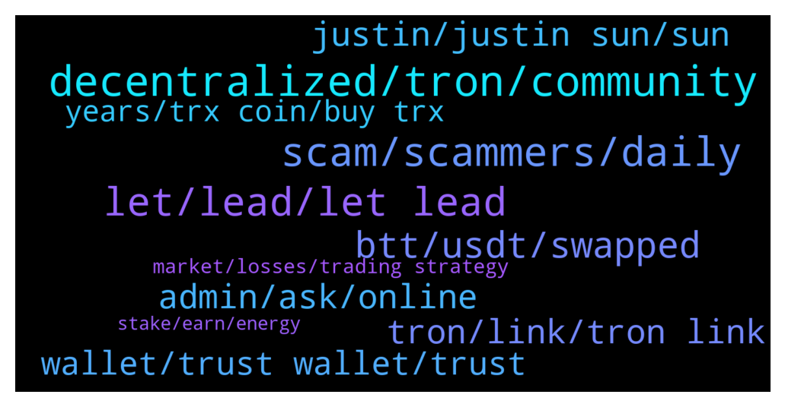

# **@tronnetworkEN**
 ## Analysis for **2021-12-16** - **2021-12-17**.

---

## 📊 **Basic Stats**

**n_messages_sent**: 399

---

---

## 🔝 **Top keywords and related messages**

1. **decentralized, tron, community**

    @Thor_070 --- *Only if trons get adopted widely in USA.* **--->** [TG Discussion](https://t.me/tronnetworkEN/3772534)

    @Carlos_TRX --- *I answered you already.... TRON has been decentralized since its inception, nothing will change but for the better, rest assured.* **--->** [TG Discussion](https://t.me/tronnetworkEN/3772642)

    @Winklancer11 --- *Wether Tron hits 1$ or 100$ or 1000$ is now fully depend on the community.* **--->** [TG Discussion](https://t.me/tronnetworkEN/3772769)

    @xPommepote --- *« I will continue to support and encourage the development of TRON and it’s decentralized community » Justin Sun, today.* **--->** [TG Discussion](https://t.me/tronnetworkEN/3772963)

    @Carlos_TRX --- *Why? TRON has been one more actor and is decentralized since its inception.* **--->** [TG Discussion](https://t.me/tronnetworkEN/3772627)

    @xPommepote --- *You are getting wrong. 3 nodes will be dissolved. This means TRX will be entire handle by the community. 100% decentralized.* **--->** [TG Discussion](https://t.me/tronnetworkEN/3772514)

2. **scam, scammers, daily**

    @xPommepote --- *99% of tg bot are scam* **--->** [TG Discussion](https://t.me/tronnetworkEN/3770945)

    @Dark --- *I block 20~30 scammers every day. Why  they aren't get tired at all 😂😑?* **--->** [TG Discussion](https://t.me/tronnetworkEN/3770512)

    @KingsDove_TRX --- *Most of them are located in Kolkata India or west Africa. They have entire shops setup to do this very work of scamming* **--->** [TG Discussion](https://t.me/tronnetworkEN/3770521)

    @agentpiki --- *Scammers keep trying hard guys.   I see y'all hiding like cockroaches.  Tronics won't stop keeping this community safe.* **--->** [TG Discussion](https://t.me/tronnetworkEN/3771895)

    @agentpiki --- *Can you clean the channel? too much scammers there* **--->** [TG Discussion](https://t.me/tronnetworkEN/3770292)

    @KingsDove_TRX --- *You'd be surprised bro.... Some of them are really good on the phone lol* **--->** [TG Discussion](https://t.me/tronnetworkEN/3770535)

3. **let, lead, let lead**

    @lastbro3 --- *okay we'll see the final result, I also feel panicked. because just yesterday I added items and staking on binance* **--->** [TG Discussion](https://t.me/tronnetworkEN/3773046)

    @S --- *From the drop we see today* **--->** [TG Discussion](https://t.me/tronnetworkEN/3772748)

    @KingsDove_TRX --- *Been a little under the weather lately. Feels good to be back!!* **--->** [TG Discussion](https://t.me/tronnetworkEN/3770450)

    @Darre81 --- *Is there a timeline for this* **--->** [TG Discussion](https://t.me/tronnetworkEN/3772505)

    @Dark --- *This  fall was intentional.  For scare people. And laquidtion long position* **--->** [TG Discussion](https://t.me/tronnetworkEN/3770599)

    @Edwina_1688888 --- *We are meeting in a bull market in 2025* **--->** [TG Discussion](https://t.me/tronnetworkEN/3770578)

4. **btt, usdt, swapped**

    @mogh2345 --- *but now my new btt is 17.000.000 unit why?* **--->** [TG Discussion](https://t.me/tronnetworkEN/3772026)

    @mogh2345 --- *Hi, I converted 288,000 wbtt to btt in sunswap, but I was given 17000000 units. What is the problem?* **--->** [TG Discussion](https://t.me/tronnetworkEN/3772013)

    @agentpiki --- *As BTC test 48 Trx test 0.08 👍* **--->** [TG Discussion](https://t.me/tronnetworkEN/3773042)

    @agentpiki --- *Maybe it is the new BTT  BTTOLD 1 = BTT new 1000* **--->** [TG Discussion](https://t.me/tronnetworkEN/3772019)

    @wolfgang1213 --- *are you guys familiar with torrentswap? its marketing itself as the first dex on btt, the btt admin says they are unfamiliar* **--->** [TG Discussion](https://t.me/tronnetworkEN/3772932)

    @xPommepote --- *What ? Why you wanted to have 50$ if you swap 0.1$ of OLDBTT* **--->** [TG Discussion](https://t.me/tronnetworkEN/3772350)

5. **admin, ask, online**

    @Mars --- *Hallo i got busd i want to swap it is support or admin online* **--->** [TG Discussion](https://t.me/tronnetworkEN/3771526)

    @Minitw --- *Hallo i got busd i want to swap it is support or admin online* **--->** [TG Discussion](https://t.me/tronnetworkEN/3771101)

    @rzkioktvn --- *did i lost my 50$ or maybe admin can help* **--->** [TG Discussion](https://t.me/tronnetworkEN/3772327)

    @Divenem --- *I just showed an admin a screenshot prove* **--->** [TG Discussion](https://t.me/tronnetworkEN/3769394)

    @Cathlyn --- *Hi there i have a question here* **--->** [TG Discussion](https://t.me/tronnetworkEN/3771590)

    @Alexander11123niraj --- *Hi admin I have  a problem* **--->** [TG Discussion](https://t.me/tronnetworkEN/3772549)

6. **tron, link, tron link**

    @xPommepote --- *There is no tron bot, it’s a scam* **--->** [TG Discussion](https://t.me/tronnetworkEN/3770922)

    @Yassir49 --- *I participated in tron airdrop in 2018 or 2019 and got a token but now i don t know where to find it* **--->** [TG Discussion](https://t.me/tronnetworkEN/3770315)

    @agentpiki --- *This is tron channel. APENFT is affiliated with Tron* **--->** [TG Discussion](https://t.me/tronnetworkEN/3771594)

    @xPommepote --- *By who ? There is no tron bot. And it’s not authorized to post link here* **--->** [TG Discussion](https://t.me/tronnetworkEN/3770928)

    @KingsDove_TRX --- *⚠️ WARNING ⚠️  If someone is sending you a message from Tron support of any kind it is a scam!!   Please do not respond and ask in the Official Main Chat here to get your issues resolved!  This channel is the only Official chatroom for anything Tron related!  Please direct your questions here and an Admin or Mod will help 😁* **--->** [TG Discussion](https://t.me/tronnetworkEN/3770574)

    @AVALON820 --- *Campian in tron link app. Which give 300 cerdite per referral* **--->** [TG Discussion](https://t.me/tronnetworkEN/3770249)

7. **justin, justin sun, sun**

    @sirajulhaq1975 --- *Bye bye Justin sun now who will handle tron* **--->** [TG Discussion](https://t.me/tronnetworkEN/3772673)

    @Aarnick --- *Is it true that justin is going away?* **--->** [TG Discussion](https://t.me/tronnetworkEN/3772946)

    @Gustavo --- *Hi everyone, good afternoon! How are things?   my name is Gustavo, I speak from Brazil.   It's been circulating on the news in my country that Justin is leaving the Tron project.   Can you tell me if this is really true?* **--->** [TG Discussion](https://t.me/tronnetworkEN/3773015)

    @firmam12 --- *why justin :( am hold tron* **--->** [TG Discussion](https://t.me/tronnetworkEN/3773038)

    @lastbro3 --- *okay i want to know, is this your view if you say this is good news justin is out of tron? how the fate of the holders. Honestly, I panicked too when this news appeared, where my staking has only been running for a few weeks* **--->** [TG Discussion](https://t.me/tronnetworkEN/3773025)

    @lastbro3 --- *hey why justin resigned? what is the resulting impact? is the TRX falling?* **--->** [TG Discussion](https://t.me/tronnetworkEN/3772622)

8. **wallet, trust wallet, trust**

    @Niikmoor --- *You can stake Tron in Atomic wallet. Tronlink too* **--->** [TG Discussion](https://t.me/tronnetworkEN/3769843)

    @Sevinc --- *Is 300 Trx credit offered on Tronlink?* **--->** [TG Discussion](https://t.me/tronnetworkEN/3770986)

    @agentpiki --- *you better ask trust wallet support.  every wallet has support function within the wallet* **--->** [TG Discussion](https://t.me/tronnetworkEN/3770366)

    @forzo --- *how swap trx trc20 to bnb bep20 in trust wallet* **--->** [TG Discussion](https://t.me/tronnetworkEN/3770111)

    @Community Representative --- *I have TRCtweet but the amount is not showing* **--->** [TG Discussion](https://t.me/tronnetworkEN/3771325)

    @Morteza --- *i stake tron in trustwallet yesterday but it's still pending how can i resolve this problem* **--->** [TG Discussion](https://t.me/tronnetworkEN/3770247)

9. **years, trx coin, buy trx**

    @lastbro3 --- *okay now I'm still confused, who will burn the trx coin later? take a look at today's volume at TRX is huge for sales. try to say this is good news for trx give a reason* **--->** [TG Discussion](https://t.me/tronnetworkEN/3773016)

    @Fred_116 --- *Trx at a good rate now??* **--->** [TG Discussion](https://t.me/tronnetworkEN/3772490)

    @Ptrondeb --- *because trx has not accomplished anything, maybe in future* **--->** [TG Discussion](https://t.me/tronnetworkEN/3771013)

    @agentpiki --- *Everybody is responsible for burning trx. You do, I do* **--->** [TG Discussion](https://t.me/tronnetworkEN/3773021)

    @jared1996z --- *Great time to buy more trx* **--->** [TG Discussion](https://t.me/tronnetworkEN/3773086)

    @O_GetbackganG --- *What’s up with trx this morning* **--->** [TG Discussion](https://t.me/tronnetworkEN/3772445)

10. **market, losses, trading strategy**

    @xPommepote --- *All crypto are on discount right now* **--->** [TG Discussion](https://t.me/tronnetworkEN/3772491)

    @Ptrondeb --- *Meanwhile  only solana and avax getting all exposure* **--->** [TG Discussion](https://t.me/tronnetworkEN/3771678)

    @ahpasdar --- *Right now, it is unfortunately a money-burning black hole. Of course, I wish ETH and any crypto project good futures. But I am fine with TRX as one of my daily drivers.* **--->** [TG Discussion](https://t.me/tronnetworkEN/3772573)

    @lastbro3 --- *I hope what you say is true, I'm really disappointed. I prefer to release Matic and ETH to choose TRX* **--->** [TG Discussion](https://t.me/tronnetworkEN/3773065)

    @Carlos_TRX --- *I agree. It is very expensive and slow, in my opinion the name fits.* **--->** [TG Discussion](https://t.me/tronnetworkEN/3772568)

    @ahpasdar --- *Hmm..realistically if we had the market cap of Ethereum right now, we would be $4.48.* **--->** [TG Discussion](https://t.me/tronnetworkEN/3772561)

