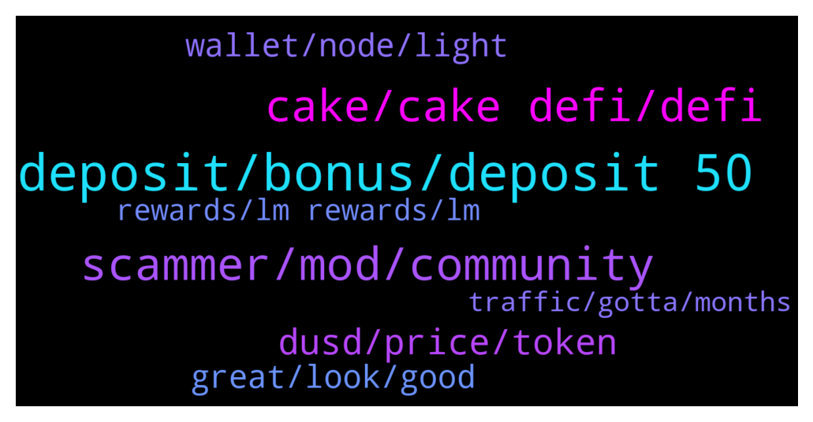

# **@CakeDeFi_EN**
 ## Analysis for **2021-12-17** - **2021-12-18**.

---

## 📊 **Basic Stats**

**n_messages_sent**: 251

---

---

## 🔝 **Top keywords and related messages**

1. **deposit, bonus, deposit 50**

    @Captain_jack5683 --- *I m new here plzzz guide me minimum investment* **--->** [TG Discussion](https://t.me/CakeDeFi_EN/154541)

    @marketwarriorfx --- *I signed up through the brave ad that was deposit 25 usd and get   a welcome bonus, I did that and now im told that i needed to deposit 50 usd or more in one deposit, that was not waht brave ad said* **--->** [TG Discussion](https://t.me/CakeDeFi_EN/154202)

    @rucoph --- *You want me to do deposit before getting  it?* **--->** [TG Discussion](https://t.me/CakeDeFi_EN/154007)

    @Juan --- *Trying to create an account and it’s taking an age to submit information for verification?* **--->** [TG Discussion](https://t.me/CakeDeFi_EN/154497)

    @Saulio --- *Could someone please explain the benefits of this? I understand it as, If I deposit BTC I’ll earn 10% APY on it. So $1000 in BTC would earn $7.66 ?* **--->** [TG Discussion](https://t.me/CakeDeFi_EN/154258)

    @Michael_Schredl --- *Did you make your first deposit?* **--->** [TG Discussion](https://t.me/CakeDeFi_EN/154006)

2. **scammer, mod, community**

    @James --- *Day 1 of trying to get scammers to send me dfi* **--->** [TG Discussion](https://t.me/CakeDeFi_EN/154373)

    @whiskyzulu13 --- *@fabioandreatta @Michael_Schredl these scammers individually messaged me but refused to pick up my call* **--->** [TG Discussion](https://t.me/CakeDeFi_EN/154085)

    @Willian --- *Got a message from a scammer name Daniel baptista as well, blocked and reported hope that helped to kick him* **--->** [TG Discussion](https://t.me/CakeDeFi_EN/153893)

    @gsf_wolfi --- *There is also a bernd mack fake account around. I going to block everyone who dms me due to security reasons. 👮* **--->** [TG Discussion](https://t.me/CakeDeFi_EN/153899)

    @gsf_wolfi --- *Hope it is not a DDOS* **--->** [TG Discussion](https://t.me/CakeDeFi_EN/154128)

    @DmgBautista --- *Its easy to check the real accounts, but always take as first approach the community guidelines! A moderator will have always the "moderator" tag here in the group, as surelly you see in my messages. This tag is centrally issued and no scammer have this. Also, they may copy the profile picture and name, but the telegram username that appears when you click in the name, will surelly be different. They may try to make it almost identical, but cannot be exactly equal. Just check carefully all the letters, and you'll se its a scammer.* **--->** [TG Discussion](https://t.me/CakeDeFi_EN/154355)

3. **cake, cake defi, defi**

    @BerndMack --- *not everyone on Cake has 20k DFI, some have just 100, or 10. Cake pools them together into masternodes* **--->** [TG Discussion](https://t.me/CakeDeFi_EN/153807)

    @cryptoman8888 --- *@fabioandreatta how does one actually get USDT or USDC into Cake without using ERC20* **--->** [TG Discussion](https://t.me/CakeDeFi_EN/154042)

    @BerndMack --- *You send 1 DFI, Cake puts a 1 DFI entry in their database and you have a new balance. if you get a reward ... same way* **--->** [TG Discussion](https://t.me/CakeDeFi_EN/153805)

    @gsf_wolfi --- *Did cake change the pay out times for rewards? It was like always 0100 utc1 but now it changed?* **--->** [TG Discussion](https://t.me/CakeDeFi_EN/153875)

    @AntWhale666 --- *I absolutely love it 😍💘  Thanks team Cake 🎂🙏🥇* **--->** [TG Discussion](https://t.me/CakeDeFi_EN/154172)

    @datoshinakamoto --- *Congratz with Cake app its briliant interface and graphs🎊🎉🎈* **--->** [TG Discussion](https://t.me/CakeDeFi_EN/154413)

4. **dusd, price, token**

    @randylzj --- *Hi what will happen when dusd price changes to 1 usd? I got it at around 1.3usd, will there be more allocation of dusd given or will I just lose the value* **--->** [TG Discussion](https://t.me/CakeDeFi_EN/154378)

    @James --- *The two assets have to maintain a 50/50 value, so if one drops the other have to either increase or decrease to maintain the balance* **--->** [TG Discussion](https://t.me/CakeDeFi_EN/154375)

    @enalettin --- *Hey guys maybe asked many times but want to clarify a newbie here if an asset's price increases outside of the pool it's quantity inside the pool decreases is that Right?* **--->** [TG Discussion](https://t.me/CakeDeFi_EN/154180)

    @riserspec24 --- *Hi. Does DUSD is a type of stable coin?* **--->** [TG Discussion](https://t.me/CakeDeFi_EN/154508)

    @Manvydasm --- *Can anyone explain what is "primary token price" ? Is just overpriced stock or something more? For dAAPL-DUSD it shows 220eu,  as the real AAPL cost only 172 USD* **--->** [TG Discussion](https://t.me/CakeDeFi_EN/153971)

    @jmenyon --- *Adding liquidity to stocks is greyed out for me…is that a US thing?* **--->** [TG Discussion](https://t.me/CakeDeFi_EN/153894)

5. **wallet, node, light**

    @Willian --- *I just downloaded the defichain wallet, not sure if that is the so called light wallet* **--->** [TG Discussion](https://t.me/CakeDeFi_EN/153904)

    @Willian --- *Is the light wallet easy to use?* **--->** [TG Discussion](https://t.me/CakeDeFi_EN/153897)

    @Willian --- *What? So you mean i can't use the wallet connected on both desktop and phone?* **--->** [TG Discussion](https://t.me/CakeDeFi_EN/153912)

    @DmgBautista --- *No, the database and code are different (one on jellyfish, the other not), so for the current time, they are independent wallets (as you can see, desktop wallet has wallet.dat file ans passphrase to recover your wallet), while the mobile wallet have 24 seed words for the same efect.* **--->** [TG Discussion](https://t.me/CakeDeFi_EN/153913)

    @DmgBautista --- *Yes! Keep it please very much safe, as the mobile wallet and the desktop wallet are not compatible, your funds in one will not appear in the other, is a tottaly independent wallet. But in the future, there will be a light wallet for desktop (not a full node wallet as the current one)* **--->** [TG Discussion](https://t.me/CakeDeFi_EN/153911)

    @DmgBautista --- *Yes, those product is not available for US users for regulatory reasons. If you realy want to provide LM to stocks, you will have to do it directly in the defichain light wallet, decentralized* **--->** [TG Discussion](https://t.me/CakeDeFi_EN/153896)

6. **great, look, good**

    @L --- *I sent you the DM with pictures attached!* **--->** [TG Discussion](https://t.me/CakeDeFi_EN/154366)

    @jezzkng --- *You can get more information here   https://blog.defichain.com/what-are-decentralised-stock-tokens-and-how-do-they-work/* **--->** [TG Discussion](https://t.me/CakeDeFi_EN/153979)

    @RS --- *I wish you good luck 😂* **--->** [TG Discussion](https://t.me/CakeDeFi_EN/154456)

    @foularin --- *Thanks for all your quick answers!* **--->** [TG Discussion](https://t.me/CakeDeFi_EN/154376)

    @DmgBautista --- *And thank you for your help!* **--->** [TG Discussion](https://t.me/CakeDeFi_EN/154365)

    @PhillipofMacedon --- *Great, thank you Francesco! And good to see you here, I'm the Phillip who met you on YouTube 😉* **--->** [TG Discussion](https://t.me/CakeDeFi_EN/154333)

7. **rewards, lm rewards, lm**

    @muslimiam --- *Cool new statistics in the app! But can anyone explain why the total on top is less than the added positions in the below detailed list? 🙄* **--->** [TG Discussion](https://t.me/CakeDeFi_EN/154267)

    @ChanA78 --- *Ah I see... hmm notice that the Total Rewards Earned figure isn't correct too. Its lower than what the Bar Chart says when I set it to All Time* **--->** [TG Discussion](https://t.me/CakeDeFi_EN/153983)

    @Willian --- *Today LM rewards are delayed again is there an issue with the Blockchain or something* **--->** [TG Discussion](https://t.me/CakeDeFi_EN/153888)

    @ChanA78 --- *loving the new website dashboard with the bar charts that show your rewards from the products you're using. Good job! However, in the top right column that says "Daily Cashflow" that figure seems to be off. It's too low, and doesn't gel with what's displayed in the bar chart when I set it to Today. Also, is the team looking into the low LM rewards?* **--->** [TG Discussion](https://t.me/CakeDeFi_EN/153981)

    @ChanA78 --- *LM rewards today seems to be much lower than yesterday, but about 50%. Anyone else noticed this?* **--->** [TG Discussion](https://t.me/CakeDeFi_EN/153934)

    @Willian --- *Anyone received LM rewards for the night?* **--->** [TG Discussion](https://t.me/CakeDeFi_EN/154527)

